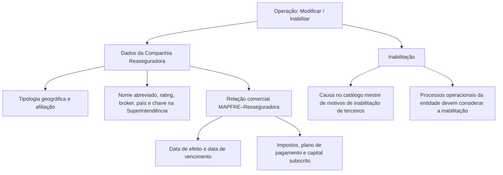

# Operação de Modificação e Inabilitação de Companhia Reaseguradora

## 1. Metadados do Documento
- **Arquivo de Origem:** Não identificado no conteúdo fornecido
- **Tipo de Documento:** Especificação Técnica / Manual Funcional
- **Domínio / Sistema:** Cadastro de Companhia Reaseguradora / MAPFRE
- **Público-Alvo:** Negócio, Operação, Analistas Funcionais e Desenvolvedores
- **Data/Versão Identificada:** Não identificada

---

## 2. Resumo Executivo & Contexto de Negócio

O documento descreve uma operação destinada a complementar e modificar informações previamente registradas de uma Companhia Reaseguradora. A mesma operação também permite inabilitar a Companhia Reaseguradora no sistema.

As ações habilitadas são **MODIFICAR** e **INHABILITAR**. O fluxo de captura dos dados segue uma ordem explícita: da esquerda para a direita e de cima para baixo, dentro do bloco de informação “Datos Compañía Reaseguradora”.

A operação administra atributos de classificação geográfica, identificação da entidade, relacionamento comercial com MAPFRE, tributação, condições de pagamento, capital subscrito e referência perante o Supervisor de Seguros ou Superintendência de Seguros local. A inabilitação deve ser considerada pelos processos operacionais da entidade.

O conteúdo não apresenta métodos HTTP, contratos JSON, persistência, integrações técnicas, ambientes, URLs, logs ou detalhes de implementação. O documento descreve principalmente campos funcionais e respectivas finalidades.

---

## 3. Arquitetura, Componentes & Tecnologias Envolvidas

Os elementos identificados no conteúdo são:

- Operação de **MODIFICAR** Companhia Reaseguradora.
- Operação de **INHABILITAR** Companhia Reaseguradora.
- Bloco funcional **Datos Compañía Reaseguradora**.
- Entidade **Compañía Reaseguradora**.
- Entidade **MAPFRE**.
- **Broker de Seguros**.
- **Supervisor de Seguros / Superintendencia de Seguros local**.
- Catálogo mestre de motivos de inabilitação de terceiros do sistema.
- Marcador `{#cod_imptos_dep}`, associado ao campo de imposto sobre juros de depósitos de resseguro.



> **Nota de Análise:** O documento não detalha arquitetura de software, tecnologias, interfaces, APIs, bancos de dados ou mecanismos de integração.

---

## 4. Regras de Negócio, Especificações Funcionais & Processos

1. A operação permite complementar e modificar informações de uma Companhia Reaseguradora previamente registrada.
2. A operação permite inabilitar uma Companhia Reaseguradora.
3. As ações habilitadas no documento são:
   - **MODIFICAR**
   - **INHABILITAR**
4. A sequência de captura dos atributos no bloco “Datos Compañía Reaseguradora” deve ser interpretada da esquerda para a direita e de cima para baixo.
5. A Tipologia de Companhia Reaseguradora classifica a Companhia Reaseguradora geograficamente, determinando:
   - se a Companhia Reaseguradora é local ou estrangeira;
   - se a Companhia Reaseguradora é afiliada localmente ou não.
6. Quando a definição estiver em espanhol, a Tipologia de Companhia Reaseguradora possui os valores:
   - `(AL) Afiliada (Local)`
   - `(NL) No Afiliada (Local)`
   - `(AE) Afiliada (Extranjera)`
   - `(NE) No Afiliada (Extranjera)`
7. O Nome Abreviado identifica a Companhia Reaseguradora por meio de um nome curto ou abreviado.
8. O Código de Rating determina o código de rating atribuído à Companhia Reaseguradora.
9. O Código de Broker de Seguros, quando aplicável, identifica o Broker de Seguros com o qual a Companhia Reaseguradora opera habitualmente.
10. O País de Origem identifica o país no qual a entidade resseguradora foi constituída.
11. A Data de Efeito estabelece a relação entre a companhia MAPFRE e a Companhia Reaseguradora.
12. A Data de Vencimento distingue o fim da relação comercial entre a companhia MAPFRE e a Companhia Reaseguradora.
13. O imposto sobre juros dos depósitos de resseguro corresponde ao código de imposto aplicável aos juros gerados pelos depósitos do resseguro.
14. O Código de Imposto sobre a Renda identifica o código de imposto aplicado pela entidade MAPFRE como retenção nas transações econômicas com a Companhia Reaseguradora.
15. O Plano de Pagamento identifica a temporalidade aplicável à relação econômica com a Companhia Reaseguradora.
16. O Capital Subscrito contém o capital subscrito pela Companhia Reaseguradora.
17. A Chave na Superintendência identifica a chave da Companhia Reaseguradora perante o Supervisor de Seguros ou Superintendência de Seguros local.
18. A propriedade Inabilitação indica ao sistema que a Companhia Reaseguradora está inabilitada.
19. Os processos operacionais da entidade devem considerar o estado de inabilitação da Companhia Reaseguradora.
20. Caso a Companhia Reaseguradora seja inabilitada, a Causa de Inabilitação deve conter o código de uma causa definida no catálogo mestre de motivos de inabilitação de terceiros do sistema.

---

## 5. Tabelas de Parâmetros, Ambientes e Estruturas de Dados

| Item / Parâmetro | Descrição / Função | Tipo / Valores / Formato | Ambiente / Observações |
| :--- | :--- | :--- | :--- |
| Ação MODIFICAR | Complementa e modifica informações previamente registradas da Companhia Reaseguradora. | Ação habilitada | Não detalhado |
| Ação INHABILITAR | Inabilita a Companhia Reaseguradora no sistema. | Ação habilitada | Deve ser considerada nos processos operacionais |
| Tipologia de Companhia Reaseguradora | Classifica geograficamente a Companhia Reaseguradora e identifica se ela é local ou estrangeira e se é afiliada localmente. | `AL`, `NL`, `AE`, `NE` | Valores apresentados em espanhol |
| `AL` | Afiliada (Local). | Código de tipologia | Tipologia de Companhia Reaseguradora |
| `NL` | No Afiliada (Local). | Código de tipologia | Tipologia de Companhia Reaseguradora |
| `AE` | Afiliada (Extranjera). | Código de tipologia | Tipologia de Companhia Reaseguradora |
| `NE` | No Afiliada (Extranjera). | Código de tipologia | Tipologia de Companhia Reaseguradora |
| Nome Abreviado da Companhia Reaseguradora | Nome curto ou abreviado que identifica a Companhia Reaseguradora. | Não detalhado | Não detalhado |
| Código de Rating | Determina o código de rating atribuído à Companhia Reaseguradora. | Não detalhado | Não detalhado |
| Código de Broker de Seguros | Identifica, se aplicável, o Broker de Seguros com o qual a Companhia Reaseguradora opera habitualmente. | Não detalhado | Campo condicional: “se procede” |
| País de Origem | Identifica o país no qual a entidade resseguradora foi constituída. | Não detalhado | Não detalhado |
| Data de Efeito | Determina a data de efeito que estabelece a relação entre MAPFRE e a Resseguradora. | Data; formato não detalhado | Relação MAPFRE–Resseguradora |
| Data de Vencimento | Determina a data que distingue o fim da relação comercial entre MAPFRE e a Resseguradora. | Data; formato não detalhado | Relação MAPFRE–Resseguradora |
| Imposto sobre Interesses dos Depósitos de Resseguro | Código de imposto aplicado aos juros gerados pelos depósitos do resseguro. | Código de imposto | Marcador associado: `{#cod_imptos_dep}` |
| Código de Imposto sobre a Renda | Código de imposto que MAPFRE aplica como retenção nas transações econômicas com a Resseguradora. | Código de imposto | Não detalhado |
| Plano de Pagamento | Identifica a temporalidade a ser considerada na relação econômica com a Companhia Reaseguradora. | Não detalhado | Não detalhado |
| Capital subscrito | Contém o capital subscrito pela Companhia Reaseguradora. | Não detalhado | Não detalhado |
| Chave na Superintendência | Identifica a chave da Companhia Reaseguradora perante o Supervisor de Seguros ou Superintendência de Seguros local. | Não detalhado | Não detalhado |
| Inabilitação | Informa ao sistema que a Companhia Reaseguradora está inabilitada. | Não detalhado | Deve impactar processos operacionais |
| Causa de Inabilitação | Código da causa de inabilitação definida no catálogo mestre de motivos de inabilitação de terceiros. | Código de catálogo | Preenchido no caso de inabilitação |

---

## 6. Bateria de Perguntas & Respostas para RAG (FAQ Sintético)

### P1: Qual é o objetivo da operação de modificação de Companhia Reaseguradora?
**R:** A operação permite complementar e modificar informações de uma Companhia Reaseguradora já registrada. A operação também possibilita inabilitar a Companhia Reaseguradora no sistema.

### P2: Quais ações estão habilitadas para a Companhia Reaseguradora?
**R:** As ações habilitadas são **MODIFICAR** e **INHABILITAR**. A ação MODIFICAR altera ou complementa dados previamente registrados; a ação INHABILITAR indica ao sistema que a Companhia Reaseguradora está inabilitada.

### P3: Como a Tipologia de Companhia Reaseguradora é usada?
**R:** A Tipologia de Companhia Reaseguradora classifica geograficamente a Companhia Reaseguradora, identificando se ela é local ou estrangeira e se ela é afiliada localmente. Os valores apresentados são AL, NL, AE e NE.

### P4: O que representam os códigos AL, NL, AE e NE?
**R:** `AL` significa Afiliada (Local); `NL` significa No Afiliada (Local); `AE` significa Afiliada (Extranjera); e `NE` significa No Afiliada (Extranjera).

### P5: Quando o Código de Broker de Seguros deve ser informado?
**R:** O Código de Broker de Seguros deve ser informado quando aplicável, pois identifica o Broker de Seguros com o qual a Companhia Reaseguradora opera habitualmente.

### P6: Qual é a diferença entre Data de Efeito e Data de Vencimento?
**R:** A Data de Efeito estabelece a relação entre a companhia MAPFRE e a Companhia Reaseguradora. A Data de Vencimento distingue o fim da relação comercial entre a companhia MAPFRE e a Companhia Reaseguradora.

### P7: Para que serve o imposto sobre juros dos depósitos de resseguro?
**R:** O campo contém o código de imposto que será aplicado sobre os juros gerados pelos depósitos do resseguro. O documento associa esse campo ao marcador `{#cod_imptos_dep}`.

### P8: Qual imposto MAPFRE aplica nas transações econômicas com a Companhia Reaseguradora?
**R:** O Código de Imposto sobre a Renda contém o código de imposto que a entidade MAPFRE aplica como retenção nas transações econômicas com a Companhia Reaseguradora.

### P9: O que o Plano de Pagamento identifica?
**R:** O Plano de Pagamento identifica a temporalidade que deve ser considerada na relação econômica com a Companhia Reaseguradora.

### P10: Qual é o efeito operacional da Inabilitação?
**R:** A propriedade Inabilitação informa ao sistema que a Companhia Reaseguradora está inabilitada. Esse estado deve ser considerado nos processos operacionais da entidade.

### P11: Como deve ser preenchida a Causa de Inabilitação?
**R:** Caso a Companhia Reaseguradora seja inabilitada, a Causa de Inabilitação deve conter o código de uma das causas definidas no catálogo mestre de motivos de inabilitação de terceiros do sistema.

### P12: O que identifica a Chave na Superintendência?
**R:** A Chave na Superintendência identifica a chave que a Companhia Reaseguradora possui perante o Supervisor de Seguros ou a Superintendência de Seguros local.

---

## 7. Glossário de Termos, Siglas & Conceitos-Chave

- **AL:** Afiliada (Local).
- **NL:** No Afiliada (Local).
- **AE:** Afiliada (Extranjera).
- **NE:** No Afiliada (Extranjera).
- **Broker de Seguros:** Entidade identificada pelo Código de Broker de Seguros, com a qual a Companhia Reaseguradora opera habitualmente, quando aplicável.
- **Capital subscrito:** Capital subscrito pela Companhia Reaseguradora.
- **Código de Rating:** Código de rating atribuído à Companhia Reaseguradora.
- **Companhia Reaseguradora:** Entidade cujas informações podem ser complementadas, modificadas ou inabilitadas na operação descrita.
- **Inabilitação:** Propriedade que informa ao sistema que a Companhia Reaseguradora está inabilitada.
- **MAPFRE:** Companhia ou entidade citada como participante da relação comercial e econômica com a Companhia Reaseguradora.
- **Plano de Pagamento:** Temporalidade considerada na relação econômica com a Companhia Reaseguradora.
- **Supervisor de Seguros / Superintendência de Seguros local:** Órgão ou referência local perante o qual a Companhia Reaseguradora possui uma chave identificadora.

---

## 8. Notas Críticas, Riscos & Limitações

- O documento não identifica nome de arquivo, data, versão, responsável, ambiente ou sistema específico.
- O documento não especifica obrigatoriedade de preenchimento, tipos técnicos, formatos de data, tamanhos de campos, validações, mensagens de erro ou regras de consistência entre os atributos.
- O documento não detalha os métodos HTTP, contratos JSON, APIs, persistência, integrações, autenticação, logs, URLs ou tecnologias utilizadas.
- A inabilitação deve ser contemplada pelos processos operacionais da entidade, porém o documento não detalha quais processos são afetados nem qual comportamento cada processo deve executar.
- A Causa de Inabilitação depende de um catálogo mestre de motivos de inabilitação de terceiros, mas o documento não apresenta os valores desse catálogo.
- O marcador `{#cod_imptos_dep}` é apresentado sem explicação técnica adicional.

---

## 9. Conteúdo Bruto Estruturado (Referência Fiel)

```text
--- [PÁGINA 1 DE 3] ---

MODIFICAR Información específica de la
Compañía Aseguradora
Objetivo
Esta Operación permite Complementar y Modificar la información de la Compañía Reaseguradora
registrada anteriormente además de poder Inhabilitarla.
Acciones habilitadas
 MODIFICAR ( )
 INHABILITAR ( )
Datos Compañía Reaseguradora
De Izquierda a Derecha y de Arriba hacia Abajo, los siguientes atributos marcan la secuencia de
captura en este Bloque de Información.
Tipología de Compañía Reaseguradora (  )
 / 
 RS
Inicio Soluciones APIs Documentación Zeus
ES


--- [PÁGINA 2 DE 3] ---

Este campo clasifica a la Compañía Reaseguradora identificándola geográficamente para conocer si
es una compañía local o extranjera y si está o no afiliada localmente.
Si el idioma empleado en la definición es el español, sus valores serían...
(AL) Afiliada (Local)
(NL) No Afiliada (Local)
(AE) Afiliada (Extranjera)
(NE) No Afiliada (Extranjera)
Nombre Abreviado de la Compañía Reaseguradora ( )
Este Dato contiene el nombre corto o abreviado que identificará a la compañía reaseguradora.
Código de Rating (  )
Este dato determina el código de rating que tiene asignado la compañía reaseguradora.
Código de Broker de Seguros (  )
Este dato, si procede, identifica al Broker de Seguros con el que habitualmente opera la compañía
reaseguradora.
País de Origen (  )
Este dato identifica el País Origen en el que se constituyó la entidad reaseguradora.
Fecha de Efecto ( )
Este campo determina la fecha de efecto que establece la relación entre la compañía MAPFRE y la
reaseguradora.
Fecha de Vencimiento ( )
Este campo determina la fecha de vencimiento que distingue el fin de la relación comercial entre la
compañía MAPFRE y la reaseguradora.
Impuesto sobre Intereses de los Depósitos de Reaseguro (  )
{#cod_imptos_dep}
Este Dato contiene el código de Impuesto que se va a aplicar sobre los intereses generados por los
depósitos del reaseguro.
Código de Impuesto sobre la Renta (  )


--- [PÁGINA 3 DE 3] ---

Este Dato contiene el código de Impuesto que la entidad MAPFRE va a aplicar como retención en las
transacciones económicas con la reaseguradora.
Plan de Pago (  )
Este Dato identifica la temporalidad que se debe considerar en la relación económica con la
compañía reaseguradora.
Capital suscrito ( )
Este Dato contiene el Capital suscrito por la compañía reaseguradora.
Clave en la Superintendencia ( )
Este dato identifica la clave que tiene la compañía reaseguradora para el Supervisor de
Seguros/Superintendencia de Seguros local.
Inhabilitación ( )
Esta propiedad le indica al Sistema que la compañía reaseguradora está inhabilitada en el Sistema
por lo que este hecho debería ser contemplado en los procesos operativos de la entidad.
Causa de Inhabilitación (   )
En el supuesto que se inhabilitara a la Compañía reaseguradora, este campo contendrá el código de
una de las causas de inhabilitación definidas en el catálogo maestro de motivos de inhabilitación de
Terceros del Sistema.
```
