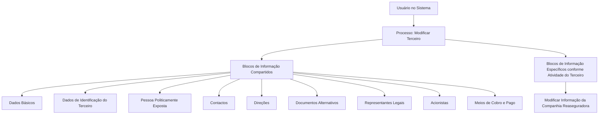
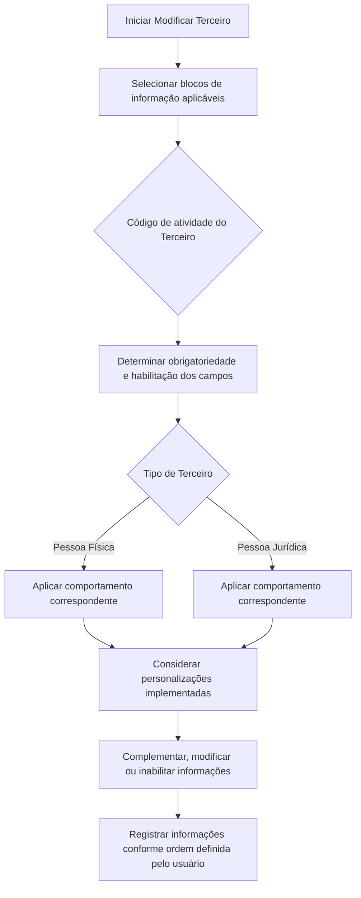

# Operação Modificar Companhia Reaseguradora — Processo e Blocos de Informação

## 1. Metadados do Documento
- **Arquivo de Origem:** Não identificado no conteúdo fornecido
- **Tipo de Documento:** Procedimento
- **Domínio / Sistema:** Operação **Modificar Terceiro** — Companhia Reaseguradora; Sistema Zeus
- **Público-Alvo:** Usuários de operação, analistas funcionais e equipes de suporte
- **Data/Versão Identificada:** Não identificada

---

## 2. Resumo Executivo & Contexto de Negócio

O documento descreve a operação **Modificar Companhia Reaseguradora**, associada ao processo **Modificar Terceiro**. A finalidade declarada é complementar, modificar e/ou inabilitar informações da Companhia Reaseguradora nos blocos ou estruturas de dados que armazenam e agrupam essas informações.

A obrigatoriedade dos campos e a possibilidade de habilitá-los durante o registro variam conforme o código de atividade do Terceiro. Portanto, o processo não possui um conjunto único e invariável de campos obrigatórios para todas as Companhias Reaseguradoras.

O tipo de Terceiro — Pessoa Física ou Pessoa Jurídica — também pode alterar a obrigatoriedade e a habilitação dos campos dos blocos de informação. Além disso, personalizações implementadas no ambiente podem impactar o comportamento da aplicação quanto à obrigatoriedade do registro dos Dados do Terceiro.

O documento informa que a ordem de captura dos dados nos blocos de informação pode variar conforme o critério adotado pelo usuário no sistema. Não há detalhamento adicional sobre regras de sequência obrigatória, validações específicas por campo, métodos de integração ou contratos técnicos.

---

## 3. Arquitetura, Componentes & Tecnologias Envolvidas

Os componentes e conceitos explicitamente citados são:

| Componente / Conceito | Papel identificado |
| :--- | :--- |
| Companhia Reaseguradora | Entidade cuja informação pode ser complementada, modificada ou inabilitada. |
| Modificar Terceiro | Processo que agrupa os blocos de informação compartilhados. |
| Modificar Informação da Companhia Reaseguradora | Bloco ou operação específica relacionada à Companhia Reaseguradora. |
| Blocos de Informação Compartidos | Estruturas compartilhadas no processo Modificar Terceiro. |
| Blocos de Informação Específicos | Estruturas aplicáveis conforme a atividade do Terceiro. |
| Sistema Zeus | Sistema citado na navegação exibida no conteúdo bruto. |
| Soluciones APIs Documentación | Termos de navegação presentes no conteúdo extraído; a finalidade não é detalhada. |



> **Nota de Análise:** O documento não detalha arquitetura de software, protocolos, APIs, bancos de dados, métodos HTTP, contratos JSON, servidores ou integrações técnicas.

---

## 4. Regras de Negócio, Especificações Funcionais & Processos

### Objetivo da operação

A operação **Modificar Companhia Reaseguradora** permite:

1. Complementar informações da Companhia Reaseguradora.
2. Modificar informações da Companhia Reaseguradora.
3. Inabilitar informações da Companhia Reaseguradora.
4. Executar as ações nos blocos ou estruturas de dados que contêm e agrupam as informações da Companhia Reaseguradora.

### Premissas e regras de variabilidade

1. A obrigatoriedade dos campos em cada bloco ou estrutura de informação compartilhada pode variar conforme o **código de atividade do Terceiro**.
2. A habilitação dos campos em cada bloco ou estrutura de informação compartilhada pode variar conforme o **código de atividade do Terceiro**.
3. A obrigatoriedade dos campos pode variar quando o Terceiro for **Pessoa Física** ou **Pessoa Jurídica**.
4. A habilitação dos campos pode variar quando o Terceiro for **Pessoa Física** ou **Pessoa Jurídica**.
5. Personalizações implementadas podem afetar o comportamento da aplicação em relação à obrigatoriedade de registro dos Dados do Terceiro.
6. A ordem de captura dos dados nos blocos de informação pode variar conforme o critério do usuário no sistema.

### Fluxo funcional identificado



> **Nota de Análise:** O documento não especifica códigos de atividade, campos obrigatórios, critérios de validação, regras distintas para Pessoa Física e Pessoa Jurídica, nem quais personalizações podem ser aplicadas.

---

## 5. Tabelas de Parâmetros, Ambientes e Estruturas de Dados

| Item / Parâmetro | Descrição / Função | Tipo / Valores / Formato | Ambiente / Observações |
| :--- | :--- | :--- | :--- |
| Código de atividade do Terceiro | Pode influenciar a obrigatoriedade e a habilitação dos campos. | Código não detalhado. | Aplicável aos blocos ou estruturas de informação compartilhada. |
| Tipo de Terceiro | Pode influenciar a obrigatoriedade e a habilitação dos campos. | Pessoa Física ou Pessoa Jurídica. | Regras específicas não detalhadas. |
| Personalizações implementadas | Podem afetar a obrigatoriedade no registro dos Dados do Terceiro. | Não detalhado. | Dependente de customizações existentes na aplicação. |
| Ordem de captura de dados | Sequência de preenchimento dos blocos de informação. | Variável. | Pode variar conforme o critério do usuário no sistema. |
| Dados Básicos | Bloco compartilhado do processo Modificar Terceiro. | Não detalhado. | Referência: `01-Comun/MODIFICAR-Tercero-Datos-Basicos.md#titulo`. |
| Dados Identificação Terceiro | Bloco compartilhado para dados de identificação. | Não detalhado. | Não há campos descritos. |
| Pessoa Politicamente Exposta | Bloco compartilhado. | Não detalhado. | Não há regras descritas. |
| Contactos | Bloco compartilhado. | Não detalhado. | Não há campos descritos. |
| Direções | Bloco compartilhado. | Não detalhado. | Não há campos descritos. |
| Documentos Alternativos | Bloco compartilhado. | Não detalhado. | Não há campos descritos. |
| Representantes Legais | Bloco compartilhado. | Não detalhado. | Não há campos descritos. |
| Acionistas | Bloco compartilhado. | Não detalhado. | Não há campos descritos. |
| Meios de Cobro e Pago | Bloco compartilhado. | Não detalhado. | Não há campos descritos. |
| Modificar Informação da Companhia Reaseguradora | Bloco específico conforme a atividade do Terceiro. | Não detalhado. | Relacionado diretamente à operação documentada. |

---

## 6. Bateria de Perguntas & Respostas para RAG (FAQ Sintético)

### P1: Qual é a finalidade da operação Modificar Companhia Reaseguradora?
**R:** A operação permite complementar, modificar e/ou inabilitar as informações da Companhia Reaseguradora nos blocos ou estruturas de dados que armazenam e agrupam essas informações.

### P2: A obrigatoriedade dos campos é igual para todas as Companhias Reaseguradoras?
**R:** Não. A obrigatoriedade dos campos nos blocos ou estruturas de informação compartilhada pode variar de acordo com o código de atividade do Terceiro.

### P3: O tipo de Terceiro influencia os campos disponíveis no processo?
**R:** Sim. A obrigatoriedade e/ou a habilitação dos campos podem variar quando o tipo de Terceiro for Pessoa Física ou Pessoa Jurídica.

### P4: As personalizações do sistema podem alterar o processo de registro?
**R:** Sim. O documento declara que personalizações implementadas podem afetar o comportamento da aplicação quanto à obrigatoriedade do registro dos Dados do Terceiro.

### P5: Existe uma ordem obrigatória para preencher os blocos de informação?
**R:** O documento informa que a ordem de captura dos dados pode variar conforme o critério seguido pelo usuário no sistema. Não é definida uma sequência obrigatória única.

### P6: Quais blocos compartilhados estão associados ao processo Modificar Terceiro?
**R:** São citados os blocos Dados Básicos, Dados de Identificação do Terceiro, Pessoa Politicamente Exposta, Contactos, Direções, Documentos Alternativos, Representantes Legais, Acionistas e Meios de Cobro e Pago.

### P7: Onde está localizada a referência para Dados Básicos no processo Modificar Terceiro?
**R:** A referência apresentada é `01-Comun/MODIFICAR-Tercero-Datos-Basicos.md#titulo`. O conteúdo fornecido não apresenta os detalhes desse documento referenciado.

### P8: Quais ações podem ser realizadas sobre as informações da Companhia Reaseguradora?
**R:** Podem ser realizadas ações de complementação, modificação e inabilitação das informações da Companhia Reaseguradora.

### P9: O documento descreve os campos específicos do bloco Modificar Informação da Companhia Reaseguradora?
**R:** Não. O documento apenas lista o bloco “Modificar Informação da Companhia Reaseguradora” como um bloco específico conforme a atividade do Terceiro, sem apresentar seus campos, validações ou estrutura.

### P10: O documento fornece detalhes técnicos sobre APIs, URLs, servidores ou integrações?
**R:** Não. Apesar de mencionar termos de navegação como “Soluciones”, “APIs”, “Documentación” e “Zeus”, o conteúdo não especifica endpoints, URLs, protocolos, ambientes, servidores ou contratos de integração.

---

## 7. Glossário de Termos, Siglas & Conceitos-Chave

- **Companhia Reaseguradora:** Entidade cujas informações podem ser complementadas, modificadas ou inabilitadas no processo descrito.
- **Terceiro:** Entidade associada aos blocos de informação do processo Modificar Terceiro.
- **Modificar Terceiro:** Processo que reúne blocos de informação compartilhados relacionados ao Terceiro.
- **Blocos de Informação Compartidos:** Estruturas de informação compartilhadas utilizadas no processo Modificar Terceiro.
- **Blocos de Informação Específicos:** Estruturas de informação aplicáveis de acordo com a atividade do Terceiro.
- **Pessoa Física:** Tipo de Terceiro citado como fator que pode alterar obrigatoriedade e habilitação de campos.
- **Pessoa Jurídica:** Tipo de Terceiro citado como fator que pode alterar obrigatoriedade e habilitação de campos.
- **Pessoa Politicamente Exposta:** Bloco de informação compartilhado listado no processo.
- **Zeus:** Nome exibido na navegação do conteúdo extraído; o documento não define sua função.

---

## 8. Notas Críticas, Riscos & Limitações

- O conteúdo não identifica arquivo de origem, autor, data, versão ou classificação documental.
- Não há detalhamento dos campos de cada bloco de informação.
- Não são apresentados códigos de atividade do Terceiro nem o impacto de cada código sobre obrigatoriedade ou habilitação.
- Não são especificadas diferenças concretas entre os fluxos de Pessoa Física e Pessoa Jurídica.
- As personalizações capazes de afetar o comportamento da aplicação não são enumeradas.
- Não há definição de permissões, perfis de acesso, auditoria, tratamento de erros ou regras de persistência.
- Não são informados APIs, URLs, ambientes, servidores, bancos de dados, tecnologias ou contratos de integração.
- O bloco específico **Modificar Informação da Companhia Reaseguradora** é citado, mas não possui detalhamento adicional no conteúdo fornecido.

---

## 9. Conteúdo Bruto Estruturado (Referência Fiel)

```text
--- [PÁGINA 1 DE 2] ---

OPERACIÓN MODIFICAR Compañía
Reaseguradora
¿En que consiste?
Esta operación consiste en Complementar, Modificar y/o Inhabilitar la información de la Compañía
Reaseguradora en cualquiera de los bloques o estructuras de datos que la contienen y agrupan.
Premisas
La obligatoriedad y/o la habilitación de los campos en el registro de los datos de cada uno de
los bloques o estructuras de información compartidas puede variar de acuerdo con el código de
actividad del Tercero:
La obligatoriedad y/o la habilitación de los campos en el registro de los datos de cada uno de
los bloques o estructuras de información pueden variar si el tipo de Tercero es una Persona
Física o una Persona Jurídica:
Las personalizaciones que se hubieran podido implementar a su vez pueden afectar el
comportamiento de la aplicación en relación con la obligatoriedad en el registro de los Datos del
Tercero.
Ejemplo:
Ejemplo:
 /
 RS
Inicio Soluciones APIs Documentación Zeus
ES


--- [PÁGINA 2 DE 2] ---

Por último, el orden de captura de los datos en los distintos bloques de Información puede
variar de acuerdo con el criterio seguido por el Usuario en el Sistema.
Proceso
MODIFICAR
TERCERO
Modificar Información de la
Compañía Reaseguradora
Bloques de Información Compartidos (MODIFICAR TERCERO)
01-Comun/MODIFICAR-Tercero-Datos-Basicos.md#titulo) ( )
 Datos Identificación Tercero ( )
 Persona Políticamente Expuesta(   )
 Contactos (   )
 Direcciones (   )
 Documentos Alternativos (   )
 Representantes Legales (   )
 Accionistas (   )
 Medios de Cobro y Pago (   )
Bloques de Información Específicos de acuerdo con la
Actividad del Tercero.
 Modificar Información de la Compañía Reaseguradora(  )
```
