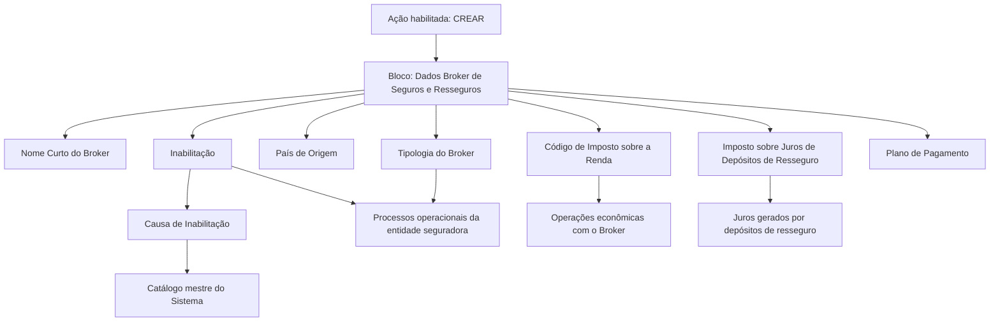

# Criação de Informações Específicas para Broker de Seguros e Resseguros

## 1. Metadados do Documento
- **Arquivo de Origem:** `Não identificado no conteúdo fornecido`
- **Tipo de Documento:** `Especificação Funcional`
- **Domínio / Sistema:** `Gestão de Broker de Seguros e Resseguros — MAPFRE`
- **Público-Alvo:** `Não identificado expressamente; conteúdo direcionado à operação e parametrização de terceiros`
- **Data/Versão Identificada:** `Não identificada`

---

## 2. Resumo Executivo & Contexto de Negócio

O documento descreve o bloco de informação utilizado para criar e manter dados específicos de um Broker de Seguros e Resseguros. O objetivo central é registrar informações de âmbito operacional do Broker e classificá-lo adequadamente para que os processos da entidade seguradora possam considerar — ou não considerar — essa condição.

A ação explicitamente habilitada é **CREAR**, isto é, criar informações específicas para o Broker. A sequência de preenchimento dos atributos deve ser interpretada da esquerda para a direita e de cima para baixo na tela ou bloco de informações correspondente.

Salvo indicação expressa em sentido contrário, os campos apresentados são aplicáveis tanto a Pessoas Físicas quanto a Pessoas Jurídicas. O documento não descreve requisitos distintos de preenchimento, validação ou obrigatoriedade para cada natureza de pessoa.

Os dados abrangem identificação abreviada, situação de inabilitação, causa de inabilitação, país de origem, tipologia do Broker, impostos aplicáveis e plano de pagamento. Esses atributos suportam decisões operacionais, classificação local ou estrangeira e tratamento econômico do relacionamento com o Broker.

O conteúdo não detalha interfaces, serviços, métodos HTTP, contratos JSON, persistência de dados, integrações ou regras técnicas de validação de campos. A especificação limita-se à finalidade funcional dos atributos do bloco de informações.

---

## 3. Arquitetura, Componentes & Tecnologias Envolvidas

Os componentes funcionais identificados são:

- **Bloco de Informação “Dados Broker de Seguros e Resseguros”**: área de captura e manutenção dos atributos específicos do Broker.
- **Ação “CREAR”**: ação habilitada para criação das informações.
- **Sistema**: responsável por interpretar a inabilitação do Broker e impedir que ele seja empregado, contemplado ou considerado em processos operacionais quando estiver inabilitado.
- **Catálogo mestre do Sistema**: origem do código da causa de inabilitação aplicável à atividade do terceiro.
- **Entidade MAPFRE**: entidade que aplica retenção de imposto sobre operações econômicas com o Broker.
- **Processos operacionais da entidade seguradora**: processos que podem considerar ou excluir o Broker de acordo com sua classificação e situação de inabilitação.



**Nota de Análise:** o documento não identifica tecnologias, bancos de dados, APIs, ambientes, URLs, servidores, logs ou integrações técnicas. Também não detalha como o Sistema implementa a exclusão operacional de Brokers inabilitados.

---

## 4. Regras de Negócio, Especificações Funcionais & Processos

### Processo de captura

1. Utilizar a ação habilitada **CREAR** para criar as informações específicas do Broker.
2. Capturar os atributos no bloco **Dados Broker de Seguros e Resseguros**.
3. Seguir a sequência de captura apresentada na interface: da esquerda para a direita e de cima para baixo.
4. Aplicar os campos tanto a Pessoas Físicas quanto a Pessoas Jurídicas, exceto quando houver indicação expressa diferente no documento.
5. Registrar o nome curto, a condição operacional, a origem, a classificação, os códigos tributários e a temporalidade de pagamento do Broker.

### Regras funcionais por atributo

- O **Nome Curto do Broker** contém o nome abreviado do Broker previamente capturado no Bloco de Informação.
- O atributo **Inabilitação** informa ao Sistema que o Broker está inabilitado.
- Quando um Broker está inabilitado, ele não deve ser empregado, contemplado nem considerado nos processos operacionais da entidade.
- A **Causa de Inabilitação** deve conter o código de uma causa definida no catálogo mestre do Sistema para a atividade correspondente do terceiro, quando o Broker estiver inabilitado.
- O **País de Origem** identifica o país em que o Broker de Seguros e Resseguros foi constituído.
- A **Tipologia do Broker** determina se o Broker é local ou estrangeiro e se possui afiliação local.
- O **Código de Imposto sobre a Renda** identifica o imposto que a entidade MAPFRE aplicará como retenção nas operações econômicas realizadas com o Broker.
- O **Imposto sobre Juros de Depósitos de Resseguro** identifica o imposto aplicável ao Broker sobre juros gerados pelos depósitos de resseguro.
- O **Plano de Pagamento** identifica a temporalidade considerada na relação econômica com o Broker, incluindo exemplos como anual, semestral, trimestral e mensal.

---

## 5. Tabelas de Parâmetros, Ambientes e Estruturas de Dados

| Item / Parâmetro | Descrição / Função | Tipo / Valores / Formato | Ambiente / Observações |
| :--- | :--- | :--- | :--- |
| Ação habilitada | Permite criar informações específicas para o Broker. | `CREAR` | O documento não apresenta outras ações habilitadas. |
| Bloco de Informação | Agrupa os dados específicos do Broker de Seguros e Resseguros. | Dados Broker de Seguros e Resseguros | A sequência de captura é da esquerda para a direita e de cima para baixo. |
| Aplicabilidade dos campos | Define o público de entidades ao qual os campos se aplicam. | Pessoas Físicas e Pessoas Jurídicas | Aplicável salvo indicação expressa diferente. |
| Nome Curto do Broker | Armazena o nome abreviado do Broker. | Nome abreviado | Deve ter sido capturado no Bloco de Informação. |
| Inabilitação | Indica que o Broker está inabilitado no Sistema. | Estado de inabilitação; formato não detalhado | Um Broker inabilitado não deve ser usado, contemplado ou considerado nos processos operacionais. |
| Causa de Inabilitação | Registra a razão da inabilitação do Broker. | Código de causa | Deve ser uma causa definida no catálogo mestre do Sistema para a atividade do terceiro. Aplicável quando o Broker estiver inabilitado. |
| País de Origem | Identifica o país de constituição do Broker. | País; formato não detalhado | Refere-se ao país onde o Broker de Seguros e Resseguros foi constituído. |
| Tipologia do Broker | Classifica o Broker conforme localização e afiliação. | `AL`, `NL`, `AE`, `NE` | Os valores apresentados são válidos quando o idioma de definição é espanhol. |
| AL | Broker afiliado local. | `(AL) Afiliado (Local)` | Valor de tipologia. |
| NL | Broker não afiliado local. | `(NL) No Afiliado (Local)` | Valor de tipologia. |
| AE | Broker afiliado estrangeiro. | `(AE) Afiliado (Extranjera)` | Valor de tipologia. |
| NE | Broker não afiliado estrangeiro. | `(NE) No Afiliado (Extranjera)` | Valor de tipologia. |
| Código de Imposto sobre a Renda | Define o código de imposto aplicado pela MAPFRE como retenção em operações econômicas com o Broker. | Código de imposto | O catálogo, alíquotas e forma de cálculo não são detalhados. |
| Imposto sobre Juros de Depósitos de Resseguro | Define o código de imposto aplicável ao Broker sobre juros de depósitos de resseguro. | Código de imposto | O documento não informa alíquota, cálculo ou catálogo tributário. |
| Plano de Pagamento | Identifica a temporalidade da relação econômica com o Broker. | Anual, semestral, trimestral, mensal, entre outros | Não são apresentados valores codificados nem regras de seleção. |
| Catálogo mestre do Sistema | Fonte das causas de inabilitação para a atividade do terceiro. | Catálogo mestre; estrutura não detalhada | Utilizado pelo atributo Causa de Inabilitação. |
| Ambiente / servidor / URL / log | Informações técnicas de implantação e operação. | Não informado | O documento não fornece ambientes, endereços, rotas de log ou servidores. |

---

## 6. Bateria de Perguntas & Respostas para RAG (FAQ Sintético)

### P1: Qual é o objetivo do bloco de informações específicas para Broker?
**R:** O bloco de informações específicas para Broker tem o objetivo de identificar dados de âmbito operacional do Broker de Seguros e Resseguros e classificá-lo adequadamente. Essa classificação permite que os processos da entidade seguradora considerem ou deixem de considerar a condição do Broker quando necessário.

### P2: Qual ação está habilitada para o cadastro de informações do Broker?
**R:** A ação habilitada explicitamente no documento é **CREAR**. O conteúdo não menciona ações de alteração, exclusão, consulta ou aprovação.

### P3: Em qual ordem os atributos do Broker devem ser capturados?
**R:** Os atributos do bloco Dados Broker de Seguros e Resseguros devem ser capturados da esquerda para a direita e de cima para baixo, seguindo a sequência apresentada na interface.

### P4: Os campos do bloco de Broker se aplicam a Pessoas Físicas e Pessoas Jurídicas?
**R:** Sim. O documento estabelece que, quando não houver especificação ou indicação expressa em contrário, os campos da janela devem ser empregados tanto para Pessoas Físicas quanto para Pessoas Jurídicas.

### P5: O que acontece quando um Broker está marcado como inabilitado?
**R:** Quando o atributo Inabilitação indica que o Broker está inabilitado no Sistema, o Broker não deve ser empregado, contemplado ou considerado nos processos operacionais da entidade.

### P6: Quando a Causa de Inabilitação deve ser preenchida?
**R:** A Causa de Inabilitação deve ser utilizada quando o Broker de Seguros e Resseguros estiver inabilitado. O atributo deve conter o código de uma causa de inabilitação definida no catálogo mestre do Sistema para a atividade do terceiro.

### P7: O que representa o País de Origem do Broker?
**R:** O País de Origem identifica o país no qual o Broker de Seguros e Resseguros foi constituído. O documento não informa formato, catálogo de países ou regras de validação para esse atributo.

### P8: Como a Tipologia do Broker classifica um Broker?
**R:** A Tipologia do Broker determina se o Broker é local ou estrangeiro e se está ou não afiliado localmente. Em espanhol, os valores apresentados são: AL para Afiliado Local, NL para Não Afiliado Local, AE para Afiliado Estrangeiro e NE para Não Afiliado Estrangeiro.

### P9: Qual é a finalidade do Código de Imposto sobre a Renda?
**R:** O Código de Imposto sobre a Renda contém o código do imposto que a entidade MAPFRE aplicará como retenção nas operações econômicas realizadas com o Broker de Seguros e Resseguros.

### P10: Qual imposto é tratado para os depósitos de resseguro?
**R:** O atributo Imposto sobre Juros de Depósitos de Resseguro contém o código de imposto aplicável ao Broker sobre os juros gerados pelos depósitos de resseguro. O documento não detalha alíquotas, cálculo ou regras tributárias adicionais.

### P11: O que o Plano de Pagamento representa no relacionamento com o Broker?
**R:** O Plano de Pagamento identifica a temporalidade a ser considerada na relação econômica com o Broker. O documento apresenta como exemplos periodicidades anual, semestral, trimestral e mensal.

### P12: O documento especifica APIs, contratos de integração ou tecnologias utilizadas?
**R:** Não. O documento apresenta uma especificação funcional dos atributos do bloco de Broker, mas não detalha APIs, métodos HTTP, contratos JSON, tecnologias, banco de dados, ambientes, URLs, servidores ou rotas de logs.

---

## 7. Glossário de Termos, Siglas & Conceitos-Chave

- **Broker de Seguros e Resseguros:** terceiro para o qual são capturados dados operacionais, de classificação e de relacionamento econômico.
- **CREAR:** ação habilitada para criar as informações específicas do Broker.
- **Bloco de Informação:** área funcional em que são capturados os atributos relacionados ao Broker.
- **Inabilitação:** condição que informa ao Sistema que o Broker não deve ser empregado, contemplado ou considerado nos processos operacionais.
- **Causa de Inabilitação:** código de motivo da inabilitação, definido no catálogo mestre do Sistema para a atividade do terceiro.
- **Catálogo mestre do Sistema:** catálogo que define causas de inabilitação para a atividade do terceiro.
- **País de Origem:** país no qual o Broker foi constituído.
- **Tipologia do Broker:** classificação que determina se o Broker é local ou estrangeiro e se possui afiliação local.
- **AL:** Afiliado (Local).
- **NL:** No Afiliado (Local).
- **AE:** Afiliado (Extranjera).
- **NE:** No Afiliado (Extranjera).
- **MAPFRE:** entidade mencionada como responsável por aplicar retenção de imposto em operações econômicas com o Broker.
- **Imposto sobre a Renda:** imposto aplicado como retenção nas operações econômicas com o Broker.
- **Depósitos de Resseguro:** depósitos cujos juros podem estar sujeitos a imposto aplicável ao Broker.
- **Plano de Pagamento:** temporalidade utilizada na relação econômica com o Broker.

---

## 8. Notas Críticas, Riscos & Limitações

- O documento não identifica o nome do arquivo de origem, a data, a versão, o autor ou a área responsável.
- O conteúdo não informa se cada atributo é obrigatório, opcional, condicional ou possui valor padrão.
- O documento não detalha formatos, tamanhos, máscaras, domínios de valores, catálogos completos ou mensagens de erro dos campos.
- A condição de inabilitação possui impacto operacional explícito: um Broker inabilitado não deve participar dos processos operacionais da entidade.
- A Causa de Inabilitação depende do catálogo mestre do Sistema, cuja estrutura e valores permitidos não são apresentados.
- Os códigos de tipologia `AL`, `NL`, `AE` e `NE` são apresentados para definições em idioma espanhol; o documento não especifica os códigos equivalentes em outros idiomas.
- Os códigos de imposto são citados somente quanto à finalidade. Não há informação sobre cálculo, retenção efetiva, alíquotas, vigência ou obrigações fiscais.
- Não há detalhamento técnico sobre APIs, serviços, contratos de dados, integrações, permissões, auditoria, logs, ambientes ou procedimento de suporte.

---

## 9. Conteúdo Bruto Estruturado (Referência Fiel)

```text
--- [PÁGINA 1 DE 3] ---

CREAR Información específica para el Broker
Objetivo
La captura de la información en este Bloque de Información obedece a la necesidad de tener
identificada la información de ámbito operativo del Broker además de clasificarlo adecuadamente
para poder contemplar o no, en los procesos de la entidad Aseguradora que así lo demanden, esta
circunstancia.
Acciones habilitadas
 CREAR ( )
Datos Broker de Seguros y Reaseguros
De Izquierda a Derecha y de Arriba hacia Abajo, los siguientes atributos marcan la secuencia de
captura en este Bloque de Información.
(Si no se especifica o indica expresamente, los campos de la ventana se emplearán tanto en
Personas Físicas como en Personas Jurídicas).
Nombre Corto del Broker ( )
 / 
 RS
Inicio Soluciones APIs Documentación Zeus
ES


--- [PÁGINA 2 DE 3] ---

Este campo contiene el nombre abreviado del Broker, que se habrá capturado en el Bloque de
Información
Inhabilitación ( )
Este campo le indica al Sistema que el Broker está inhabilitado en el Sistema por lo cual, de estarlo,
no debería ser empleado, contemplado o considerado en los procesos operativos de la entidad.
Causa de Inhabilitación (  )
En el supuesto que el Broker de Seguros y Reaseguros estuviera inhabilitado, este Atributo
contendrá el código de una causa de inhabilitación definida en el catálogo maestro del Sistema para
esta Actividad del Tercero.
País de Origen (  )
Este dato identifica el País Origen en el que se constituyó el Broker de Seguros y Reaseguros.
Tipología del Broker (  )
Este campo clasifica y determina si el Broker es un Broker Local o Extranjero y si está o no afiliado
localmente.
Si el idioma empleado en la definición es el español, sus valores serían...
(AL) Afiliado (Local)
(NL) No Afiliado (Local)
(AE) Afiliado (Extranjera)
(NE) No Afiliado (Extranjera)
Código de Impuesto sobre la Renta (  )
Este Dato contiene el código de Impuesto que la entidad MAPFRE va a aplicar como retención en las
operaciones económicas con el Broker de Seguros y Reaseguros.
Impuesto sobre Intereses de los Depósitos de Reaseguro (  )
Este Dato contiene el código de Impuesto que se va a aplicar al Broker sobre los intereses
generados por los depósitos del reaseguro.
Plan de Pago (  )
Este Dato identifica la temporalidad que se debe considerar en la relación económica con el Broker
(Anual, semestral, trimestral, mensualmente,...)


--- [PÁGINA 3 DE 3] ---

[Página em branco ou apenas elementos visuais/imagem]
```
