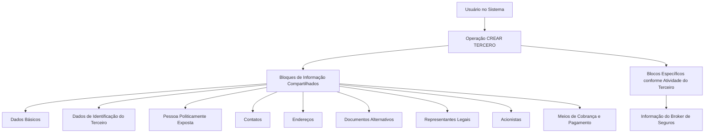

# Operação Criar Broker de Seguros — Registro de Terceiro no Sistema

## 1. Metadados do Documento
- **Arquivo de Origem:** Não identificado no conteúdo fornecido
- **Tipo de Documento:** Procedimento
- **Domínio / Sistema:** Registro de Brokers de Seguros / Terceiros MAPFRE
- **Público-Alvo:** Operação, negócio e usuários do sistema
- **Data/Versão Identificada:** Não identificada

---

## 2. Resumo Executivo & Contexto de Negócio

O documento descreve a operação **“Crear Broker”**, destinada ao registro, no sistema, das informações de Brokers de Seguros que mantêm relação comercial pontual ou total com a entidade MAPFRE em seus processos operacionais.

Um Broker de Seguros é apresentado como intermediário entre o cliente final e a companhia seguradora. O Broker de Seguros assessora o cliente e recomenda companhias, tipos de seguro e cláusulas de apólice adequadas à contratação.

O processo reutiliza blocos de informação compartilhados da operação **“Crear Tercero”** e adiciona um bloco específico para **Informação do Broker de Seguros**. A obrigatoriedade e a habilitação dos campos dependem do código de atividade do terceiro, de sua classificação como pessoa física ou pessoa jurídica e de possíveis personalizações implementadas.

O documento também estabelece que a ordem de captura dos dados nos blocos de informação pode variar segundo o critério do usuário no sistema. Não são detalhados campos individuais, validações específicas, contratos de API, métodos HTTP ou integrações técnicas.

---

## 3. Arquitetura, Componentes & Tecnologias Envolvidas

O conteúdo descreve uma composição funcional baseada na operação principal **Crear Tercero**, blocos de informação compartilhados e um bloco específico conforme a atividade do terceiro. Não há detalhes sobre arquitetura de software, bancos de dados, microsserviços, APIs, tecnologias, ambientes ou protocolos.



**Nota de Análise:** O documento cita “Inicio”, “Soluciones”, “APIs”, “Documentación” e “Zeus” em um trecho de navegação, mas não explica a função dessas referências no processo de criação de Broker de Seguros.

---

## 4. Regras de Negócio, Especificações Funcionais & Processos

### Finalidade da operação

A operação **Crear Broker** permite registrar no sistema as informações dos Brokers de Seguros com os quais a entidade MAPFRE mantém relação comercial pontual ou total em qualquer um de seus processos operacionais.

### Definição funcional de Broker de Seguros

O Broker de Seguros é um intermediário entre:
- Cliente final;
- Companhia seguradora.

Segundo o documento, o Broker de Seguros:
- Assessora o cliente final;
- Recomenda a companhia seguradora;
- Recomenda tipos de seguro;
- Recomenda cláusulas da apólice mais adequadas à contratação;
- É um profissional qualificado, com ampla experiência e alto conhecimento do setor de seguros.

### Premissas para preenchimento

1. A obrigatoriedade e/ou habilitação dos campos de cada bloco ou estrutura de informação compartilhada pode variar conforme o **código de atividade do Terceiro**.
2. A obrigatoriedade e/ou habilitação dos campos pode variar caso o Terceiro seja:
   - Pessoa Física;
   - Pessoa Jurídica.
3. Personalizações implementadas podem afetar o comportamento da aplicação quanto à obrigatoriedade de registro dos Dados do Terceiro.
4. A ordem de captura dos dados nos blocos de informação pode variar de acordo com o critério adotado pelo usuário no sistema.

### Processo funcional

1. O usuário inicia a operação **CREAR TERCERO**.
2. O usuário registra os dados nos blocos de informação compartilhados aplicáveis.
3. O usuário registra os dados no bloco específico de acordo com a atividade do terceiro.
4. Para um Broker de Seguros, o bloco específico indicado é **Informação do Broker de Seguros**.
5. A obrigatoriedade, habilitação e sequência de preenchimento devem respeitar as condições aplicáveis ao código de atividade, tipo de terceiro e personalizações existentes.

---

## 5. Tabelas de Parâmetros, Ambientes e Estruturas de Dados

| Item / Parâmetro | Descrição / Função | Tipo / Valores / Formato | Ambiente / Observações |
| :--- | :--- | :--- | :--- |
| Operação principal | Processo utilizado para registrar o Terceiro | `CREAR TERCERO` | Base para o registro de Broker de Seguros |
| Atividade do Terceiro | Critério que pode alterar obrigatoriedade e habilitação de campos | Código de atividade | O documento não informa os códigos possíveis |
| Tipo de Terceiro | Critério que pode alterar obrigatoriedade e habilitação de campos | Pessoa Física ou Pessoa Jurídica | Não são descritas regras específicas por tipo |
| Personalizações | Implementações que podem afetar o comportamento da aplicação | Não detalhado | Podem afetar obrigatoriedade de Dados do Terceiro |
| Ordem de captura | Sequência de preenchimento dos blocos de informação | Definida pelo usuário | Pode variar conforme critério do usuário |
| Dados Básicos | Bloco de informação compartilhado | Não detalhado | Parte de `CREAR TERCERO` |
| Dados de Identificação do Terceiro | Bloco de informação compartilhado | Não detalhado | Parte de `CREAR TERCERO` |
| Pessoa Politicamente Exposta | Bloco de informação compartilhado | Não detalhado | Parte de `CREAR TERCERO` |
| Contatos | Bloco de informação compartilhado | Não detalhado | Parte de `CREAR TERCERO` |
| Endereços | Bloco de informação compartilhado | Não detalhado | Parte de `CREAR TERCERO` |
| Documentos Alternativos | Bloco de informação compartilhado | Não detalhado | Parte de `CREAR TERCERO` |
| Representantes Legais | Bloco de informação compartilhado | Não detalhado | Parte de `CREAR TERCERO` |
| Acionistas | Bloco de informação compartilhado | Não detalhado | Parte de `CREAR TERCERO` |
| Meios de Cobrança e Pagamento | Bloco de informação compartilhado | Não detalhado | Parte de `CREAR TERCERO` |
| Informação do Broker de Seguros | Bloco específico para a atividade de Broker de Seguros | Não detalhado | Aplicável ao terceiro Broker de Seguros |

---

## 6. Bateria de Perguntas & Respostas para RAG (FAQ Sintético)

### P1: Qual é o objetivo da operação “Crear Broker”?
**R:** A operação “Crear Broker” permite registrar no sistema as informações de Brokers de Seguros que possuem relação comercial pontual ou total com a entidade MAPFRE em seus processos operacionais.

### P2: O que é um Broker de Seguros no contexto do documento?
**R:** Um Broker de Seguros é um intermediário entre o cliente final e a companhia seguradora. O Broker assessora o cliente e recomenda companhia seguradora, tipos de seguro e cláusulas de apólice adequadas à contratação.

### P3: Qual operação deve ser utilizada para criar as informações de um Broker de Seguros?
**R:** O processo indicado é a operação `CREAR TERCERO`, composta por blocos de informação compartilhados e por blocos específicos conforme a atividade do Terceiro.

### P4: Qual bloco específico deve ser utilizado para um Broker de Seguros?
**R:** O bloco específico indicado para a atividade é **Informação do Broker de Seguros**.

### P5: Quais blocos de informação compartilhados fazem parte da operação CREAR TERCERO?
**R:** Os blocos listados são Dados Básicos, Dados de Identificação do Terceiro, Pessoa Politicamente Exposta, Contatos, Endereços, Documentos Alternativos, Representantes Legais, Acionistas e Meios de Cobrança e Pagamento.

### P6: A obrigatoriedade dos campos é fixa para todos os terceiros?
**R:** Não. A obrigatoriedade e/ou habilitação dos campos pode variar conforme o código de atividade do Terceiro, conforme o Terceiro seja pessoa física ou pessoa jurídica e conforme personalizações implementadas na aplicação.

### P7: Como o tipo de Terceiro influencia o registro de dados?
**R:** O documento informa que a obrigatoriedade e/ou habilitação dos campos nos blocos ou estruturas de informação pode variar quando o Terceiro é uma Pessoa Física ou uma Pessoa Jurídica. As diferenças específicas não são detalhadas.

### P8: Personalizações da aplicação podem afetar o processo de criação do Broker?
**R:** Sim. O documento afirma que personalizações implementadas podem afetar o comportamento da aplicação em relação à obrigatoriedade do registro dos Dados do Terceiro.

### P9: Existe uma ordem obrigatória para preencher os blocos de informação?
**R:** Não há uma sequência fixa descrita. A ordem de captura dos dados nos blocos de informação pode variar conforme o critério seguido pelo usuário no sistema.

### P10: O documento informa quais campos devem ser preenchidos em cada bloco?
**R:** Não. O documento lista os blocos de informação, mas não apresenta os campos individuais, tipos de dados, regras de validação ou valores permitidos para cada bloco.

---

## 7. Glossário de Termos, Siglas & Conceitos-Chave

- **Broker de Seguros:** Intermediário entre o cliente final e a companhia seguradora, responsável por assessorar o cliente e recomendar companhias, tipos de seguro e cláusulas de apólice.
- **CREAR TERCERO:** Operação utilizada para criar ou registrar as informações de um Terceiro no sistema.
- **Terceiro:** Entidade cujo registro é realizado na operação `CREAR TERCERO`; pode ser Pessoa Física ou Pessoa Jurídica.
- **Pessoa Física:** Classificação de Terceiro mencionada como fator que pode alterar obrigatoriedade e habilitação de campos.
- **Pessoa Jurídica:** Classificação de Terceiro mencionada como fator que pode alterar obrigatoriedade e habilitação de campos.
- **Pessoa Politicamente Exposta:** Bloco de informação compartilhado listado na operação `CREAR TERCERO`.
- **MAPFRE:** Entidade mencionada como possuidora de relação comercial com os Brokers de Seguros registrados.

---

## 8. Notas Críticas, Riscos & Limitações

- O documento não informa os campos que compõem cada bloco de informação.
- O documento não detalha códigos de atividade, regras de obrigatoriedade por código ou regras específicas para Pessoa Física e Pessoa Jurídica.
- Não há especificação de validações, mensagens de erro, fluxos de aprovação, perfis de acesso ou permissões.
- Não são descritos métodos HTTP, contratos JSON, endpoints, APIs, bancos de dados, logs, URLs, servidores ou ambientes.
- As personalizações podem alterar a obrigatoriedade de dados, criando variações comportamentais que não estão especificadas no conteúdo fornecido.
- A ordem de preenchimento é flexível segundo o critério do usuário, mas o documento não define restrições ou dependências entre blocos.

---

## 9. Conteúdo Bruto Estruturado (Referência Fiel)

```text
--- [PÁGINA 1 DE 2] ---

OPERACIÓN CREAR Broker

Un Broker de Seguros es un intermediario entre el cliente final y la compañía aseguradora,
asesorándole y recomendando la compañía, tipo de seguros y cláusulas de la póliza que más le
conviene contratar.

El bróker, por tanto, es un profesional cualificado con amplia experiencia y altos conocimientos del
sector de los seguros.

¿En que consiste?

Esta operación permite registrar en el Sistema la Información de los Brokers de Seguros, con los
que la entidad MAPFRE tiene una relación comercial puntual o total en cualquiera de sus procesos
operativos.

Premisas

La obligatoriedad y/o la habilitación de los campos en el registro de los datos de cada uno de
los bloques o estructuras de información compartidas puede variar de acuerdo con el código de
actividad del Tercero:

La obligatoriedad y/o la habilitación de los campos en el registro de los datos de cada uno de
los bloques o estructuras de información pueden variar si el tipo de Tercero es una Persona
Física o una Persona Jurídica:

Ejemplo:
 /
 RS
Inicio Soluciones APIs Documentación Zeus
ES


--- [PÁGINA 2 DE 2] ---

Las personalizaciones que se hubieran podido implementar a su vez pueden afectar el
comportamiento de la aplicación en relación con la obligatoriedad en el registro de los Datos del
Tercero.

Por último, el orden de captura de los datos en los distintos bloques de Información puede
variar de acuerdo con el criterio seguido por el Usuario en el Sistema.

Proceso

CREAR
TERCERO

Crear Información del
Broker de Seguros

Bloques de Información Compartidos (CREAR TERCERO)
 Datos Básicos ( )
 Datos Identificación del Tercero ( )
 Persona Políticamente Expuesta ( )
 Contactos ( )
 Direcciones ( )
 Documentos Alternativos ( )
 Representantes Legales ( )
 Accionistas ( )
 Medios de Cobro y Pago ( )

Bloques de Información Específicos de acuerdo con la
Actividad del Tercero.
 Información del Broker de Seguros ( )

Ejemplo:
```
