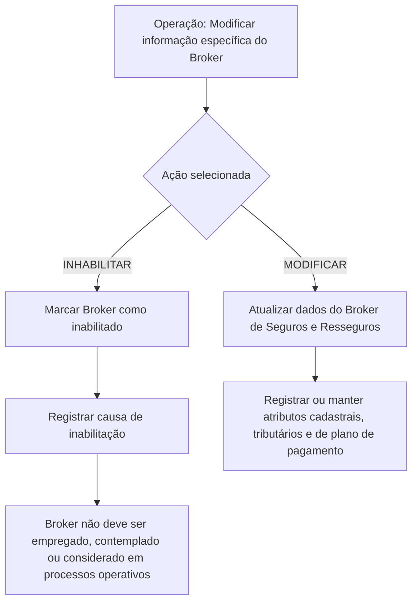

# Operação de Modificação e Inabilitação de Broker de Seguros e Resseguros

## 1. Metadados do Documento
- **Arquivo de Origem:** Não identificado
- **Tipo de Documento:** Procedimento
- **Domínio / Sistema:** MAPFRE — cadastro de Broker de Seguros e Resseguros
- **Público-Alvo:** Operação, Negócio e Backoffice
- **Data/Versão Identificada:** Não identificada

---

## 2. Resumo Executivo & Contexto de Negócio

O documento descreve a operação para modificar informações previamente registradas de um Broker de Seguros e Resseguros. A operação também permite inabilitar o Broker no sistema.

As ações possíveis são **MODIFICAR** e **INHABILITAR**. A captura dos atributos do bloco “Dados Broker de Seguros e Resseguros” deve seguir a sequência indicada pelo documento: da esquerda para a direita e de cima para baixo.

A inabilitação impede que o Broker seja empregado, contemplado ou considerado nos processos operativos da entidade. Quando um Broker estiver inabilitado, deve ser registrado um código de causa de inabilitação definido no catálogo mestre do sistema para a atividade do terceiro.

Além de dados de identificação e situação operacional, o procedimento contempla classificação de origem e tipologia do Broker, códigos tributários aplicáveis às operações econômicas e aos juros de depósitos de resseguro, e o plano de pagamento utilizado para determinar a periodicidade de contato e envio de informações econômicas.

---

## 3. Arquitetura, Componentes & Tecnologias Envolvidas

O conteúdo não detalha arquitetura de software, microsserviços, tecnologias, integrações, ambientes, URLs, contratos HTTP ou estruturas de persistência. O documento apresenta exclusivamente uma operação funcional de manutenção cadastral de Broker de Seguros e Resseguros no sistema MAPFRE.



**Nota de Análise:** o documento não especifica como a operação é acessada, quais usuários possuem permissão para executá-la, nem os mecanismos técnicos de persistência ou validação.

---

## 4. Regras de Negócio, Especificações Funcionais & Processos

### 4.1 Operação disponível

A operação permite modificar a informação previamente registrada para um Broker de Seguros e Resseguros e permite inabilitar esse Broker.

### 4.2 Ações possíveis

- **MODIFICAR:** ação destinada à alteração das informações cadastradas para o Broker de Seguros e Resseguros.
- **INHABILITAR:** ação destinada a registrar que o Broker está inabilitado no sistema.

### 4.3 Sequência de captura

Os atributos do bloco “Dados Broker de Seguros e Resseguros” devem ser capturados na sequência apresentada no formulário:

1. Da esquerda para a direita.
2. De cima para baixo.

### 4.4 Regras para inabilitação

1. O atributo **Inhabilitación** informa ao sistema que o Broker está inabilitado.
2. Um Broker inabilitado não deve ser empregado, contemplado ou considerado nos processos operativos da entidade.
3. Se o Broker de Seguros e Resseguros estiver inabilitado, o atributo **Causa de Inhabilitación** deve conter o código de uma causa de inabilitação.
4. A causa de inabilitação deve estar definida no catálogo mestre do sistema para a atividade do terceiro.

### 4.5 Regras de classificação do Broker

O atributo **País de Origen** identifica o país em que o Broker de Seguros e Resseguros foi constituído.

O atributo **Tipología del Broker** classifica e determina:

- Se o Broker é local ou estrangeiro.
- Se o Broker é afiliado localmente ou não.

Quando o idioma empregado na definição for espanhol, os valores apresentados são:

- **AL:** Afiliado (Local).
- **NL:** No Afiliado (Local).
- **AE:** Afiliado (Extranjera).
- **NE:** No Afiliado (Extranjera).

### 4.6 Regras tributárias e econômicas

- **Código de Impuesto sobre la Renta:** contém o código de imposto que a entidade MAPFRE aplicará como retenção nas operações econômicas com o Broker de Seguros e Resseguros.
- **Impuesto sobre Intereses de los Depósitos de Reaseguro:** contém o código de imposto aplicável ao Broker sobre juros gerados por depósitos de resseguro.
- **Plan de Pago:** identifica a temporalidade a considerar no contato com o Broker e no envio de informação econômica. O documento cita como exemplos periodicidades anual, semestral, trimestral e mensal.

---

## 5. Tabelas de Parâmetros, Ambientes e Estruturas de Dados

| Item / Parâmetro | Descrição / Função | Tipo / Valores / Formato | Ambiente / Observações |
| :--- | :--- | :--- | :--- |
| Operação | Modifica informações previamente registradas do Broker ou permite sua inabilitação. | MODIFICAR ou INHABILITAR. | Sistema não identificado no texto. |
| Nombre Corto del Broker | Contém o nome abreviado do Broker, previamente capturado no bloco de informação. | Texto; formato não detalhado. | Broker de Seguros e Resseguros. |
| Inhabilitación | Indica que o Broker está inabilitado no sistema. | Indicador; valores não detalhados. | Um Broker inabilitado não deve participar dos processos operativos da entidade. |
| Causa de Inhabilitación | Contém o código da causa de inabilitação. | Código definido em catálogo mestre. | Aplicável quando o Broker estiver inabilitado. |
| País de Origen | Identifica o país onde o Broker foi constituído. | País; código ou formato não detalhado. | Broker de Seguros e Resseguros. |
| Tipología del Broker | Classifica o Broker quanto à origem e afiliação local. | AL, NL, AE, NE. | Valores apresentados para definição em espanhol. |
| AL | Afiliado (Local). | Código de tipologia. | Broker local afiliado. |
| NL | No Afiliado (Local). | Código de tipologia. | Broker local não afiliado. |
| AE | Afiliado (Extranjera). | Código de tipologia. | Broker estrangeiro afiliado. |
| NE | No Afiliado (Extranjera). | Código de tipologia. | Broker estrangeiro não afiliado. |
| Código de Impuesto sobre la Renta | Código de imposto aplicado pela MAPFRE como retenção nas operações econômicas com o Broker. | Código de imposto; formato não detalhado. | Operações econômicas com o Broker de Seguros e Resseguros. |
| Impuesto sobre Intereses de los Depósitos de Reaseguro | Código de imposto aplicado sobre juros gerados pelos depósitos de resseguro. | Código de imposto; formato não detalhado. | Aplicável ao Broker. |
| Plan de Pago | Determina a periodicidade de contato com o Broker e de envio de informação econômica. | Anual, semestral, trimestral, mensal, entre outros. | O documento não define a lista completa de periodicidades. |

---

## 6. Bateria de Perguntas & Respostas para RAG (FAQ Sintético)

### P1: Qual é a finalidade da operação de modificação de Broker?
**R:** A operação permite modificar informações previamente registradas para um Broker de Seguros e Resseguros. A operação também permite inabilitar o Broker no sistema.

### P2: Quais ações podem ser executadas na operação de manutenção do Broker?
**R:** O documento apresenta duas ações possíveis: **MODIFICAR**, para alterar informações do Broker, e **INHABILITAR**, para registrar que o Broker está inabilitado no sistema.

### P3: Qual é a consequência operacional de inabilitar um Broker?
**R:** Um Broker inabilitado não deve ser empregado, contemplado ou considerado nos processos operativos da entidade.

### P4: Quando a causa de inabilitação deve ser preenchida?
**R:** A causa de inabilitação deve ser informada quando o Broker de Seguros e Resseguros estiver inabilitado. O atributo deve conter o código de uma causa definida no catálogo mestre do sistema para a atividade do terceiro.

### P5: O que representa o campo “País de Origen”?
**R:** O campo “País de Origen” identifica o país em que o Broker de Seguros e Resseguros foi constituído.

### P6: Como a tipologia do Broker é classificada?
**R:** A tipologia classifica o Broker como local ou estrangeiro e indica se o Broker é afiliado localmente. Os valores apresentados são AL para Afiliado (Local), NL para No Afiliado (Local), AE para Afiliado (Extranjera) e NE para No Afiliado (Extranjera).

### P7: Qual imposto é tratado pelo campo “Código de Impuesto sobre la Renta”?
**R:** Esse campo contém o código de imposto que a entidade MAPFRE aplicará como retenção nas operações econômicas realizadas com o Broker de Seguros e Resseguros.

### P8: O que é informado no campo de imposto sobre juros de depósitos de resseguro?
**R:** O campo “Impuesto sobre Intereses de los Depósitos de Reaseguro” contém o código de imposto aplicável ao Broker sobre os juros gerados pelos depósitos de resseguro.

### P9: Para que serve o “Plan de Pago” do Broker?
**R:** O “Plan de Pago” identifica a temporalidade que deve ser considerada no contato com o Broker e no envio de informação econômica. O documento cita periodicidades anual, semestral, trimestral e mensal como exemplos.

### P10: Em qual ordem os atributos do bloco de dados do Broker devem ser preenchidos?
**R:** Os atributos devem seguir a sequência de captura da esquerda para a direita e de cima para baixo.

---

## 7. Glossário de Termos, Siglas & Conceitos-Chave

- **Broker de Seguros y Reaseguros:** Broker de seguros e resseguros cujas informações podem ser modificadas ou cuja condição pode ser inabilitada no sistema.
- **Inhabilitación:** atributo que informa ao sistema que o Broker está inabilitado.
- **Causa de Inhabilitación:** código de causa de inabilitação definido no catálogo mestre do sistema para a atividade do terceiro.
- **Catálogo maestro:** catálogo mestre do sistema que contém causas de inabilitação para a atividade do terceiro.
- **País de Origen:** país em que o Broker de Seguros e Resseguros foi constituído.
- **Tipología del Broker:** classificação do Broker quanto à condição local ou estrangeira e à afiliação local.
- **AL:** Afiliado (Local).
- **NL:** No Afiliado (Local).
- **AE:** Afiliado (Extranjera).
- **NE:** No Afiliado (Extranjera).
- **MAPFRE:** entidade mencionada como responsável pela aplicação de retenção de imposto nas operações econômicas com o Broker.
- **Plan de Pago:** temporalidade considerada no contato com o Broker e no envio de informação econômica.
- **Depósitos de Reaseguro:** depósitos de resseguro cujos juros podem sofrer aplicação de imposto ao Broker.

---

## 8. Notas Críticas, Riscos & Limitações

- O documento não identifica o nome do arquivo, versão, data, ambiente ou sistema específico em que a operação é executada.
- O documento não detalha permissões, perfis autorizados, trilha de auditoria, aprovação, validações obrigatórias ou comportamento de erro.
- Não foram fornecidos contratos de integração, métodos HTTP, APIs, banco de dados, telas completas ou estruturas de dados técnicas.
- O formato dos códigos de país, impostos, causa de inabilitação e nome curto do Broker não é especificado.
- A lista completa de periodicidades do plano de pagamento não é definida; anual, semestral, trimestral e mensal são apresentados apenas como exemplos.
- **Nota de Análise:** o documento descreve a existência de um catálogo mestre para causas de inabilitação, mas não detalha seu conteúdo, manutenção ou critérios de seleção.

---

## 9. Conteúdo Bruto Estruturado (Referência Fiel)

```text
--- [PÁGINA 1 DE 2] ---

MODIFICAR Información específica del Broker
Esta Operación permite Modificar la información que tuviera el Broker de Seguros y Reaseguros
registrada previamente además de poder Inhabilitarlo.
Posibles Acciones
 MODIFICAR ( )
 INHABILITAR ( )
Datos Broker de Seguros y Reaseguros
De Izquierda a Derecha y de Arriba hacia Abajo, los siguientes atributos marcan la secuencia de
captura en este Bloque de Información.
Nombre Corto del Broker ( )
Este campo contiene el nombre abreviado del Broker, que se habrá capturado en el Bloque de
Información
Inhabilitación ( )
 / 
 RS
Inicio Soluciones APIs Documentación Zeus
ES


--- [PÁGINA 2 DE 2] ---

Este campo le indica al Sistema que el Broker está inhabilitado en el Sistema por lo cual, de estarlo,
no debería ser empleado, contemplado o considerado en los procesos operativos de la entidad.
Causa de Inhabilitación (   )
En el supuesto que el Broker de Seguros y Reaseguros estuviera inhabilitado, este Atributo
contendrá el código de una causa de inhabilitación definida en el catálogo maestro del Sistema para
esta Actividad del Tercero.
País de Origen (  )
Este dato identifica el País Origen en el que se constituyó el Broker de Seguros y Reaseguros.
Tipología del Broker (  )
Este campo clasifica y determina si el Broker es un Broker Local o Extranjero y si está o no afiliado
localmente.
Si el idioma empleado en la definición es el español, sus valores serían...
(AL) Afiliado (Local)
(NL) No Afiliado (Local)
(AE) Afiliado (Extranjera)
(NE) No Afiliado (Extranjera)
Código de Impuesto sobre la Renta (  )
Este Dato contiene el código de Impuesto que la entidad MAPFRE va a aplicar como retención en las
operaciones económicas con el Broker de Seguros y Reaseguros.
Impuesto sobre Intereses de los Depósitos de Reaseguro (  )
Este Dato contiene el código de Impuesto que se va a aplicar al Broker sobre los intereses
generados por los depósitos del reaseguro.
Plan de Pago (  )
Este Dato identifica la temporalidad que se debe considerar en el contacto con el Broker y en relación
al envío de información económica (Anual, semestral, trimestral, mensualmente,...)
```
