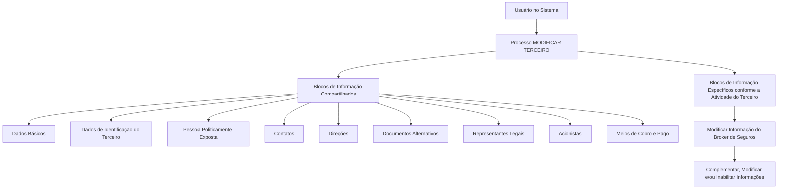

# Operação MODIFICAR Broker — Gestão de Informações de Broker de Seguros e Resseguros

## 1. Metadados do Documento
- **Arquivo de Origem:** Não identificado no conteúdo fornecido
- **Tipo de Documento:** Procedimento
- **Domínio / Sistema:** Operação MODIFICAR TERCEIRO / Broker de Seguros e Resseguros
- **Público-Alvo:** Usuários do Sistema, Operação e Negócio
- **Data/Versão Identificada:** Não identificada

---

## 2. Resumo Executivo & Contexto de Negócio

O documento descreve a operação **MODIFICAR Broker**, destinada ao complemento, à modificação e/ou à inabilitação de informações de um **Broker de Seguros e Resseguros**. A operação atua sobre blocos ou estruturas de dados que agrupam informações conforme a natureza dos dados registrados.

A operação faz parte do processo **MODIFICAR TERCEIRO** e permite alterar informações compartilhadas do Terceiro, além de informações específicas associadas à atividade do Terceiro. O documento relaciona explicitamente a modificação das informações do Broker de Seguros como um bloco específico vinculado à atividade.

A obrigatoriedade e a habilitação dos campos não são uniformes para todos os registros. Esses comportamentos podem variar conforme o código de atividade do Terceiro e conforme o tipo de Terceiro, que pode ser **Pessoa Física** ou **Pessoa Jurídica**.

O documento também estabelece que personalizações previamente implementadas podem afetar a obrigatoriedade de registro dos Dados do Terceiro. Além disso, a ordem de captura dos dados nos diferentes blocos de informação pode variar segundo o critério adotado pelo Usuário no Sistema.

---

## 3. Arquitetura, Componentes & Tecnologias Envolvidas

O conteúdo fornecido não detalha arquitetura de software, tecnologias, protocolos, APIs, URLs de ambiente, bancos de dados ou contratos de integração. O documento apresenta uma estrutura funcional de navegação e alteração de informações dentro do processo **MODIFICAR TERCEIRO**.

### Componentes funcionais identificados

| Componente / Bloco | Papel no processo |
| :--- | :--- |
| MODIFICAR TERCEIRO | Processo que concentra a alteração das informações do Terceiro. |
| Modificar Informação do Broker de Seguros | Operação específica para complementar, modificar e/ou inabilitar dados do Broker de Seguros e Resseguros. |
| Blocos de Informação Compartilhados | Estruturas de informação comuns disponíveis no processo MODIFICAR TERCEIRO. |
| Blocos de Informação Específicos | Estruturas disponíveis de acordo com a atividade do Terceiro. |
| Usuário no Sistema | Responsável por definir o critério e a ordem de captura dos dados nos blocos de informação. |
| Terceiro | Entidade cujas informações podem ser modificadas; pode ser Pessoa Física ou Pessoa Jurídica. |
| Broker de Seguros e Resseguros | Tipo de informação/atividade abordada pela operação MODIFICAR Broker. |



> **Nota de Análise:** O documento não detalha métodos HTTP, contratos JSON, APIs, tecnologias, persistência de dados, autenticação ou integrações entre sistemas.

---

## 4. Regras de Negócio, Especificações Funcionais & Processos

### 4.1 Escopo da operação MODIFICAR Broker

A operação **MODIFICAR Broker** consiste em:

1. Complementar informações do Broker de Seguros e Resseguros.
2. Modificar informações do Broker de Seguros e Resseguros.
3. Inabilitar informações do Broker de Seguros e Resseguros.
4. Atuar em qualquer bloco ou estrutura de dados que contenha e agrupe informações conforme a natureza dessas informações.

### 4.2 Premissas de obrigatoriedade e habilitação de campos

A obrigatoriedade e/ou a habilitação dos campos no registro dos dados variam conforme as seguintes condições:

1. **Código de atividade do Terceiro**  
   A obrigatoriedade e/ou habilitação dos campos em cada bloco ou estrutura de informação compartilhada pode variar conforme o código de atividade atribuído ao Terceiro.

2. **Tipo de Terceiro**  
   A obrigatoriedade e/ou habilitação dos campos pode variar quando o Terceiro for classificado como:
   - Pessoa Física; ou
   - Pessoa Jurídica.

3. **Personalizações implementadas**  
   Personalizações previamente implementadas podem afetar o comportamento da aplicação quanto à obrigatoriedade do registro dos Dados do Terceiro.

4. **Ordem de captura de dados**  
   A ordem de captura dos dados nos distintos blocos de informação pode variar conforme o critério seguido pelo Usuário no Sistema.

### 4.3 Processo funcional identificado

O processo apresentado pelo documento pode ser organizado da seguinte forma:

1. O Usuário acessa o processo **MODIFICAR TERCEIRO**.
2. O Usuário pode modificar informações localizadas nos blocos de informação compartilhados.
3. O Usuário pode acessar blocos específicos conforme a atividade do Terceiro.
4. Para a atividade relacionada ao Broker, o Usuário utiliza o bloco **Modificar Informação do Broker de Seguros**.
5. O comportamento de obrigatoriedade e habilitação dos campos deve ser considerado de acordo com:
   - Código de atividade do Terceiro;
   - Tipo de Terceiro;
   - Personalizações implementadas.
6. O Usuário pode seguir uma ordem de captura de dados definida por seu próprio critério no Sistema.

### 4.4 Blocos de informação compartilhados

O documento lista os seguintes blocos de informação compartilhados no processo MODIFICAR TERCEIRO:

- Dados Básicos;
- Dados de Identificação do Terceiro;
- Pessoa Politicamente Exposta;
- Contatos;
- Direções;
- Documentos Alternativos;
- Representantes Legais;
- Acionistas;
- Meios de Cobro e Pago.

### 4.5 Bloco específico da atividade

O documento apresenta o seguinte bloco específico de acordo com a atividade do Terceiro:

- Modificar Informação do Broker de Seguros.

> **Nota de Análise:** O documento não apresenta a definição dos campos existentes em cada bloco, regras de validação individuais, valores permitidos, mensagens de erro ou critérios de inabilitação das informações.

---

## 5. Tabelas de Parâmetros, Ambientes e Estruturas de Dados

| Item / Parâmetro | Descrição / Função | Tipo / Valores / Formato | Ambiente / Observações |
| :--- | :--- | :--- | :--- |
| Operação MODIFICAR Broker | Permite complementar, modificar e/ou inabilitar informações do Broker de Seguros e Resseguros. | Operação funcional | Atua sobre blocos ou estruturas de dados segundo a natureza das informações. |
| MODIFICAR TERCEIRO | Processo no qual são alteradas informações compartilhadas e específicas do Terceiro. | Processo funcional | Contém os blocos de informação relacionados no documento. |
| Código de atividade do Terceiro | Critério que pode influenciar a obrigatoriedade e/ou habilitação dos campos. | Código de atividade | O documento não informa valores, catálogo ou formato. |
| Tipo de Terceiro | Critério que pode alterar a obrigatoriedade e/ou habilitação dos campos. | Pessoa Física ou Pessoa Jurídica | Não há detalhamento adicional sobre classificação. |
| Personalizações implementadas | Configurações previamente implementadas que podem afetar o comportamento da aplicação. | Personalizações | Podem afetar a obrigatoriedade de registro dos Dados do Terceiro. |
| Ordem de captura dos dados | Sequência adotada para registrar dados nos blocos de informação. | Critério do Usuário no Sistema | Pode variar conforme o Usuário. |
| Dados Básicos | Bloco de informação compartilhada. | Estrutura de dados | Campos não detalhados. |
| Dados de Identificação do Terceiro | Bloco de informação compartilhada. | Estrutura de dados | Campos não detalhados. |
| Pessoa Politicamente Exposta | Bloco de informação compartilhada. | Estrutura de dados | Campos e regras não detalhados. |
| Contatos | Bloco de informação compartilhada. | Estrutura de dados | Campos não detalhados. |
| Direções | Bloco de informação compartilhada. | Estrutura de dados | Campos não detalhados. |
| Documentos Alternativos | Bloco de informação compartilhada. | Estrutura de dados | Campos não detalhados. |
| Representantes Legais | Bloco de informação compartilhada. | Estrutura de dados | Campos não detalhados. |
| Acionistas | Bloco de informação compartilhada. | Estrutura de dados | Campos não detalhados. |
| Meios de Cobro e Pago | Bloco de informação compartilhada. | Estrutura de dados | Campos não detalhados. |
| Modificar Informação do Broker de Seguros | Bloco específico da atividade do Terceiro relacionada ao Broker. | Estrutura de dados específica | Regras de campos, valores e validações não detalhados. |

---

## 6. Bateria de Perguntas & Respostas para RAG (FAQ Sintético)

### P1: Qual é a finalidade da operação MODIFICAR Broker?
**R:** A operação MODIFICAR Broker permite complementar, modificar e/ou inabilitar informações do Broker de Seguros e Resseguros em blocos ou estruturas de dados que agrupam informações de acordo com sua natureza.

### P2: Em qual processo está inserida a modificação das informações do Broker de Seguros?
**R:** A modificação das informações do Broker de Seguros está inserida no processo **MODIFICAR TERCEIRO**, que contém blocos de informação compartilhados e blocos específicos conforme a atividade do Terceiro.

### P3: Quais fatores podem alterar a obrigatoriedade ou habilitação dos campos?
**R:** A obrigatoriedade e/ou habilitação dos campos pode variar conforme o código de atividade do Terceiro, o tipo de Terceiro — Pessoa Física ou Pessoa Jurídica — e personalizações que tenham sido implementadas.

### P4: O tipo de Terceiro influencia o comportamento dos campos?
**R:** Sim. O documento informa que a obrigatoriedade e/ou habilitação dos campos pode variar quando o tipo de Terceiro for Pessoa Física ou Pessoa Jurídica.

### P5: As personalizações existentes podem afetar o registro dos Dados do Terceiro?
**R:** Sim. As personalizações que tenham sido implementadas podem afetar o comportamento da aplicação relacionado à obrigatoriedade do registro dos Dados do Terceiro.

### P6: A ordem de captura dos dados é fixa no processo MODIFICAR TERCEIRO?
**R:** Não. O documento informa que a ordem de captura dos dados nos distintos blocos de informação pode variar de acordo com o critério seguido pelo Usuário no Sistema.

### P7: Quais blocos de informação compartilhados são listados no processo MODIFICAR TERCEIRO?
**R:** Os blocos listados são: Dados Básicos, Dados de Identificação do Terceiro, Pessoa Politicamente Exposta, Contatos, Direções, Documentos Alternativos, Representantes Legais, Acionistas e Meios de Cobro e Pago.

### P8: Qual é o bloco específico apresentado para a atividade de Broker?
**R:** O bloco específico apresentado pelo documento é **Modificar Informação do Broker de Seguros**, classificado como um bloco de informação específico de acordo com a atividade do Terceiro.

### P9: O documento define os campos que devem ser preenchidos no bloco de informações do Broker?
**R:** Não. O documento identifica a existência do bloco **Modificar Informação do Broker de Seguros**, mas não detalha seus campos, formatos, valores permitidos ou validações individuais.

### P10: O documento explica como inabilitar uma informação de Broker?
**R:** Não. O documento estabelece que a operação MODIFICAR Broker permite inabilitar informações, mas não descreve o procedimento operacional, condições de negócio, permissões ou efeitos da inabilitação.

### P11: O documento apresenta APIs ou contratos técnicos para a operação MODIFICAR Broker?
**R:** Não. Não há especificação de APIs, métodos HTTP, URLs, contratos JSON, protocolos, autenticação ou integrações técnicas no conteúdo fornecido.

### P12: Como o código de atividade do Terceiro afeta a operação MODIFICAR Broker?
**R:** O código de atividade do Terceiro pode alterar a obrigatoriedade e/ou a habilitação dos campos registrados em cada bloco ou estrutura de informações compartilhadas.

---

## 7. Glossário de Termos, Siglas & Conceitos-Chave

- **Broker de Seguros e Resseguros:** Entidade cujas informações podem ser complementadas, modificadas e/ou inabilitadas pela operação MODIFICAR Broker.
- **MODIFICAR Broker:** Operação destinada à gestão das informações do Broker de Seguros e Resseguros.
- **MODIFICAR TERCEIRO:** Processo que permite modificar informações compartilhadas e informações específicas do Terceiro.
- **Terceiro:** Entidade cujos dados são registrados e modificados no processo; pode ser Pessoa Física ou Pessoa Jurídica.
- **Pessoa Física:** Tipo de Terceiro citado como critério que pode alterar a obrigatoriedade e/ou habilitação dos campos.
- **Pessoa Jurídica:** Tipo de Terceiro citado como critério que pode alterar a obrigatoriedade e/ou habilitação dos campos.
- **Blocos de Informação Compartilhados:** Estruturas de dados disponíveis no processo MODIFICAR TERCEIRO e comuns às informações do Terceiro.
- **Blocos de Informação Específicos:** Estruturas de dados disponíveis conforme a atividade do Terceiro.
- **Pessoa Politicamente Exposta:** Bloco de informação compartilhada listado no processo MODIFICAR TERCEIRO.
- **Meios de Cobro e Pago:** Bloco de informação compartilhada listado no processo MODIFICAR TERCEIRO.

---

## 8. Notas Críticas, Riscos & Limitações

- O documento não identifica o nome do arquivo de origem, data, versão, responsável ou sistema específico.
- O documento não detalha os campos presentes em nenhum dos blocos de informação listados.
- O documento não apresenta regras específicas de validação, campos obrigatórios por tipo de Terceiro, valores aceitos ou mensagens de erro.
- O documento informa que personalizações podem afetar a obrigatoriedade dos Dados do Terceiro, mas não identifica quais personalizações existem ou seus impactos concretos.
- O documento não descreve permissões, perfis de acesso, trilha de auditoria ou responsabilidades para executar a operação MODIFICAR Broker.
- O documento não esclarece o procedimento técnico ou funcional para inabilitar informações do Broker de Seguros e Resseguros.
- Não há detalhamento de APIs, integrações, tecnologias, bancos de dados, ambientes, URLs, servidores ou logs.
- A ordem de captura de informações pode variar conforme o critério do Usuário no Sistema, o que pode introduzir variação operacional caso não existam procedimentos complementares.

---

## 9. Conteúdo Bruto Estruturado (Referência Fiel)

```text
--- [PÁGINA 1 DE 2] ---

OPERACIÓN MODIFICAR Broker
¿En que consiste?
Esta operación consiste en el Complemento, Modificación y/o Inhabilitación de la información del
Broker de Seguros y Reaseguros en cualquiera de los bloques o estructuras de datos que la
contienen y agrupan de acuerdo con su naturaleza.
Premisas
La obligatoriedad y/o la habilitación de los campos en el registro de los datos de cada uno de
los bloques o estructuras de información compartidas puede variar de acuerdo con el código de
actividad del Tercero:
La obligatoriedad y/o la habilitación de los campos en el registro de los datos de cada uno de
los bloques o estructuras de información pueden variar si el tipo de Tercero es una Persona
Física o una Persona Jurídica:
Las personalizaciones que se hubieran podido implementar a su vez pueden afectar el
comportamiento de la aplicación en relación con la obligatoriedad en el registro de los Datos del
Tercero.
Ejemplo:
Ejemplo:
 /
 RS
Inicio Soluciones APIs Documentación Zeus
ES


--- [PÁGINA 2 DE 2] ---

Por último, el orden de captura de los datos en los distintos bloques de Información puede
variar de acuerdo con el criterio seguido por el Usuario en el Sistema.
Proceso
MODIFICAR
TERCERO
Modificar Información
del Broker de Seguros
Bloques de Información Compartidos (MODIFICAR TERCERO)
 Datos Básicos ( )
 Datos Identificación Tercero ( )
 Persona Políticamente Expuesta(   )
 Contactos (   )
 Direcciones (   )
 Documentos Alternativos (   )
 Representantes Legales (   )
 Accionistas (   )
 Medios de Cobro y Pago (   )
Bloques de Información Específicos de acuerdo con la
Actividad del Tercero.
 Modificar Información del Broker de Seguros (  )
```
