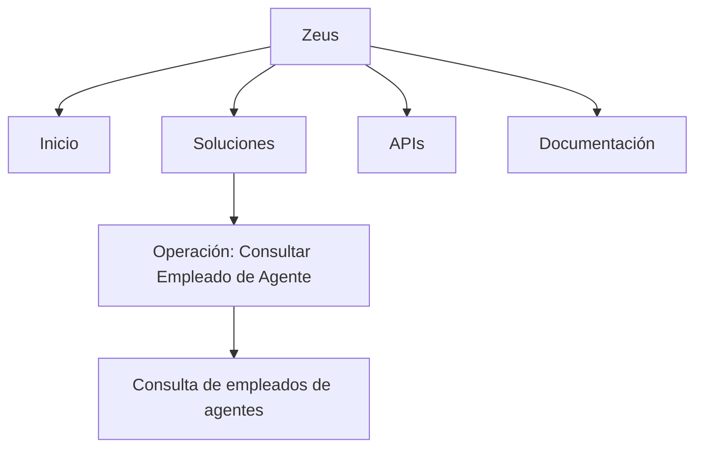

# Operação “Consultar Empleado de Agente” — Consulta de Funcionários de Agentes

## 1. Metadados do Documento
- **Arquivo de Origem:** `Não identificado`
- **Tipo de Documento:** `Manual Operacional`
- **Domínio / Sistema:** `Zeus — Soluciones APIs`
- **Público-Alvo:** `Operação, Negócio e usuários do sistema Zeus`
- **Data/Versão Identificada:** `Não identificada`

---

## 2. Resumo Executivo & Contexto de Negócio

O conteúdo descreve a operação **“Consultar Empleado de Agente”**, destinada à consulta dos funcionários associados aos agentes com os quais a companhia opera.

A funcionalidade está localizada no contexto de navegação do sistema **Zeus**, dentro da área **Soluciones**, com referências também a **APIs** e **Documentación**. O trecho apresenta uma interface ou página disponível em idioma espanhol, identificada pelo marcador **ES**.

O objetivo operacional explicitamente apresentado é permitir a visualização ou consulta de empregados vinculados a agentes parceiros da companhia. O texto não detalha filtros, critérios de busca, campos retornados, permissões de acesso, integrações de backend ou contratos de API.

> **Nota de Análise:** O documento identifica a operação de consulta de empregados de agentes, mas não informa como a pesquisa é executada, quais dados do empregado são exibidos ou quais APIs suportam a operação.

---

## 3. Arquitetura, Componentes & Tecnologias Envolvidas

Os componentes e termos identificados são:

| Componente / Termo | Papel identificado no conteúdo |
| :--- | :--- |
| `Zeus` | Sistema ou contexto principal de navegação apresentado. |
| `Soluciones` | Seção de soluções dentro da navegação exibida. |
| `APIs` | Área ou item de navegação relacionado a APIs. |
| `Documentación` | Área ou item de navegação relacionado à documentação. |
| `Consultar Empleado de Agente` | Operação de consulta de funcionários de agentes. |
| `RS` | Sigla exibida no conteúdo, sem definição fornecida. |
| `ES` | Indicador de idioma espanhol exibido na interface. |



> **Nota de Análise:** O documento não descreve arquitetura técnica, camadas de software, microsserviços, banco de dados, protocolos de comunicação ou fluxo de integração.

---

## 4. Regras de Negócio, Especificações Funcionais & Processos

### Operação identificada
- A operação é denominada **“Consultar Empleado de Agente”**.
- A operação está associada à **consulta dos empregados dos agentes com os quais a companhia opera**.
- O conteúdo relaciona a operação ao ambiente ou sistema denominado **Zeus**.

### Fluxo funcional extraído
1. O usuário acessa o contexto de navegação do sistema **Zeus**.
2. O usuário encontra a operação **“Consultar Empleado de Agente”**.
3. A operação tem como finalidade consultar empregados vinculados a agentes que operam com a companhia.

### Restrições e ausência de detalhamento
- Não são informados critérios de seleção de agentes.
- Não são informados filtros de empregados.
- Não são apresentados campos de entrada.
- Não são apresentados campos de saída ou atributos de empregados.
- Não são descritos níveis de acesso, perfis ou matriz de permissões.
- Não são identificados métodos HTTP, endpoints, formatos JSON, autenticação ou códigos de resposta.
- A sigla **RS** é apresentada sem explicação funcional ou técnica.

---

## 5. Tabelas de Parâmetros, Ambientes e Estruturas de Dados

| Item / Parâmetro | Descrição / Função | Tipo / Valores / Formato | Ambiente / Observações |
| :--- | :--- | :--- | :--- |
| Operação | Consulta de funcionários de agentes. | `Consultar Empleado de Agente` | Associada aos agentes com os quais a companhia opera. |
| Entidade consultada | Funcionários dos agentes. | `Empleados de los Agentes` | O documento não detalha os atributos retornados. |
| Sistema | Contexto principal de navegação. | `Zeus` | Não há versão ou ambiente identificados. |
| Seção | Área de soluções exibida na navegação. | `Soluciones` | Relação exata com a operação não é tecnicamente detalhada. |
| Área relacionada | Item de navegação para APIs. | `APIs` | Não há contrato de API apresentado. |
| Área relacionada | Item de navegação para documentação. | `Documentación` | Não há referência documental adicional. |
| Sigla | Termo exibido no conteúdo. | `RS` | Significado não identificado. |
| Idioma | Indicador de idioma da interface. | `ES` | Espanhol. |

---

## 6. Bateria de Perguntas & Respostas para RAG (FAQ Sintético)

### P1: Qual é o objetivo da operação “Consultar Empleado de Agente”?
**R:** A operação “Consultar Empleado de Agente” tem como objetivo consultar os empregados dos agentes com os quais a companhia opera.

### P2: Quais entidades de negócio são consultadas pela operação apresentada?
**R:** A operação consulta empregados vinculados a agentes que mantêm operação com a companhia. O documento não apresenta atributos, identificadores ou estrutura de dados desses empregados ou agentes.

### P3: Em qual sistema está localizada a operação de consulta de empregados de agentes?
**R:** A operação é apresentada no contexto do sistema ou ambiente denominado Zeus.

### P4: O documento informa quais filtros podem ser usados para consultar empregados de agentes?
**R:** Não. O conteúdo apenas informa que existe uma consulta de empregados de agentes; não especifica filtros por agente, empregado, identificação, status ou qualquer outro critério.

### P5: Quais dados de um empregado são retornados pela consulta?
**R:** O documento não detalha os campos retornados. Não há informação sobre nome, identificador, função, agente associado, status ou outros atributos do empregado.

### P6: Existem endpoints ou métodos HTTP documentados para “Consultar Empleado de Agente”?
**R:** Não. Embora o conteúdo apresente o item “APIs” na navegação, não são informados endpoints, métodos HTTP, parâmetros, autenticação, payloads ou respostas.

### P7: O que significa a sigla “RS” exibida no documento?
**R:** O significado de “RS” não é definido no conteúdo fornecido. A sigla deve ser tratada como termo não documentado até que haja uma fonte complementar.

### P8: Qual idioma é indicado no conteúdo da operação?
**R:** O marcador “ES” indica que o conteúdo ou interface está apresentado em espanhol.

### P9: A operação “Consultar Empleado de Agente” possui regras de autorização documentadas?
**R:** Não. O documento não descreve perfis de usuário, permissões, autenticação, autorização ou restrições de acesso para executar a consulta.

### P10: Onde o usuário encontra referências a APIs e documentação no contexto apresentado?
**R:** O conteúdo exibe os itens de navegação “APIs” e “Documentación” no contexto de Zeus, porém não especifica documentos, serviços ou recursos vinculados a esses itens.

---

## 7. Glossário de Termos, Siglas & Conceitos-Chave

- **APIs:** Termo exibido como item de navegação; o documento não especifica quais interfaces de programação estão disponíveis.
- **Consultar Empleado de Agente:** Operação destinada à consulta de empregados dos agentes com os quais a companhia opera.
- **Documentación:** Item de navegação relacionado à documentação, sem conteúdo adicional detalhado.
- **ES:** Indicador apresentado no conteúdo; corresponde ao idioma espanhol.
- **Empleado:** Empregado ou funcionário, no contexto dos agentes que operam com a companhia.
- **RS:** Sigla apresentada sem definição no documento.
- **Soluciones:** Seção ou item de navegação de soluções.
- **Zeus:** Sistema ou contexto principal no qual a operação é exibida.

---

## 8. Notas Críticas, Riscos & Limitações

- O conteúdo disponível é extremamente resumido e não fornece especificações técnicas da operação.
- Não há definição para a sigla **RS**.
- Não há informação sobre URL, ambiente, servidor, autenticação, autorização ou credenciais.
- Não há contratos de API, métodos HTTP, parâmetros de requisição, estruturas JSON ou códigos de resposta.
- Não há definição dos campos exibidos ou retornados para empregados e agentes.
- Não há descrição de tratamento de erros, auditoria, logs, desempenho ou disponibilidade.
- Não é possível inferir tecnologias, banco de dados, integrações ou arquitetura interna sem introduzir informação não sustentada pelo documento.

---

## 9. Conteúdo Bruto Estruturado (Referência Fiel)

```text
--- [PÁGINA 1 DE 1] ---

OPERACIÓN CONSULTAR Empleado de Agente
Consulta de los Empleados de los Agentes con los que opera la compañía.
 / 
 RS
Inicio Soluciones APIs Documentación Zeus
ES
```
