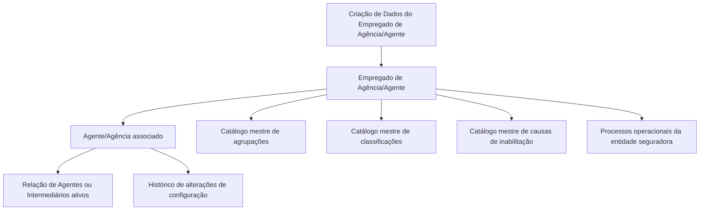

# Cadastro de Informação Específica do Empregado de Agência/Agente

## 1. Metadados do Documento
- **Arquivo de Origem:** `Não identificado no conteúdo fornecido`
- **Tipo de Documento:** Especificação Funcional
- **Domínio / Sistema:** Cadastro operacional de Empregado de Agência/Agente em entidade seguradora
- **Público-Alvo:** Negócio, analistas funcionais, desenvolvedores e operação
- **Data/Versão Identificada:** Não identificada

---

## 2. Resumo Executivo & Contexto de Negócio

O documento descreve o bloco de informação destinado à criação e ao cadastro de dados específicos de um **Empregado de Agência/Agente**. O objetivo declarado é identificar informações de âmbito operacional desse empregado e permitir sua classificação adequada no sistema.

A classificação e os atributos operacionais registrados devem permitir que processos da entidade seguradora considerem — ou não — circunstâncias específicas relacionadas ao empregado. Entre essas circunstâncias estão o relacionamento com um Agente, a classificação comercial, a habilitação profissional e uma eventual inabilitação.

A única ação habilitada explicitamente no conteúdo é **CREAR**, isto é, criar o registro de dados do Empregado de Agência/Agente. O documento também estabelece uma sequência de captura dos atributos: da esquerda para a direita e de cima para baixo.

Os campos são aplicáveis tanto a Pessoas Físicas quanto a Pessoas Jurídicas, exceto quando houver indicação expressa em contrário. O conteúdo fornecido não apresenta detalhamento sobre telas, contratos de API, validações técnicas de formato, perfis de acesso, persistência de dados ou integrações externas.

---

## 3. Arquitetura, Componentes & Tecnologias Envolvidas

O documento menciona um **Sistema** corporativo que mantém catálogos mestres e relações de Agentes ou Intermediários ativos. Não há tecnologias, serviços, bancos de dados, APIs, protocolos, ambientes ou componentes de infraestrutura detalhados.

Os componentes funcionais identificados são:

- **Empregado de Agência/Agente:** entidade cujos dados operacionais são cadastrados.
- **Agente/Agência:** entidade à qual o empregado está relacionado e da qual depende.
- **Relação de Agentes ou Intermediários ativos:** fonte de referência para o código do Agente associado.
- **Catálogo mestre de agrupações:** fonte de valores para o Agrupamento Comercial do Empregado.
- **Catálogo mestre de classificações:** fonte de valores para a Classificação do Empregado.
- **Catálogo mestre de causas de inabilitação:** fonte de valores para a Causa de Inabilitação.
- **Processos operacionais da entidade seguradora:** processos que devem considerar a condição de inabilitação do empregado quando aplicável.
- **Histórico de alterações:** finalidade associada à utilização correta da Data de Validade na configuração de Agentes.



> **Nota de Análise:** O conteúdo cita referências a “Soluciones”, “APIs”, “Documentación” e “Zeus” em elementos de navegação ou rodapé, mas não descreve a função desses elementos nem confirma que façam parte da arquitetura funcional do cadastro.

---

## 4. Regras de Negócio, Especificações Funcionais & Processos

### Objetivo do bloco de informação

O bloco de informação existe para registrar e identificar os dados operacionais do Empregado de Agência/Agente. O cadastro também permite classificar adequadamente o empregado para que processos da entidade seguradora possam considerar as circunstâncias cadastradas quando esses processos exigirem essa avaliação.

### Ação habilitada

A ação explicitamente habilitada é:

- **CREAR:** criação do registro de dados do Empregado de Agência/Agente.

### Sequência de captura

A ordem de captura dos atributos deve seguir a disposição visual do bloco:

1. Da esquerda para a direita.
2. De cima para baixo.

### Aplicabilidade para tipo de pessoa

Quando o documento não indicar ou especificar expressamente uma exceção, os campos devem ser utilizados para:

- Pessoas Físicas.
- Pessoas Jurídicas.

### Regras por atributo

1. **Agente**
   - Deve conter o código do Agente ao qual o Empregado está relacionado.
   - O Empregado depende do Agente relacionado.
   - O Agente deve pertencer à relação de Agentes ou Intermediários ativos no Sistema.

2. **Agrupamento Comercial do Empregado**
   - Deve conter a Agrupação Comercial do Empregado do Agente/Agência.
   - O valor deve estar de acordo com a relação de valores definida no catálogo mestre de agrupações existente no Sistema.

3. **Classificação do Empregado**
   - Deve conter a classificação do Empregado do Agente/Agência.
   - O valor deve estar de acordo com a relação de valores existente no catálogo mestre de classificações configurado no Sistema.

4. **Número de Colegiação**
   - Contém a chave ou código da cédula profissional do Empregado do Agente/Agência.
   - A cédula profissional decorre da pertença do empregado a um colégio profissional ou associação semelhante de caráter oficial.
   - Essa condição habilita o empregado a exercer sua profissão.

5. **Inabilitação**
   - Indica ao Sistema que o Empregado do Agente/Agência está inabilitado no Sistema.
   - A condição de inabilitação deve ser contemplada ou considerada nos processos operacionais da entidade.

6. **Causa de Inabilitação**
   - É aplicável quando o Empregado estiver inabilitado.
   - Deve conter o código de uma das causas de inabilitação definidas no catálogo mestre do Sistema para essa atividade.

7. **Porcentagem de Participação**
   - Contém a porcentagem de participação do empregado sobre o total do Agente.
   - O valor deve proceder do Agente/Agência ao qual o empregado está associado.

8. **Data de Validade**
   - Indica ao Sistema a data a partir da qual o Agente está plenamente operativo no Sistema.
   - O uso correto da Data de Validade permite à entidade seguradora manter um histórico das mudanças realizadas na configuração dos Agentes.

---

## 5. Tabelas de Parâmetros, Ambientes e Estruturas de Dados

| Item / Parâmetro | Descrição / Função | Tipo / Valores / Formato | Ambiente / Observações |
| :--- | :--- | :--- | :--- |
| Ação habilitada | Permite criar o registro de informação específica do Empregado de Agência/Agente. | `CREAR` | Nenhuma outra ação é detalhada. |
| Agente | Código do Agente ao qual o Empregado está relacionado e do qual depende. | Código do Agente | Deve existir na relação de Agentes ou Intermediários ativos no Sistema. |
| Agrupamento Comercial do Empregado | Agrupação Comercial do Empregado do Agente/Agência. | Valor de catálogo mestre | Deve respeitar os valores definidos no catálogo mestre de agrupações. |
| Classificação do Empregado | Classificação do Empregado do Agente/Agência. | Valor de catálogo mestre | Deve respeitar os valores existentes no catálogo mestre de classificações configurado no Sistema. |
| Número de Colegiação | Chave ou código da cédula profissional do empregado. | Chave/código | Associado à habilitação profissional decorrente de colégio profissional ou associação oficial semelhante. |
| Inabilitação | Informa que o Empregado do Agente/Agência está inabilitado no Sistema. | Propriedade; formato não detalhado | Deve ser considerada pelos processos operacionais da entidade seguradora. |
| Causa de Inabilitação | Código da causa de inabilitação do empregado. | Código de catálogo mestre | Aplicável no caso de Empregado inabilitado. |
| Porcentagem de Participação | Participação do empregado sobre o total do Agente. | Porcentagem; formato não detalhado | O valor deve proceder do Agente/Agência associado ao empregado. |
| Data de Validade | Data a partir da qual o Agente está plenamente operativo no Sistema. | Data; formato não detalhado | Permite manter histórico de mudanças na configuração dos Agentes. |
| Tipos de pessoa | Escopo de uso dos campos. | Pessoas Físicas e Pessoas Jurídicas | Aplicável quando não existir indicação expressa em contrário. |
| Sequência de captura | Ordem de preenchimento dos atributos no bloco. | Da esquerda para a direita; de cima para baixo | Regra de navegação/captura apresentada pelo documento. |

---

## 6. Bateria de Perguntas & Respostas para RAG (FAQ Sintético)

### P1: Qual é o objetivo do bloco de informação do Empregado de Agência/Agente?
**R:** O bloco de informação tem como objetivo identificar os dados de âmbito operacional do Empregado de Agência/Agente e classificá-lo adequadamente. Essa classificação permite que os processos da entidade seguradora considerem ou não as circunstâncias associadas ao empregado quando esses processos demandarem essa avaliação.

### P2: Qual ação está habilitada para os dados do Empregado de Agência/Agente?
**R:** A ação habilitada apresentada no documento é **CREAR**, destinada à criação do registro de dados do Empregado de Agência/Agente. O documento não descreve ações de consulta, alteração ou exclusão.

### P3: Como deve ser informado o campo Agente no cadastro do empregado?
**R:** O campo Agente deve conter o código do Agente ao qual o Empregado está relacionado e do qual depende. Esse Agente deve constar na relação de Agentes ou Intermediários ativos existente no Sistema.

### P4: De onde devem vir os valores do Agrupamento Comercial do Empregado?
**R:** O Agrupamento Comercial do Empregado deve ser informado de acordo com a relação de valores definida no catálogo mestre de agrupações existente no Sistema.

### P5: Qual é a fonte de referência para a Classificação do Empregado?
**R:** A Classificação do Empregado deve utilizar a relação de valores existente no catálogo mestre de classificações configurado no Sistema.

### P6: O que representa o Número de Colegiação do Empregado de Agência/Agente?
**R:** O Número de Colegiação contém a chave ou código da cédula profissional do empregado. A cédula está associada à pertença do empregado a um colégio profissional ou associação semelhante de caráter oficial, condição pela qual o empregado está habilitado para exercer sua profissão.

### P7: Qual é o efeito da propriedade Inabilitação no Sistema?
**R:** A propriedade Inabilitação informa ao Sistema que o Empregado do Agente/Agência está inabilitado. Essa circunstância deve ser contemplada ou considerada nos processos operacionais da entidade seguradora.

### P8: Quando a Causa de Inabilitação deve ser preenchida?
**R:** A Causa de Inabilitação deve ser informada quando o Empregado estiver inabilitado. O campo deve conter o código de uma das causas de inabilitação definidas no catálogo mestre do Sistema para essa atividade.

### P9: Como deve ser obtida a Porcentagem de Participação do empregado?
**R:** A Porcentagem de Participação representa a participação do empregado sobre o total do Agente. O valor dessa porcentagem deve proceder do Agente ou Agência ao qual o empregado está associado.

### P10: Qual é a finalidade da Data de Validade?
**R:** A Data de Validade indica ao Sistema a data a partir da qual o Agente está plenamente operativo. A utilização correta dessa data permite à entidade seguradora manter um histórico das alterações efetuadas na configuração dos Agentes.

### P11: Os campos são utilizados para Pessoas Físicas e Pessoas Jurídicas?
**R:** Sim. Quando o documento não especificar ou indicar expressamente uma exceção, os campos devem ser empregados tanto para Pessoas Físicas quanto para Pessoas Jurídicas.

### P12: Qual sequência deve ser seguida no preenchimento dos atributos?
**R:** Os atributos devem ser capturados da esquerda para a direita e de cima para baixo, conforme a sequência indicada no bloco de informação.

---

## 7. Glossário de Termos, Siglas & Conceitos-Chave

- **Agente:** entidade cujo código identifica a relação da qual o Empregado depende.
- **Agência:** contexto organizacional associado ao Empregado e ao Agente.
- **Agrupamento Comercial:** agrupação comercial atribuída ao Empregado do Agente/Agência segundo catálogo mestre.
- **Catálogo mestre:** relação de valores definidos e mantidos no Sistema para utilização em campos específicos.
- **Cédula profissional:** chave ou código que demonstra habilitação profissional do empregado em razão de sua pertença a colégio profissional ou associação oficial semelhante.
- **Classificação do Empregado:** classificação atribuída ao Empregado do Agente/Agência segundo catálogo mestre configurado.
- **Empregado de Agência/Agente:** pessoa cujas informações operacionais, classificação e condições de habilitação são registradas no bloco.
- **Inabilitação:** condição que indica que o Empregado do Agente/Agência está inabilitado no Sistema.
- **Intermediário:** entidade incluída na relação de Agentes ou Intermediários ativos no Sistema.
- **Número de Colegiação:** chave ou código da cédula profissional do empregado.
- **Porcentagem de Participação:** participação do empregado sobre o total do Agente.
- **Data de Validade:** data a partir da qual o Agente está plenamente operativo no Sistema.

---

## 8. Notas Críticas, Riscos & Limitações

- O conteúdo não identifica o nome do arquivo, data, versão, autor, sistema específico ou ambiente de execução.
- O documento não informa formatos de dados, obrigatoriedade, tamanhos máximos, valores permitidos, mensagens de erro ou regras de validação técnica para os campos.
- Não há detalhamento sobre APIs, métodos HTTP, contratos JSON, persistência, integrações, autenticação, autorização ou perfis de acesso.
- A regra de dependência entre Empregado e Agente é declarada, mas o documento não detalha como o Sistema deve reagir se o Agente não estiver ativo.
- A Causa de Inabilitação é descrita como aplicável quando o empregado está inabilitado, mas o texto não determina se o preenchimento é obrigatório nem descreve o comportamento para inconsistências.
- A Porcentagem de Participação deve proceder do Agente/Agência associado, porém o documento não especifica limites, precisão decimal, soma entre empregados ou mecanismo de sincronização.
- A Data de Validade é descrita como mecanismo de histórico da configuração de Agentes, mas não há regra sobre datas retroativas, futuras, sobreposição de vigências ou encerramento de validade.
- A página 3 não apresenta conteúdo textual funcional adicional.

---

## 9. Conteúdo Bruto Estruturado (Referência Fiel)

```text
--- [PÁGINA 1 DE 3] ---

CREAR Información específica del Empleado
de Agente
Objetivo
La captura de la información en este Bloque de Información obedece a la necesidad de tener
identificada la información de ámbito operativo del Empleado de Agencia/Agente además de
clasificarlo adecuadamente para poder contemplar o no, en los procesos de la entidad Aseguradora
que así lo demanden, esta circunstancia.
Acciones habilitadas
 CREAR ( )
Datos Empleado de Agencia/Agente
De Izquierda a Derecha y de Arriba hacia Abajo, los siguientes atributos marcan la secuencia de
captura en este Bloque de Información.
(Si no se especifica o indica expresamente, los campos se emplearán tanto en Personas Físicas
como en Personas Jurídicas).
 /
 RS
Inicio Soluciones APIs Documentación Zeus
ES


--- [PÁGINA 2 DE 3] ---

Agente (  )
Este atributo debe contener el código del Agente con el que está relacionado y del que depende el
Empleado de acuerdo con la relación de Agentes o Intermediarios que se encuentren activos en el
Sistema.
Agrupamiento Comercial del Empleado (  )
Este Campo contendrá la Agrupación Comercial del Empleado del Agente/Agencia de acuerdo con la
relación de valores definidos en el catálogo maestro de agrupaciones existente en el Sistema.
Clasificación del Empleado (  )
Este dato contendrá la clasificación del Empleado del Agente/Agencia de acuerdo con la relación de
valores existentes en el catálogo maestro de clasificaciones configurado en el Sistema.
Número de Colegiación ( )
Este campo contiene la clave/código de la cédula profesional por la que el Empleado del
Agente/Agencia, por su pertenencia a un colegio profesional o asociación semejante de carácter
oficial, está habilitado para ejercer en el desempeño de su Profesión.
Inhabilitación ( )
Esta propiedad le indica al Sistema que el Empleado del Agente/Agencia está inhabilitado en el
Sistema y por ello esta circunstancia debería estar contemplada o considerada en los procesos
operativos de la entidad.
Causa de Inhabilitación (  )
En el supuesto que el Empleado estuviera inhabilitado, este dato contendrá el código de una de las
causas de inhabilitación definidas en el catálogo maestro del Sistema para esta actividad.
Porcentaje de Participación ( )
Este campo contiene el porcentaje de participación del empleado sobre el total del Agente.
El valor de este porcentaje debe proceder del Agente/Agencia al que está asociado el empleado.
Fecha de Validez ( )
Esta propiedad le indica al Sistema la fecha a partir de la cual el Agente está plenamente operativo
en el sistema por lo que su empleo y correcta utilización permite tener en la entidad Aseguradora un
histórico de los cambios efectuados en la configuración de los Agentes.


--- [PÁGINA 3 DE 3] ---

[Página em branco ou apenas elementos visuais/imagem]
```
