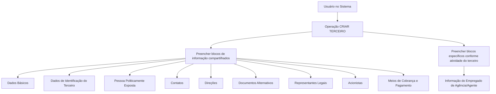

# Operação CRIAR — Informação do Empregado de Agência/Agente

## 1. Metadados do Documento
- **Arquivo de Origem:** Não identificado
- **Tipo de Documento:** Procedimento
- **Domínio / Sistema:** MAPFRE — Sistema Zeus
- **Público-Alvo:** Operação, Negócio e usuários responsáveis por cadastro de terceiros
- **Data/Versão Identificada:** Não identificada

---

## 2. Resumo Executivo & Contexto de Negócio

O documento descreve a operação **CRIAR** para registrar no sistema as informações de empregados de agências ou agentes que mantêm relação comercial com a entidade MAPFRE para intermediação de apólices.

O registro do empregado de agência/agente depende da criação de um terceiro e do preenchimento de blocos de informação compartilhados. A obrigatoriedade e a habilitação dos campos podem variar conforme o código de atividade do terceiro, o tipo de terceiro — pessoa física ou pessoa jurídica — e personalizações implementadas na aplicação.

O documento também informa que a ordem de captura dos dados nos diferentes blocos de informação pode variar segundo o critério adotado pelo usuário no sistema. Não são apresentados detalhes sobre telas, campos específicos, métodos de integração, contratos JSON ou regras de persistência.

---

## 3. Arquitetura, Componentes & Tecnologias Envolvidas

Os componentes e conceitos explicitamente citados são:

- **Sistema Zeus:** ambiente de documentação e operação mencionado no conteúdo extraído.
- **MAPFRE:** entidade que mantém relação comercial com agências ou agentes para intermediação de apólices.
- **Operação CRIAR TERCEIRO:** processo-base associado à criação das informações do empregado.
- **Informação do Empregado de Agência/Agente:** bloco específico de informação a ser criado.
- **Blocos de Informação Compartilhados:** estruturas de dados associadas ao processo de criação de terceiro.
- **Blocos de Informação Específicos:** estruturas dependentes da atividade do terceiro.



> **Nota de Análise:** O documento não descreve tecnologias de implementação, interfaces, URLs operacionais, serviços, métodos HTTP, contratos de dados ou mecanismos de integração.

---

## 4. Regras de Negócio, Especificações Funcionais & Processos

1. A operação permite registrar no sistema a informação dos empregados de agências ou agentes.
2. As agências ou agentes abrangidos possuem relação comercial com a MAPFRE para intermediação de apólices.
3. A criação da informação do empregado está associada ao processo **CRIAR TERCEIRO**.
4. A obrigatoriedade e/ou habilitação dos campos de cada bloco ou estrutura de informação compartilhada pode variar conforme o **código de atividade do terceiro**.
5. A obrigatoriedade e/ou habilitação dos campos pode variar quando o tipo de terceiro for:
   - Pessoa física.
   - Pessoa jurídica.
6. Personalizações implementadas podem afetar o comportamento da aplicação quanto à obrigatoriedade de registro dos dados do terceiro.
7. A ordem de captura dos dados nos diferentes blocos de informação pode variar conforme o critério seguido pelo usuário no sistema.
8. A criação inclui blocos de informação compartilhados do processo CRIAR TERCEIRO e um bloco específico para a informação do empregado de agência/agente.

---

## 5. Tabelas de Parâmetros, Ambientes e Estruturas de Dados

| Item / Parâmetro | Descrição / Função | Tipo / Valores / Formato | Ambiente / Observações |
| :--- | :--- | :--- | :--- |
| Operação | Registra informações de empregados de agências ou agentes. | CRIAR | Associada ao processo CRIAR TERCEIRO. |
| Entidade | Mantém relação comercial para intermediação de apólices. | MAPFRE | Citada como entidade vinculada às agências ou agentes. |
| Código de atividade do terceiro | Pode influenciar obrigatoriedade e habilitação de campos. | Não detalhado | Aplicável aos blocos ou estruturas de informação compartilhada. |
| Tipo de terceiro | Pode influenciar obrigatoriedade e habilitação de campos. | Pessoa física ou pessoa jurídica | Não há critérios específicos por tipo no documento. |
| Personalizações | Podem afetar o comportamento da aplicação. | Não detalhado | Podem alterar a obrigatoriedade do registro dos dados do terceiro. |
| Ordem de captura | Define a sequência de preenchimento dos blocos de informação. | Variável | Pode variar segundo o critério do usuário no sistema. |
| Dados Básicos | Bloco de informação compartilhado. | Não detalhado | Parte de CRIAR TERCEIRO. |
| Dados de Identificação do Terceiro | Bloco de informação compartilhado. | Não detalhado | Parte de CRIAR TERCEIRO. |
| Pessoa Politicamente Exposta | Bloco de informação compartilhado. | Não detalhado | Parte de CRIAR TERCEIRO. |
| Contatos | Bloco de informação compartilhado. | Não detalhado | Parte de CRIAR TERCEIRO. |
| Direções | Bloco de informação compartilhado. | Não detalhado | Parte de CRIAR TERCEIRO. |
| Documentos Alternativos | Bloco de informação compartilhado. | Não detalhado | Parte de CRIAR TERCEIRO. |
| Representantes Legais | Bloco de informação compartilhado. | Não detalhado | Parte de CRIAR TERCEIRO. |
| Acionistas | Bloco de informação compartilhado. | Não detalhado | Parte de CRIAR TERCEIRO. |
| Meios de Cobrança e Pagamento | Bloco de informação compartilhado. | Não detalhado | Parte de CRIAR TERCEIRO. |
| Informação do Empregado de Agência/Agente | Bloco específico relativo à atividade do terceiro. | Não detalhado | Associado ao registro do empregado de agência ou agente. |

---

## 6. Bateria de Perguntas & Respostas para RAG (FAQ Sintético)

### P1: Qual é o objetivo da operação CRIAR para empregado de agência ou agente?
**R:** A operação CRIAR permite registrar no sistema as informações dos empregados das agências ou dos agentes que possuem relação comercial com a entidade MAPFRE para intermediação de apólices.

### P2: A criação da informação do empregado ocorre de forma independente?
**R:** Não. O documento associa a criação da informação do empregado de agência/agente ao processo CRIAR TERCEIRO, que inclui blocos de informação compartilhados e blocos específicos conforme a atividade do terceiro.

### P3: Quais fatores podem alterar a obrigatoriedade ou habilitação dos campos?
**R:** A obrigatoriedade e/ou habilitação dos campos pode variar conforme o código de atividade do terceiro, o tipo de terceiro — pessoa física ou pessoa jurídica — e personalizações implementadas na aplicação.

### P4: Quais tipos de terceiro são mencionados no documento?
**R:** O documento menciona terceiros classificados como pessoa física ou pessoa jurídica. A classificação pode influenciar a obrigatoriedade e a habilitação dos campos de informação.

### P5: As personalizações podem influenciar o cadastro do terceiro?
**R:** Sim. As personalizações que possam ter sido implementadas podem afetar o comportamento da aplicação em relação à obrigatoriedade de registrar os dados do terceiro.

### P6: A ordem de preenchimento dos blocos é fixa?
**R:** Não. O documento afirma que a ordem de captura dos dados nos diferentes blocos de informação pode variar de acordo com o critério seguido pelo usuário no sistema.

### P7: Quais blocos compartilhados são apresentados no processo CRIAR TERCEIRO?
**R:** O documento lista Dados Básicos, Dados de Identificação do Terceiro, Pessoa Politicamente Exposta, Contatos, Direções, Documentos Alternativos, Representantes Legais, Acionistas e Meios de Cobrança e Pagamento.

### P8: Qual é o bloco específico relacionado ao cadastro tratado no documento?
**R:** O bloco específico apresentado é **Informação do Empregado de Agência/Agente**, classificado como informação específica de acordo com a atividade do terceiro.

### P9: O documento especifica quais campos existem dentro de cada bloco?
**R:** Não. O documento somente lista os blocos de informação e informa que obrigatoriedade, habilitação e ordem de captura podem variar. Não há detalhamento dos campos individuais.

### P10: O documento define APIs, métodos HTTP ou contratos JSON para a operação?
**R:** Não. O conteúdo extraído não informa métodos HTTP, URLs de serviço, contratos JSON, esquemas de dados ou detalhes de integração técnica.

---

## 7. Glossário de Termos, Siglas & Conceitos-Chave

- **CRIAR:** Operação utilizada para registrar informações no sistema.
- **CRIAR TERCEIRO:** Processo relacionado à criação de informações de um terceiro e aos seus blocos de informação compartilhados.
- **MAPFRE:** Entidade mencionada como possuidora de relação comercial com agências ou agentes para intermediação de apólices.
- **Terceiro:** Entidade cujo código de atividade, tipo e dados podem afetar o comportamento de obrigatoriedade e habilitação dos campos.
- **Pessoa Física:** Tipo de terceiro mencionado no documento.
- **Pessoa Jurídica:** Tipo de terceiro mencionado no documento.
- **Pessoa Politicamente Exposta:** Bloco de informação compartilhado listado no processo CRIAR TERCEIRO.
- **Informação do Empregado de Agência/Agente:** Bloco específico de informação associado à atividade do terceiro.
- **Zeus:** Sistema ou contexto de documentação citado no conteúdo extraído.

---

## 8. Notas Críticas, Riscos & Limitações

- O documento não identifica o arquivo de origem, data, versão ou responsável pela documentação.
- Não há detalhamento dos campos internos de nenhum bloco de informação.
- Não são definidos critérios específicos que relacionem códigos de atividade a campos obrigatórios ou habilitados.
- Não são apresentadas regras distintas para pessoa física e pessoa jurídica.
- O documento declara que personalizações podem alterar o comportamento da aplicação, mas não identifica quais personalizações existem ou seus impactos.
- A ordem de captura dos dados pode variar por critério do usuário, sem que o documento apresente restrições, dependências ou validações de sequência.
- Não há especificação de interfaces, integrações, métodos HTTP, contratos JSON, tratamento de erros ou regras de persistência.

---

## 9. Conteúdo Bruto Estruturado (Referência Fiel)

```text
--- [PÁGINA 1 DE 2] ---

OPERACIÓN CREAR Empleado de Agente
¿En que consiste?
Esta operación permite registrar en el Sistema la Información de los Empleados de las Agencias o
de los Agentes, con los que la entidad MAPFRE tiene una relación comercial para la intermediación
de sus pólizas.
Premisas
La obligatoriedad y/o la habilitación de los campos en el registro de los datos de cada uno de
los bloques o estructuras de información compartidas puede variar de acuerdo con el código de
actividad del Tercero:
La obligatoriedad y/o la habilitación de los campos en el registro de los datos de cada uno de
los bloques o estructuras de información pueden variar si el tipo de Tercero es una Persona
Física o una Persona Jurídica:
Las personalizaciones que se hubieran podido implementar a su vez pueden afectar el
comportamiento de la aplicación en relación con la obligatoriedad en el registro de los Datos del
Tercero.
Ejemplo:
Ejemplo:
 / 
 RS
Inicio Soluciones APIs Documentación Zeus
ES


--- [PÁGINA 2 DE 2] ---

Por último, el orden de captura de los datos en los distintos bloques de Información puede
variar de acuerdo con el criterio seguido por el Usuario en el Sistema.
Proceso
CREAR
TERCERO
Crear Información
del Empleado de Agente
Bloques de Información Compartidos (CREAR TERCERO)
 Datos Básicos ( )
 Datos Identificación del Tercero ( )
 Persona Políticamente Expuesta ( )
 Contactos ( )
 Direcciones ( )
 Documentos Alternativos ( )
 Representantes Legales ( )
 Accionistas ( )
 Medios de Cobro y Pago ( )
Bloques de Información Específicos de acuerdo con la
Actividad del Tercero.
 Información del Empleado de Agencia/Agente ( )
```
