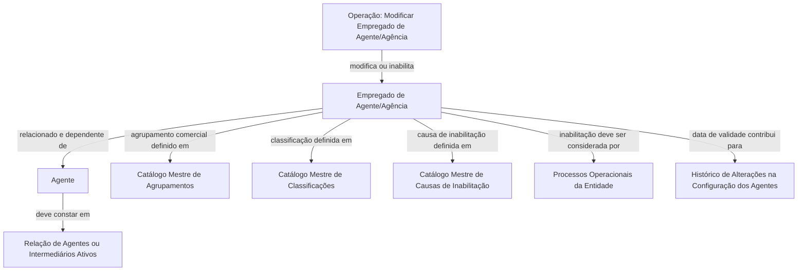

# Operação de Modificação e Inabilitação de Empregado de Agente/Agência

## 1. Metadados do Documento
- **Arquivo de Origem:** Não identificado — conteúdo bruto fornecido na solicitação
- **Tipo de Documento:** Especificação Funcional
- **Domínio / Sistema:** Cadastro de Empregado de Agente/Agência em entidade seguradora
- **Público-Alvo:** Negócio, Analistas Funcionais, Desenvolvedores e Operação
- **Data/Versão Identificada:** Não identificada

---

## 2. Resumo Executivo & Contexto de Negócio

O documento descreve a operação **“Modificar Información específica del Empleado de Agente”**, destinada a complementar e alterar dados previamente registrados para um Empregado de Agente/Agência. A operação também permite inabilitar o empregado no sistema.

As ações habilitadas explicitamente são **MODIFICAR** e **INHABILITAR**. O conteúdo aborda atributos de cadastro associados ao empregado, incluindo vínculo com agente, agrupamento comercial, classificação, número de colegiação, causa de inabilitação, participação e data de validade.

O cadastro do Empregado de Agente/Agência depende da relação de agentes ou intermediários ativos no sistema. Alguns atributos são preenchidos com base em catálogos mestres configurados no sistema, especificamente os catálogos de agrupamentos comerciais, classificações e causas de inabilitação.

A inabilitação deve ser considerada pelos processos operacionais da entidade. A data de validade é apresentada como mecanismo para registrar quando o agente está plenamente operacional e manter histórico de alterações na configuração dos agentes.

---

## 3. Arquitetura, Componentes & Tecnologias Envolvidas

Os componentes conceituais identificados no conteúdo são:

- **Sistema:** Mantém relações de agentes ou intermediários ativos, catálogos mestres e dados de empregados de agentes/agências.
- **Empregado de Agente/Agência:** Entidade cujos dados podem ser complementados, modificados ou inabilitados.
- **Agente:** Entidade à qual o empregado está relacionado e da qual depende.
- **Intermediário:** Entidade considerada na relação de agentes ou intermediários ativos do sistema.
- **Catálogo mestre de agrupamentos:** Fonte de valores para o agrupamento comercial do empregado.
- **Catálogo mestre de classificações:** Fonte de valores para a classificação do empregado.
- **Catálogo mestre de causas de inabilitação:** Fonte de valores para a causa de inabilitação.
- **Processos operacionais da entidade:** Processos que devem considerar o estado de inabilitação do empregado.
- **Histórico de alterações:** Histórico associado à configuração de agentes, suportado pelo uso da data de validade.



**Nota de Análise:** O conteúdo não informa tecnologias, APIs, métodos HTTP, contratos JSON, banco de dados, URLs, ambientes, servidores ou mecanismos técnicos de integração.

---

## 4. Regras de Negócio, Especificações Funcionais & Processos

### 4.1 Objetivo da operação

A operação permite:

1. Complementar dados já registrados para um Empregado de Agente/Agência.
2. Modificar dados já registrados para um Empregado de Agente/Agência.
3. Inabilitar um Empregado de Agente/Agência.

### 4.2 Ações habilitadas

- **MODIFICAR:** Permite complementar ou alterar informações previamente registradas para o Empregado de Agente/Agência.
- **INHABILITAR:** Permite marcar o Empregado de Agente/Agência como inabilitado no sistema.

### 4.3 Sequência de captura dos atributos

O documento determina que os atributos do bloco de informação devem ser tratados na sequência de leitura:

1. Da esquerda para a direita.
2. De cima para baixo.

Quando não houver indicação expressa em contrário, os campos devem ser utilizados tanto para **Pessoas Físicas** quanto para **Pessoas Jurídicas**.

### 4.4 Regras sobre vínculo com agente

- O atributo **Agente** contém o código do agente com o qual o Empregado de Agente/Agência está relacionado.
- O Empregado de Agente/Agência depende do agente associado.
- A relação deve considerar agentes ou intermediários que estejam ativos no sistema.

### 4.5 Regras sobre agrupamento e classificação

- O **Agrupamento Comercial do Empregado** deve corresponder a um valor definido no catálogo mestre de agrupamentos existente no sistema.
- A **Classificação do Empregado** deve corresponder a um valor existente no catálogo mestre de classificações configurado no sistema.

### 4.6 Regras sobre número de colegiação

- O **Número de Colegiación** contém a chave ou código da cédula profissional.
- A cédula profissional está associada à habilitação do empregado para exercer sua profissão em razão de pertencer a colégio profissional ou associação oficial semelhante.

### 4.7 Regras sobre inabilitação

- A propriedade **Inhabilitación** indica que o Empregado de Agente/Agência está inabilitado no sistema.
- Quando o empregado estiver inabilitado, essa circunstância deve ser contemplada ou considerada nos processos operacionais da entidade.
- Se o empregado estiver inabilitado, o campo **Causa de Inhabilitación** deve conter o código de uma causa de inabilitação definida no catálogo mestre do sistema.

### 4.8 Regras sobre participação e vigência

- O **Porcentaje de Participación** representa o percentual de participação do empregado sobre o total do agente.
- A **Fecha de Validez** informa a data a partir da qual o agente está plenamente operacional no sistema.
- O uso correto da data de validade permite à entidade seguradora manter um histórico das alterações realizadas na configuração dos agentes.

---

## 5. Tabelas de Parâmetros, Ambientes e Estruturas de Dados

| Item / Parâmetro | Descrição / Função | Tipo / Valores / Formato | Ambiente / Observações |
| :--- | :--- | :--- | :--- |
| Operação | Complementa e modifica dados previamente registrados do Empregado de Agente/Agência; também permite inabilitá-lo. | Ações: `MODIFICAR` e `INHABILITAR` | Sistema não identificado |
| Dados Persona | Bloco de dados aplicável a Pessoa Física ou Pessoa Jurídica, salvo indicação expressa em contrário. | Pessoa Física / Pessoa Jurídica | A sequência de captura é da esquerda para a direita e de cima para baixo. |
| Agente | Contém o código do agente ao qual o empregado está relacionado e do qual depende. | Código do agente | Deve considerar a relação de agentes ou intermediários ativos no sistema. |
| Agrupamento Comercial do Empregado | Indica a agrupação comercial à qual pertence o Empregado de Agente/Agência. | Valor de catálogo mestre | O valor deve existir no catálogo mestre de agrupamentos do sistema. |
| Classificação do Empregado | Indica a classificação do Empregado de Agente/Agência. | Valor de catálogo mestre | O valor deve existir no catálogo mestre de classificações configurado no sistema. |
| Número de Colegiación | Contém a chave ou código da cédula profissional que habilita o empregado ao exercício da profissão. | Chave/código | Relacionado à pertença a colégio profissional ou associação oficial semelhante. |
| Inhabilitación | Indica que o Empregado de Agente/Agência está inabilitado no sistema. | Propriedade de inabilitação | A inabilitação deve ser considerada pelos processos operacionais da entidade. |
| Causa de Inhabilitación | Contém o código da causa de inabilitação do empregado. | Código de catálogo mestre | Aplicável quando o empregado estiver inabilitado. |
| Porcentaje de Participación | Representa o percentual de participação do empregado sobre o total do agente. | Percentual | O formato numérico não foi detalhado. |
| Fecha de Validez | Indica a data a partir da qual o agente está plenamente operacional no sistema. | Data | Permite manter histórico de alterações na configuração dos agentes. |

**Nota de Análise:** O documento não apresenta URLs, ambientes técnicos, servidores, diretórios de log, tipos de dados formais, obrigatoriedade de campos, formatos de datas ou limites de valores.

---

## 6. Bateria de Perguntas & Respostas para RAG (FAQ Sintético)

### P1: Qual é o objetivo da operação de modificação do Empregado de Agente/Agência?
**R:** A operação permite complementar e modificar dados previamente registrados para um Empregado de Agente/Agência. A mesma operação também permite inabilitar esse empregado no sistema.

### P2: Quais ações estão habilitadas para o Empregado de Agente/Agência?
**R:** O documento lista duas ações habilitadas: `MODIFICAR` e `INHABILITAR`. A ação MODIFICAR trata da alteração ou complementação de dados existentes, enquanto INHABILITAR marca o empregado como inabilitado no sistema.

### P3: Como deve ser seguida a ordem de captura dos atributos no bloco de dados?
**R:** Os atributos devem ser capturados da esquerda para a direita e de cima para baixo. Quando não houver indicação expressa em contrário, os campos são aplicáveis tanto a Pessoas Físicas quanto a Pessoas Jurídicas.

### P4: O que representa o campo Agente no cadastro do empregado?
**R:** O campo Agente contém o código do agente ao qual o Empregado de Agente/Agência está relacionado e do qual depende. A relação considera os agentes ou intermediários que estejam ativos no sistema.

### P5: De onde vem o valor do Agrupamento Comercial do Empregado?
**R:** O Agrupamento Comercial do Empregado deve ser selecionado conforme a relação de valores definida no catálogo mestre de agrupamentos existente no sistema.

### P6: Como é definida a Classificação do Empregado?
**R:** A Classificação do Empregado corresponde a um dos valores existentes no catálogo mestre de classificações configurado no sistema.

### P7: O que é o Número de Colegiación?
**R:** O Número de Colegiación é a chave ou código da cédula profissional que habilita o Empregado de Agente/Agência a exercer sua profissão devido à sua pertença a um colégio profissional ou associação oficial semelhante.

### P8: Qual é o efeito da propriedade Inhabilitación?
**R:** A propriedade Inhabilitación informa ao sistema que o Empregado de Agente/Agência está inabilitado. Essa condição deve ser contemplada ou considerada nos processos operacionais da entidade.

### P9: Quando a Causa de Inhabilitación deve ser preenchida?
**R:** A Causa de Inhabilitación é aplicável quando o empregado estiver inabilitado. O campo deve conter o código de uma das causas de inabilitação definidas no catálogo mestre do sistema.

### P10: O que representa o Porcentaje de Participación?
**R:** O Porcentaje de Participación representa o percentual de participação do empregado sobre o total do agente.

### P11: Para que serve a Fecha de Validez?
**R:** A Fecha de Validez indica a data a partir da qual o agente está plenamente operacional no sistema. O emprego correto dessa data permite manter, na entidade seguradora, um histórico das mudanças efetuadas na configuração dos agentes.

### P12: O documento especifica APIs, métodos HTTP ou contratos de integração?
**R:** Não. O conteúdo fornecido não detalha APIs, métodos HTTP, contratos JSON, URLs, tecnologias, ambientes técnicos ou mecanismos de integração.

---

## 7. Glossário de Termos, Siglas & Conceitos-Chave

- **Agente:** Entidade cujo código é associado ao Empregado de Agente/Agência e da qual esse empregado depende.
- **Agrupamento Comercial:** Agrupação comercial à qual pertence o empregado, conforme catálogo mestre existente no sistema.
- **Causa de Inhabilitación:** Código de uma causa de inabilitação definida no catálogo mestre do sistema.
- **Catálogo Mestre:** Relação de valores definida ou configurada no sistema para agrupamentos, classificações ou causas de inabilitação.
- **Cédula Profissional:** Chave ou código associado à habilitação profissional do empregado.
- **Classificação do Empregado:** Classificação definida conforme valores existentes no catálogo mestre de classificações.
- **Empleado de Agente/Agencia:** Empregado relacionado a um agente ou agência, sujeito a complementação, modificação ou inabilitação no sistema.
- **Fecha de Validez:** Data a partir da qual o agente está plenamente operacional no sistema.
- **Inhabilitación:** Propriedade que informa que o Empregado de Agente/Agência está inabilitado no sistema.
- **Intermediário:** Entidade considerada, juntamente com o agente, na relação de agentes ou intermediários ativos no sistema.
- **Número de Colegiación:** Chave ou código da cédula profissional do empregado.
- **Porcentaje de Participación:** Percentual de participação do empregado sobre o total do agente.

---

## 8. Notas Críticas, Riscos & Limitações

- O documento não identifica nome do sistema, versão, data, autor ou responsável pela especificação.
- O conteúdo não define obrigatoriedade, validação, formato, tamanho ou domínio técnico dos campos.
- O documento não informa como o sistema valida se um agente ou intermediário está ativo.
- A propriedade de inabilitação deve ser considerada em processos operacionais, mas esses processos não são enumerados.
- Não foram detalhados os efeitos funcionais da modificação ou inabilitação sobre integrações, permissões, cálculos, apólices ou demais processos corporativos.
- O documento cita catálogos mestres, mas não apresenta seus valores, estruturas, responsáveis ou regras de manutenção.
- O campo **Fecha de Validez** menciona que o histórico é mantido para alterações na configuração dos agentes; o conteúdo não detalha como esse histórico é armazenado ou consultado.
- Não há detalhamento de APIs, contratos, persistência, mecanismos de auditoria, autenticação, ambientes ou logs.

---

## 9. Conteúdo Bruto Estruturado (Referência Fiel)

```text
--- [PÁGINA 1 DE 2] ---

MODIFICAR Información específica del
Empleado de Agente
Objetivo
Esta Operación permite Complementar y Modificar los datos que se encontraran registrados
previamente en el Empleado de Agente/Agencia además de poder Inhabilitarlo.
Acciones habilitadas
 MODIFICAR ( )
 INHABILITAR ( )
Datos Persona Persona Física/Jurídica
De Izquierda a Derecha y de Arriba hacia Abajo, los siguientes atributos marcan la secuencia de
captura en este Bloque de Información.
(Si no se especifica o indica expresamente, los campos se emplearán tanto en Personas Físicas
como en Personas Jurídicas).
Agente (  )
 / 
 RS
Inicio Soluciones APIs Documentación Zeus
ES


--- [PÁGINA 2 DE 2] ---

Este atributo contiene el código del Agente con el que está relacionado y del que depende el
Empleado de acuerdo con la relación de Agentes o Intermediarios que se encuentren activos en el
Sistema
Agrupamiento Comercial del Empleado (  )
Este Campo incluye la Agrupación Comercial al que pertenece el Empleado del Agente/Agencia, de
acuerdo con la relación de valores definidos en el catálogo maestro de agrupaciones existente en el
Sistema.
Clasificación del Empleado (  )
Este dato contiene la clasificación del Empleado del Agente/Agencia de acuerdo con la relación de
valores existentes en el catálogo maestro de clasificaciones configurado en el Sistema.
Número de Colegiación ( )
Este campo contiene la clave/código de la cédula profesional por la que el Empleado del
Agente/Agencia, por su pertenencia a un colegio profesional o asociación semejante de carácter
oficial, está habilitado para ejercer en el desempeño de su Profesión.
Inhabilitación ( )
Esta propiedad le indica al Sistema que el Empleado del Agente/Agencia está inhabilitado en el
Sistema y por ello esta circunstancia debería estar contemplada o considerada en los procesos
operativos de la entidad.
Causa de Inhabilitación (   )
En el supuesto que el Empleado estuviera inhabilitado, este dato contendrá el código de una de las
causas de inhabilitación definidas en el catálogo maestro del Sistema.
Porcentaje de Participación ( )
Este campo contiene el porcentaje de participación del empleado sobre el total del Agente.
Fecha de Validez ( )
Esta propiedad le indica al Sistema la fecha a partir de la cual el Agente está plenamente operativo
en el sistema por lo que su empleo y correcta utilización permite tener en la entidad Aseguradora un
histórico de los cambios efectuados en la configuración de los Agentes.
```
