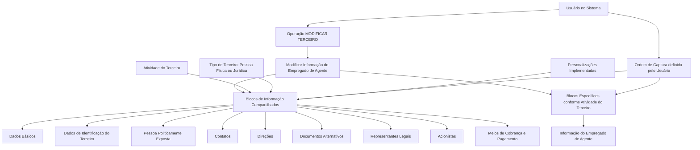

# Operação MODIFICAR Empregado de Agente — Informações Compartilhadas e Específicas de Terceiros

## 1. Metadados do Documento
- **Arquivo de Origem:** `Não identificado no conteúdo fornecido`
- **Tipo de Documento:** `Procedimento`
- **Domínio / Sistema:** `Zeus — Operação MODIFICAR TERCEIRO`
- **Público-Alvo:** `Usuários do sistema, analistas funcionais e equipes de operação`
- **Data/Versão Identificada:** `Não identificada`

---

## 2. Resumo Executivo & Contexto de Negócio

O documento descreve a operação **MODIFICAR Empregado de Agente**, destinada ao complemento, à modificação e/ou à inabilitação das informações de empregados vinculados a Agências ou Agentes. A operação pode incidir sobre qualquer bloco ou estrutura de dados que contenha e agrupe essas informações conforme sua natureza.

A operação está inserida no contexto de **MODIFICAR TERCEIRO**, utilizando blocos de informações compartilhadas e um bloco específico denominado **Informação do Empregado de Agente**. Os blocos compartilhados abrangem informações cadastrais, identificação, contatos, endereços, documentos alternativos, representantes legais, acionistas e meios de cobrança e pagamento.

A obrigatoriedade e a habilitação dos campos não são fixas para todos os registros. O comportamento pode variar de acordo com o código de atividade do Terceiro, com o tipo de Terceiro — Pessoa Física ou Pessoa Jurídica — e com personalizações implementadas na aplicação.

O documento também indica que a sequência de captura dos dados nos diferentes blocos de informação pode variar conforme o critério adotado pelo usuário no sistema. Não são apresentados detalhes sobre métodos HTTP, contratos JSON, persistência de dados, regras de validação por campo ou permissões de acesso.

---

## 3. Arquitetura, Componentes & Tecnologias Envolvidas

Os componentes e estruturas explicitamente citados são:

- **Sistema Zeus**
- **Operação MODIFICAR TERCEIRO**
- **Operação MODIFICAR Empregado de Agente**
- **Terceiro**
- **Agências**
- **Agentes**
- **Blocos de Informação Compartilhados**
- **Blocos de Informação Específicos de acordo com a Atividade do Terceiro**
- **Informação do Empregado de Agente**



> **Nota de Análise:** O conteúdo não identifica tecnologias de implementação, integrações, serviços, APIs, bancos de dados, ambientes, servidores ou mecanismos de autenticação.

---

## 4. Regras de Negócio, Especificações Funcionais & Processos

### 4.1 Finalidade da operação

A operação **MODIFICAR Empregado de Agente** consiste no:

1. Complemento de informações de empregados de Agências ou Agentes.
2. Modificação de informações de empregados de Agências ou Agentes.
3. Inabilitação de informações de empregados de Agências ou Agentes.

A atuação pode ocorrer em qualquer bloco ou estrutura de dados que contenha e agrupe informações de empregados conforme a natureza dessas informações.

### 4.2 Variabilidade de obrigatoriedade e habilitação dos campos

A obrigatoriedade e/ou habilitação dos campos para registro dos dados em cada bloco ou estrutura de informação compartilhada podem variar conforme os seguintes fatores:

1. **Código de atividade do Terceiro:** a atividade associada ao Terceiro pode alterar quais campos são obrigatórios ou habilitados.
2. **Tipo de Terceiro:** a condição de Pessoa Física ou Pessoa Jurídica pode alterar quais campos são obrigatórios ou habilitados.
3. **Personalizações implementadas:** personalizações existentes podem afetar o comportamento da aplicação quanto à obrigatoriedade de registrar Dados do Terceiro.

### 4.3 Ordem de captura das informações

A ordem de captura dos dados nos diferentes blocos de informação pode variar de acordo com o critério seguido pelo usuário no sistema. O documento não estabelece uma sequência obrigatória, fluxo de aprovação ou dependência explícita entre os blocos.

### 4.4 Processo funcional identificado

1. O usuário acessa a operação **MODIFICAR TERCEIRO**.
2. O usuário seleciona ou executa a ação de modificar a informação do Empregado de Agente.
3. O usuário registra, complementa, modifica ou inabilita dados nos blocos de informação aplicáveis.
4. Os blocos compartilhados utilizados podem variar conforme atividade, tipo de Terceiro e personalizações.
5. O usuário utiliza o bloco específico **Informação do Empregado de Agente**, de acordo com a atividade do Terceiro.
6. A ordem de preenchimento dos blocos pode ser definida conforme o critério do usuário.

---

## 5. Tabelas de Parâmetros, Ambientes e Estruturas de Dados

| Item / Parâmetro | Descrição / Função | Tipo / Valores / Formato | Ambiente / Observações |
| :--- | :--- | :--- | :--- |
| Operação MODIFICAR Empregado de Agente | Permite complementar, modificar e/ou inabilitar informações de empregados de Agências ou Agentes. | Operação funcional | Inserida no contexto de MODIFICAR TERCEIRO. |
| Terceiro | Entidade cujos dados e blocos de informação são tratados pela operação. | Pessoa Física ou Pessoa Jurídica | O tipo de Terceiro pode alterar obrigatoriedade e habilitação de campos. |
| Código de atividade do Terceiro | Critério que pode alterar a obrigatoriedade e/ou habilitação dos campos. | Código de atividade | O documento não informa códigos, valores permitidos ou regras específicas por atividade. |
| Personalizações implementadas | Implementações que podem afetar o comportamento da aplicação quanto à obrigatoriedade de dados do Terceiro. | Personalização da aplicação | Não são detalhadas configurações, responsáveis ou efeitos específicos. |
| Ordem de captura | Sequência de registro de dados nos blocos de informação. | Definida pelo critério do usuário | O documento não fixa uma ordem obrigatória. |
| Dados Básicos | Bloco de informação compartilhado. | Bloco de dados | Não há detalhamento dos campos internos. |
| Dados de Identificação do Terceiro | Bloco de informação compartilhado. | Bloco de dados | Não há detalhamento dos campos internos. |
| Pessoa Politicamente Exposta | Bloco de informação compartilhado. | Bloco de dados | O documento não especifica critérios ou classificações. |
| Contatos | Bloco de informação compartilhado. | Bloco de dados | Não há detalhamento dos campos internos. |
| Direções | Bloco de informação compartilhado. | Bloco de dados | Não há detalhamento dos campos internos. |
| Documentos Alternativos | Bloco de informação compartilhado. | Bloco de dados | Não há detalhamento dos documentos aceitos. |
| Representantes Legais | Bloco de informação compartilhado. | Bloco de dados | Não há detalhamento de requisitos ou vínculos. |
| Acionistas | Bloco de informação compartilhado. | Bloco de dados | Não há detalhamento de participação societária ou validações. |
| Meios de Cobrança e Pagamento | Bloco de informação compartilhado. | Bloco de dados | Não há detalhamento de modalidades ou dados financeiros. |
| Informação do Empregado de Agente | Bloco de informação específico conforme a atividade do Terceiro. | Bloco específico | É o bloco explicitamente associado à operação descrita. |
| Sistema Zeus | Sistema mencionado na navegação do conteúdo. | Sistema corporativo | O documento não fornece detalhes técnicos sobre Zeus. |

---

## 6. Bateria de Perguntas & Respostas para RAG (FAQ Sintético)

### P1: Em que consiste a operação MODIFICAR Empregado de Agente?
**R:** A operação MODIFICAR Empregado de Agente consiste no complemento, na modificação e/ou na inabilitação das informações dos empregados de Agências ou de Agentes. Essas ações podem ser realizadas em qualquer bloco ou estrutura de dados que contenha e agrupe as informações conforme sua natureza.

### P2: Qual operação principal contém a modificação da informação do Empregado de Agente?
**R:** A modificação da informação do Empregado de Agente é apresentada como parte da operação **MODIFICAR TERCEIRO**. O processo inclui blocos de informação compartilhados e o bloco específico **Informação do Empregado de Agente**.

### P3: Quais fatores podem alterar a obrigatoriedade dos campos do Terceiro?
**R:** A obrigatoriedade e/ou habilitação dos campos pode variar conforme o código de atividade do Terceiro, o tipo de Terceiro — Pessoa Física ou Pessoa Jurídica — e as personalizações que tenham sido implementadas na aplicação.

### P4: O tipo de Terceiro influencia o preenchimento das informações?
**R:** Sim. O documento informa que a obrigatoriedade e/ou habilitação dos campos nos blocos ou estruturas de informação pode variar quando o Terceiro for uma Pessoa Física ou uma Pessoa Jurídica.

### P5: As personalizações da aplicação podem modificar o comportamento do cadastro?
**R:** Sim. As personalizações implementadas podem afetar o comportamento da aplicação em relação à obrigatoriedade do registro dos Dados do Terceiro. O documento não detalha quais personalizações existem nem quais campos cada uma afeta.

### P6: Existe uma ordem obrigatória para captura dos dados nos blocos de informação?
**R:** Não. O documento indica que a ordem de captura dos dados nos diferentes blocos de informação pode variar conforme o critério seguido pelo usuário no sistema.

### P7: Quais são os blocos de informação compartilhados disponíveis em MODIFICAR TERCEIRO?
**R:** Os blocos de informação compartilhados listados são: Dados Básicos, Dados de Identificação do Terceiro, Pessoa Politicamente Exposta, Contatos, Direções, Documentos Alternativos, Representantes Legais, Acionistas e Meios de Cobrança e Pagamento.

### P8: Qual bloco específico deve ser considerado para dados de empregados de Agente?
**R:** O documento identifica o bloco **Informação do Empregado de Agente** como bloco de informação específico de acordo com a atividade do Terceiro.

### P9: O documento informa os campos internos do bloco Informação do Empregado de Agente?
**R:** Não. O documento apenas lista o bloco **Informação do Empregado de Agente** como uma estrutura específica conforme a atividade do Terceiro, sem detalhar campos, formatos, validações ou obrigatoriedades internas.

### P10: O documento descreve APIs, métodos HTTP ou contratos JSON para MODIFICAR Empregado de Agente?
**R:** Não. O conteúdo fornecido descreve a operação funcional e os blocos de informação envolvidos, mas não detalha APIs, métodos HTTP, contratos JSON, endpoints, tecnologias ou integrações técnicas.

---

## 7. Glossário de Termos, Siglas & Conceitos-Chave

- **Agente:** Entidade cujos empregados podem ter informações complementadas, modificadas ou inabilitadas pela operação descrita.
- **Agência:** Entidade cujos empregados podem ter informações complementadas, modificadas ou inabilitadas pela operação descrita.
- **Blocos de Informação Compartilhados:** Estruturas de informação utilizadas no contexto de MODIFICAR TERCEIRO e listadas como Dados Básicos, Identificação, Contatos, Direções e outros.
- **Blocos de Informação Específicos:** Estruturas de informação aplicáveis de acordo com a atividade do Terceiro.
- **Dados do Terceiro:** Informações registradas para a entidade classificada como Terceiro.
- **MODIFICAR TERCEIRO:** Operação que agrupa os blocos de informação compartilhados e específicos utilizados no processo.
- **Pessoa Física:** Tipo de Terceiro que pode influenciar a obrigatoriedade e/ou habilitação dos campos.
- **Pessoa Jurídica:** Tipo de Terceiro que pode influenciar a obrigatoriedade e/ou habilitação dos campos.
- **Pessoa Politicamente Exposta:** Bloco de informação compartilhado listado no processo.
- **Terceiro:** Entidade cujos dados são tratados pela operação e cuja atividade e tipo podem afetar regras de obrigatoriedade ou habilitação.
- **Zeus:** Sistema mencionado no conteúdo original, sem detalhamento funcional ou técnico adicional.

---

## 8. Notas Críticas, Riscos & Limitações

- O conteúdo não identifica o arquivo de origem, versão, data, autor ou área responsável pelo procedimento.
- O documento não detalha campos internos, tipos de dados, formatos, valores permitidos ou critérios de validação para nenhum bloco de informação.
- O documento não apresenta regras específicas por código de atividade do Terceiro.
- O documento não informa quais campos variam entre Pessoa Física e Pessoa Jurídica.
- O documento menciona personalizações que podem alterar obrigatoriedades, mas não descreve quais personalizações existem, como são configuradas ou como são auditadas.
- A inexistência de uma ordem obrigatória de captura pode demandar conhecimento operacional adicional por parte dos usuários.
- O documento não especifica controles de acesso, perfis autorizados, trilha de auditoria, persistência, integrações, APIs, mensagens de erro ou critérios de sucesso da operação.
- **Nota de Análise:** O documento lista o bloco **Informação do Empregado de Agente**, porém não detalha seus campos, regras de negócio internas, contratos de integração ou comportamentos de interface.

---

## 9. Conteúdo Bruto Estruturado (Referência Fiel)

```text
--- [PÁGINA 1 DE 2] ---

OPERACIÓN MODIFICAR Empleado de Agente
¿En que consiste?
Esta operación consiste en el Complemento, Modificación y/o Inhabilitación de la información de
los Empleados de las Agencias o de los Agentes, en cualquiera de los bloques o estructuras de
datos que la contienen y agrupan de acuerdo con su naturaleza.
Premisas
La obligatoriedad y/o la habilitación de los campos en el registro de los datos de cada uno de
los bloques o estructuras de información compartidas puede variar de acuerdo con el código de
actividad del Tercero:
La obligatoriedad y/o la habilitación de los campos en el registro de los datos de cada uno de
los bloques o estructuras de información pueden variar si el tipo de Tercero es una Persona
Física o una Persona Jurídica:
Las personalizaciones que se hubieran podido implementar a su vez pueden afectar el
comportamiento de la aplicación en relación con la obligatoriedad en el registro de los Datos del
Tercero.
Ejemplo:
Ejemplo:
 /
 RS
Inicio Soluciones APIs Documentación Zeus
ES


--- [PÁGINA 2 DE 2] ---

Por último, el orden de captura de los datos en los distintos bloques de Información puede
variar de acuerdo con el criterio seguido por el Usuario en el Sistema.
Proceso
MODIFICAR
TERCERO
Modificar Información
del Empleado de Agente
Bloques de Información Compartidos (MODIFICAR TERCERO)
 Datos Básicos ( )
 Datos Identificación Tercero ( )
 Persona Políticamente Expuesta(   )
 Contactos (   )
 Direcciones (   )
 Documentos Alternativos (   )
 Representantes Legales (   )
 Accionistas (   )
 Medios de Cobro y Pago (   )
Bloques de Información Específicos de acuerdo con la
Actividad del Tercero.
 Información del Empleado de Agente (  )
```
