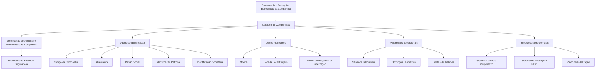

# Cadastro de Informações Específicas da Companhia — Catálogo Corporativo MAPFRE

## 1. Metadados do Documento
- **Arquivo de Origem:** Não informado
- **Tipo de Documento:** Procedimento / Manual Funcional
- **Domínio / Sistema:** Cadastro de Companhias MAPFRE
- **Público-Alvo:** Operação, Negócio, Analistas Funcionais e Administradores de Catálogo
- **Data/Versão Identificada:** Não identificada

---

## 2. Resumo Executivo & Contexto de Negócio

O documento descreve a criação de informações específicas de uma Companhia em uma estrutura de cadastro. O objetivo declarado é identificar, detalhar e classificar informações do âmbito operacional da Companhia, permitindo que processos da entidade seguradora considerem ou não essas circunstâncias quando necessário.

A ação explicitamente habilitada no procedimento é **CREAR**, ou seja, criar uma Companhia no catálogo correspondente. A captura dos atributos deve seguir uma sequência indicada como “da esquerda para a direita e de cima para baixo” no bloco de informações de dados da Companhia.

O cadastro concentra identificadores corporativos, legais, contábeis e patronais, além de parâmetros monetários e operacionais. Entre os elementos identificados estão código da Companhia, abreviatura, razão social, moeda, identificadores vinculados à legislação local e ao sistema contábil corporativo, e código de entidade no sistema de resseguro RE21.

O documento também registra configurações que influenciam operações de câmbio e o calendário considerado pela Companhia, como a definição de moeda local de origem e a classificação de sábados e domingos como dias laboráveis ou festivos. Adicionalmente, há parâmetros do Plano de Fidelização relacionados à moeda de Tréboles e aos limites mínimo e máximo para resgate.

---

## 3. Arquitetura, Componentes & Tecnologias Envolvidas

Os componentes e conceitos explicitamente citados são:

- **Estrutura de informações específicas da Companhia:** estrutura utilizada para registrar dados operacionais e classificatórios da Companhia.
- **Catálogo de Companhias / catálogo de definição das entidades:** cadastro onde são definidos atributos das entidades.
- **Entidade seguradora:** consumidora potencial das circunstâncias e classificações cadastradas.
- **Sistema Contable Corporativo:** sistema contábil corporativo utilizado como referência para a Clave de Identificación Societaria.
- **Sistema de Reaseguro RE21:** sistema de resseguro cuja entidade é identificada pelo atributo “Compañía Reaseguro Externa”.
- **Plan de Fidelización:** configuração operacional local que define a moeda usada para obtenção e resgate de Tréboles.
- **Código ISO de moeda:** código monetário utilizado para identificar a moeda do país e a moeda do programa de fidelização.
- **APIs, Documentación e Zeus:** termos exibidos no conteúdo bruto de navegação; o documento não detalha sua função na criação de Companhias.



> **Nota de Análise:** O documento cita o sistema contábil corporativo, o sistema de resseguro RE21 e o Plano de Fidelização, mas não detalha interfaces, métodos de integração, contratos de dados, tecnologias, URLs, ambientes ou mecanismos de sincronização entre esses componentes.

---

## 4. Regras de Negócio, Especificações Funcionais & Processos

### 4.1 Objetivo da estrutura de cadastro

A captura de dados na estrutura de informações específicas da Companhia atende à necessidade de:

1. Identificar informações de âmbito operacional da Companhia.
2. Detalhar informações operacionais da Companhia.
3. Classificar adequadamente essas informações.
4. Permitir que processos da entidade seguradora considerem ou não as circunstâncias cadastradas, conforme a demanda de cada processo.

### 4.2 Ação habilitada

A única ação explicitamente indicada é:

- **CREAR:** criação de uma Companhia e de suas informações específicas no catálogo.

### 4.3 Sequência de captura

Os atributos do bloco “Datos Compañía” devem ser capturados:

1. Da esquerda para a direita.
2. De cima para baixo.

O documento não fornece detalhamento adicional sobre obrigatoriedade, formato técnico, validações de preenchimento, telas, mensagens de erro ou permissões associadas a cada atributo.

### 4.4 Identificação da Companhia

- **Código da Companhia:** identifica a chave da Companhia.
- **Abreviatura da Companhia:** contém a abreviatura pela qual a Companhia pode ser identificada.
- **Razão Social:** indica o nome pelo qual a entidade ou sociedade mercantil MAPFRE está registrada local e legalmente.
- **Clave de Identificación Patronal:** identifica, no catálogo de Companhias, a chave de identificação patronal conforme a legislação do país onde a Companhia está localizada.
- **Clave de Identificación Societaria:** identifica a chave de identificação contábil conforme as diretrizes corporativas da MAPFRE.

A Clave de Identificación Societaria deve ter como valor o identificador da sociedade no Sistema Contable Corporativo. O documento apresenta os seguintes exemplos:

- `0002` — Mapfre España.
- `0233` — Mapfre Paraguay Seguros.
- `0378` — Mapfre Dominicana, S.A.

### 4.5 Regras monetárias e cambiais

- **Moneda:** identifica no sistema o código ISO da moeda do país.
- **Moneda Local Origen:** quando o campo é ativado, determina que a moeda do país será a moeda de origem considerada internamente pela Companhia para realizar mudanças cruzadas entre divisas.
- **Moneda Programa de Fidelización (Tréboles):** identifica no sistema o código ISO da moeda utilizada para obter ou resgatar Tréboles, de acordo com a configuração operacional realizada localmente no Plano de Fidelização.

### 4.6 Regras de calendário operacional

- **¿Sábados Laborables?:** identifica se os sábados serão ou não considerados dias festivos.
- **¿Domingos Laborables?:** identifica se os domingos serão ou não considerados dias festivos.

> **Nota de Análise:** O documento formula a regra em termos de identificação de sábados e domingos como dias festivos, mas não especifica os valores permitidos, o comportamento de cada valor, impactos em cálculos de prazo ou a relação com calendários corporativos.

### 4.7 Regras do Plano de Fidelização — Tréboles

- **Número Mínimo de Tréboles:** informa ao sistema o número mínimo de Tréboles estabelecido pela entidade para que um Cliente possa realizar o resgate.
- **Número Máximo de Tréboles:** informa ao sistema o número máximo de Tréboles que a entidade estabelece para que um Cliente possa resgatá-los no pagamento de recibos.
- O intervalo de resgate pode permanecer aberto quando o dado de número máximo não é informado.

> **Nota de Análise:** O documento não especifica a unidade de cálculo, a forma de conversão de moeda para Tréboles, os tipos de recibo aceitos, as regras de saldo ou a validação aplicada quando o número mínimo de Tréboles não é atingido.

---

## 5. Tabelas de Parâmetros, Ambientes e Estruturas de Dados

| Item / Parâmetro | Descrição / Função | Tipo / Valores / Formato | Ambiente / Observações |
| :--- | :--- | :--- | :--- |
| Ação habilitada | Permite criar informações específicas da Companhia. | `CREAR` | O documento apresenta apenas a ação de criação. |
| Código da Companhia | Identifica a chave da Companhia. | Não especificado | Campo pertencente ao bloco “Datos Compañía”. |
| Abreviatura da Companhia | Registra a abreviatura pela qual a Companhia pode ser identificada. | Não especificado | Utilizada na criação da Companhia. |
| Razão Social | Registra o nome pelo qual a entidade ou sociedade mercantil MAPFRE está registrada local e legalmente. | Não especificado | Aplicável à criação da Companhia. |
| Moneda | Identifica o código ISO da moeda do país no sistema. | Código ISO de moeda | O documento não especifica uma lista de códigos aceitos. |
| Clave de Identificación Patronal | Identifica a chave de identificação patronal no catálogo de Companhias, conforme a legislação local. | Não especificado | Depende do país em que a Companhia está localizada. |
| Clave de Identificación Societaria | Identifica a chave de identificação contábil conforme as diretrizes corporativas MAPFRE. | Identificador da sociedade no Sistema Contable Corporativo | Exemplos: `0002`, `0233`, `0378`. |
| `0002` | Exemplo de identificador societário. | Código | Mapfre España. |
| `0233` | Exemplo de identificador societário. | Código | Mapfre Paraguay Seguros. |
| `0378` | Exemplo de identificador societário. | Código | Mapfre Dominicana, S.A. |
| Compañía Reaseguro Externa | Identifica o código da entidade no sistema de resseguro RE21. | Código da entidade | Referência ao sistema de resseguro RE21. |
| Moneda Local Origen | Define que a moeda do país será a moeda de origem considerada internamente pela Companhia para mudanças cruzadas entre divisas. | Campo de ativação / check | Aplicável quando o campo é ativado. |
| ¿Sábados Laborables? | Identifica se sábados serão ou não considerados dias festivos. | Não especificado | O documento não informa impactos operacionais adicionais. |
| ¿Domingos Laborables? | Identifica se domingos serão ou não considerados dias festivos. | Não especificado | O documento não informa impactos operacionais adicionais. |
| Moneda Programa de Fidelización (Tréboles) | Identifica o código ISO da moeda usada para obtenção e resgate de Tréboles. | Código ISO de moeda | Conforme configuração operacional local do Plano de Fidelização. |
| Número Mínimo de Tréboles | Define o número mínimo estabelecido pela entidade para que um Cliente possa realizar o resgate de Tréboles. | Número | Aplicável ao resgate de Tréboles. |
| Número Máximo de Tréboles | Define o número máximo de Tréboles que a entidade permite resgatar no pagamento de recibos. | Número ou não informado | O intervalo pode ficar aberto se o dado não for informado. |

---

## 6. Bateria de Perguntas & Respostas para RAG (FAQ Sintético)

### P1: Qual é o objetivo da estrutura de informações específicas da Companhia?
**R:** A estrutura de informações específicas da Companhia existe para identificar, detalhar e classificar informações de âmbito operacional da Companhia. Essa classificação permite que processos da entidade seguradora considerem ou não determinadas circunstâncias quando esses processos demandarem esse tratamento.

### P2: Qual ação está habilitada no procedimento de manutenção de dados da Companhia?
**R:** O documento identifica a ação **CREAR**, destinada à criação de informações específicas da Companhia no catálogo correspondente.

### P3: Qual sequência deve ser seguida para capturar os atributos no bloco “Datos Compañía”?
**R:** Os atributos do bloco “Datos Compañía” devem ser capturados da esquerda para a direita e de cima para baixo.

### P4: Para que serve o Código da Companhia?
**R:** O Código da Companhia identifica a chave da Companhia no cadastro. O documento não informa formato, tamanho, obrigatoriedade ou regras de geração desse código.

### P5: O que representa a Clave de Identificación Societaria?
**R:** A Clave de Identificación Societaria é a chave de identificação contábil da Companhia, definida de acordo com as diretrizes corporativas da MAPFRE. O valor deve corresponder ao identificador da sociedade no Sistema Contable Corporativo.

### P6: Quais exemplos de Clave de Identificación Societaria são apresentados?
**R:** O documento apresenta `0002` para Mapfre España, `0233` para Mapfre Paraguay Seguros e `0378` para Mapfre Dominicana, S.A. Esses códigos são exemplos de identificadores de sociedade no Sistema Contable Corporativo.

### P7: Qual é a finalidade do atributo Compañía Reaseguro Externa?
**R:** O atributo Compañía Reaseguro Externa identifica, no catálogo de definição das entidades, o código da entidade no sistema de resseguro RE21. O documento não detalha o formato do código nem a integração entre o catálogo e o RE21.

### P8: O que acontece quando o campo Moneda Local Origen é ativado?
**R:** Quando o campo Moneda Local Origen é ativado, a moeda do país passa a ser considerada internamente pela Companhia como moeda de origem para efetuar mudanças cruzadas entre divisas.

### P9: Como os campos ¿Sábados Laborables? e ¿Domingos Laborables? são utilizados?
**R:** Os campos identificam se sábados e domingos serão ou não considerados dias festivos. O documento não define os valores de configuração nem os efeitos específicos dessa definição sobre processos, calendários ou cálculos de prazo.

### P10: Qual moeda deve ser registrada para o Programa de Fidelização Tréboles?
**R:** Deve ser registrado o código ISO da moeda utilizada para obter e resgatar Tréboles, de acordo com a configuração operacional realizada localmente no Plano de Fidelização.

### P11: Qual é a função do Número Mínimo de Tréboles?
**R:** O Número Mínimo de Tréboles informa ao sistema a quantidade mínima estabelecida pela entidade para que um Cliente possa realizar o resgate de Tréboles.

### P12: Em que situação o intervalo de Tréboles para resgate pode permanecer aberto?
**R:** O intervalo pode ficar aberto quando o Número Máximo de Tréboles não é informado. Esse número máximo representa a quantidade máxima de Tréboles que a entidade permite resgatar no pagamento de recibos.

---

## 7. Glossário de Termos, Siglas & Conceitos-Chave

- **Código ISO de moeda:** código ISO utilizado para identificar a moeda do país e a moeda do Programa de Fidelização.
- **Cliente:** entidade que pode realizar o resgate de Tréboles quando atendidas as condições configuradas pela entidade.
- **Compañía Reaseguro Externa:** atributo que identifica o código de uma entidade no sistema de resseguro RE21.
- **Entidad Aseguradora:** entidade seguradora cujos processos podem considerar ou não circunstâncias classificadas no cadastro da Companhia.
- **MAPFRE:** organização mencionada no contexto do registro legal de entidades ou sociedades mercantis e das diretrizes corporativas contábeis.
- **Moneda Local Origen:** moeda do país considerada internamente pela Companhia como moeda de origem para mudanças cruzadas entre divisas, quando o campo correspondente é ativado.
- **Plan de Fidelización:** configuração operacional local relacionada à obtenção e ao resgate de Tréboles.
- **RE21:** sistema de resseguro citado como referência para identificação de uma entidade externa de resseguro.
- **Sistema Contable Corporativo:** sistema contábil corporativo utilizado como referência para o identificador da sociedade.
- **Tréboles:** unidades do Programa de Fidelização que podem ser obtidas ou resgatadas, inclusive no pagamento de recibos, conforme parâmetros definidos pela entidade.

---

## 8. Notas Críticas, Riscos & Limitações

- O documento não identifica o arquivo de origem, autoria, data, versão ou sistema aplicativo específico onde o cadastro é executado.
- Não são apresentados requisitos de acesso, perfis de permissão, segregação de funções ou processo de aprovação para criação de Companhias.
- Não há detalhamento sobre obrigatoriedade dos campos, tipos de dados, tamanho máximo, máscaras, listas de valores ou mensagens de validação.
- O documento cita o sistema de resseguro RE21, o Sistema Contable Corporativo e o Plano de Fidelização, mas não descreve integrações, sincronizações, APIs, contratos ou responsabilidades entre equipes.
- Não são fornecidos valores possíveis para os campos de sábados e domingos laboráveis, nem os impactos sobre calendário, operações ou prazos.
- O procedimento indica que o Número Máximo de Tréboles pode não ser informado, deixando o intervalo aberto, mas não esclarece se há validação adicional, limite implícito ou aprovação necessária.
- Os termos “APIs”, “Documentación” e “Zeus” aparecem no conteúdo bruto, mas sem relação funcional explicada com o cadastro de Companhias.

---

## 9. Conteúdo Bruto Estruturado (Referência Fiel)

```text
--- [PÁGINA 1 DE 3] ---

CREAR Información específica de la Compañía
Objetivo
La captura de la información en esta Estructura obedece a la necesidad de identificar y detallar la
información de ámbito operativo de la Compañía además de clasificarla adecuadamente para poder
contemplar o no esta circunstancia en los procesos de la entidad Aseguradora que así lo demanden.
Acciones habilitadas
 CREAR ( )
Datos Compañía
De Izquierda a Derecha y de Arriba hacia Abajo, los siguientes atributos marcan la secuencia de
captura en este Bloque de Información.
Código de la Compañía ( )
Este Campo identifica la clave de la Compañía.
 / 
 RS
Inicio Soluciones APIs Documentación Zeus
ES


--- [PÁGINA 2 DE 3] ---

Abreviatura de la Compañía ( )
Este dato en la creación de la Compañía contiene la abreviatura por la que se puede identificar.
Razón Social ( )
Este dato en la creación de la compañía indicará el nombre con que la entidad o sociedad mercantil
MAPFRE está registrada local y legalmente.
Moneda (  )
Este dato identifica en el sistema el código ISO de la Moneda del país.
Clave de Identificación Patronal ( )
Este atributo sirve para identificar en el catálogo de compañías la clave de identificación patronal de
acuerdo con la legislación del país en el que se ubica la compañía.
Clave de Identificación Societaria ( )
Este atributo sirve para identificar la clave de identificación contable de acuerdo con las directrices
Corporativas de MAPFRE.
Su valor debe ser el identificador de la sociedad en el sistema Contable Corporativo como por
ejemplo: 0002 (Mapfre España), 0233 (Mapfre Paraguay Seguros), 0378 (Mapfre Dominicana,
S.A.), ...
Compañía Reaseguro Externa ( )
Este atributo del catálogo de definición de las entidades, identifica en el sistema el código de la
entidad en el sistema de Reaseguro RE21.*
Moneda Local Origen ( )
Si activamos el Check de este Campo, se determina que la Moneda del País va a ser la Moneda
Origen que la Compañía va a considerar internamente para efectuar cambios cruzados entre divisas.
¿Sábados Laborables? ( )
Este campo identifica si los sábados van a considerarse o no días como días festivos.
¿Domingos Laborables? ( )
Ejemplo:


--- [PÁGINA 3 DE 3] ---

Este campo identifica si los domingos van a considerarse o no días como días festivos.
Moneda Programa de Fidelización (Tréboles) (  )
Este campo identifica en el sistema el código ISO de la moneda usada para obtener/canjear Tréboles
de acuerdo con la configuración operativa realizada localmente en el Plan de Fidelización
Número Mínimo de Tréboles ( )
Este dato en la definición de las compañías le indica al Sistema el número mínimo de tréboles que la
entidad ha establecido para que un Cliente pueda realizar el canje de los mismos.
Número Máximo de Tréboles ( )
Este atributo en el catálogo de definición de compañías le indica al Sistema el número máximo de
tréboles que la entidad establece para que un Cliente pueda canjearlos en el pago de sus recibos,
pudiendo quedar abierto este rango si el dato no se informa.
```
