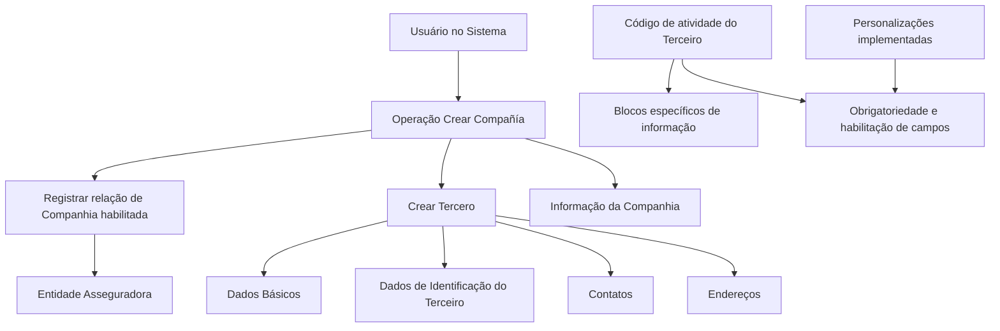

# Operação Criar Companhia para Entidade Asseguradora

## 1. Metadados do Documento
- **Arquivo de Origem:** Não identificado
- **Tipo de Documento:** Procedimento
- **Domínio / Sistema:** Cadastro de Terceiros e Companhias para Entidade Asseguradora
- **Público-Alvo:** Operação, Negócio e usuários do Sistema
- **Data/Versão Identificada:** Não identificada

---

## 2. Resumo Executivo & Contexto de Negócio

O documento descreve a operação **“Crear Compañía”**, destinada a registrar no Sistema a relação de Companhias habilitadas para uma Entidade Asseguradora. O processo utiliza a operação de criação de Terceiro como base para a inclusão dos dados corporativos da Companhia.

A principal regra de negócio explícita estabelece que as Companhias de uma Entidade Asseguradora devem sempre ser criadas como **Personas Jurídicas**. O cadastro é organizado em blocos de informações compartilhadas e em blocos específicos definidos conforme a atividade do Terceiro.

A obrigatoriedade e a habilitação dos campos podem variar de acordo com o código de atividade do Terceiro. Além disso, personalizações implementadas no Sistema podem alterar o comportamento da aplicação em relação à obrigatoriedade de preenchimento dos Dados do Terceiro.

O documento também informa que a sequência de captura dos dados nos diferentes blocos de informação pode variar conforme o critério adotado pelo usuário no Sistema. Não foram detalhados campos individuais, validações específicas por atividade, métodos técnicos, integrações ou contratos de API.

---

## 3. Arquitetura, Componentes & Tecnologias Envolvidas

Os elementos funcionais identificados são:

- **Sistema:** plataforma na qual a relação de Companhias habilitadas é registrada.
- **Operação Crear Compañía:** operação de criação da Companhia.
- **Operação Crear Tercero:** estrutura de cadastro utilizada para os blocos de informação compartilhados.
- **Entidad Aseguradora:** entidade para a qual as Companhias são habilitadas.
- **Tercero:** entidade cadastrada no Sistema, cuja atividade determina blocos específicos e pode influenciar a obrigatoriedade ou habilitação de campos.
- **Información de la Compañía:** bloco específico para dados da Companhia.



> **Nota de Análise:** O documento não identifica tecnologias, bancos de dados, URLs, ambientes, microsserviços, métodos HTTP, contratos JSON ou mecanismos de integração.

---

## 4. Regras de Negócio, Especificações Funcionais & Processos

### Objetivo da operação

A operação **Crear Compañía** permite registrar no Sistema a relação de Companhias habilitadas para uma Entidade Asseguradora.

### Regras de negócio

1. As Companhias da Entidade Asseguradora devem sempre ser criadas como **Personas Jurídicas**.
2. A obrigatoriedade e/ou a habilitação dos campos de registro pode variar conforme o código de atividade do Terceiro.
3. Personalizações implementadas podem afetar o comportamento da aplicação quanto à obrigatoriedade do registro dos Dados do Terceiro.
4. A ordem de captura dos dados nos diferentes blocos de informação pode variar conforme o critério seguido pelo usuário no Sistema.
5. O cadastro inclui blocos de informações compartilhadas da operação **Crear Tercero**.
6. O cadastro inclui blocos de informações específicos conforme a atividade do Terceiro, incluindo o bloco **Información de la Compañía**.

### Fluxo funcional identificado

1. O usuário inicia a operação **Crear Compañía** no Sistema.
2. A Companhia é tratada como uma Pessoa Jurídica.
3. O usuário registra as informações compartilhadas da operação **Crear Tercero**.
4. O usuário registra os blocos específicos aplicáveis conforme a atividade do Terceiro.
5. O usuário inclui a **Información de la Compañía**.
6. A Companhia passa a compor a relação de Companhias habilitadas para a Entidade Asseguradora.

> **Nota de Análise:** O documento não detalha critérios de conclusão do cadastro, mensagens de erro, aprovações, estados intermediários, responsáveis por validação ou regras de desativação da Companhia.

---

## 5. Tabelas de Parâmetros, Ambientes e Estruturas de Dados

| Item / Parâmetro | Descrição / Função | Tipo / Valores / Formato | Ambiente / Observações |
| :--- | :--- | :--- | :--- |
| Operação Crear Compañía | Registra no Sistema a relação de Companhias habilitadas para uma Entidade Asseguradora. | Operação funcional | Não especificado |
| Companhia | Entidade cadastrada na operação Crear Compañía. | Deve ser Persona Jurídica | Associada a uma Entidade Asseguradora |
| Entidade Asseguradora | Entidade para a qual a relação de Companhias habilitadas é registrada. | Entidade de negócio | Não especificado |
| Terceiro | Entidade cujo código de atividade influencia os blocos específicos e a configuração dos campos. | Cadastro de Terceiro | Não especificado |
| Código de atividade do Terceiro | Critério que pode determinar obrigatoriedade, habilitação e blocos específicos de informação. | Código não detalhado | Valores não especificados |
| Dados Básicos | Bloco de informação compartilhada da operação Crear Tercero. | Bloco de cadastro | Campos não detalhados |
| Dados de Identificação do Terceiro | Bloco de informação compartilhada da operação Crear Tercero. | Bloco de cadastro | Campos não detalhados |
| Contatos | Bloco de informação compartilhada da operação Crear Tercero. | Bloco de cadastro | Campos não detalhados |
| Endereços | Bloco de informação compartilhada da operação Crear Tercero. | Bloco de cadastro | Campos não detalhados |
| Informação da Companhia | Bloco específico de informação da Companhia. | Bloco de cadastro | Campos não detalhados |
| Personalizações implementadas | Implementações que podem afetar o comportamento de obrigatoriedade dos Dados do Terceiro. | Configuração/personalização | Não detalhada |
| Ordem de captura | Sequência em que o usuário preenche os blocos de informação. | Variável conforme critério do usuário | Não fixa segundo o documento |

---

## 6. Bateria de Perguntas & Respostas para RAG (FAQ Sintético)

### P1: Qual é a finalidade da operação Crear Compañía?
**R:** A operação Crear Compañía permite registrar no Sistema a relação de Companhias habilitadas para uma Entidade Asseguradora.

### P2: Uma Companhia pode ser cadastrada como Pessoa Física?
**R:** Não. O documento estabelece que as Companhias da Entidade Asseguradora devem sempre ser criadas como Personas Jurídicas.

### P3: Quais blocos compartilhados são utilizados no cadastro de uma Companhia?
**R:** O cadastro utiliza os blocos compartilhados da operação Crear Tercero: Dados Básicos, Dados de Identificação do Terceiro, Contatos e Endereços.

### P4: Existe um bloco específico para registrar dados da Companhia?
**R:** Sim. O documento identifica o bloco específico chamado Información de la Compañía.

### P5: O código de atividade do Terceiro influencia o cadastro?
**R:** Sim. A obrigatoriedade e/ou a habilitação dos campos de cada bloco ou estrutura de informação compartilhada pode variar conforme o código de atividade do Terceiro. O código de atividade também está relacionado aos blocos específicos de informação aplicáveis ao Terceiro.

### P6: A obrigatoriedade dos Dados do Terceiro é sempre fixa?
**R:** Não. O documento informa que personalizações implementadas podem afetar o comportamento da aplicação em relação à obrigatoriedade de registro dos Dados do Terceiro.

### P7: Os blocos de informação precisam ser preenchidos em uma ordem obrigatória?
**R:** Não necessariamente. A ordem de captura dos dados nos diferentes blocos de informação pode variar de acordo com o critério seguido pelo usuário no Sistema.

### P8: O documento detalha quais campos existem em Dados Básicos, Contatos ou Endereços?
**R:** Não. O documento apenas lista os blocos Dados Básicos, Dados de Identificação do Terceiro, Contatos e Endereços, sem descrever os respectivos campos.

### P9: O documento informa os métodos HTTP ou contratos de API da operação Crear Compañía?
**R:** Não. O documento não apresenta métodos HTTP, endpoints, contratos JSON, URLs ou detalhes de integração técnica.

### P10: Quais condições podem alterar a habilitação de campos no cadastro?
**R:** A habilitação dos campos pode variar conforme o código de atividade do Terceiro. O documento também informa que personalizações implementadas podem afetar o comportamento relacionado à obrigatoriedade dos Dados do Terceiro.

---

## 7. Glossário de Termos, Siglas & Conceitos-Chave

- **Compañía:** Companhia registrada no Sistema e habilitada para uma Entidade Asseguradora.
- **Crear Compañía:** Operação usada para registrar a relação de Companhias habilitadas para uma Entidade Asseguradora.
- **Crear Tercero:** Operação que contém os blocos compartilhados de informação utilizados no cadastro.
- **Entidad Aseguradora:** Entidade para a qual as Companhias são habilitadas.
- **Información de la Compañía:** Bloco específico de informação aplicável ao cadastro da Companhia.
- **Persona Jurídica:** Classificação obrigatória para as Companhias da Entidade Asseguradora.
- **Tercero:** Entidade cadastrada cujo código de atividade pode influenciar os blocos específicos e a configuração de obrigatoriedade ou habilitação de campos.

---

## 8. Notas Críticas, Riscos & Limitações

- O documento não identifica o nome do Sistema, versão, data, autor ou arquivo de origem.
- Não há detalhamento dos campos existentes em cada bloco de informação.
- Não há catálogo de códigos de atividade do Terceiro nem associação entre códigos e blocos específicos.
- Não há detalhamento das personalizações que podem alterar a obrigatoriedade dos Dados do Terceiro.
- Não são descritos fluxos de aprovação, validações, mensagens de erro, permissões, perfis de acesso ou critérios de sucesso do cadastro.
- Não são informados ambientes, servidores, URLs, rotas de log, tecnologias, integrações, APIs ou contratos técnicos.
- A variação da ordem de captura por critério do usuário pode exigir orientação operacional complementar para assegurar consistência no preenchimento.

---

## 9. Conteúdo Bruto Estruturado (Referência Fiel)

```text
--- [PÁGINA 1 DE 2] ---

OPERACIÓN CREAR Compañía
¿En que consiste?
Esta operación permite registrar en el Sistema la relación de Compañías habilitadas para la Entidad
Aseguradora.
Premisas
Las Compañías de la Entidad Aseguradora siempre se crearán como Personas Jurídicas.
La obligatoriedad y/o la habilitación de los campos en el registro de los datos de cada uno de
los bloques o estructuras de información compartidas puede variar de acuerdo con el código de
actividad del Tercero:
Las personalizaciones que se hubieran podido implementar a su vez pueden afectar el
comportamiento de la aplicación en relación con la obligatoriedad en el registro de los Datos del
Tercero.
Por último, el orden de captura de los datos en los distintos bloques de Información puede
variar de acuerdo con el criterio seguido por el Usuario en el Sistema.
Proceso
Ejemplo:
 / 
 RS
Inicio Soluciones APIs Documentación Zeus
ES


--- [PÁGINA 2 DE 2] ---

CREAR
TERCERO
Crear Información de
la Compañía
Bloques de Información Compartidos (CREAR TERCERO)
 Datos Básicos ( )
 Datos Identificación del Tercero ( )
 Contactos ( )
 Direcciones ( )
Bloques de Información Específicos de acuerdo con la
Actividad del Tercero.
 Información de la Compañía ( )
```
