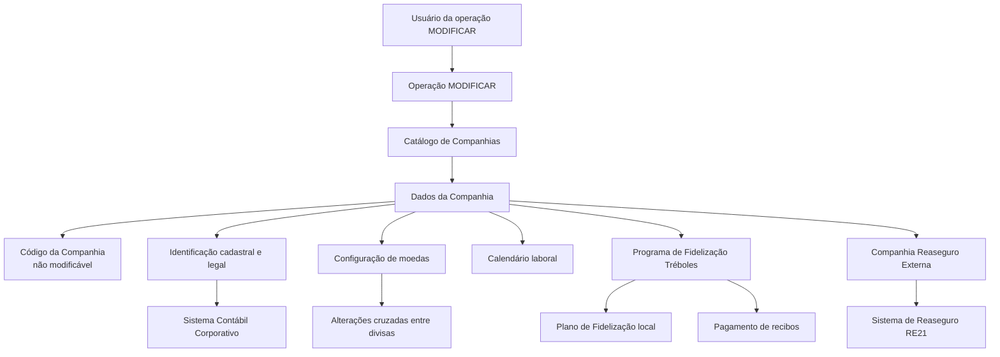

# Operação “Modificar Informação Específica da Companhia” — Catálogo de Companhias MAPFRE

## 1. Metadados do Documento
- **Arquivo de Origem:** Não identificado no conteúdo fornecido
- **Tipo de Documento:** Especificação Funcional
- **Domínio / Sistema:** Catálogo de Companhias MAPFRE; integração conceitual com Reaseguro RE21 e Sistema Contábil Corporativo
- **Público-Alvo:** Analistas funcionais, desenvolvedores, operação e administradores de cadastro corporativo
- **Data/Versão Identificada:** Não identificada

---

## 2. Resumo Executivo & Contexto de Negócio

O documento descreve a operação **MODIFICAR**, destinada à alteração de informações específicas de uma Companhia no catálogo de companhias. A operação apresenta os atributos exibidos no bloco de informações da companhia e a sequência de captura dos dados, organizada da esquerda para a direita e de cima para baixo.

O **Código da Companhia** identifica a chave da Companhia e possui uma restrição explícita: não pode ser modificado. Os demais atributos documentados abrangem identificação corporativa, dados legais, moedas, parâmetros de reaseguro, regras de calendário laboral e configuração do programa de fidelização Tréboles.

A especificação associa dados cadastrais locais a referências corporativas MAPFRE. Em especial, a **Chave de Identificação Societária** deve corresponder ao identificador da sociedade no Sistema Contábil Corporativo, com exemplos como `0002` para Mapfre España, `0233` para Mapfre Paraguay Seguros e `0378` para Mapfre Dominicana, S.A.

Também são definidos parâmetros operacionais relevantes para conversão de moedas e fidelização. A configuração de **Moeda Local Origem** determina a moeda interna usada pela Companhia em mudanças cruzadas entre divisas. Já os parâmetros de Tréboles controlam a moeda do programa, a quantidade mínima exigida para resgate e a quantidade máxima aplicável ao pagamento de recibos.

O conteúdo não informa tecnologias de implementação, métodos HTTP, contratos JSON, banco de dados, URLs, perfis de acesso, trilhas de auditoria ou mecanismos de validação técnica. A documentação descreve o comportamento funcional e o significado dos campos, sem detalhar interfaces técnicas.

---

## 3. Arquitetura, Componentes & Tecnologias Envolvidas

Os componentes e sistemas explicitamente citados são:

- **Operação MODIFICAR:** ação habilitada para alterar informações da Companhia.
- **Catálogo de Companhias / Catálogo de definição de entidades:** repositório funcional em que atributos da Companhia são definidos.
- **Companhia:** entidade corporativa cujos dados são cadastrados ou modificados.
- **Sistema Contábil Corporativo:** sistema de referência para a Chave de Identificação Societária.
- **Sistema de Reaseguro RE21:** sistema de referência para a Companhia Reaseguro Externa.
- **Plano de Fidelização:** configuração operacional local que define a utilização da moeda para obtenção e resgate de Tréboles.
- **Tréboles:** unidade associada ao programa de fidelização, utilizada para obtenção, resgate e pagamento de recibos.
- **Código ISO de moeda:** identificação da moeda do país e da moeda usada no programa de fidelização.



**Nota de Análise:** O documento não detalha a arquitetura técnica de integração entre o Catálogo de Companhias, o Sistema Contábil Corporativo e o sistema de Reaseguro RE21. Também não apresenta protocolos, APIs, métodos HTTP, contratos de dados, filas, eventos ou mecanismos de sincronização.

---

## 4. Regras de Negócio, Especificações Funcionais & Processos

### 4.1 Operação habilitada

- A operação documentada permite **Modificar a informação da Companhia**.
- A ação habilitada indicada no documento é **MODIFICAR**.
- Os atributos seguem uma sequência de captura apresentada da esquerda para a direita e de cima para baixo no bloco de informação.

### 4.2 Identificação da Companhia

1. **Código da Companhia**
   - Identifica a chave da Companhia.
   - A chave não pode ser modificada.
   - A operação MODIFICAR não deve alterar o Código da Companhia.

2. **Abreviatura da Companhia**
   - Na criação da Companhia, contém a abreviatura pela qual a Companhia pode ser identificada.
   - O documento não detalha tamanho, formato, obrigatoriedade ou regras de unicidade.

3. **Razão Social**
   - Na criação da Companhia, indica o nome pelo qual a entidade ou sociedade mercantil MAPFRE está registrada local e legalmente.
   - O documento não especifica regras de validação legal, país, caracteres permitidos ou obrigatoriedade.

4. **Chave de Identificação Patronal**
   - Identifica, no catálogo de companhias, a chave de identificação patronal.
   - A chave deve estar de acordo com a legislação do país em que a Companhia está localizada.
   - O documento não informa formatos nacionais, máscaras ou algoritmos de validação.

5. **Chave de Identificação Societária**
   - Identifica a chave de identificação contábil segundo as diretrizes corporativas MAPFRE.
   - O valor deve ser o identificador da sociedade no Sistema Contábil Corporativo.
   - Exemplos documentados:
     - `0002`: Mapfre España.
     - `0233`: Mapfre Paraguay Seguros.
     - `0378`: Mapfre Dominicana, S.A.

### 4.3 Regras relacionadas a moeda

1. **Moeda**
   - Identifica no sistema o código ISO da moeda do país.
   - O documento não define quais códigos ISO são aceitos nem menciona uma lista de referência.

2. **Moeda Local Origem**
   - Quando o check do campo é ativado, a moeda do país passa a ser a moeda de origem considerada internamente pela Companhia.
   - A moeda de origem é utilizada para efetuar mudanças cruzadas entre divisas.
   - O documento não detalha regras de cotação, arredondamento, data de vigência ou fonte cambial.

3. **Moeda Programa de Fidelização (Tréboles)**
   - Identifica o código ISO da moeda usada para obter ou resgatar Tréboles.
   - A moeda é definida conforme a configuração operacional local realizada no Plano de Fidelização.

### 4.4 Regras relacionadas a calendário laboral

1. **Sábados Laboráveis**
   - Define se os sábados são considerados dias laboráveis ou dias festivos.
   - O documento não explicita o valor técnico armazenado para cada condição.

2. **Domingos Laboráveis**
   - Define se os domingos são considerados dias laboráveis ou dias festivos.
   - O documento não detalha relação com feriados locais, calendários externos ou cálculo de prazos.

### 4.5 Regras relacionadas ao reaseguro

1. **Companhia Reaseguro Externa**
   - Atributo do catálogo de definição de entidades.
   - Identifica no sistema o código da entidade correspondente no sistema de Reaseguro RE21.
   - O documento não especifica se o código é validado em tempo real contra RE21 ou apenas armazenado localmente.

### 4.6 Regras relacionadas ao programa de fidelização Tréboles

1. **Número Mínimo de Tréboles**
   - Define a quantidade mínima de Tréboles que um Cliente deve possuir para poder efetuar o resgate.
   - A quantidade mínima é estabelecida pela entidade no cadastro de definição das companhias.

2. **Número Máximo de Tréboles**
   - Define a quantidade máxima de Tréboles que a entidade permite que um Cliente utilize para pagamento de seus recibos.
   - O intervalo pode permanecer aberto quando o dado não for informado.
   - O documento não define o significado técnico de “aberto”, por exemplo, se representa ausência de limite máximo ou outro comportamento operacional.

---

## 5. Tabelas de Parâmetros, Ambientes e Estruturas de Dados

| Item / Parâmetro | Descrição / Função | Tipo / Valores / Formato | Ambiente / Observações |
| :--- | :--- | :--- | :--- |
| Operação | Permite modificar informações da Companhia. | Ação habilitada: `MODIFICAR`. | Não são informados perfis de acesso ou permissões. |
| Código da Companhia | Identifica a chave da Companhia. | Não informado. | Não pode ser modificado. |
| Abreviatura da Companhia | Identifica a Companhia por uma abreviatura definida em sua criação. | Não informado. | Sem detalhamento de tamanho, formato ou unicidade. |
| Razão Social | Nome sob o qual a entidade ou sociedade mercantil MAPFRE está registrada local e legalmente. | Não informado. | Associado ao cadastro de criação da Companhia. |
| Moeda | Identifica o código ISO da moeda do país. | Código ISO de moeda. | O documento não lista códigos aceitos. |
| Chave de Identificação Patronal | Identifica a chave patronal da Companhia conforme legislação local. | Não informado. | Deve observar a legislação do país de localização da Companhia. |
| Chave de Identificação Societária | Identifica contabilmente a sociedade segundo diretrizes corporativas MAPFRE. | Identificador da sociedade no Sistema Contábil Corporativo. | Exemplos: `0002`, `0233`, `0378`. |
| `0002` | Identificador societário exemplificado. | Código de sociedade. | Mapfre España. |
| `0233` | Identificador societário exemplificado. | Código de sociedade. | Mapfre Paraguay Seguros. |
| `0378` | Identificador societário exemplificado. | Código de sociedade. | Mapfre Dominicana, S.A. |
| Companhia Reaseguro Externa | Identifica o código da entidade no sistema de Reaseguro RE21. | Código de entidade. | Campo do catálogo de definição de entidades. |
| Moeda Local Origem | Define a moeda do país como moeda de origem interna da Companhia. | Check / indicador de ativação. | Usada em mudanças cruzadas entre divisas. |
| Sábados Laboráveis | Define o tratamento de sábados como dias laboráveis ou festivos. | Campo booleano ou equivalente não especificado. | O valor técnico não é documentado. |
| Domingos Laboráveis | Define o tratamento de domingos como dias laboráveis ou festivos. | Campo booleano ou equivalente não especificado. | O valor técnico não é documentado. |
| Moeda Programa de Fidelização (Tréboles) | Identifica a moeda usada para obter ou resgatar Tréboles. | Código ISO de moeda. | Conforme configuração operacional local do Plano de Fidelização. |
| Número Mínimo de Tréboles | Estabelece o saldo mínimo de Tréboles para que um Cliente possa resgatá-los. | Número. | Definido pela entidade. |
| Número Máximo de Tréboles | Estabelece o máximo de Tréboles utilizável por Cliente no pagamento de recibos. | Número ou valor não informado. | Pode permanecer aberto se o dado não for informado. |

---

## 6. Bateria de Perguntas & Respostas para RAG (FAQ Sintético)

### P1: Qual é a finalidade da operação MODIFICAR no catálogo de companhias?
**R:** A operação **MODIFICAR** permite alterar informações específicas de uma Companhia no catálogo de companhias. O documento identifica explicitamente a ação habilitada como `MODIFICAR`, mas não detalha perfis de acesso, etapas de aprovação ou mecanismos técnicos de persistência.

### P2: O Código da Companhia pode ser alterado pela operação MODIFICAR?
**R:** Não. O **Código da Companhia** identifica a chave da Companhia e o documento estabelece expressamente que essa chave não poderá ser modificada.

### P3: Qual informação deve ser registrada na Chave de Identificação Societária?
**R:** A **Chave de Identificação Societária** deve conter o identificador da sociedade no Sistema Contábil Corporativo, conforme as diretrizes corporativas MAPFRE. O documento exemplifica `0002` para Mapfre España, `0233` para Mapfre Paraguay Seguros e `0378` para Mapfre Dominicana, S.A.

### P4: Para que serve a Chave de Identificação Patronal?
**R:** A **Chave de Identificação Patronal** identifica, no catálogo de companhias, a chave patronal aplicável à Companhia. Essa chave deve estar de acordo com a legislação do país em que a Companhia está localizada.

### P5: O que acontece quando a Moeda Local Origem é ativada?
**R:** Quando o check de **Moeda Local Origem** é ativado, a moeda do país passa a ser considerada internamente pela Companhia como a moeda de origem para realizar mudanças cruzadas entre divisas.

### P6: Como a Companhia Reaseguro Externa se relaciona com o RE21?
**R:** A **Companhia Reaseguro Externa** identifica no sistema o código da entidade correspondente no sistema de Reaseguro **RE21**. O documento não informa se existe integração online, validação automática ou sincronização de dados com RE21.

### P7: Qual é a função dos campos Sábados Laboráveis e Domingos Laboráveis?
**R:** Os campos **Sábados Laboráveis** e **Domingos Laboráveis** definem se sábados e domingos devem ser considerados dias laboráveis ou dias festivos. A especificação não detalha como essa configuração afeta prazos, vencimentos ou calendários de processamento.

### P8: Qual moeda deve ser configurada para o Programa de Fidelização Tréboles?
**R:** A **Moeda Programa de Fidelização (Tréboles)** deve conter o código ISO da moeda usada para obter ou resgatar Tréboles, de acordo com a configuração operacional local realizada no Plano de Fidelização.

### P9: Para que serve o Número Mínimo de Tréboles?
**R:** O **Número Mínimo de Tréboles** determina a quantidade mínima de Tréboles que um Cliente deve possuir para poder realizar o resgate desses Tréboles.

### P10: Como funciona o Número Máximo de Tréboles no pagamento de recibos?
**R:** O **Número Máximo de Tréboles** determina a quantidade máxima de Tréboles que um Cliente pode utilizar no pagamento de seus recibos. O documento informa que esse intervalo pode permanecer aberto caso o dado não seja informado, sem detalhar o comportamento técnico dessa condição.

### P11: A especificação define quais códigos ISO de moeda são aceitos?
**R:** Não. O documento apenas informa que o campo **Moeda** identifica o código ISO da moeda do país e que a moeda do programa Tréboles também utiliza código ISO. Não há relação de moedas permitidas, regras de validação ou formato técnico adicional.

### P12: O documento apresenta contratos de API ou métodos HTTP para a operação MODIFICAR?
**R:** Não. A documentação apresenta a descrição funcional da operação e dos campos da Companhia, mas não informa métodos HTTP, URLs, contratos JSON, autenticação, mensagens de erro ou detalhes de implementação de API.

---

## 7. Glossário de Termos, Siglas & Conceitos-Chave

- **Companhia:** Entidade cadastrada no catálogo de companhias e submetida à operação MODIFICAR.
- **Código da Companhia:** Chave identificadora da Companhia; não pode ser modificada.
- **Código ISO de moeda:** Código utilizado pelo sistema para identificar a moeda de um país ou a moeda do programa de fidelização.
- **Divisas:** Moedas envolvidas em mudanças cruzadas realizadas internamente pela Companhia.
- **MAPFRE:** Organização corporativa mencionada como referência para diretrizes societárias e registro local e legal de entidades ou sociedades mercantis.
- **Plano de Fidelização:** Configuração operacional local que define, entre outros aspectos, a moeda usada para obtenção e resgate de Tréboles.
- **RE21:** Sistema de Reaseguro no qual é identificado o código da entidade correspondente à Companhia Reaseguro Externa.
- **Sistema Contábil Corporativo:** Sistema que contém o identificador societário usado na Chave de Identificação Societária.
- **Tréboles:** Unidade do Programa de Fidelização utilizada para obtenção, resgate e pagamento de recibos.
- **Razão Social:** Nome pelo qual a entidade ou sociedade mercantil MAPFRE está registrada local e legalmente.
- **Chave de Identificação Patronal:** Chave de identificação da Companhia conforme a legislação do país onde está localizada.
- **Chave de Identificação Societária:** Identificador contábil da sociedade conforme diretrizes corporativas MAPFRE.

---

## 8. Notas Críticas, Riscos & Limitações

- O documento não informa o nome do arquivo de origem, versão, data de publicação, autor ou responsável pela especificação.
- Não há definição de campos obrigatórios, opcionais, tamanhos máximos, padrões de preenchimento, tipos técnicos ou mensagens de erro.
- Não são apresentados mecanismos de autenticação, autorização, perfis de usuário, aprovação, auditoria ou rastreabilidade da operação MODIFICAR.
- O Código da Companhia é explicitamente imutável; qualquer processo que dependa de alteração dessa chave requer tratamento externo não documentado.
- A Chave de Identificação Patronal depende da legislação do país da Companhia, mas não há catálogo de regras legais, máscaras ou validadores por país.
- A Chave de Identificação Societária depende do Sistema Contábil Corporativo, porém não são descritas regras de integração, sincronização ou validação de existência.
- A Companhia Reaseguro Externa referencia o RE21, mas não há detalhes sobre disponibilidade, consistência, reconciliação ou tratamento de códigos inexistentes.
- A configuração de Moeda Local Origem influencia mudanças cruzadas entre divisas, porém taxas cambiais, arredondamento, vigência e fontes de cotação não são detalhados.
- O comportamento de “rango aberto” para o Número Máximo de Tréboles não é definido tecnicamente.
- **Nota de Análise:** O documento lista campos funcionais, mas não detalha métodos HTTP, contratos JSON, banco de dados, integrações técnicas, URLs de ambientes ou rotas de logs.

---

## 9. Conteúdo Bruto Estruturado (Referência Fiel)

```text
--- [PÁGINA 1 DE 3] ---

MODIFICAR Información específica de la
Compañía
Objetivo
Esta Operación permite Modificar la información de la Compañía.
Acciones habilitadas
 MODIFICAR ( )
Datos Compañía
De Izquierda a Derecha y de Arriba hacia Abajo, los siguientes atributos marcan la secuencia de
captura en este Bloque de Información.
Código de la Compañía
Este Campo identifica la clave de la Compañía, clave que no podrá modificarse.
 / 
 RS
Inicio Soluciones APIs Documentación Zeus
ES


--- [PÁGINA 2 DE 3] ---

Abreviatura de la Compañía ( )
Este dato en la creación de la Compañía contiene la abreviatura por la que se puede identificar.
Razón Social ( )
Este dato en la creación de la compañía indicará el nombre con que la entidad o sociedad mercantil
MAPFRE está registrada local y legalmente.
Moneda (  )
Este dato identifica en el sistema el código ISO de la Moneda del país.
Clave de Identificación Patronal ( )
Este atributo sirve para identificar en el catálogo de compañías la clave de identificación patronal de
acuerdo con la legislación del país en el que se ubica la compañía.
Clave de Identificación Societaria ( )
Este atributo sirve para identificar la clave de identificación contable de acuerdo con las directrices
Corporativas de MAPFRE.
Su valor debe ser el identificador de la sociedad en el sistema Contable Corporativo: 0002 (Mapfre
España), 0233 (Mapfre Paraguay Seguros), 0378 (Mapfre Dominicana, S.A.), ...
Compañía Reaseguro Externa ( )
Este atributo del catálogo de definición de las entidades, identifica en el sistema el código de la
entidad en el sistema de Reaseguro RE21.
Moneda Local Origen ( )
Si activamos el Check de este Campo, se determina que la Moneda del País va a ser la Moneda
Origen que la Compañía va a considerar internamente para efectuar cambios cruzados entre divisas.
¿Sábados Laborables? ( )
Este campo identifica si los sábados van a considerarse o no días como días festivos.
¿Domingos Laborables? ( )
Este campo identifica si los domingos van a considerarse o no días como días festivos.
Ejemplo:


--- [PÁGINA 3 DE 3] ---

Moneda Programa de Fidelización (Tréboles) (  )
Este campo identifica en el sistema el código ISO de moneda usada para obtener/canjear Tréboles
de acuerdo con la configuración operativa realizada localmente en el Plan de Fidelización
Número Mínimo de Tréboles ( )
Este dato en la definición de las compañías le indica al Sistema el número mínimo de tréboles que la
entidad establece ha de tener un Cliente para que éste pueda realizar el canje de los mismos.
Número Máximo de Tréboles ( )
Este atributo en el catálogo de definición de compañías le indica al Sistema el número máximo de
tréboles que la entidad establece para que un Cliente pueda canjearlos en el pago de sus recibos,
pudiendo quedar abierto este rango si el dato no se informa.
```
