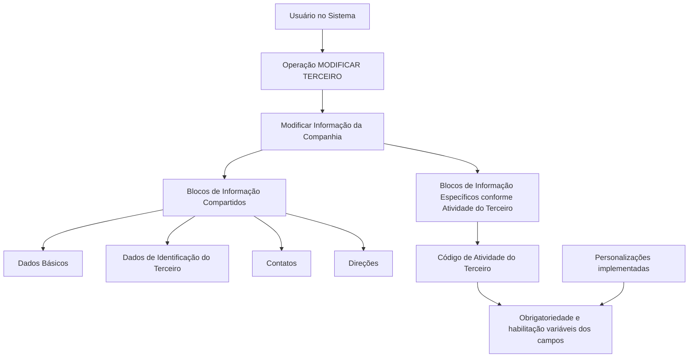

# Operação MODIFICAR Companhia — Gestão de Informações de Terceiros

## 1. Metadados do Documento
- **Arquivo de Origem:** Não identificado
- **Tipo de Documento:** Manual Operacional
- **Domínio / Sistema:** Operação MODIFICAR TERCEIRO / Companhia
- **Público-Alvo:** Usuários do Sistema, Operação, Negócio
- **Data/Versão Identificada:** Não identificada

---

## 2. Resumo Executivo & Contexto de Negócio

O documento descreve a operação **MODIFICAR Companhia**, também apresentada como **MODIFICAR TERCEIRO**, destinada à complementação, modificação e/ou inabilitação das informações de uma Companhia. A atualização pode ocorrer em quaisquer estruturas de dados que contenham e agrupem as informações da Companhia.

A operação organiza a informação em **Blocos de Informação Compartidos** e em **Blocos de Informação Específicos**, definidos de acordo com a atividade do Terceiro. Os blocos compartilhados citados incluem Dados Básicos, Dados de Identificação do Terceiro, Contatos e Direções.

A obrigatoriedade e a habilitação dos campos podem variar conforme o código de atividade do Terceiro. Além disso, personalizações implementadas podem alterar o comportamento da aplicação quanto à obrigatoriedade do registro dos Dados do Terceiro.

A ordem de captura dos dados nos blocos de informação não é fixa: ela pode variar segundo o critério utilizado pelo Usuário no Sistema. O documento não apresenta detalhes adicionais sobre telas, validações específicas por campo, integrações, métodos HTTP, contratos de dados ou persistência técnica.

---

## 3. Arquitetura, Componentes & Tecnologias Envolvidas

Os componentes funcionais explicitamente identificados são:

- Operação **MODIFICAR Companhia**.
- Operação **MODIFICAR TERCEIRO**.
- Estrutura de **Blocos de Informação Compartidos**.
- Estrutura de **Blocos de Informação Específicos de acordo com a Actividad del Tercero**.
- Blocos compartilhados: Dados Básicos, Dados de Identificação do Terceiro, Contatos e Direções.
- Ação **Modificar Información de la Compañía**.
- Referências de navegação apresentadas: `Inicio`, `Soluciones`, `APIs`, `Documentación`, `Zeus`, `ES`.



**Nota de Análise:** o documento apresenta uma estrutura funcional de alteração de dados, mas não detalha arquitetura de software, tecnologias, APIs, serviços, bancos de dados, ambientes ou contratos de integração.

---

## 4. Regras de Negócio, Especificações Funcionais & Processos

1. A operação **MODIFICAR Companhia** permite:
   - Complementar informações da Companhia.
   - Modificar informações da Companhia.
   - Inabilitar informações da Companhia.

2. As alterações podem atingir qualquer estrutura de dados que contenha e agrupe informações da Companhia.

3. Os dados são organizados em dois grupos:
   - **Blocos de Informação Compartidos**, aplicáveis à operação MODIFICAR TERCEIRO.
   - **Blocos de Informação Específicos**, definidos de acordo com a atividade do Terceiro.

4. Os Blocos de Informação Compartidos listados são:
   - Dados Básicos.
   - Dados de Identificação do Terceiro.
   - Contatos.
   - Direções.

5. A obrigatoriedade e/ou a habilitação dos campos de cada bloco ou estrutura de informação compartilhada pode variar conforme o código de atividade do Terceiro.

6. Personalizações que tenham sido implementadas podem afetar o comportamento da aplicação quanto à obrigatoriedade do registro dos Dados do Terceiro.

7. A sequência de captura das informações nos blocos pode variar conforme o critério seguido pelo Usuário no Sistema.

8. O processo ilustrado parte da operação **MODIFICAR TERCEIRO**, segue para a ação **Modificar Informação de la Compañía** e disponibiliza blocos compartilhados e blocos específicos conforme a atividade do Terceiro.

**Nota de Análise:** o documento não define quais códigos de atividade existem, quais campos compõem cada bloco, nem as regras condicionais detalhadas de obrigatoriedade, habilitação ou inabilitação.

---

## 5. Tabelas de Parâmetros, Ambientes e Estruturas de Dados

| Item / Parâmetro | Descrição / Função | Tipo / Valores / Formato | Ambiente / Observações |
| :--- | :--- | :--- | :--- |
| MODIFICAR Companhia | Operação para complementar, modificar e/ou inabilitar informações da Companhia. | Operação funcional. | Pode atuar em estruturas de dados que contêm e agrupam informações da Companhia. |
| MODIFICAR TERCEIRO | Operação apresentada como contexto dos blocos de informação compartilhados. | Operação funcional. | Associada à ação de modificar a informação da Companhia. |
| Dados Básicos | Bloco de Informação Compartido. | Estrutura de informação. | Campos não detalhados. |
| Dados de Identificação do Terceiro | Bloco de Informação Compartido. | Estrutura de informação. | Campos não detalhados. |
| Contatos | Bloco de Informação Compartido. | Estrutura de informação. | Campos não detalhados. |
| Direções | Bloco de Informação Compartido. | Estrutura de informação. | Campos não detalhados. |
| Blocos de Informação Específicos | Estruturas específicas para informações do Terceiro. | Estruturas condicionais por atividade. | Definidos de acordo com a atividade do Terceiro. |
| Código de atividade do Terceiro | Critério que pode alterar obrigatoriedade e habilitação dos campos. | Código não especificado. | Valores e regras de associação não detalhados. |
| Personalizações implementadas | Podem influenciar o comportamento da aplicação relativo à obrigatoriedade dos Dados do Terceiro. | Personalizações não especificadas. | Dependência de configurações ou implementações prévias. |
| Ordem de captura dos dados | Sequência de preenchimento dos blocos de informação. | Ordem definida pelo Usuário no Sistema. | Pode variar conforme o critério do Usuário. |
| Inicio / Soluciones / APIs / Documentación / Zeus / ES | Referências apresentadas na extração do documento. | Itens de navegação ou contexto visual. | Função técnica não detalhada. |

---

## 6. Bateria de Perguntas & Respostas para RAG (FAQ Sintético)

### P1: Em que consiste a operação MODIFICAR Companhia?
**R:** A operação MODIFICAR Companhia consiste em complementar, modificar e/ou inabilitar as informações da Companhia em qualquer uma das estruturas de dados que contêm e agrupam essas informações.

### P2: A operação MODIFICAR Companhia permite excluir dados?
**R:** O documento menciona complementar, modificar e/ou inabilitar informações da Companhia. Não descreve uma funcionalidade de exclusão física ou lógica de registros.

### P3: Quais blocos de informação compartilhados estão disponíveis em MODIFICAR TERCEIRO?
**R:** Os blocos de Informação Compartidos citados são Dados Básicos, Dados de Identificação do Terceiro, Contatos e Direções.

### P4: O que determina a obrigatoriedade ou habilitação dos campos de informação compartilhada?
**R:** A obrigatoriedade e/ou a habilitação dos campos pode variar conforme o código de atividade do Terceiro.

### P5: As personalizações podem alterar o comportamento de obrigatoriedade dos campos?
**R:** Sim. O documento informa que personalizações implementadas podem afetar o comportamento da aplicação em relação à obrigatoriedade do registro dos Dados do Terceiro.

### P6: A ordem de preenchimento dos blocos de informação é obrigatória?
**R:** Não. O documento afirma que a ordem de captura dos dados nos distintos blocos de informação pode variar de acordo com o critério seguido pelo Usuário no Sistema.

### P7: Existem blocos de dados específicos para todos os Terceiros?
**R:** O documento indica a existência de Blocos de Informação Específicos de acordo com a atividade do Terceiro. Entretanto, não detalha quais blocos se aplicam a cada atividade.

### P8: O documento detalha os campos presentes em Dados Básicos, Contatos ou Direções?
**R:** Não. O documento apenas lista Dados Básicos, Dados de Identificação do Terceiro, Contatos e Direções como blocos de informação compartilhados, sem apresentar seus campos internos.

### P9: O documento especifica APIs, métodos HTTP ou contratos JSON da operação MODIFICAR TERCEIRO?
**R:** Não. Embora a extração contenha a referência textual “APIs”, o documento não descreve endpoints, métodos HTTP, contratos JSON, autenticação ou integrações técnicas.

### P10: Qual é a relação entre MODIFICAR TERCEIRO e Modificar Informação da Companhia?
**R:** O fluxo apresentado posiciona “Modificar Información de la Compañía” como ação dentro do contexto de MODIFICAR TERCEIRO, com acesso a blocos compartilhados e a blocos específicos conforme a atividade do Terceiro.

---

## 7. Glossário de Termos, Siglas & Conceitos-Chave

- **Companhia:** Entidade cujas informações podem ser complementadas, modificadas e/ou inabilitadas pela operação descrita.
- **Terceiro:** Entidade associada à operação MODIFICAR TERCEIRO e ao código de atividade que influencia regras de campos.
- **MODIFICAR Companhia:** Operação de manutenção das informações da Companhia.
- **MODIFICAR TERCEIRO:** Operação apresentada como contexto para os blocos de informação compartilhados e para a modificação de informações da Companhia.
- **Blocos de Informação Compartidos:** Estruturas de informação compartilhadas que incluem Dados Básicos, Dados de Identificação do Terceiro, Contatos e Direções.
- **Blocos de Informação Específicos:** Estruturas de informação aplicáveis conforme a atividade do Terceiro.
- **Código de atividade do Terceiro:** Critério que pode alterar a obrigatoriedade e/ou habilitação de campos.
- **Personalizações:** Implementações que podem afetar o comportamento da aplicação em relação à obrigatoriedade do registro de Dados do Terceiro.
- **Dados Básicos:** Bloco de Informação Compartido listado no documento, sem campos detalhados.
- **Dados de Identificação do Terceiro:** Bloco de Informação Compartido listado no documento, sem campos detalhados.
- **Contatos:** Bloco de Informação Compartido listado no documento, sem campos detalhados.
- **Direções:** Bloco de Informação Compartido listado no documento, sem campos detalhados.

---

## 8. Notas Críticas, Riscos & Limitações

- O documento não identifica o arquivo de origem, versão, data, autor, sistema corporativo ou ambiente operacional.
- Não há detalhamento dos campos que compõem Dados Básicos, Dados de Identificação do Terceiro, Contatos e Direções.
- Não são apresentados códigos de atividade do Terceiro, regras de associação entre atividades e blocos específicos, nem critérios detalhados de obrigatoriedade.
- As personalizações podem modificar o comportamento da aplicação, criando risco de variação funcional entre implantações ou configurações.
- A liberdade na ordem de captura dos dados pode exigir validações adicionais não descritas para garantir integridade e completude cadastral.
- Não há informações sobre permissões, auditoria, autenticação, rastreabilidade, APIs, persistência, mensagens de erro ou processos de aprovação.
- **Nota de Análise:** a menção a “APIs” e “Zeus” aparece apenas na extração textual; o documento não explica o significado, a função ou a relação desses termos com a operação MODIFICAR Companhia.

---

## 9. Conteúdo Bruto Estruturado (Referência Fiel)

```text
--- [PÁGINA 1 DE 2] ---

OPERACIÓN MODIFICAR Compañía
¿En que consiste?
Esta operación consiste en Complementar, Modificar y/o Inhabilitar la información de la Compañía
en cualquiera de las estructuras de datos que la contienen y agrupan.
Premisas
La obligatoriedad y/o la habilitación de los campos en el registro de los datos de cada uno de
los bloques o estructuras de información compartidas puede variar de acuerdo con el código de
actividad del Tercero:
Las personalizaciones que se hubieran podido implementar a su vez pueden afectar el
comportamiento de la aplicación en relación con la obligatoriedad en el registro de los Datos del
Tercero.
Por último, el orden de captura de los datos en los distintos bloques de Información puede
variar de acuerdo con el criterio seguido por el Usuario en el Sistema.
Proceso
Ejemplo:
 /
 RS
Inicio Soluciones APIs Documentación Zeus
ES


--- [PÁGINA 2 DE 2] ---

MODIFICAR
TERCERO
Modificar Información
de la Compañía
Bloques de Información Compartidos (MODIFICAR TERCERO)
 Datos Básicos ( )
 Datos Identificación Tercero ( )
 Contactos (   )
 Direcciones (   )
Bloques de Información Específicos de acuerdo con la
Actividad del Tercero.
 Modificar Información de la Compañía ( )
```
