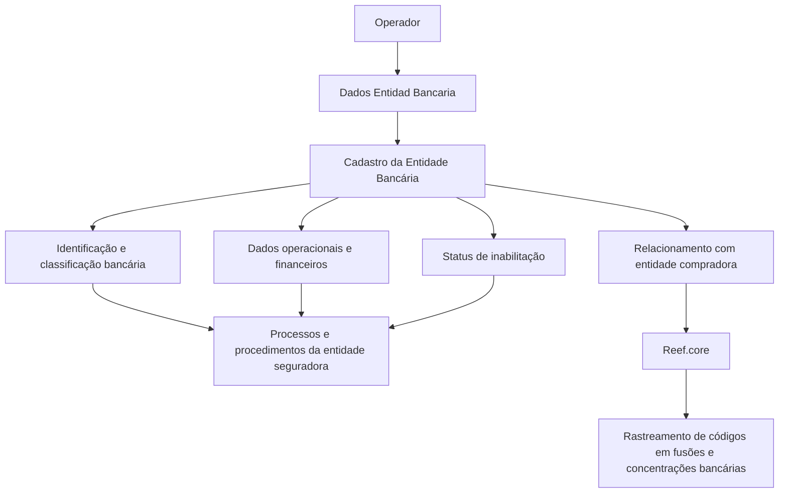

# Cadastro de Informações Específicas de Entidades Bancárias no Reef.core

## 1. Metadados do Documento
- **Arquivo de Origem:** Não identificado
- **Tipo de Documento:** Manual Operacional
- **Domínio / Sistema:** Reef.core; entidades bancárias; operações financeiras
- **Público-Alvo:** Operação, Negócio, Administradores de Catálogo e Desenvolvedores
- **Data/Versão Identificada:** Não identificada

---

## 2. Resumo Executivo & Contexto de Negócio

O documento descreve o cadastro de informações específicas de uma entidade bancária em uma estrutura de dados do sistema Reef.core. O objetivo do cadastro é identificar, detalhar, tipificar e classificar entidades bancárias para que seus valores possam ser considerados, ou não, em procedimentos e processos da entidade seguradora.

A única ação explicitamente habilitada é **CRIAR**. A sequência de captura dos atributos deve seguir a orientação visual de esquerda para direita e de cima para baixo no bloco denominado **Dados Entidad Bancaria**.

Os dados registrados abrangem identificação bancária, tipologia, classificação, referência, domicílio bancário, status de inabilitação, código SWIFT/BIC, prazo adicional para composição de data valor, relação com entidade compradora em processos de concentração bancária, data de constituição, nacionalidade e tipo de empresa jurídica.

O documento também estabelece uma regra operacional relevante para o código SWIFT/BIC: sua aplicação ocorre exclusivamente em países que não pertencem à Zona SEPA. O cadastro de entidade compradora permite ao Reef.core rastrear códigos de entidades bancárias ao longo de fusões e concentrações bancárias.

---

## 3. Arquitetura, Componentes & Tecnologias Envolvidas

### Componentes e conceitos identificados

| Componente / Termo | Papel identificado no documento |
| :--- | :--- |
| **Reef.core** | Sistema que permite rastrear códigos de entidades bancárias após fusões e concentrações. |
| **Estrutura de Dados** | Estrutura utilizada para registrar informações operacionais, tipológicas e classificatórias de entidades bancárias. |
| **Dados Entidad Bancaria** | Bloco de informação que contém a sequência de atributos para captura. |
| **Entidade Seguradora** | Organização que configura previamente classificações e catálogos utilizados pelo cadastro e por processos operacionais. |
| **Entidade Bancária** | Organização bancária cadastrada, classificada e potencialmente utilizada nos procedimentos e processos da entidade seguradora. |
| **Zona SEPA** | Zona Única de Pagamentos em Europa; utilizada como critério para aplicação do código SWIFT/BIC. |
| **Código SWIFT / BIC** | Código alfanumérico de 8 ou 11 dígitos para identificar o banco receptor de transferência internacional. |



> **Nota de Análise:** O documento menciona o sistema Reef.core, mas não detalha arquitetura técnica, interfaces, métodos HTTP, contratos de integração, persistência de dados, tecnologias de implementação ou ambientes.

---

## 4. Regras de Negócio, Especificações Funcionais & Processos

### Objetivo do cadastro

O registro de informações na estrutura de dados existe para:

1. Identificar entidades bancárias.
2. Detalhar informações de âmbito operativo das entidades bancárias.
3. Tipificar entidades bancárias.
4. Classificar entidades bancárias.
5. Permitir que valores de entidades bancárias sejam contemplados ou não nos procedimentos e processos da entidade seguradora que necessitem dessas informações.

### Ação habilitada

A ação habilitada explicitamente no documento é:

- **CRIAR**

### Sequência de captura

A captura dos atributos do bloco **Dados Entidad Bancaria** deve obedecer à sequência visual:

1. Da esquerda para a direita.
2. De cima para baixo.

### Regras por atributo

#### Código da Entidade Bancária
- Identifica a chave que a entidade bancária terá no sistema.

#### Tipologia da Entidade Bancária
- Contém a tipologia da entidade bancária.
- A tipologia deve estar de acordo com configuração prévia realizada pela entidade seguradora.
- A tipologia é destinada à exploração posterior.

#### Tipo de Domiciliação Permitida
- Determina o tipo de processo de domiciliação bancária que a entidade MAPFRE local considera realizar com a entidade bancária.
- O tipo de domiciliação depende do acordo comercial pactuado entre as duas partes.

#### Tipo de Instituição Bancária
- Identifica a classificação bancária atribuída à entidade bancária.
- A classificação depende de configuração prévia realizada pela entidade seguradora.

#### Referência Bancária
- Contém a chave de referência da entidade bancária.

#### Inabilitação
- Indica ao sistema que a entidade bancária está inabilitada.
- Uma entidade bancária inabilitada não deve ser empregada, contemplada ou considerada nos processos operativos da entidade.

#### Código SWIFT / BIC
- Contém o código SWIFT, sigla de **Society for Worldwide Interbank Financial Telecommunication**.
- O código SWIFT também é denominado BIC, sigla de **Bank Identifier Code**.
- O código SWIFT/BIC consiste em uma série alfanumérica de 8 ou 11 dígitos.
- O código SWIFT/BIC é utilizado para identificar o banco receptor de uma transferência internacional.
- O código SWIFT/BIC aplica-se exclusivamente aos países que não pertencem à Zona SEPA.

#### Países e territórios mencionados como integrantes da Zona SEPA
O documento informa que a Zona SEPA compreende:

- Os 28 países da União Europeia.
- Liechtenstein.
- Islândia.
- Noruega.
- Andorra.
- Mónaco.
- San Marino.
- Suíça.
- Reino Unido.
- Cidade do Vaticano Estado.

#### Número de Dias Adicionais
- Contém o número de dias que a entidade bancária considera para compor a **FECHA VALOR** em operações financeiras.

#### Entidade Compradora
- Contém o código da entidade bancária compradora.
- É aplicável quando ocorreu processo de concentração bancária e uma entidade absorveu uma ou mais entidades bancárias.
- Permite que o Reef.core rastreie os códigos das entidades bancárias ao longo de fusões e concentrações.

#### Data de Constituição
- Contém a data em que a entidade bancária foi legalmente constituída no país onde opera.

#### Nacionalidade
- Contém a chave do primeiro nível da estrutura geográfica correspondente ao país de procedência da entidade bancária.

#### Tipo de Empresa Jurídica
- Estabelece a tipologia da empresa.
- A tipologia depende de configuração expressa e prévia da entidade seguradora no catálogo correspondente.

---

## 5. Tabelas de Parâmetros, Ambientes e Estruturas de Dados

| Item / Parâmetro | Descrição / Função | Tipo / Valores / Formato | Ambiente / Observações |
| :--- | :--- | :--- | :--- |
| Ação habilitada | Cria o registro de informações específicas de entidade bancária. | `CRIAR` | Nenhuma outra ação é detalhada. |
| Código da Entidade Bancária | Identifica a chave da entidade bancária no sistema. | Não especificado | Utilizado para identificação da entidade no sistema. |
| Tipologia da Entidade Bancária | Define a tipologia da entidade bancária para exploração posterior. | Configuração prévia da entidade seguradora | Valores permitidos não são detalhados. |
| Tipo de Domiciliação Permitida | Determina o tipo de processo de domiciliação bancária permitido. | Conforme acordo comercial | Relacionado à entidade MAPFRE local e à entidade bancária. |
| Tipo de Instituição Bancária | Identifica a classificação bancária atribuída à entidade bancária. | Configuração prévia da entidade seguradora | Valores de classificação não são detalhados. |
| Referência Bancária | Armazena a chave de referência da entidade bancária. | Não especificado | Não são descritas regras de formato. |
| Inabilitação | Indica que a entidade bancária não deve ser utilizada em processos operativos. | Não especificado | Entidade inabilitada não deve ser empregada, contemplada ou considerada. |
| Código SWIFT / BIC | Identifica o banco receptor de uma transferência internacional. | Série alfanumérica de 8 ou 11 dígitos | Aplicável somente para países fora da Zona SEPA. |
| Número de Dias Adicionais | Define dias adicionais considerados na composição da FECHA VALOR. | Número de dias | Aplicável às operações financeiras da entidade bancária. |
| Entidade Compradora | Registra o código da entidade bancária compradora. | Código da entidade bancária | Aplicável em concentração bancária com absorção de entidades. |
| Data de Constituição | Registra a data de constituição legal da entidade bancária. | Data | Refere-se ao país em que a entidade opera. |
| Nacionalidade | Registra a chave geográfica do país de procedência. | Chave do primeiro nível da estrutura geográfica | O catálogo ou estrutura geográfica não é detalhado. |
| Tipo de Empresa Jurídica | Define a tipologia jurídica da empresa. | Configuração prévia no catálogo correspondente | Valores possíveis não são detalhados. |
| Sistema | Permite rastrear códigos bancários em fusões e concentrações. | Reef.core | Arquitetura e integrações não detalhadas. |
| Zona SEPA | Critério para aplicação do código SWIFT/BIC. | 28 países da União Europeia e territórios listados | O documento não apresenta relação individual dos 28 países. |

---

## 6. Bateria de Perguntas & Respostas para RAG (FAQ Sintético)

### P1: Qual é o objetivo do cadastro de informações específicas de uma entidade bancária?
**R:** O cadastro tem o objetivo de identificar, detalhar, tipificar e classificar informações operacionais de entidades bancárias. Essas informações permitem que os valores das entidades bancárias sejam considerados ou não nos procedimentos e processos da entidade seguradora que precisem utilizá-los.

### P2: Qual ação está habilitada no processo de Dados Entidad Bancaria?
**R:** O documento informa que a ação habilitada é **CRIAR**. Não há descrição de ações de alteração, consulta, exclusão ou inabilitação como operações independentes.

### P3: Como deve ser realizada a sequência de captura dos atributos da entidade bancária?
**R:** A sequência de captura dos atributos no bloco **Dados Entidad Bancaria** deve ocorrer da esquerda para a direita e de cima para baixo.

### P4: Qual é a finalidade do Código da Entidade Bancária?
**R:** O Código da Entidade Bancária identifica a chave que a entidade bancária terá dentro do sistema.

### P5: O que acontece quando uma entidade bancária está inabilitada?
**R:** A inabilitação informa ao sistema que a entidade bancária está inabilitada. Nessa condição, a entidade bancária não deve ser empregada, contemplada ou considerada nos processos operativos da entidade seguradora.

### P6: Qual é o formato do código SWIFT/BIC e qual é sua finalidade?
**R:** O código SWIFT/BIC é uma série alfanumérica de 8 ou 11 dígitos. Ele é utilizado para identificar o banco receptor de uma transferência internacional. SWIFT significa Society for Worldwide Interbank Financial Telecommunication, e BIC significa Bank Identifier Code.

### P7: Quando o código SWIFT/BIC deve ser aplicado?
**R:** O código SWIFT/BIC deve ser aplicado exclusivamente em países que não pertencem à Zona SEPA. O documento caracteriza a Zona SEPA como composta pelos 28 países da União Europeia, além de Liechtenstein, Islândia, Noruega, Andorra, Mónaco, San Marino, Suíça, Reino Unido e Cidade do Vaticano Estado.

### P8: O que representa o Tipo de Domiciliação Permitida?
**R:** O Tipo de Domiciliação Permitida determina o tipo de processo de domiciliação bancária que a entidade MAPFRE local considera realizar com a entidade bancária, conforme o acordo comercial pactuado entre ambas as partes.

### P9: Para que serve o campo Número de Dias Adicionais?
**R:** O campo Número de Dias Adicionais contém o número de dias que a entidade bancária considera para compor a **FECHA VALOR** nas operações financeiras.

### P10: Como o campo Entidade Compradora é utilizado em processos de concentração bancária?
**R:** O campo Entidade Compradora contém o código da entidade bancária compradora quando ocorreu uma concentração bancária em que uma entidade absorveu uma ou mais entidades bancárias. Esse registro permite ao Reef.core rastrear os códigos das entidades bancárias durante fusões e concentrações.

### P11: O que informa o campo Nacionalidade da entidade bancária?
**R:** O campo Nacionalidade contém a chave do primeiro nível da estrutura geográfica correspondente ao país de procedência da entidade bancária.

### P12: Como são definidos a Tipologia da Entidade Bancária e o Tipo de Empresa Jurídica?
**R:** A Tipologia da Entidade Bancária é definida de acordo com configuração prévia realizada pela entidade seguradora. O Tipo de Empresa Jurídica também depende de configuração expressa prévia da entidade seguradora no catálogo correspondente. O documento não informa os valores disponíveis nesses catálogos.

---

## 7. Glossário de Termos, Siglas & Conceitos-Chave

- **BIC:** *Bank Identifier Code*; denominação alternativa para o código SWIFT.
- **Código SWIFT / BIC:** Série alfanumérica de 8 ou 11 dígitos utilizada para identificar o banco receptor de uma transferência internacional.
- **Entidade Bancária:** Organização bancária identificada, classificada e utilizada ou excluída dos processos operativos da entidade seguradora.
- **Entidade Compradora:** Entidade bancária que absorveu outra ou outras entidades bancárias em processo de concentração bancária.
- **Entidade Seguradora:** Organização que realiza configurações prévias de tipologias, classificações e catálogos utilizados no cadastro.
- **FECHA VALOR:** Data valor de operações financeiras; o documento informa que pode considerar dias adicionais definidos pela entidade bancária.
- **MAPFRE local:** Entidade MAPFRE local que contempla realizar processos de domiciliação bancária conforme acordo comercial.
- **Reef.core:** Sistema que permite rastrear códigos de entidades bancárias ao longo de fusões e concentrações bancárias.
- **SEPA:** Zona Única de Pagamentos em Europa.
- **Society for Worldwide Interbank Financial Telecommunication:** Significado da sigla SWIFT.
- **SWIFT:** Sigla de *Society for Worldwide Interbank Financial Telecommunication*.
- **Zona SEPA:** Zona Única de Pagamentos em Europa, utilizada no documento como critério para definir a aplicação do código SWIFT/BIC.

---

## 8. Notas Críticas, Riscos & Limitações

- O documento não identifica o arquivo de origem, autoria, versão, data de publicação ou ambiente de execução.
- O documento não especifica obrigatoriedade dos campos, tipos técnicos de dados, tamanhos máximos, máscaras, validações, mensagens de erro ou valores padrão.
- O documento não informa os valores permitidos para Tipologia da Entidade Bancária, Tipo de Instituição Bancária ou Tipo de Empresa Jurídica; esses valores dependem de configurações prévias da entidade seguradora.
- O documento menciona que o código SWIFT/BIC possui 8 ou 11 dígitos, mas não detalha regras de validação sintática, preenchimento obrigatório ou tratamento para países dentro da Zona SEPA.
- O documento relaciona a Zona SEPA aos 28 países da União Europeia e outros territórios, mas não lista individualmente os 28 países.
- O documento menciona o Reef.core apenas como sistema de rastreabilidade de códigos em fusões e concentrações bancárias; não detalha integrações, fluxos de persistência, telas, APIs ou contratos de dados.
- A expressão **FECHA VALOR** é usada no documento, mas não recebe definição adicional além de sua relação com operações financeiras e dias adicionais.
- Não há detalhamento adicional sobre os exemplos prometidos na seção “¿Cuándo se aplica el código SWIFT / BIC?”.

---

## 9. Conteúdo Bruto Estruturado (Referência Fiel)

```text
--- [PÁGINA 1 DE 3] ---

CREAR Información específica de la Entidad
Bancaria
Objetivo
El registro de la información en esta Estructura de Datos obedece a la necesidad de identificar y
detallar la información de ámbito operativo de las Entidades Bancarias además de tipificar y
clasificarlas adecuadamente para poder contemplar o no sus valores en los Procedimientos y/o
Procesos de la entidad Aseguradora que lo requieran.
Acciones habilitadas
 CREAR ( )
Datos Entidad Bancaria
De Izquierda a Derecha y de Arriba hacia Abajo, los siguientes atributos marcan la secuencia de
captura en este Bloque de Información.
Código de la Entidad Bancaria ( )
 / 
 RS
Inicio Soluciones APIs Documentación Zeus
ES


--- [PÁGINA 2 DE 3] ---

Este campo identifica la clave que va a tener la entidad Bancaria en el Sistema.
Tipología de la Entidad Bancaria (  )
Este dato contiene la tipología de la entidad bancaria, de acuerdo con la configuración previa que
haya realizado la entidad aseguradora, para su posterior explotación.
Tipo de Domiciliación Permitida (  )
Este dato determina el tipo de proceso de domiciliación bancaria que la entidad MAPFRE local
contempla realizar con la entidad bancaria de acuerdo con el acuerdo comercial pactado entre
ambas partes.
Tipo de Institución Bancaria (  )
Este campo identifica la clasificación bancaria que se otorga a la entidad bancaria de acuerdo con la
configuración previa que haya realizado la Entidad Aseguradora:
Referencia Bancaria ( )
Este campo contiene la clave de referencia de la entidad bancaria.
Inhabilitación ( )
Este campo le indica al sistema que la Entidad Bancaria está inhabilitada por lo que de encontrarse
en esta situación, no debería ser empleada, contemplada o considerada en los procesos operativos
de la entidad.
Código SWIFT ( )
Este campo contiene el código SWIFT (acrónimo de Society for Worldwide Interbank Financial
Telecommunication), también denominado código BIC (Bank Identifier Code), que no es sino una
serie alfanumérica de 8 u 11 dígitos que se utiliza para identificar al banco receptor de una
transferencia internacional.
¿Cuándo se aplica el código SWIFT / BIC?
Ejemplo:
Ejemplo:
Ejemplo:


--- [PÁGINA 3 DE 3] ---

El código SWIFT / BIC se aplica únicamente en aquellos países que no pertenecen a la Zona SEPA
(o Zona única de Pagos en Europa) comprendida por los 28 países de la Unión Europea, además de
Liechtenstein, Islandia, Noruega, Andorra, Mónaco, San Marino, Suiza, Reino Unido y Ciudad del
Vaticano Estado.
Número de Días Adicionales ( )
Este campo contiene el número de días que la entidad bancaria contempla para conformar la
'FECHA VALOR' en sus operaciones financieras.
Entidad Compradora ( )
Este campo contiene el código de la entidad bancaria compradora (en el supuesto que haya existido
un proceso de concentración bancario y una entidad haya absorbido una u otras entidades
bancarias).
De esta manera Reef.core permite trazar los códigos de las Entidades de acuerdo a las fusiones y
concentraciones por las que pasen a lo largo de su existencia.
Fecha de Constitución ( )
Este dato contiene la fecha en la que se constituyó legalmente la entidad bancaria en el país en el
que está operando.
Nacionalidad ( )
Este campo contiene la clave del primer nivel de la estructura geográfica que corresponde al país de
procedencia de la entidad bancaria.
Tipo de Empresa Jurídica ( )
Este dato establece la tipología de la Empresa de acuerdo con la configuración expresa que la
Entidad Aseguradora haya realizado previamente en el catálogo correspondiente.
```
