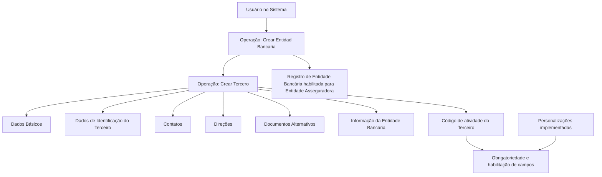

# Operação Criar Entidade Bancária — Registro de Entidades Bancárias para Entidade Asseguradora

## 1. Metadados do Documento
- **Arquivo de Origem:** Não identificado
- **Tipo de Documento:** Procedimento
- **Domínio / Sistema:** Operação de criação de Entidade Bancária / criação de Terceiro
- **Público-Alvo:** Usuários do sistema, Operação, Negócio
- **Data/Versão Identificada:** Não identificada

---

## 2. Resumo Executivo & Contexto de Negócio

O documento descreve a operação **“Crear Entidad Bancaria”**, destinada a registrar no sistema a relação de entidades bancárias habilitadas para uma Entidade Asseguradora. A criação da Entidade Bancária ocorre no contexto funcional de **“Crear Tercero”**.

A premissa explicitada é que Entidades Bancárias associadas à Entidade Asseguradora devem sempre ser criadas como **Pessoas Jurídicas**. O processo inclui o preenchimento de blocos de informação compartilhados e de informações específicas relacionadas à atividade do terceiro.

A obrigatoriedade e a habilitação dos campos podem variar conforme o código de atividade do Terceiro. Além disso, personalizações implementadas no sistema podem alterar o comportamento da aplicação em relação à obrigatoriedade dos Dados do Terceiro.

O documento também informa que a ordem de captura dos dados nos blocos de informação pode variar conforme o critério adotado pelo usuário no sistema. Não são detalhados contratos de integração, validações de campos individuais, métodos HTTP, URLs operacionais, tecnologias ou regras de persistência.

---

## 3. Arquitetura, Componentes & Tecnologias Envolvidas

Os componentes funcionais identificados são:

- **Sistema:** ambiente não nomeado no conteúdo extraído.
- **Operação “Crear Entidad Bancaria”:** operação para registrar Entidades Bancárias habilitadas.
- **Operação “Crear Tercero”:** estrutura de criação utilizada para registrar a Entidade Bancária.
- **Entidade Asseguradora:** organização para a qual as Entidades Bancárias habilitadas são registradas.
- **Terceiro:** entidade cadastral cuja atividade influencia a obrigatoriedade e habilitação dos campos.
- **Blocos de Informação Compartilhados:** Dados Básicos, Dados de Identificação do Terceiro, Contatos, Direções e Documentos Alternativos.
- **Bloco de Informação Específico:** Informação da Entidade Bancária.



> **Nota de Análise:** O conteúdo não identifica nome técnico do sistema, banco de dados, APIs, integrações, tecnologias, URLs, ambientes ou contratos de dados.

---

## 4. Regras de Negócio, Especificações Funcionais & Processos

### Regras de negócio identificadas

1. A operação **“Crear Entidad Bancaria”** permite registrar no sistema a relação de Entidades Bancárias habilitadas para uma Entidade Asseguradora.
2. Entidades Bancárias de uma Entidade Asseguradora devem sempre ser criadas como **Pessoas Jurídicas**.
3. A criação de uma Entidade Bancária utiliza blocos de informação compartilhados no processo **“Crear Tercero”**.
4. O registro deve incluir blocos de informação específicos conforme a atividade do Terceiro.
5. A obrigatoriedade e/ou habilitação de campos em cada bloco ou estrutura de informação compartilhada pode variar conforme o **código de atividade do Terceiro**.
6. Personalizações implementadas podem afetar o comportamento da aplicação quanto à obrigatoriedade de registro dos Dados do Terceiro.
7. A ordem de captura dos dados nos diferentes blocos de informação pode variar de acordo com o critério utilizado pelo usuário no sistema.

### Processo funcional identificado

1. O usuário inicia a operação **“Crear Entidad Bancaria”**.
2. A Entidade Bancária é criada no contexto de **“Crear Tercero”**.
3. O usuário registra informações nos blocos compartilhados:
   - Dados Básicos.
   - Dados de Identificação do Terceiro.
   - Contatos.
   - Direções.
   - Documentos Alternativos.
4. O usuário registra a **Informação da Entidade Bancária** como bloco específico relacionado à atividade do Terceiro.
5. A obrigatoriedade e a habilitação dos campos dependem do código de atividade do Terceiro e podem ser afetadas por personalizações existentes.

> **Nota de Análise:** O documento não descreve campos obrigatórios específicos, critérios de sucesso, mensagens de erro, validações de duplicidade, aprovação, exclusão, alteração ou consulta da Entidade Bancária.

---

## 5. Tabelas de Parâmetros, Ambientes e Estruturas de Dados

| Item / Parâmetro | Descrição / Função | Tipo / Valores / Formato | Ambiente / Observações |
| :--- | :--- | :--- | :--- |
| Operação | Criar Entidade Bancária | Operação funcional | Registra Entidades Bancárias habilitadas para a Entidade Asseguradora |
| Entidade Bancária | Entidade a ser registrada no sistema | Pessoa Jurídica | Deve sempre ser criada como Pessoa Jurídica |
| Entidade Asseguradora | Organização associada às Entidades Bancárias habilitadas | Entidade de negócio | Não há identificação nominal no conteúdo |
| Terceiro | Entidade cadastral criada no processo | Cadastro / terceiro | O código de atividade influencia campos disponíveis e obrigatórios |
| Código de atividade do Terceiro | Critério que pode alterar obrigatoriedade e habilitação de campos | Código não detalhado | Valores e formato não informados |
| Dados Básicos | Bloco de informação compartilhado | Estrutura de informação | Campos não detalhados |
| Dados de Identificação do Terceiro | Bloco de informação compartilhado | Estrutura de informação | Campos não detalhados |
| Contatos | Bloco de informação compartilhado | Estrutura de informação | Campos não detalhados |
| Direções | Bloco de informação compartilhado | Estrutura de informação | Campos não detalhados |
| Documentos Alternativos | Bloco de informação compartilhado | Estrutura de informação | Campos não detalhados |
| Informação da Entidade Bancária | Bloco de informação específico | Estrutura específica por atividade | Campos não detalhados |
| Personalizações | Implementações que podem afetar o comportamento da aplicação | Configuração ou customização não detalhada | Podem alterar obrigatoriedade dos Dados do Terceiro |
| Ordem de captura | Sequência de preenchimento dos blocos | Definida pelo usuário | Pode variar conforme o critério do usuário |

---

## 6. Bateria de Perguntas & Respostas para RAG (FAQ Sintético)

### P1: Qual é o objetivo da operação “Crear Entidad Bancaria”?
**R:** A operação “Crear Entidad Bancaria” permite registrar no sistema a relação de Entidades Bancárias habilitadas para uma Entidade Asseguradora.

### P2: Como uma Entidade Bancária deve ser cadastrada para uma Entidade Asseguradora?
**R:** As Entidades Bancárias de uma Entidade Asseguradora devem sempre ser criadas como Pessoas Jurídicas.

### P3: Em qual processo ocorre a criação de uma Entidade Bancária?
**R:** A criação da Entidade Bancária ocorre no processo “Crear Tercero”, utilizando blocos de informação compartilhados e um bloco específico de Informação da Entidade Bancária.

### P4: Quais blocos de informação compartilhados são apresentados para criar o Terceiro?
**R:** Os blocos apresentados são Dados Básicos, Dados de Identificação do Terceiro, Contatos, Direções e Documentos Alternativos.

### P5: Qual bloco específico deve ser preenchido para uma Entidade Bancária?
**R:** O bloco específico indicado é “Informação da Entidade Bancária”, apresentado como informação específica de acordo com a atividade do Terceiro.

### P6: O que influencia a obrigatoriedade e a habilitação dos campos no cadastro?
**R:** A obrigatoriedade e/ou habilitação dos campos nos blocos ou estruturas de informação compartilhadas pode variar de acordo com o código de atividade do Terceiro.

### P7: As personalizações do sistema podem alterar as regras de preenchimento?
**R:** Sim. O documento informa que personalizações implementadas podem afetar o comportamento da aplicação quanto à obrigatoriedade do registro dos Dados do Terceiro.

### P8: A ordem de preenchimento dos blocos de informação é fixa?
**R:** Não. A ordem de captura dos dados nos blocos de informação pode variar conforme o critério seguido pelo usuário no sistema.

### P9: O documento informa os campos obrigatórios da Informação da Entidade Bancária?
**R:** Não. O documento cita o bloco “Informação da Entidade Bancária”, mas não detalha os campos, formatos, regras de validação ou obrigatoriedade específica desse bloco.

### P10: O documento especifica APIs, URLs ou integrações para criar Entidades Bancárias?
**R:** Não. O conteúdo extraído não detalha métodos HTTP, contratos JSON, APIs, URLs, ambientes técnicos ou integrações relacionadas à operação.

---

## 7. Glossário de Termos, Siglas & Conceitos-Chave

- **Entidade Bancária:** entidade habilitada que pode ser registrada no sistema para uma Entidade Asseguradora.
- **Entidade Asseguradora:** organização para a qual é mantida a relação de Entidades Bancárias habilitadas.
- **Pessoa Jurídica:** classificação obrigatória para Entidades Bancárias criadas para a Entidade Asseguradora.
- **Terceiro:** entidade cadastral criada no processo “Crear Tercero”.
- **Código de atividade do Terceiro:** critério que pode determinar a obrigatoriedade e/ou habilitação de campos de informação.
- **Blocos de Informação Compartilhados:** estruturas de cadastro reutilizadas no processo “Crear Tercero”.
- **Informação da Entidade Bancária:** bloco de informação específico aplicável à atividade do Terceiro como Entidade Bancária.
- **Personalizações:** implementações que podem alterar o comportamento da aplicação em relação à obrigatoriedade de dados.

---

## 8. Notas Críticas, Riscos & Limitações

- O documento não identifica o sistema corporativo no qual a operação é executada.
- O conteúdo não informa campos, formatos, tipos de dados ou regras de validação para os blocos de informação.
- O código de atividade do Terceiro é citado como fator relevante, porém seus valores, catálogo e regras de associação não são apresentados.
- As personalizações podem alterar a obrigatoriedade dos Dados do Terceiro, mas o documento não detalha quais personalizações existem nem seus efeitos.
- Não há definição de tratamento de erros, regras de duplicidade, trilha de auditoria, permissões, perfis de acesso ou fluxo de aprovação.
- Não são apresentados detalhes técnicos sobre APIs, integrações, bancos de dados, URLs, ambientes, servidores ou logs.
- O conteúdo de “Processo” inclui referências textuais a “Inicio Soluciones APIs Documentación Zeus ES”, sem explicação adicional sobre sua função no procedimento.

---

## 9. Conteúdo Bruto Estruturado (Referência Fiel)

```text
--- [PÁGINA 1 DE 2] ---

OPERACIÓN CREAR Entidad Bancaria
¿En que consiste?
Esta operación permite registrar en el Sistema la relación de Entidades Bancarias habilitadas para
la Entidad Aseguradora.
Premisas
Las Entidades Bancarias de la Entidad Aseguradora siempre se crearán como Personas
Jurídicas.
La obligatoriedad y/o la habilitación de los campos en el registro de los datos de cada uno de
los bloques o estructuras de información compartidas puede variar de acuerdo con el código de
actividad del Tercero:
Las personalizaciones que se hubieran podido implementar a su vez pueden afectar el
comportamiento de la aplicación en relación con la obligatoriedad en el registro de los Datos del
Tercero.
Por último, el orden de captura de los datos en los distintos bloques de Información puede
variar de acuerdo con el criterio seguido por el Usuario en el Sistema.
Proceso
Ejemplo:
 /
 RS
Inicio Soluciones APIs Documentación Zeus
ES


--- [PÁGINA 2 DE 2] ---

CREAR
TERCERO
Crear Información de
la Entidad Bancaria
Bloques de Información Compartidos (CREAR TERCERO)
 Datos Básicos ( )
 Datos Identificación del Tercero ( )
 Contactos ( )
 Direcciones ( )
 Documentos Alternativos ( )
Bloques de Información Específicos de acuerdo con la
Actividad del Tercero.
 Información de la Entidad Bancaria ( )
```
