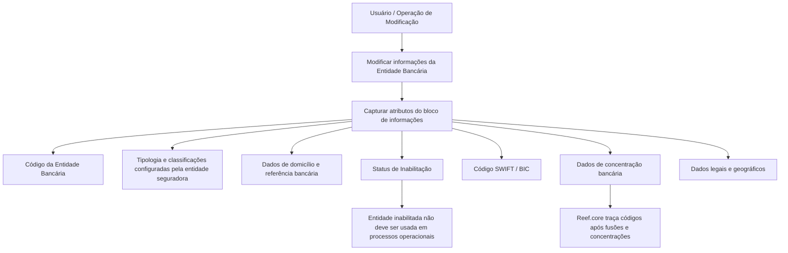

# Modificação e Inabilitação de Informações de Entidade Bancária no Reef.core

## 1. Metadados do Documento
- **Arquivo de Origem:** Não identificado no conteúdo fornecido
- **Tipo de Documento:** Especificação Funcional
- **Domínio / Sistema:** Reef.core; cadastro de Entidades Bancárias; entidade seguradora; MAPFRE
- **Público-Alvo:** Desenvolvedores, Arquitetos, Operação e Negócio
- **Data/Versão Identificada:** Não identificada

---

## 2. Resumo Executivo & Contexto de Negócio

O documento descreve a operação **“Modificar Información específica de la Entidad Bancaria”**, destinada à alteração de informações cadastrais de uma entidade bancária no sistema. A operação também permite a inabilitação da entidade bancária, evitando que uma entidade marcada como inabilitada seja utilizada, contemplada ou considerada em processos operacionais da entidade.

A especificação apresenta os atributos de uma entidade bancária e informa que a sequência de captura deve ser interpretada da esquerda para a direita e de cima para baixo no bloco de informações. Os atributos abrangem identificação, tipologia, dados de domicílio bancário, classificação institucional, referência, status de inabilitação, código SWIFT/BIC, dias adicionais para composição de data-valor, histórico de concentração bancária, data de constituição, nacionalidade e natureza jurídica.

O conteúdo também relaciona o cadastro bancário a configurações prévias realizadas pela entidade seguradora. A tipologia da entidade bancária, a classificação bancária e o tipo de empresa jurídica dependem de configurações existentes em catálogos correspondentes da entidade seguradora.

O Reef.core é explicitamente citado como o sistema que permite rastrear códigos de entidades bancárias após fusões e concentrações bancárias. Esse rastreamento é suportado pelo atributo **Entidad Compradora**, que registra o código da entidade absorvedora quando uma ou mais entidades tiverem sido absorvidas.

O código SWIFT/BIC é descrito como um identificador alfanumérico de 8 ou 11 caracteres para identificar o banco receptor de uma transferência internacional. O documento estabelece que a aplicação do código SWIFT/BIC ocorre somente em países fora da Zona SEPA, cuja composição territorial é listada no conteúdo original.

---

## 3. Arquitetura, Componentes & Tecnologias Envolvidas

Os elementos identificados são:

- **Reef.core:** sistema citado como responsável por traçar códigos de entidades bancárias ao longo de fusões e concentrações bancárias.
- **Operação de modificação de entidade bancária:** operação funcional para alterar informações específicas e inabilitar uma entidade bancária.
- **Entidade seguradora:** organização que realiza previamente configurações usadas por atributos como tipologia bancária, tipo de instituição bancária e tipo de empresa jurídica.
- **Entidade MAPFRE local:** entidade mencionada no contexto da definição do tipo de processo de domicílio bancário.
- **Entidade bancária:** objeto cadastral principal da operação.
- **Código SWIFT/BIC:** identificador utilizado para banco receptor de transferência internacional nos países aplicáveis.
- **Zona SEPA:** Zona Única de Pagos en Europa, usada como critério de aplicabilidade do código SWIFT/BIC.



> **Nota de Análise:** O documento não detalha interfaces, métodos HTTP, contratos JSON, banco de dados, autenticação, APIs, rotas técnicas, tecnologias de implementação ou ambientes de execução.

---

## 4. Regras de Negócio, Especificações Funcionais & Processos

### Operação habilitada

A operação permite modificar informações específicas da entidade bancária e também inabilitá-la.

Ações habilitadas apresentadas no documento:

- **MODIFICAR**
- **INHABILITAR**

### Sequência de captura

No bloco **Datos Entidad Bancaria**, os atributos seguem uma sequência de captura definida como:

1. Da esquerda para a direita.
2. De cima para baixo.

### Regras por atributo

1. **Código da Entidade Bancária**
   - Identifica a chave da entidade bancária no sistema.

2. **Tipologia da Entidade Bancária**
   - Contém a tipologia da entidade bancária.
   - A tipologia deve estar de acordo com uma configuração prévia realizada pela entidade seguradora.
   - A configuração é destinada à posterior exploração da informação.

3. **Tipo de Domiciliação Permitida**
   - Determina o tipo de processo de domicílio bancário que a entidade MAPFRE local prevê realizar com a entidade bancária.
   - O tipo de processo é definido de acordo com o acordo comercial pactuado entre as partes.

4. **Tipo de Instituição Bancária**
   - Identifica a classificação bancária atribuída à entidade bancária.
   - A classificação decorre de uma configuração prévia realizada pela entidade seguradora.

5. **Referência Bancária**
   - Contém a chave de referência da entidade bancária.

6. **Inabilitação**
   - Indica ao sistema que o Broker está inabilitado no sistema.
   - Quando inabilitado, o Broker não deve ser empregado, contemplado ou considerado nos processos operacionais da entidade.

> **Nota de Análise:** O documento associa o campo **Inhabilitación** a um “Broker”, embora o restante da especificação trate de uma entidade bancária. O conteúdo não esclarece se “Broker” é um termo genérico, uma inconsistência textual ou uma entidade distinta.

7. **Código SWIFT/BIC**
   - Contém o código SWIFT, sigla de *Society for Worldwide Interbank Financial Telecommunication*.
   - O código SWIFT também é denominado código BIC, sigla de *Bank Identifier Code*.
   - É uma série alfanumérica de 8 ou 11 dígitos.
   - É utilizado para identificar o banco receptor de uma transferência internacional.
   - Aplica-se somente em países que não pertencem à Zona SEPA.

8. **Critério territorial para SWIFT/BIC**
   - A Zona SEPA é apresentada como composta pelos 28 países da União Europeia, além de Liechtenstein, Islândia, Noruega, Andorra, Mônaco, San Marino, Suíça, Reino Unido e Cidade do Vaticano Estado.
   - Portanto, segundo o documento, o código SWIFT/BIC é aplicado somente fora desse conjunto territorial.

9. **Número de Dias Adicionais**
   - Contém a quantidade de dias considerada pela entidade bancária para formar a **FECHA VALOR** em operações financeiras.

10. **Entidade Compradora**
    - Contém o código da entidade bancária compradora.
    - É utilizado quando houver concentração bancária e uma entidade absorver uma ou mais entidades.
    - Permite ao Reef.core rastrear os códigos das entidades de acordo com fusões e concentrações ocorridas durante sua existência.

11. **Data de Constituição**
    - Contém a data em que a entidade bancária foi legalmente constituída no país em que opera.

12. **Nacionalidade**
    - Contém a chave do primeiro nível da estrutura geográfica.
    - Essa chave corresponde ao país de procedência da entidade bancária.

13. **Tipo de Empresa Jurídica**
    - Estabelece a tipologia da empresa.
    - A tipologia depende de configuração expressa e prévia da entidade seguradora no catálogo correspondente.

---

## 5. Tabelas de Parâmetros, Ambientes e Estruturas de Dados

| Item / Parâmetro | Descrição / Função | Tipo / Valores / Formato | Ambiente / Observações |
| :--- | :--- | :--- | :--- |
| Operação | Modifica informações específicas da entidade bancária e permite inabilitá-la. | Ações: `MODIFICAR` e `INHABILITAR`. | Sistema não detalhado além da referência ao Reef.core. |
| Código da Entidade Bancária | Identifica a chave da entidade bancária no sistema. | Código/chave; formato não informado. | Integrante do bloco Dados Entidade Bancária. |
| Tipologia da Entidade Bancária | Armazena a tipologia bancária para posterior exploração. | Valor configurado previamente. | Configuração prévia da entidade seguradora. |
| Tipo de Domiciliação Permitida | Determina o processo de domicílio bancário previsto entre entidade MAPFRE local e entidade bancária. | Tipo de processo; valores não informados. | Depende do acordo comercial pactuado entre as partes. |
| Tipo de Instituição Bancária | Identifica a classificação bancária da entidade. | Classificação configurada previamente. | Configuração prévia da entidade seguradora. |
| Referência Bancária | Contém a chave de referência da entidade bancária. | Chave; formato não informado. | Sem detalhamento adicional. |
| Inabilitação | Indica que o Broker está inabilitado no sistema. | Indicador; valores não informados. | Entidade inabilitada não deve ser empregada, contemplada ou considerada nos processos operacionais. |
| Código SWIFT | Identifica o banco receptor de uma transferência internacional. | Série alfanumérica de 8 ou 11 dígitos. | Aplica-se apenas a países fora da Zona SEPA. |
| Código BIC | Denominação alternativa para o código SWIFT. | Série alfanumérica de 8 ou 11 dígitos. | *Bank Identifier Code*. |
| Número de Dias Adicionais | Define a quantidade de dias considerada para formar a FECHA VALOR. | Número de dias; formato numérico não detalhado. | Operações financeiras da entidade bancária. |
| Entidade Compradora | Registra o código da entidade bancária compradora após processo de concentração bancária. | Código; formato não informado. | Reef.core utiliza o dado para rastrear entidades em fusões e concentrações. |
| Data de Constituição | Registra a data de constituição legal da entidade bancária. | Data; formato não informado. | País em que a entidade bancária está operando. |
| Nacionalidade | Registra a chave do primeiro nível geográfico correspondente ao país de procedência. | Chave geográfica; formato não informado. | Relacionada ao país de origem da entidade bancária. |
| Tipo de Empresa Jurídica | Define a tipologia da empresa. | Tipologia configurada previamente. | Requer catálogo correspondente da entidade seguradora. |
| Zona SEPA | Zona usada como critério para aplicação do código SWIFT/BIC. | 28 países da União Europeia e territórios listados no documento. | Inclui Liechtenstein, Islândia, Noruega, Andorra, Mônaco, San Marino, Suíça, Reino Unido e Cidade do Vaticano Estado. |

---

## 6. Bateria de Perguntas & Respostas para RAG (FAQ Sintético)

### P1: Qual é o objetivo da operação de modificação de entidade bancária?
**R:** A operação permite modificar informações específicas de uma entidade bancária e também inabilitá-la. As ações habilitadas apresentadas são `MODIFICAR` e `INHABILITAR`.

### P2: Como deve ser seguida a sequência de captura dos dados da entidade bancária?
**R:** O documento determina que, no bloco Dados Entidade Bancária, os atributos devem seguir a sequência da esquerda para a direita e de cima para baixo.

### P3: O que identifica o Código da Entidade Bancária?
**R:** O Código da Entidade Bancária identifica a chave da entidade bancária no sistema. O documento não informa o formato técnico, tamanho ou regras de validação desse código.

### P4: De onde vêm os valores para Tipologia da Entidade Bancária e Tipo de Instituição Bancária?
**R:** Ambos dependem de configurações prévias realizadas pela entidade seguradora. A tipologia é armazenada para posterior exploração, enquanto o tipo de instituição identifica a classificação bancária atribuída à entidade.

### P5: Como é definido o Tipo de Domiciliação Permitida?
**R:** O Tipo de Domiciliação Permitida determina o tipo de processo de domicílio bancário que a entidade MAPFRE local pretende realizar com a entidade bancária, de acordo com o acordo comercial pactuado entre as partes.

### P6: Qual é o efeito operacional da inabilitação?
**R:** O campo de inabilitação informa ao sistema que o Broker está inabilitado. Quando estiver inabilitado, não deve ser empregado, contemplado ou considerado nos processos operacionais da entidade. O documento não esclarece a relação terminológica entre Broker e entidade bancária.

### P7: Quando o código SWIFT/BIC deve ser aplicado?
**R:** Segundo o documento, o código SWIFT/BIC deve ser aplicado unicamente em países que não pertencem à Zona SEPA. O código identifica o banco receptor de uma transferência internacional.

### P8: Qual formato o código SWIFT/BIC possui?
**R:** O documento define o código SWIFT/BIC como uma série alfanumérica de 8 ou 11 dígitos. SWIFT significa *Society for Worldwide Interbank Financial Telecommunication* e BIC significa *Bank Identifier Code*.

### P9: Para que serve o Número de Dias Adicionais?
**R:** O Número de Dias Adicionais contém a quantidade de dias que a entidade bancária considera para compor a FECHA VALOR em suas operações financeiras.

### P10: Como o Reef.core trata fusões e concentrações bancárias?
**R:** O atributo Entidade Compradora registra o código da entidade bancária compradora quando ocorre um processo de concentração bancária e uma entidade absorve uma ou mais entidades. Dessa forma, o Reef.core pode rastrear os códigos das entidades ao longo de fusões e concentrações.

### P11: O que representa o campo Nacionalidade?
**R:** O campo Nacionalidade contém a chave do primeiro nível da estrutura geográfica correspondente ao país de procedência da entidade bancária.

### P12: Como é determinado o Tipo de Empresa Jurídica?
**R:** O Tipo de Empresa Jurídica estabelece a tipologia da empresa conforme uma configuração expressa e prévia da entidade seguradora no catálogo correspondente.

---

## 7. Glossário de Termos, Siglas & Conceitos-Chave

- **BIC:** *Bank Identifier Code*; denominação alternativa para o código SWIFT.
- **Broker:** Termo usado no campo Inabilitação para indicar o elemento que pode ser marcado como inabilitado. O documento não esclarece sua relação com a entidade bancária.
- **Código SWIFT:** Código alfanumérico de 8 ou 11 dígitos utilizado para identificar o banco receptor de uma transferência internacional.
- **Entidad Compradora:** Entidade bancária que absorve uma ou mais entidades em um processo de concentração bancária.
- **Entidad MAPFRE local:** Entidade mencionada como participante do processo de domicílio bancário com a entidade bancária.
- **Entidade seguradora:** Organização responsável pelas configurações prévias de tipologias, classificações e catálogos mencionados na especificação.
- **FECHA VALOR:** Data-valor formada considerando o número de dias adicionais contemplados pela entidade bancária em operações financeiras.
- **Reef.core:** Sistema citado como responsável por rastrear códigos de entidades bancárias em cenários de fusões e concentrações.
- **SEPA:** Zona Única de Pagos en Europa; conjunto territorial usado pelo documento para delimitar a aplicabilidade do código SWIFT/BIC.
- **SWIFT:** *Society for Worldwide Interbank Financial Telecommunication*.
- **Tipo de Domiciliação Permitida:** Tipo de processo de domicílio bancário definido conforme acordo comercial entre a entidade MAPFRE local e a entidade bancária.

---

## 8. Notas Críticas, Riscos & Limitações

- O documento não identifica nome de arquivo, autor, data, versão ou aprovação.
- Não há detalhamento de telas, campos obrigatórios, tipos de dados, tamanhos máximos, formatos de data, valores permitidos, mensagens de erro ou validações de entrada.
- Não são descritos métodos HTTP, APIs, contratos JSON, eventos, integrações técnicas, autenticação, autorização, persistência de dados ou ambientes.
- O campo **Inhabilitación** menciona que “o Broker” fica inabilitado, enquanto o documento descreve a manutenção de entidades bancárias. A ambiguidade não é resolvida pelo conteúdo original.
- O documento apresenta marcadores de exemplos para SWIFT/BIC, mas nenhum exemplo concreto está disponível no texto fornecido.
- A referência aos “28 países da União Europeia” e aos territórios adicionais deve ser interpretada como conteúdo do documento; não há atualização normativa ou temporal indicada.
- Não há detalhamento adicional sobre como o Reef.core executa o rastreamento de códigos após fusões e concentrações bancárias.

---

## 9. Conteúdo Bruto Estruturado (Referência Fiel)

```text
--- [PÁGINA 1 DE 3] ---

MODIFICAR Información específica de la
Entidad Bancaria
Objetivo
Esta Operación permite Modificar la información de la Entidad Bancaria además de poder
Inhabilitarla.
Acciones habilitadas
 MODIFICAR ( )
 INHABILITAR ( )
Datos Entidad Bancaria
De Izquierda a Derecha y de Arriba hacia Abajo, los siguientes atributos marcan la secuencia de
captura en este Bloque de Información.
Código de la Entidad Bancaria
Este Campo identifica la clave de la entidad Bancaria en el Sistema.
 / 
 RS
Inicio Soluciones APIs Documentación Zeus
ES


--- [PÁGINA 2 DE 3] ---

Tipología de la Entidad Bancaria (  )
Este dato contiene la tipología de la entidad bancaria, de acuerdo con la configuración previa que
haya realizado la entidad aseguradora, para su posterior explotación.
Tipo de Domiciliación Permitida (  )
Este dato determina el tipo de proceso de domiciliación bancaria que la entidad MAPFRE local
contempla realizar con la entidad bancaria de acuerdo con el acuerdo comercial pactado entre
ambas partes.
Tipo de Institución Bancaria (  )
Este campo identifica la clasificación bancaria que se otorga a la entidad bancaria de acuerdo con la
configuración previa que haya realizado la Entidad Aseguradora:
Referencia Bancaria ( )
Este campo contiene la clave de referencia de la entidad bancaria.
Inhabilitación ( )
Este campo le indica al Sistema que el Broker está inhabilitado en el Sistema por lo cual, de estarlo,
no debería ser empleado, contemplado o considerado en los procesos operativos de la entidad.
Código SWIFT ( )
Este atributo contiene el código SWIFT (acrónimo de Society for Worldwide Interbank Financial
Telecommunication), también denominado código BIC (Bank Identifier Code), que no es sino una
serie alfanumérica de 8 u 11 dígitos que se utiliza para identificar al banco receptor de una
transferencia internacional.
¿Cuándo se aplica el código SWIFT / BIC?
El código SWIFT / BIC se aplica únicamente en aquellos países que no pertenecen a la Zona SEPA
(o Zona única de Pagos en Europa) comprendida por los 28 países de la Unión Europea, además de
Liechtenstein, Islandia, Noruega, Andorra, Mónaco, San Marino, Suiza, Reino Unido y Ciudad del
Vaticano Estado.
Ejemplo:
Ejemplo:
Ejemplo:


--- [PÁGINA 3 DE 3] ---

Número de Días Adicionales ( )
Este Campo contiene el número de días que la entidad bancaria contempla para conformar la
'FECHA VALOR' en sus operaciones financieras.
Entidad Compradora ( )
Este campo contiene el código de la entidad bancaria compradora en el supuesto que haya existido
un proceso de concentración bancario y una entidad haya absorbido una u otras entidades
bancarias. De esta manera Reef.core permite trazar los códigos de las Entidades de acuerdo a las
fusiones y concentraciones por las que pasen a lo largo de su existencia.
Fecha de Constitución ( )
Este atributo contiene la fecha en la que se constituyó legalmente la entidad bancaria en el país en el
que está operando.
Nacionalidad ( )
Este atributo contiene la clave del primer nivel de la estructura geográfica que corresponde al país
de procedencia de la entidad bancaria.
Tipo de Empresa Jurídica ( )
Este Dato establece la tipología de la Empresa de acuerdo con la configuración expresa que la
Entidad Aseguradora haya realizado previamente en el catálogo correspondiente.
```
