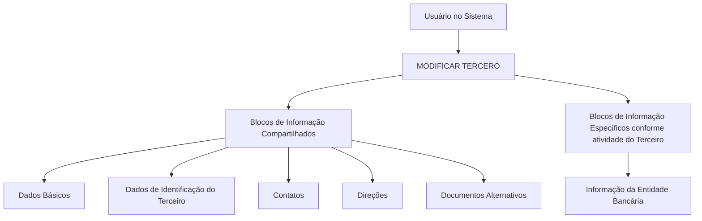

# Operação Modificar Entidade Bancária — Estruturas de Informação de Terceiros

## 1. Metadados do Documento
- **Arquivo de Origem:** Não identificado
- **Tipo de Documento:** Procedimento
- **Domínio / Sistema:** Operação **MODIFICAR TERCERO**; Entidade Bancária; Zeus
- **Público-Alvo:** Usuários do sistema; Operação
- **Data/Versão Identificada:** Não identificada

---

## 2. Resumo Executivo & Contexto de Negócio

O documento descreve a operação **MODIFICAR Entidad Bancaria**, destinada a complementar, modificar e/ou inabilitar informações de uma Entidade Bancária nas estruturas de dados que armazenam e agrupam essas informações.

A operação está inserida no contexto de **MODIFICAR TERCERO**, no qual existem blocos de informação compartilhados e blocos de informação específicos conforme a atividade do Terceiro. A informação da Entidade Bancária é apresentada como um bloco específico associado à atividade do Terceiro.

A obrigatoriedade e a habilitação de campos podem variar conforme o código de atividade do Terceiro. Personalizações previamente implementadas também podem alterar o comportamento da aplicação em relação à obrigatoriedade de preenchimento dos dados do Terceiro.

O documento informa ainda que a ordem de captura dos dados nos blocos de informação pode variar conforme o critério seguido pelo usuário no sistema. Não são detalhados campos, regras de validação, contratos de API, permissões, integrações ou critérios de inabilitação.

---

## 3. Arquitetura, Componentes & Tecnologias Envolvidas

Os elementos identificados no conteúdo são:

| Componente / Elemento | Papel descrito |
| :--- | :--- |
| MODIFICAR TERCERO | Operação que agrupa blocos de informação compartilhados e específicos. |
| Informação da Entidade Bancária | Bloco de informação específico de acordo com a atividade do Terceiro. |
| Dados Básicos | Bloco de informação compartilhado em MODIFICAR TERCERO. |
| Dados de Identificação do Terceiro | Bloco de informação compartilhado em MODIFICAR TERCERO. |
| Contatos | Bloco de informação compartilhado em MODIFICAR TERCERO. |
| Endereços | Bloco de informação compartilhado em MODIFICAR TERCERO. |
| Documentos Alternativos | Bloco de informação compartilhado em MODIFICAR TERCERO. |
| Zeus | Nome exibido no exemplo de navegação/documentação. |
| Soluções / APIs / Documentação | Termos exibidos no exemplo de navegação. |



> **Nota de Análise:** O documento não apresenta arquitetura técnica, interfaces, protocolos, métodos HTTP, contratos JSON, bancos de dados ou relações de integração entre componentes.

---

## 4. Regras de Negócio, Especificações Funcionais & Processos

1. A operação **MODIFICAR Entidad Bancaria** permite complementar, modificar e/ou inabilitar a informação de uma Entidade Bancária.
2. A informação da Entidade Bancária pode estar presente em estruturas de dados que a contêm e agrupam.
3. A obrigatoriedade dos campos no registro de dados de cada bloco ou estrutura compartilhada pode variar conforme o código de atividade do Terceiro.
4. A habilitação dos campos no registro de dados de cada bloco ou estrutura compartilhada pode variar conforme o código de atividade do Terceiro.
5. Personalizações implementadas podem afetar o comportamento da aplicação referente à obrigatoriedade no preenchimento dos Dados do Terceiro.
6. A ordem de captura dos dados nos diferentes blocos de informação pode variar conforme o critério adotado pelo usuário no sistema.
7. Em **MODIFICAR TERCERO**, a Informação da Entidade Bancária é apresentada como bloco de informação específico de acordo com a atividade do Terceiro.
8. Os blocos compartilhados listados são: Dados Básicos, Dados de Identificação do Terceiro, Contatos, Direções e Documentos Alternativos.

> **Nota de Análise:** O documento não detalha quais campos compõem a Informação da Entidade Bancária, quais códigos de atividade alteram os campos, nem quais condições efetivamente inabilitam uma Entidade Bancária.

---

## 5. Tabelas de Parâmetros, Ambientes e Estruturas de Dados

| Item / Parâmetro | Descrição / Função | Tipo / Valores / Formato | Ambiente / Observações |
| :--- | :--- | :--- | :--- |
| Operação MODIFICAR Entidad Bancaria | Complementar, modificar e/ou inabilitar informações de Entidade Bancária. | Operação funcional | Inserida no contexto de MODIFICAR TERCERO. |
| Código de atividade do Terceiro | Pode determinar obrigatoriedade e habilitação de campos. | Código não detalhado | Valores não informados. |
| Personalizações implementadas | Podem afetar a obrigatoriedade de registro dos Dados do Terceiro. | Personalização não detalhada | Não são identificadas personalizações específicas. |
| Ordem de captura dos dados | Pode variar entre os blocos de informação. | Critério definido pelo usuário | Não há ordem fixa descrita. |
| Dados Básicos | Bloco compartilhado de MODIFICAR TERCERO. | Estrutura de informação | Campos não detalhados. |
| Dados de Identificação do Terceiro | Bloco compartilhado de MODIFICAR TERCERO. | Estrutura de informação | Campos não detalhados. |
| Contatos | Bloco compartilhado de MODIFICAR TERCERO. | Estrutura de informação | Campos não detalhados. |
| Direções | Bloco compartilhado de MODIFICAR TERCERO. | Estrutura de informação | Campos não detalhados. |
| Documentos Alternativos | Bloco compartilhado de MODIFICAR TERCERO. | Estrutura de informação | Campos não detalhados. |
| Informação da Entidade Bancária | Bloco específico conforme atividade do Terceiro. | Estrutura de informação específica | Campos e regras não detalhados. |
| Zeus | Referência exibida no exemplo. | Nome próprio / sistema não detalhado | Relação técnica não especificada. |

---

## 6. Bateria de Perguntas & Respostas para RAG (FAQ Sintético)

### P1: Em que consiste a operação MODIFICAR Entidad Bancaria?
**R:** A operação consiste em complementar, modificar e/ou inabilitar a informação da Entidade Bancária em qualquer estrutura de dados que contenha e agrupe essa informação.

### P2: A operação MODIFICAR Entidad Bancaria faz parte de qual processo?
**R:** A operação é apresentada no contexto de **MODIFICAR TERCERO**, que contém blocos de informação compartilhados e blocos específicos conforme a atividade do Terceiro.

### P3: Quais ações podem ser executadas sobre a informação da Entidade Bancária?
**R:** O documento informa três ações possíveis: complementar, modificar e inabilitar a informação da Entidade Bancária.

### P4: O código de atividade do Terceiro influencia o preenchimento dos dados?
**R:** Sim. A obrigatoriedade e/ou a habilitação dos campos no registro de dados de cada bloco ou estrutura de informação compartilhada pode variar conforme o código de atividade do Terceiro.

### P5: Personalizações podem alterar a obrigatoriedade de campos?
**R:** Sim. Personalizações que tenham sido implementadas podem afetar o comportamento da aplicação quanto à obrigatoriedade do registro dos Dados do Terceiro.

### P6: Existe uma ordem obrigatória para capturar dados nos blocos de informação?
**R:** Não há uma ordem fixa descrita. O documento indica que a ordem de captura de dados nos diferentes blocos pode variar conforme o critério seguido pelo usuário no sistema.

### P7: Quais são os blocos de informação compartilhados em MODIFICAR TERCERO?
**R:** Os blocos listados são: Dados Básicos, Dados de Identificação do Terceiro, Contatos, Direções e Documentos Alternativos.

### P8: A Informação da Entidade Bancária é um bloco compartilhado?
**R:** Não. O documento apresenta a Informação da Entidade Bancária como um bloco de informação específico, de acordo com a atividade do Terceiro.

### P9: O documento informa os campos que compõem a Informação da Entidade Bancária?
**R:** Não. O documento apenas identifica a Informação da Entidade Bancária como um bloco específico; não detalha campos, formatos, obrigatoriedade individual ou validações.

### P10: O documento detalha APIs ou contratos de integração para a operação?
**R:** Não. Embora o exemplo apresente os termos “Soluções”, “APIs”, “Documentação” e “Zeus”, não há métodos HTTP, endpoints, contratos JSON, autenticação ou especificações de integração.

---

## 7. Glossário de Termos, Siglas & Conceitos-Chave

- **MODIFICAR Entidad Bancaria:** Operação para complementar, modificar e/ou inabilitar dados da Entidade Bancária.
- **MODIFICAR TERCERO:** Contexto operacional que agrupa blocos de informação compartilhados e específicos relativos ao Terceiro.
- **Terceiro:** Entidade cujos dados são registrados nos blocos de informação citados.
- **Entidade Bancária:** Entidade cuja informação pode ser complementada, modificada ou inabilitada.
- **Blocos de Informação Compartilhados:** Estruturas listadas em MODIFICAR TERCERO, incluindo Dados Básicos, Identificação, Contatos, Direções e Documentos Alternativos.
- **Blocos de Informação Específicos:** Estruturas que dependem da atividade do Terceiro; a Informação da Entidade Bancária é apresentada nessa categoria.
- **Zeus:** Nome exibido no exemplo do documento, sem detalhamento de função.
- **APIs:** Termo exibido no exemplo de navegação, sem detalhamento técnico adicional.

---

## 8. Notas Críticas, Riscos & Limitações

- O documento não identifica o arquivo de origem, data, versão ou responsável.
- Não há detalhamento dos campos da Informação da Entidade Bancária.
- Não são apresentados códigos de atividade do Terceiro nem o efeito de cada código sobre obrigatoriedade ou habilitação.
- As personalizações que podem alterar o comportamento da aplicação não são identificadas.
- Não há critérios técnicos, funcionais ou operacionais para inabilitar uma Entidade Bancária.
- Não são informados perfis de acesso, permissões, trilha de auditoria, mensagens de erro ou validações.
- A menção a Zeus, Soluções, APIs e Documentação não contém descrição de integração ou arquitetura técnica.

---

## 9. Conteúdo Bruto Estruturado (Referência Fiel)

```text
--- [PÁGINA 1 DE 2] ---

OPERACIÓN MODIFICAR Entidad Bancaria
¿En que consiste?
Esta operación consiste en Complementar, Modificar y/o Inhabilitar la información de la Entidad
Bancaria en cualquiera de las estructuras de datos que la contienen y agrupan.
Premisas
La obligatoriedad y/o la habilitación de los campos en el registro de los datos de cada uno de
los bloques o estructuras de información compartidas puede variar de acuerdo con el código de
actividad del Tercero:
Las personalizaciones que se hubieran podido implementar a su vez pueden afectar el
comportamiento de la aplicación en relación con la obligatoriedad en el registro de los Datos del
Tercero.
Por último, el orden de captura de los datos en los distintos bloques de Información puede
variar de acuerdo con el criterio seguido por el Usuario en el Sistema.
Proceso
Ejemplo:
 /
 RS
Inicio Soluciones APIs Documentación Zeus
ES


--- [PÁGINA 2 DE 2] ---

MODIFICAR
TERCERO
Modificar Información
de la Entidad Bancaria
Bloques de Información Compartidos (MODIFICAR TERCERO)
 Datos Básicos ( )
 Datos Identificación Tercero ( )
 Contactos (   )
 Direcciones (   )
 Documentos Alternativos (   )
Bloques de Información Específicos de acuerdo con la
Actividad del Tercero.
 Información de la Entidad Bancaria (  )
```
