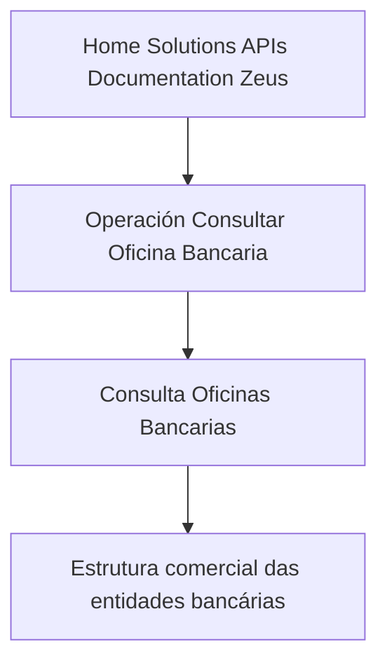

# Operación Consultar Oficina Bancaria — Documentação Zeus

## 1. Metadados do Documento
- **Arquivo de Origem:** Não identificado
- **Tipo de Documento:** Não identificado; o conteúdo indica documentação de API
- **Domínio / Sistema:** Zeus / Home Solutions APIs Documentation
- **Público-Alvo:** Não identificado
- **Data/Versão Identificada:** Não identificada

---

## 2. Resumo Executivo & Contexto de Negócio

O conteúdo descreve a operação **“Consultar Oficina Bancaria”**, destinada à consulta de escritórios/agências bancárias conforme a estrutura comercial das entidades bancárias.

A referência disponível associa a operação ao ambiente ou portal **Home Solutions APIs Documentation Zeus**. O texto também apresenta os identificadores ou elementos `CF` e `EN`, sem explicitar seus significados funcionais.

Não há detalhamento sobre contrato de API, métodos HTTP, parâmetros de entrada, estrutura de resposta, autenticação, URL de endpoint, regras de validação ou tratamento de erros. Portanto, a finalidade operacional identificável limita-se à consulta de oficinas bancárias.

---

## 3. Arquitetura, Componentes & Tecnologias Envolvidas

Componentes e termos citados:

| Componente / Termo | Descrição sustentada pelo conteúdo |
| :--- | :--- |
| Operación Consultar Oficina Bancaria | Operação para consulta de oficinas bancárias. |
| Oficinas Bancarias | Entidades consultadas pela operação. |
| Estrutura comercial | Critério pelo qual a consulta de oficinas bancárias é realizada. |
| Home Solutions APIs Documentation | Área ou documentação mencionada no conteúdo. |
| Zeus | Termo associado à documentação de APIs. |
| CF | Sigla ou identificador citado sem detalhamento. |
| EN | Sigla ou identificador citado sem detalhamento. |



**Nota de Análise:** O conteúdo não detalha componentes técnicos, integrações, microsserviços, protocolos, rotas, métodos HTTP ou tecnologias de implementação.

---

## 4. Regras de Negócio, Especificações Funcionais & Processos

1. A operação é denominada **“Consultar Oficina Bancaria”**.
2. A operação realiza a consulta de **Oficinas Bancarias**.
3. A consulta ocorre de acordo com a **estrutura comercial das entidades bancárias**.
4. O conteúdo faz referência a **Home Solutions APIs Documentation Zeus**.
5. Os elementos `CF` e `EN` estão presentes no texto, mas não possuem definição ou contexto adicional.

**Nota de Análise:** Não foram fornecidas regras de elegibilidade, filtros de consulta, critérios de ordenação, campos retornados, regras de acesso, mensagens de erro ou fluxo operacional detalhado.

---

## 5. Tabelas de Parâmetros, Ambientes e Estruturas de Dados

| Item / Parâmetro | Descrição / Função | Tipo / Valores / Formato | Ambiente / Observações |
| :--- | :--- | :--- | :--- |
| Operación Consultar Oficina Bancaria | Nome da operação documentada. | Texto | Relacionada à consulta de oficinas bancárias. |
| Oficinas Bancarias | Objeto da consulta. | Não especificado | Consultadas conforme a estrutura comercial das entidades bancárias. |
| Estrutura comercial | Critério de referência para a consulta. | Não especificado | Associada às entidades bancárias. |
| Home Solutions APIs Documentation | Referência à documentação de APIs. | Texto | Associada ao termo Zeus. |
| Zeus | Termo citado na documentação. | Texto | Não há detalhamento técnico adicional. |
| CF | Sigla ou identificador citado. | Texto | Significado não identificado. |
| EN | Sigla ou identificador citado. | Texto | Significado não identificado. |

---

## 6. Bateria de Perguntas & Respostas para RAG (FAQ Sintético)

### P1: Qual é a finalidade da operação “Consultar Oficina Bancaria”?
**R:** A operação “Consultar Oficina Bancaria” é destinada à consulta de oficinas bancárias de acordo com a estrutura comercial das entidades bancárias.

### P2: O que é consultado pela operação documentada?
**R:** A operação consulta oficinas bancárias, denominadas no conteúdo como “Oficinas Bancarias”.

### P3: Qual critério orienta a consulta de oficinas bancárias?
**R:** A consulta é realizada de acordo com a estrutura comercial das entidades bancárias.

### P4: O documento informa o método HTTP da operação?
**R:** Não. O conteúdo disponível não informa método HTTP, como GET, POST, PUT ou DELETE.

### P5: O documento apresenta a URL ou rota da API?
**R:** Não. Não há URL, endpoint ou rota de API informada no conteúdo.

### P6: A documentação descreve parâmetros de entrada para consultar uma oficina bancária?
**R:** Não. O texto não detalha parâmetros de entrada, formatos, obrigatoriedade ou exemplos de requisição.

### P7: A documentação define o formato da resposta da operação?
**R:** Não. Não foram apresentados campos de resposta, contratos JSON, códigos de retorno ou exemplos de payload.

### P8: Qual sistema ou contexto de documentação é mencionado?
**R:** O conteúdo menciona “Home Solutions APIs Documentation Zeus” como referência de documentação associada à operação.

### P9: O que significam as siglas CF e EN?
**R:** O documento contém os termos `CF` e `EN`, mas não fornece seus significados ou papéis no contexto da operação.

### P10: Há informações sobre autenticação, autorização ou segurança da API?
**R:** Não. O conteúdo não descreve mecanismos de autenticação, autorização, credenciais ou políticas de segurança.

---

## 7. Glossário de Termos, Siglas & Conceitos-Chave

- **Oficina Bancaria:** Escritório ou agência bancária consultada pela operação.
- **Estrutura comercial:** Estrutura das entidades bancárias usada como referência para a consulta de oficinas bancárias.
- **Zeus:** Termo associado à referência “Home Solutions APIs Documentation Zeus”; não possui definição adicional no conteúdo.
- **CF:** Sigla ou identificador citado sem expansão ou definição.
- **EN:** Sigla ou identificador citado sem expansão ou definição.
- **Home Solutions APIs Documentation:** Referência textual a uma documentação de APIs.

---

## 8. Notas Críticas, Riscos & Limitações

- O arquivo de origem não foi identificado no conteúdo fornecido.
- Não há data, versão, autor, público-alvo ou histórico de alterações.
- Não há método HTTP, endpoint, contrato de entrada, contrato de resposta ou códigos de erro.
- Não há informações sobre autenticação, autorização, observabilidade, logs, SLA ou ambientes.
- As siglas `CF` e `EN` não são definidas.
- Não é possível inferir tecnologias, arquitetura de integração ou dependências sem introduzir informação não sustentada pelo documento.

---

## 9. Conteúdo Bruto Estruturado (Referência Fiel)

```text
--- [PÁGINA 1 DE 1] ---

OPERACIÓN CONSULTAR Oficina Bancaria
Consulta de las Oficinas Bancarias de acuerdo con la estructura comercial de las entidades
bancarias.
 / 
 CF
Home Solutions APIs Documentation Zeus
EN
```
