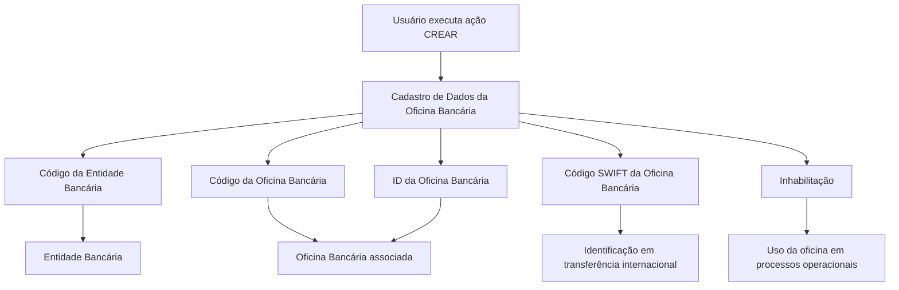

# Cadastro de Informações Específicas de Oficina Bancária

## 1. Metadados do Documento
- **Arquivo de Origem:** Não identificado
- **Tipo de Documento:** Especificação Funcional
- **Domínio / Sistema:** Cadastro de Oficinas Bancárias
- **Público-Alvo:** Negócio, Operação, Desenvolvedores
- **Data/Versão Identificada:** Não identificada

---

## 2. Resumo Executivo & Contexto de Negócio

O documento descreve o processo de criação de informações específicas de uma Oficina Bancária. O objetivo declarado é registrar dados operacionais das oficinas bancárias e classificá-las adequadamente para permitir consulta e exploração posterior das informações.

A estrutura de dados apresentada associa uma oficina a uma Entidade Bancária por meio do Código da Entidade Bancária. A Oficina Bancária também possui um código identificador próprio e um identificador interno alinhado à configuração territorial utilizada pela entidade bancária.

O documento prevê o registro do código SWIFT da Oficina Bancária para identificação do banco e da oficina receptora em transferências internacionais. A especificação diferencia o código SWIFT aplicável à oficina central daquele aplicável a uma sucursal específica.

Também existe o atributo de Inhabilitação, utilizado para indicar que a Oficina Bancária não deve ser empregada, contemplada ou considerada em processos operacionais quando o estado da oficina for relevante.

---

## 3. Arquitetura, Componentes & Tecnologias Envolvidas

Os elementos funcionais identificados são:

- **Estrutura de Dados de Oficina Bancária:** estrutura usada para registrar e classificar informações operacionais.
- **Entidade Bancária:** banco ao qual a Oficina Bancária é associada.
- **Oficina Bancária:** sucursal bancária cadastrada.
- **Código SWIFT:** código usado para identificar banco e oficina receptora em transferências internacionais.
- **Sistema:** componente não nomeado que interpreta o atributo de Inhabilitação nos processos operacionais.



> **Nota de Análise:** O documento não identifica tecnologias, APIs, métodos HTTP, bancos de dados, ambientes, integrações técnicas ou contratos JSON.

---

## 4. Regras de Negócio, Especificações Funcionais & Processos

1. A ação habilitada no documento é **CREAR**.
2. O registro de dados da Oficina Bancária atende à necessidade de identificar e detalhar informações de âmbito operativo das Oficinas Bancárias.
3. As Oficinas Bancárias devem ser classificadas adequadamente para permitir consulta e exploração posterior.
4. Os atributos devem ser capturados na sequência indicada, da esquerda para a direita e de cima para baixo.
5. O **Código da Entidade Bancária** contém a chave do banco ao qual será associada a sucursal bancária em definição.
6. O **Código da Oficina Bancária** é a chave utilizada para identificar a sucursal bancária associada ao Código da Entidade Bancária previamente capturado.
7. O **ID da Oficina Bancária** contém o código interno da Oficina Bancária segundo a configuração da estrutura territorial própria da Entidade Bancária.
8. O **Código SWIFT da Oficina Bancária** registra o código utilizado para identificar o banco e a oficina receptora de uma transferência internacional.
9. SWIFT é o acrônimo de **Society for Worldwide Interbank Financial Telecommunication**.
10. Os três últimos dígitos do código SWIFT são opcionais.
11. Quando presentes, os três últimos dígitos do código SWIFT fazem referência à sucursal em que se encontra uma conta específica.
12. Quando os três últimos dígitos não estiverem presentes, entende-se que a conta pertence à oficina central do banco.
13. Para uma conta pertencente à oficina central, o código SWIFT considerado é o configurado no nível da Entidade Bancária.
14. O atributo **Inhabilitação** informa ao Sistema que a Oficina Bancária está inabilitada.
15. Uma Oficina Bancária inabilitada não deve ser empregada, contemplada nem considerada nos processos operacionais da entidade em que o estado da Oficina Bancária seja relevante.

---

## 5. Tabelas de Parâmetros, Ambientes e Estruturas de Dados

| Item / Parâmetro | Descrição / Função | Tipo / Valores / Formato | Ambiente / Observações |
| :--- | :--- | :--- | :--- |
| Ação habilitada | Permite criar informações específicas da Oficina Bancária. | `CREAR` | O documento apresenta somente essa ação. |
| Código da Entidade Bancária | Contém a chave do banco ao qual a sucursal bancária será associada. | Não especificado | Deve ser capturado antes do Código da Oficina Bancária. |
| Código da Oficina Bancária | Identifica a sucursal bancária associada ao Código da Entidade Bancária. | Não especificado | Atua como chave de identificação da sucursal. |
| ID da Oficina Bancária | Contém o código interno da Oficina Bancária. | Não especificado | Depende da configuração da estrutura territorial da Entidade Bancária. |
| Código SWIFT da Oficina Bancária | Registra o código que identifica o banco e a oficina receptora de uma transferência internacional. | Código SWIFT; os três últimos dígitos são opcionais. | Sem os três últimos dígitos, aplica-se o SWIFT configurado no nível da Entidade Bancária para a oficina central. |
| Três últimos dígitos do SWIFT | Referenciam a sucursal onde se encontra uma conta específica. | Opcional | A ausência indica pertencimento à oficina central do banco. |
| Inhabilitação | Informa ao Sistema que a Oficina Bancária está inabilitada. | Não especificado | A oficina inabilitada não deve participar de processos operacionais relevantes ao seu estado. |

---

## 6. Bateria de Perguntas & Respostas para RAG (FAQ Sintético)

### P1: Qual é o objetivo do cadastro de informações específicas de Oficina Bancária?
**R:** O objetivo é identificar, detalhar e classificar adequadamente informações operacionais das Oficinas Bancárias, permitindo sua consulta e exploração posterior.

### P2: Qual ação está habilitada para a estrutura de dados de Oficina Bancária?
**R:** A única ação explicitamente habilitada no documento é `CREAR`, destinada à criação de informações específicas de Oficina Bancária.

### P3: Para que serve o Código da Entidade Bancária?
**R:** O Código da Entidade Bancária contém a chave do banco ao qual será associada a sucursal bancária que está sendo definida.

### P4: Como uma sucursal bancária é identificada no cadastro?
**R:** A sucursal bancária é identificada pelo Código da Oficina Bancária, associado ao Código da Entidade Bancária previamente capturado.

### P5: O que representa o ID da Oficina Bancária?
**R:** O ID da Oficina Bancária contém o código interno da oficina, de acordo com a configuração da estrutura territorial própria da Entidade Bancária.

### P6: Para que é utilizado o código SWIFT da Oficina Bancária?
**R:** O código SWIFT é utilizado para identificar o banco e a oficina receptora de uma transferência internacional.

### P7: O que significam os três últimos dígitos opcionais do código SWIFT?
**R:** Quando presentes, os três últimos dígitos fazem referência à sucursal na qual se encontra uma conta específica.

### P8: O que acontece quando os três últimos dígitos do código SWIFT não são informados?
**R:** A ausência dos três últimos dígitos indica que a conta pertence à oficina central do banco. Nesse caso, considera-se o código SWIFT configurado no nível da Entidade Bancária.

### P9: Qual é o efeito da Inhabilitação de uma Oficina Bancária?
**R:** A Inhabilitação informa ao Sistema que a Oficina Bancária está inabilitada e, portanto, não deve ser empregada, contemplada ou considerada em processos operacionais nos quais o estado da oficina seja relevante.

### P10: O documento define o formato técnico, tamanho ou validação dos campos cadastrados?
**R:** Não. O documento descreve a finalidade funcional dos campos, mas não apresenta formatos, tamanhos, obrigatoriedade técnica, regras de validação ou contratos de interface.

---

## 7. Glossário de Termos, Siglas & Conceitos-Chave

- **CREAR:** Ação habilitada para criação de informações específicas de Oficina Bancária.
- **Entidade Bancária:** Banco ao qual uma sucursal ou Oficina Bancária está associada.
- **Oficina Bancária:** Sucursal bancária cujas informações operacionais são registradas.
- **ID da Oficina Bancária:** Código interno da Oficina Bancária, conforme a estrutura territorial da Entidade Bancária.
- **SWIFT:** Acrônimo de *Society for Worldwide Interbank Financial Telecommunication*; código utilizado para identificar banco e oficina receptora em transferência internacional.
- **Inhabilitação:** Estado que indica que uma Oficina Bancária não deve ser utilizada nem considerada em processos operacionais relevantes.

---

## 8. Notas Críticas, Riscos & Limitações

- O documento não informa o nome do sistema responsável pelo cadastro.
- Não são definidos tipos técnicos, formatos, tamanhos, obrigatoriedade ou mensagens de validação para os campos.
- Não há detalhamento de persistência, integrações, APIs, permissões, auditoria ou trilhas de alteração.
- Não são apresentadas regras para alteração, exclusão, reabilitação ou consulta de Oficinas Bancárias.
- O documento menciona um “Exemplo”, mas o conteúdo fornecido termina após essa indicação, sem exemplo preenchido.
- Elementos como “Inicio”, “Soluciones”, “APIs”, “Documentación”, “Zeus” e “ES” aparecem como artefatos de navegação da extração e não possuem explicação funcional no texto.

---

## 9. Conteúdo Bruto Estruturado (Referência Fiel)

```text
--- [PÁGINA 1 DE 2] ---

CREAR Información específica de la Oficina
Bancaria
Objetivo
El registro de la información en esta Estructura de Datos obedece a la necesidad de identificar y
detallar la información de ámbito operativo de las Oficinas Bancarias además de clasificarlas
adecuadamente para su posterior consulta y explotación.
Acciones habilitadas
 CREAR ( )
Datos Oficina Bancaria
De Izquierda a Derecha y de Arriba hacia Abajo, los siguientes atributos marcan la secuencia de
captura en este Bloque de Información.
Código de la Entidad Bancaria (  )
Este campo contiene la clave del banco a la que estará asociada la sucursal bancaria que se esté
definiendo.
 /
 RS
Inicio Soluciones APIs Documentación Zeus
ES

--- [PÁGINA 2 DE 2] ---

Código de la Oficina Bancaria ( )
Este dato será la clave por la que se va a identificar la sucursal bancaria que estará asociada al
código de Entidad Bancaria previamente capturado.
ID de la Oficina Bancaria ( )
Este campo contiene el código interno de la Oficina Bancaria de acuerdo con la configuración de la
estructura Territorial propia que tenga la entidad Bancaria.
Código SWIFT de la Oficina Bancaria ( )
Este campo sirve para registrar el código SWIFT (acrónimo de Society for Worldwide Interbank
Financial Telecommunication) que se utiliza para identificar al banco y la oficina receptora de una
transferencia internacional.
Los tres últimos dígitos son opcionales y en caso de aparecer hacen referencia a la sucursal en la
que se encuentra la cuenta en concreto. Si no estuvieran presentes se entiende que pertenece a
la oficina central del banco y por tanto el código SWIFT sería el configurado a nivel de la Entidad
Bancaria.
Inhabilitación ( )
Este campo le indica al Sistema que la Oficina Bancaria está inhabilitada en el Sistema por lo cual,
de estarlo, no debería ser empleada, contemplada o considerada en los procesos operativos de la
entidad en los que el estado de la Oficina sea relevante..
Ejemplo:
```
