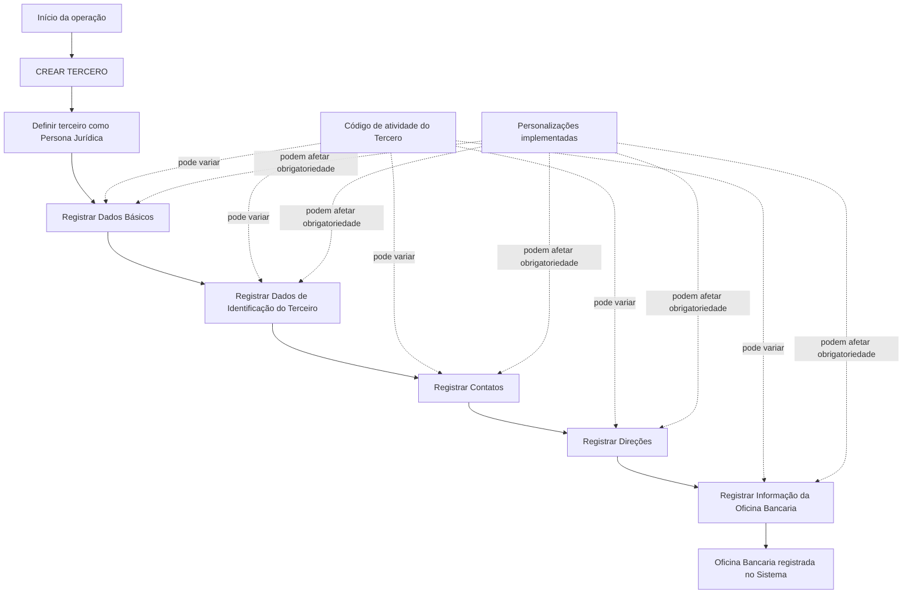

# Operação “Criar Oficina Bancaria” — Registro de Oficinas Bancárias na Entidade Asseguradora

## 1. Metadados do Documento
- **Arquivo de Origem:** Não informado; conteúdo bruto fornecido no prompt.
- **Tipo de Documento:** Procedimento / Manual Operacional.
- **Domínio / Sistema:** Operação **CREAR TERCERO** para criação de **Oficina Bancaria**.
- **Público-Alvo:** Usuários operacionais do sistema, analistas funcionais e equipes de suporte.
- **Data/Versão Identificada:** Não identificada.

---

## 2. Resumo Executivo & Contexto de Negócio

O documento descreve a operação **“Crear Oficina Bancaria”**, cujo objetivo é registrar no sistema a relação de Oficinas Bancárias habilitadas por uma Entidade Bancária dentro de uma Entidade Asseguradora. A criação é realizada no contexto da operação **CREAR TERCERO**.

A premissa funcional explícita é que as Oficinas Bancárias da Entidade Asseguradora devem sempre ser criadas como **Personas Jurídicas**. Essa regra determina a natureza cadastral aplicável à entidade registrada.

O registro é composto por blocos de informações compartilhados e por blocos específicos relacionados à atividade do terceiro. Entre os blocos compartilhados apresentados estão Dados Básicos, Dados de Identificação do Terceiro, Contatos e Direções. Para a atividade de Oficina Bancária, há ainda o bloco específico **“Información de la Oficina Bancaria”**.

A obrigatoriedade e a habilitação de campos podem variar conforme o código de atividade do terceiro. Personalizações implementadas também podem alterar o comportamento da aplicação em relação à obrigatoriedade de preenchimento dos dados do terceiro. O documento também informa que a ordem de captura dos blocos de informação pode variar segundo o critério do usuário no sistema.

---

## 3. Arquitetura, Componentes & Tecnologias Envolvidas

O conteúdo fornecido não detalha arquitetura técnica, integrações, microsserviços, tecnologias, contratos de API, bancos de dados, URLs operacionais ou ambientes. Os componentes funcionais explicitamente apresentados são:

- **Sistema:** sistema não nomeado no conteúdo extraído.
- **Operação:** `CREAR TERCERO`.
- **Objeto cadastral:** Oficina Bancaria.
- **Entidade relacionada:** Entidade Bancária.
- **Entidade de contexto:** Entidade Asseguradora.
- **Blocos compartilhados:** Dados Básicos, Identificação do Terceiro, Contatos e Direções.
- **Bloco específico:** Informação da Oficina Bancária.
- **Critérios que podem afetar campos:** código de atividade do terceiro e personalizações implementadas.



> **Nota de Análise:** O diagrama representa exclusivamente relações funcionais sustentadas pelo texto. O documento não detalha processamento interno, persistência, interfaces, serviços, APIs ou sequenciamento técnico obrigatório entre os blocos.

---

## 4. Regras de Negócio, Especificações Funcionais & Processos

### 4.1 Objetivo da operação

A operação **“Crear Oficina Bancaria”** permite registrar no sistema a relação de Oficinas Bancárias habilitadas por Entidade Bancária na Entidade Asseguradora.

### 4.2 Regra obrigatória de natureza jurídica

- As Oficinas Bancárias da Entidade Asseguradora devem sempre ser criadas como **Personas Jurídicas**.

### 4.3 Variação de obrigatoriedade e habilitação de campos

A obrigatoriedade e/ou habilitação dos campos de cadastro pode variar de acordo com o **código de atividade do Tercero**. Essa variação pode ocorrer em cada bloco ou estrutura de informação compartilhada.

O conteúdo não especifica:

- quais códigos de atividade existem;
- quais campos são obrigatórios para cada código;
- quais campos podem ser habilitados ou desabilitados;
- quais validações são executadas pelo sistema.

### 4.4 Impacto de personalizações

Personalizações que tenham sido implementadas podem afetar o comportamento da aplicação quanto à obrigatoriedade de registro dos Dados do Tercero.

O conteúdo não descreve quais personalizações existem, quem as configura, quais blocos são afetados ou como o comportamento é alterado.

### 4.5 Ordem de captura das informações

A ordem de captura dos dados nos blocos de informação pode variar segundo o critério adotado pelo usuário no sistema.

Portanto, o conteúdo não estabelece uma sequência obrigatória entre os blocos de Dados Básicos, Identificação do Terceiro, Contatos, Direções e Informação da Oficina Bancaria.

### 4.6 Processo funcional identificado

1. Iniciar a operação de criação da Oficina Bancária.
2. Utilizar a operação **CREAR TERCERO**.
3. Criar a Oficina Bancária como **Persona Jurídica**.
4. Registrar os blocos de informação compartilhados aplicáveis:
   - Dados Básicos;
   - Dados de Identificação do Terceiro;
   - Contatos;
   - Direções.
5. Registrar o bloco específico **Información de la Oficina Bancaria**.
6. Considerar as regras de obrigatoriedade e habilitação decorrentes do código de atividade do terceiro.
7. Considerar eventuais personalizações que alterem a obrigatoriedade do cadastro.
8. Executar os blocos na ordem definida pelo usuário no sistema, pois o documento não fixa uma ordem única obrigatória.

---

## 5. Tabelas de Parâmetros, Ambientes e Estruturas de Dados

| Item / Parâmetro | Descrição / Função | Tipo / Valores / Formato | Ambiente / Observações |
| :--- | :--- | :--- | :--- |
| Operação | Operação usada para criar o registro da Oficina Bancária. | `CREAR TERCERO` | O documento associa a criação de Oficina Bancaria à operação CREAR TERCERO. |
| Oficina Bancaria | Entidade cadastrada no sistema. | Registro de terceiro | Representa uma Oficina Bancária habilitada por uma Entidade Bancária na Entidade Asseguradora. |
| Natureza da Oficina Bancaria | Classificação cadastral obrigatória da Oficina Bancária. | Persona Jurídica | Regra explícita: sempre deve ser criada como Persona Jurídica. |
| Entidade Bancária | Entidade que habilita a Oficina Bancária. | Não detalhado | O documento não informa identificadores, campos ou regras da Entidade Bancária. |
| Entidade Asseguradora | Contexto organizacional no qual a Oficina Bancária é registrada. | Não detalhado | O documento não identifica a Entidade Asseguradora por nome. |
| Código de atividade do Tercero | Critério que pode alterar a obrigatoriedade e/ou habilitação de campos. | Código não especificado | Não há lista de códigos de atividade ou mapeamento de campos. |
| Personalizações implementadas | Configurações ou adaptações que podem afetar a obrigatoriedade dos Dados do Tercero. | Não detalhado | O documento não informa escopo, responsáveis ou comportamento de cada personalização. |
| Dados Básicos | Bloco de informação compartilhado no cadastro. | Estrutura de informação | Campos não detalhados. |
| Dados de Identificação do Terceiro | Bloco de informação compartilhado para identificação do terceiro. | Estrutura de informação | Campos não detalhados. |
| Contatos | Bloco de informação compartilhado para dados de contato. | Estrutura de informação | Campos não detalhados. |
| Direções | Bloco de informação compartilhado para endereços ou direções. | Estrutura de informação | Campos não detalhados. |
| Informação da Oficina Bancaria | Bloco de informação específico da atividade do terceiro. | Estrutura de informação específica | Campos e validações não detalhados. |
| Ordem de captura | Sequência em que os blocos de informação são preenchidos. | Variável | Pode variar conforme o critério do usuário no sistema. |
| URLs, logs, servidores e ambientes | Dados técnicos de infraestrutura. | Não informado | O conteúdo fornecido não apresenta URLs, caminhos de log, nomes de servidores, portas ou ambientes. |

---

## 6. Bateria de Perguntas & Respostas para RAG (FAQ Sintético)

### P1: Qual é o objetivo da operação “Crear Oficina Bancaria”?
**R:** A operação “Crear Oficina Bancaria” permite registrar no sistema a relação de Oficinas Bancárias habilitadas por uma Entidade Bancária na Entidade Asseguradora.

### P2: Em qual operação do sistema uma Oficina Bancária deve ser criada?
**R:** A Oficina Bancária deve ser criada no contexto da operação **CREAR TERCERO**, conforme apresentado no conteúdo extraído.

### P3: Qual natureza jurídica deve ser atribuída a uma Oficina Bancária?
**R:** As Oficinas Bancárias da Entidade Asseguradora devem sempre ser criadas como **Personas Jurídicas**.

### P4: Quais blocos de informação compartilhados são citados para o cadastro da Oficina Bancária?
**R:** Os blocos de informação compartilhados citados são: Dados Básicos, Dados de Identificação do Terceiro, Contatos e Direções.

### P5: Qual é o bloco específico aplicável à criação de uma Oficina Bancária?
**R:** O bloco específico mencionado é **Información de la Oficina Bancaria**, classificado como bloco de informação específico de acordo com a atividade do terceiro.

### P6: A obrigatoriedade dos campos é sempre igual para todas as Oficinas Bancárias?
**R:** Não necessariamente. O documento informa que a obrigatoriedade e/ou habilitação dos campos pode variar de acordo com o código de atividade do terceiro.

### P7: Personalizações podem modificar o comportamento do cadastro de Oficina Bancária?
**R:** Sim. O documento informa que personalizações implementadas podem afetar o comportamento da aplicação quanto à obrigatoriedade de registro dos Dados do Tercero.

### P8: Existe uma ordem obrigatória para preencher Dados Básicos, Identificação, Contatos, Direções e Informação da Oficina Bancaria?
**R:** Não. O documento estabelece que a ordem de captura dos dados nos diferentes blocos de informação pode variar conforme o critério seguido pelo usuário no sistema.

### P9: O documento informa quais campos devem ser preenchidos no bloco “Información de la Oficina Bancaria”?
**R:** Não. O documento apenas lista o bloco “Información de la Oficina Bancaria”, sem detalhar os campos, formatos, regras de validação ou valores permitidos.

### P10: O documento informa quais códigos de atividade do terceiro alteram a obrigatoriedade dos campos?
**R:** Não. O conteúdo informa que o código de atividade do terceiro pode influenciar a obrigatoriedade e habilitação dos campos, mas não lista códigos de atividade nem regras específicas por código.

### P11: Existem informações de API, URLs, servidores, ambientes ou arquivos de log para a operação?
**R:** Não. O conteúdo fornecido não apresenta métodos HTTP, contratos JSON, URLs, servidores, portas, ambientes, variáveis de configuração ou rotas de log.

### P12: Quem habilita a Oficina Bancária registrada no sistema?
**R:** Segundo o documento, a Oficina Bancária é habilitada por uma **Entidad Bancaria** no contexto da **Entidad Aseguradora**.

---

## 7. Glossário de Termos, Siglas & Conceitos-Chave

- **CREAR TERCERO:** Operação do sistema usada no processo de criação de uma Oficina Bancária.
- **Oficina Bancaria:** Oficina Bancária registrada no sistema e habilitada por uma Entidade Bancária na Entidade Asseguradora.
- **Entidad Bancaria:** Entidade Bancária que habilita a Oficina Bancária.
- **Entidad Aseguradora:** Entidade Asseguradora no contexto da qual as Oficinas Bancárias são registradas.
- **Tercero:** Terceiro cadastrado no sistema; a Oficina Bancária é criada por meio da operação CREAR TERCERO.
- **Persona Jurídica:** Natureza cadastral obrigatória para Oficinas Bancárias da Entidade Asseguradora.
- **Código de actividad:** Código de atividade do terceiro que pode modificar a obrigatoriedade e/ou habilitação de campos.
- **Datos Básicos:** Bloco de informações compartilhadas listado no processo CREAR TERCERO.
- **Datos Identificación del Tercero:** Bloco de informações compartilhadas destinado à identificação do terceiro.
- **Contactos:** Bloco de informações compartilhadas para contatos.
- **Direcciones:** Bloco de informações compartilhadas para direções ou endereços.
- **Información de la Oficina Bancaria:** Bloco de informação específico da atividade de Oficina Bancária.

---

## 8. Notas Críticas, Riscos & Limitações

- O conteúdo não identifica o nome do sistema no qual a operação é executada.
- O conteúdo não detalha campos, formatos, obrigatoriedades específicas, valores permitidos ou mensagens de erro para nenhum bloco de informação.
- O conteúdo não informa quais códigos de atividade do terceiro existem nem como cada código altera a habilitação ou obrigatoriedade dos campos.
- O conteúdo menciona personalizações, mas não descreve suas regras, configurações, responsáveis ou impactos funcionais concretos.
- O conteúdo não define uma sequência obrigatória de preenchimento dos blocos de informação.
- O conteúdo não contém informações técnicas sobre APIs, microsserviços, integrações, autenticação, banco de dados, URLs, ambientes, logs, servidores ou monitoramento.
- **Nota de Análise:** O documento lista a operação `CREAR TERCERO` e os blocos de informação relacionados, porém não detalha métodos HTTP, contratos JSON, telas, campos internos ou fluxos técnicos expostos.

---

## 9. Conteúdo Bruto Estruturado (Referência Fiel)

```text
--- [PÁGINA 1 DE 2] ---

OPERACIÓN CREAR Oficina Bancaria
¿En que consiste?
Esta operación permite registrar en el Sistema la relación de Oficinas Bancarias habilitadas por
Entidad Bancaria en la Entidad Aseguradora.
Premisas
Las Oficinas Bancarias de la Entidad Aseguradora siempre se crearán como Personas
Jurídicas.
La obligatoriedad y/o la habilitación de los campos en el registro de los datos de cada uno de
los bloques o estructuras de información compartidas puede variar de acuerdo con el código de
actividad del Tercero:
Las personalizaciones que se hubieran podido implementar a su vez pueden afectar el
comportamiento de la aplicación en relación con la obligatoriedad en el registro de los Datos del
Tercero.
Por último, el orden de captura de los datos en los distintos bloques de Información puede
variar de acuerdo con el criterio seguido por el Usuario en el Sistema.
Proceso
Ejemplo:
 / 
 RS
Inicio Soluciones APIs Documentación Zeus
ES


--- [PÁGINA 2 DE 2] ---

CREAR
TERCERO
Crear Información de
la Oficina Bancaria
Bloques de Información Compartidos (CREAR TERCERO)
 Datos Básicos ( )
 Datos Identificación del Tercero ( )
 Contactos ( )
 Direcciones ( )
Bloques de Información Específicos de acuerdo con la
Actividad del Tercero.
 Información de la Oficina Bancaria ( )
```
