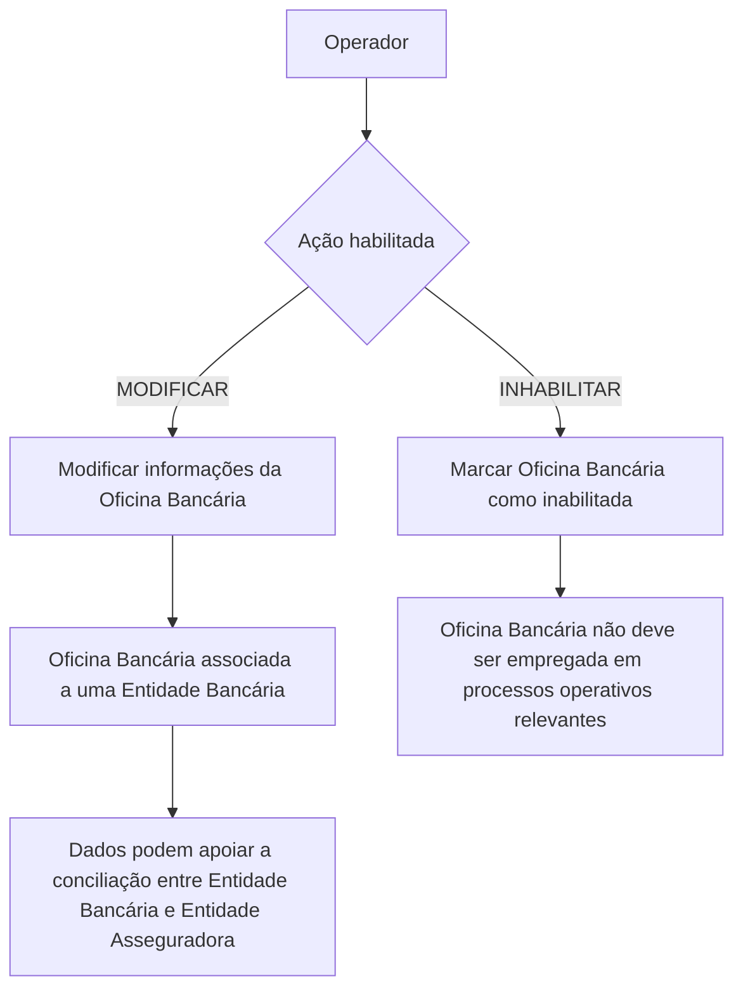

# Modificação e Inabilitação de Informação de Oficina Bancária

## 1. Metadados do Documento
- **Arquivo de Origem:** `Não identificado — conteúdo bruto fornecido no prompt`
- **Tipo de Documento:** Manual Operacional
- **Domínio / Sistema:** Gestão de Entidades e Oficinas Bancárias
- **Público-Alvo:** Operação, Negócio e Administração de Dados Bancários
- **Data/Versão Identificada:** Não identificada

---

## 2. Resumo Executivo & Contexto de Negócio

O documento descreve a operação destinada a modificar informações de Oficinas Bancárias ou inabilitar o uso dessas Oficinas Bancárias nos processos operativos da entidade. A operação contempla duas ações habilitadas: **MODIFICAR** e **INHABILITAR**.

A manutenção dos dados de uma Oficina Bancária inclui a identificação da Entidade Bancária associada, o código identificador da própria Oficina Bancária, um identificador interno configurado segundo a estrutura territorial da entidade bancária e, opcionalmente, o código SWIFT da Oficina Bancária.

O documento destaca que o correto preenchimento e manutenção do **ID da Oficina Bancária** facilita a conciliação das operações entre a Entidade Bancária e a Entidade Asseguradora. Portanto, a qualidade dos dados cadastrais da Oficina Bancária possui impacto operacional direto.

A inabilitação sinaliza ao sistema que a Oficina Bancária não deve ser empregada, contemplada ou considerada em processos operativos nos quais o estado da Oficina Bancária seja relevante. O documento não detalha os critérios de autorização, persistência, auditoria ou reabilitação de uma Oficina Bancária.

---

## 3. Arquitetura, Componentes & Tecnologias Envolvidas

O conteúdo fornecido não descreve arquitetura de software, APIs, microsserviços, bancos de dados, protocolos técnicos ou ambientes de implantação. Os elementos funcionais identificados são:

- **Entidade Bancária:** banco ao qual a Oficina Bancária está associada.
- **Oficina Bancária:** sucursal bancária cujas informações podem ser modificadas ou inabilitadas.
- **Entidade Asseguradora:** entidade que participa da conciliação de operações com a Entidade Bancária.
- **Sistema:** sistema que considera o estado de inabilitação da Oficina Bancária durante processos operativos.
- **Código SWIFT:** código utilizado para identificar o banco e a oficina receptora de uma transferência internacional.



> **Nota de Análise:** O documento não especifica telas, endpoints HTTP, contratos JSON, mecanismos de autenticação, tecnologias de persistência ou integrações técnicas.

---

## 4. Regras de Negócio, Especificações Funcionais & Processos

### 4.1 Objetivo da operação

A operação permite:

1. Modificar as informações das Oficinas Bancárias.
2. Inabilitar o uso de Oficinas Bancárias nos processos operativos da entidade.

### 4.2 Ações habilitadas

As ações apresentadas são:

- **MODIFICAR**
- **INHABILITAR**

O conteúdo não detalha se as duas ações podem ser executadas simultaneamente, se dependem de perfis de acesso específicos ou se produzem registros de auditoria.

### 4.3 Sequência de captura de dados

O documento estabelece que, no bloco de informação da Entidade Bancária, os atributos devem ser capturados seguindo a ordem:

1. Da esquerda para a direita.
2. De cima para baixo.

### 4.4 Código da Entidade Bancária

O campo **Código da Entidade Bancária** apresenta a chave do banco ao qual a sucursal bancária está associada.

### 4.5 Código da Oficina Bancária

O campo **Código da Oficina Bancária** apresenta a chave que identifica a sucursal bancária.

### 4.6 ID da Oficina Bancária

O campo **ID da Oficina Bancária** contém o código interno da Oficina Bancária, conforme a configuração da estrutura territorial fornecida pela Entidade Bancária.

O correto tratamento desse dado facilita a conciliação das operações entre:

- Entidade Bancária;
- Entidade Asseguradora.

### 4.7 Código SWIFT da Oficina Bancária

O campo **Código SWIFT da Oficina Bancária** registra o código SWIFT utilizado para identificar o banco e a oficina receptora de uma transferência internacional.

O documento informa as seguintes regras para o código SWIFT:

1. Os três últimos dígitos são opcionais.
2. Quando presentes, os três últimos dígitos fazem referência à sucursal onde está localizada a conta específica.
3. Quando os três últimos dígitos não estão presentes, entende-se que a conta pertence à oficina central do banco.
4. Na ausência dos três últimos dígitos, o código SWIFT aplicável é o configurado no nível da Entidade Bancária.

### 4.8 Inabilitação da Oficina Bancária

O campo **Inabilitação** informa ao sistema que a Oficina Bancária está inabilitada.

Quando uma Oficina Bancária está inabilitada:

- não deve ser empregada;
- não deve ser contemplada;
- não deve ser considerada;

nos processos operativos da entidade em que o estado da Oficina Bancária seja relevante.

> **Nota de Análise:** O documento não descreve valores possíveis para o campo de Inabilitação, regras para reabilitação, datas de vigência, justificativas, nem o comportamento do sistema em processos já iniciados.

---

## 5. Tabelas de Parâmetros, Ambientes e Estruturas de Dados

| Item / Parâmetro | Descrição / Função | Tipo / Valores / Formato | Ambiente / Observações |
| :--- | :--- | :--- | :--- |
| Ação MODIFICAR | Permite modificar a informação das Oficinas Bancárias. | Ação habilitada. | Não há detalhamento de permissões ou etapas de confirmação. |
| Ação INHABILITAR | Permite inabilitar o emprego da Oficina Bancária em processos operativos da entidade. | Ação habilitada. | O documento não especifica mecanismo de reversão. |
| Código da Entidade Bancária | Mostra a chave do banco ao qual a sucursal bancária está associada. | Código / chave bancária. | Campo pertencente ao bloco de informação da Entidade Bancária. |
| Código da Oficina Bancária | Mostra a chave que identifica a sucursal bancária. | Código / chave da sucursal. | O formato não é especificado. |
| ID da Oficina Bancária | Contém o código interno da Oficina Bancária conforme a estrutura territorial da Entidade Bancária. | Código interno. | A manutenção correta facilita a conciliação entre Entidade Bancária e Entidade Asseguradora. |
| Código SWIFT da Oficina Bancária | Registra o código SWIFT para identificação do banco e da oficina receptora de transferência internacional. | Código SWIFT; os três últimos dígitos são opcionais. | Sem os três últimos dígitos, considera-se a oficina central e aplica-se o código SWIFT configurado para a Entidade Bancária. |
| Inabilitação | Indica ao sistema que a Oficina Bancária está inabilitada. | Campo de estado; valores não especificados. | A Oficina Bancária inabilitada não deve ser empregada, contemplada ou considerada quando o estado for relevante. |
| Ordem de captura | Define a sequência de captura dos atributos no bloco de informação. | Da esquerda para a direita e de cima para baixo. | Aplicável aos atributos do bloco de informação da Entidade Bancária. |

---

## 6. Bateria de Perguntas & Respostas para RAG (FAQ Sintético)

### P1: Qual é o objetivo da operação de Oficina Bancária?
**R:** A operação permite modificar a informação das Oficinas Bancárias ou inabilitar o uso dessas Oficinas Bancárias nos processos operativos da entidade.

### P2: Quais ações estão habilitadas na operação de Oficina Bancária?
**R:** O documento apresenta duas ações habilitadas: **MODIFICAR** e **INHABILITAR**.

### P3: O que representa o Código da Entidade Bancária?
**R:** O Código da Entidade Bancária mostra a chave do banco ao qual a sucursal bancária está associada.

### P4: Qual é a finalidade do Código da Oficina Bancária?
**R:** O Código da Oficina Bancária mostra a chave que identifica a sucursal bancária.

### P5: Para que serve o ID da Oficina Bancária?
**R:** O ID da Oficina Bancária contém o código interno da Oficina Bancária, de acordo com a configuração da estrutura territorial fornecida pela Entidade Bancária. A manutenção correta desse dado facilita a conciliação das operações entre a Entidade Bancária e a Entidade Asseguradora.

### P6: Qual é a finalidade do Código SWIFT da Oficina Bancária?
**R:** O Código SWIFT da Oficina Bancária serve para registrar o código utilizado para identificar o banco e a oficina receptora de uma transferência internacional.

### P7: Os três últimos dígitos do código SWIFT são obrigatórios?
**R:** Não. O documento informa que os três últimos dígitos do código SWIFT são opcionais. Quando presentes, eles identificam a sucursal em que se encontra a conta específica.

### P8: O que ocorre quando os três últimos dígitos do código SWIFT não são informados?
**R:** Quando os três últimos dígitos não estão presentes, entende-se que a conta pertence à oficina central do banco. Nessa situação, o código SWIFT aplicável é o configurado no nível da Entidade Bancária.

### P9: O que significa inabilitar uma Oficina Bancária?
**R:** Inabilitar uma Oficina Bancária informa ao sistema que a Oficina Bancária está inabilitada e, quando o estado da Oficina Bancária for relevante, ela não deve ser empregada, contemplada ou considerada nos processos operativos da entidade.

### P10: Em que ordem os atributos devem ser capturados no bloco de informação?
**R:** Os atributos devem ser capturados da esquerda para a direita e de cima para baixo.

### P11: O documento informa como reabilitar uma Oficina Bancária inabilitada?
**R:** Não. O conteúdo fornecido descreve a ação de inabilitar e seus efeitos operacionais, mas não especifica procedimentos, regras ou condições para reabilitação.

### P12: O documento especifica APIs, métodos HTTP ou contratos de integração para a operação?
**R:** Não. O documento é funcional e descreve campos, ações e regras de uso da Oficina Bancária, sem detalhar APIs, métodos HTTP, contratos JSON, tecnologias ou integrações técnicas.

---

## 7. Glossário de Termos, Siglas & Conceitos-Chave

- **Código SWIFT:** Código utilizado para identificar o banco e a oficina receptora de uma transferência internacional.
- **SWIFT:** *Society for Worldwide Interbank Financial Telecommunication*, conforme explicitado no documento.
- **Entidade Bancária:** Banco ao qual uma sucursal ou Oficina Bancária está associada.
- **Entidade Asseguradora:** Entidade envolvida na conciliação de operações com a Entidade Bancária.
- **Oficina Bancária:** Sucursal bancária identificada por código próprio e associada a uma Entidade Bancária.
- **ID da Oficina Bancária:** Código interno da Oficina Bancária conforme a estrutura territorial fornecida pela Entidade Bancária.
- **Inabilitação:** Estado que impede que uma Oficina Bancária seja empregada, contemplada ou considerada em processos operativos relevantes.

---

## 8. Notas Críticas, Riscos & Limitações

- O conteúdo não identifica o nome do sistema, a versão do documento, a data de publicação, os responsáveis ou o ambiente de execução.
- O documento não especifica formatos, tamanhos, obrigatoriedade ou validações dos campos Código da Entidade Bancária, Código da Oficina Bancária e ID da Oficina Bancária.
- O documento não define os valores técnicos possíveis para o campo Inabilitação.
- Não há detalhamento sobre permissões, perfis autorizados, trilha de auditoria, aprovação ou dupla validação das ações MODIFICAR e INHABILITAR.
- Não há instruções sobre reabilitação de uma Oficina Bancária previamente inabilitada.
- Não são apresentados APIs, serviços, integrações, banco de dados, mecanismos de persistência, logs ou tratamento de erros.
- O trecho termina com o termo **“Consejo:”**, sem conteúdo complementar disponível.

---

## 9. Conteúdo Bruto Estruturado (Referência Fiel)

```text
--- [PÁGINA 1 DE 2] ---

MODIFICAR Información específica de la
Oficina Bancaria
Objetivo
Esta Operación permite Modificar la información de las Oficinas Bancarias o Inhabilitar su empleo
en los procesos operativos de la entidad.
Acciones habilitadas
 MODIFICAR ( )
 INHABILITAR ( )
Datos Entidad Bancaria
De Izquierda a Derecha y de Arriba hacia Abajo, los siguientes atributos marcan la secuencia de
captura en este Bloque de Información.
Código de la Entidad Bancaria
Este campo muestra la clave del banco a la que está asociada la sucursal bancaria.
 /
 RS
Inicio Soluciones APIs Documentación Zeus
ES


--- [PÁGINA 2 DE 2] ---

Código de la Oficina Bancaria
Este dato mostrará la clave que identifica a la sucursal bancaria.
ID de la Oficina Bancaria ( )
Este campo contiene el código interno de la Oficina Bancaria de acuerdo con la configuración de la
estructura Territorial provista por la entidad Bancaria.
El correcto mantenimiento de este dato facilitará la conciliación de las operaciones entre la
Entidad Bancaria y la Entidad Aseguradora.
Código SWIFT de la Oficina Bancaria ( )
Este campo sirve para registrar el código SWIFT (acrónimo de Society for Worldwide Interbank
Financial Telecommunication) que se utiliza para identificar al banco y la oficina receptora de una
transferencia internacional.
Los tres últimos dígitos son opcionales y en caso de aparecer hacen referencia a la sucursal en la
que se encuentra la cuenta en concreto. Si no estuvieran presentes se entiende que pertenece a
la oficina central del banco y por tanto el código SWIFT sería el configurado a nivel de la Entidad
Bancaria.
Inhabilitación ( )
Este campo le indica al Sistema que la Oficina Bancaria está inhabilitada en el Sistema por lo cual,
de estarlo, no debería ser empleada, contemplada o considerada en los procesos operativos de la
entidad en los que el estado de la Oficina sea relevante..
Consejo:
```
