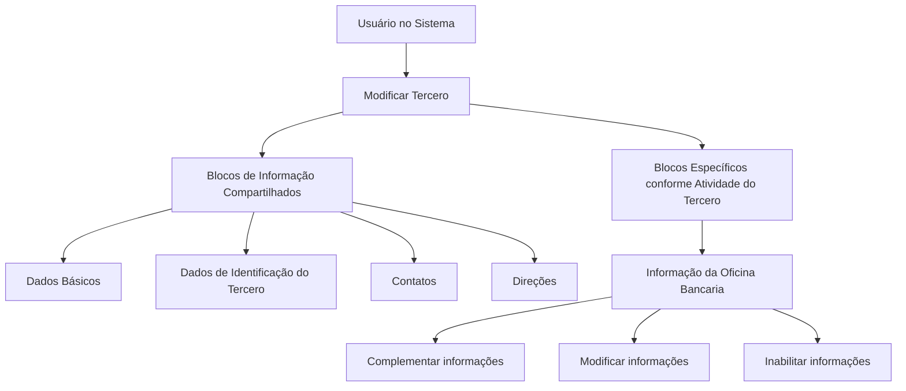

# Operação “Modificar Oficina Bancaria” — Gestão de Informação de Escritório Bancário

## 1. Metadados do Documento
- **Arquivo de Origem:** Não identificado no conteúdo fornecido
- **Tipo de Documento:** Procedimento
- **Domínio / Sistema:** Modificar Tercero / Oficina Bancaria
- **Público-Alvo:** Usuários do Sistema, Operação e Negócio
- **Data/Versão Identificada:** Não identificada

---

## 2. Resumo Executivo & Contexto de Negócio

O documento descreve a operação **“Modificar Oficina Bancaria”**, destinada a complementar, modificar e/ou inabilitar informações relacionadas a uma oficina bancária. A alteração pode ocorrer em qualquer estrutura de dados que contenha ou agrupe essas informações.

A operação está inserida no contexto funcional de **“Modificar Tercero”**. O processo inclui blocos de informação compartilhados e blocos específicos dependentes da atividade do terceiro, incluindo explicitamente a **Informação de la Oficina Bancaria**.

A obrigatoriedade e a habilitação dos campos podem variar conforme o código de atividade do terceiro. Adicionalmente, personalizações implementadas podem alterar o comportamento da aplicação quanto à exigência de preenchimento dos dados do terceiro.

O documento também registra que a ordem de captura das informações nos blocos pode variar conforme o critério adotado pelo usuário no sistema. Não são detalhados campos específicos, validações por código de atividade, regras de inabilitação ou contratos técnicos.

---

## 3. Arquitetura, Componentes & Tecnologias Envolvidas

Os elementos funcionais explicitamente citados são:

- Operação **Modificar Oficina Bancaria**.
- Processo ou contexto **Modificar Tercero**.
- Blocos de informação compartilhados:
  - Dados Básicos.
  - Dados de Identificação do Terceiro.
  - Contatos.
  - Direções.
- Blocos de informação específicos conforme a atividade do terceiro.
- Informação da Oficina Bancária.



> **Nota de Análise:** O documento não identifica tecnologias, microsserviços, bancos de dados, URLs, ambientes, métodos HTTP, contratos JSON ou mecanismos de persistência.

---

## 4. Regras de Negócio, Especificações Funcionais & Processos

1. A operação permite **complementar**, **modificar** e/ou **inabilitar** a informação da oficina bancária.
2. A modificação pode ocorrer em qualquer estrutura de dados que contenha e agrupe a informação da oficina bancária.
3. A obrigatoriedade de preenchimento dos campos pode variar de acordo com o **código de atividade do terceiro**.
4. A habilitação dos campos também pode variar de acordo com o código de atividade do terceiro.
5. Personalizações previamente implementadas podem afetar o comportamento da aplicação em relação à obrigatoriedade de registrar dados do terceiro.
6. A captura de dados nos distintos blocos de informação pode ocorrer em ordem variável, conforme o critério seguido pelo usuário no sistema.
7. O fluxo exibido associa a modificação da informação da oficina bancária ao processo **Modificar Tercero**.
8. Os blocos compartilhados apresentados são Dados Básicos, Dados de Identificação do Terceiro, Contatos e Direções.
9. O documento lista a Informação da Oficina Bancária como bloco específico de acordo com a atividade do terceiro.

> **Nota de Análise:** O documento não especifica quais campos formam a Informação da Oficina Bancária, quais códigos de atividade habilitam cada campo, nem as consequências funcionais ou técnicas da inabilitação.

---

## 5. Tabelas de Parâmetros, Ambientes e Estruturas de Dados

| Item / Parâmetro | Descrição / Função | Tipo / Valores / Formato | Ambiente / Observações |
| :--- | :--- | :--- | :--- |
| Operação Modificar Oficina Bancaria | Complementa, modifica e/ou inabilita informação da oficina bancária. | Operação funcional. | Executada no contexto do sistema. |
| Código de atividade do Tercero | Determina variações na obrigatoriedade e/ou habilitação de campos. | Código não detalhado. | Regras específicas não informadas. |
| Personalizações implementadas | Podem afetar a obrigatoriedade de registro dos dados do terceiro. | Personalizações da aplicação. | Implementações não detalhadas. |
| Ordem de captura de dados | Pode variar nos blocos de informação. | Ordem definida pelo usuário. | Depende do critério do usuário no sistema. |
| Dados Básicos | Bloco de informação compartilhado. | Estrutura de informação. | Conteúdo não detalhado. |
| Dados de Identificação do Tercero | Bloco de informação compartilhado. | Estrutura de informação. | Conteúdo não detalhado. |
| Contatos | Bloco de informação compartilhado. | Estrutura de informação. | Conteúdo não detalhado. |
| Direções | Bloco de informação compartilhado. | Estrutura de informação. | Conteúdo não detalhado. |
| Informação da Oficina Bancaria | Bloco específico associado à atividade do terceiro. | Estrutura de informação específica. | Campos e validações não detalhados. |

---

## 6. Bateria de Perguntas & Respostas para RAG (FAQ Sintético)

### P1: Qual é a finalidade da operação “Modificar Oficina Bancaria”?
**R:** A operação permite complementar, modificar e/ou inabilitar a informação da oficina bancária em qualquer estrutura de dados que contenha e agrupe essas informações.

### P2: Em qual processo a modificação da informação da oficina bancária está inserida?
**R:** A modificação da informação da oficina bancária está apresentada dentro do processo **Modificar Tercero**.

### P3: Quais ações podem ser realizadas sobre a informação da oficina bancária?
**R:** O documento informa três ações: complementar informações, modificar informações e inabilitar informações relacionadas à oficina bancária.

### P4: A obrigatoriedade dos campos da oficina bancária é sempre a mesma?
**R:** Não. A obrigatoriedade e/ou a habilitação dos campos pode variar de acordo com o código de atividade do terceiro.

### P5: As personalizações da aplicação podem alterar o preenchimento obrigatório?
**R:** Sim. O documento informa que personalizações implementadas podem afetar o comportamento da aplicação relacionado à obrigatoriedade no registro dos dados do terceiro.

### P6: A ordem de preenchimento dos blocos de informação é fixa?
**R:** Não. A ordem de captura dos dados nos distintos blocos de informação pode variar conforme o critério seguido pelo usuário no sistema.

### P7: Quais são os blocos de informação compartilhados mostrados no processo “Modificar Tercero”?
**R:** Os blocos apresentados são Dados Básicos, Dados de Identificação do Terceiro, Contatos e Direções.

### P8: A informação da oficina bancária é apresentada como bloco compartilhado ou específico?
**R:** A Informação da Oficina Bancaria é apresentada como um bloco de informação específico de acordo com a atividade do terceiro.

### P9: O documento define os campos da Informação da Oficina Bancaria?
**R:** Não. O documento menciona a estrutura “Informação de la Oficina Bancaria”, mas não detalha seus campos, formatos, obrigatoriedades individuais ou regras de validação.

### P10: O documento informa integrações, APIs ou contratos técnicos da operação?
**R:** Não. Não há detalhes sobre integrações, APIs, métodos HTTP, contratos JSON, bancos de dados, URLs ou ambientes técnicos.

---

## 7. Glossário de Termos, Siglas & Conceitos-Chave

- **Oficina Bancaria:** Informação de escritório bancário que pode ser complementada, modificada ou inabilitada.
- **Tercero:** Entidade cujo processo de modificação agrupa blocos de informação compartilhados e específicos.
- **Modificar Tercero:** Processo no qual a informação da oficina bancária é modificada.
- **Blocos de Informação Compartilhados:** Estruturas listadas como Dados Básicos, Dados de Identificação do Terceiro, Contatos e Direções.
- **Blocos de Informação Específicos:** Estruturas associadas à atividade do terceiro.
- **Código de atividade do Tercero:** Critério que pode influenciar a obrigatoriedade e a habilitação dos campos.

---

## 8. Notas Críticas, Riscos & Limitações

- O documento não identifica o arquivo de origem, versão, data, autor ou responsável funcional.
- Não há detalhamento de campos, formatos, valores permitidos ou validações da Informação da Oficina Bancaria.
- Os códigos de atividade do terceiro que alteram obrigatoriedade ou habilitação não são informados.
- As personalizações que podem afetar o comportamento da aplicação não são descritas.
- Não há definição de permissões, perfis de usuário, trilha de auditoria, regras de aprovação ou mecanismos de reversão.
- Não são fornecidos detalhes técnicos sobre persistência, integração, APIs, infraestrutura, logs ou ambientes.

---

## 9. Conteúdo Bruto Estruturado (Referência Fiel)

```text
--- [PÁGINA 1 DE 2] ---

OPERACIÓN MODIFICAR Oficina Bancaria
¿En que consiste?
Esta operación consiste en Complementar, Modificar y/o Inhabilitar la información de la Oficina
Bancaria en cualquiera de las estructuras de datos que la contienen y agrupan.
Premisas
La obligatoriedad y/o la habilitación de los campos en el registro de los datos de cada uno de
los bloques o estructuras de información compartidas puede variar de acuerdo con el código de
actividad del Tercero:
Las personalizaciones que se hubieran podido implementar a su vez pueden afectar el
comportamiento de la aplicación en relación con la obligatoriedad en el registro de los Datos del
Tercero.
Por último, el orden de captura de los datos en los distintos bloques de Información puede
variar de acuerdo con el criterio seguido por el Usuario en el Sistema.
Proceso
Ejemplo:
 /
 RS
Inicio Soluciones APIs Documentación Zeus
ES


--- [PÁGINA 2 DE 2] ---

MODIFICAR
TERCERO
Modificar Información
de la Oficina Bancaria
Bloques de Información Compartidos (MODIFICAR TERCERO)
 Datos Básicos ( )
 Datos Identificación Tercero ( )
 Contactos (   )
 Direcciones (   )
Bloques de Información Específicos de acuerdo con la
Actividad del Tercero.
 Información de la Oficina Bancaria(  )
```
