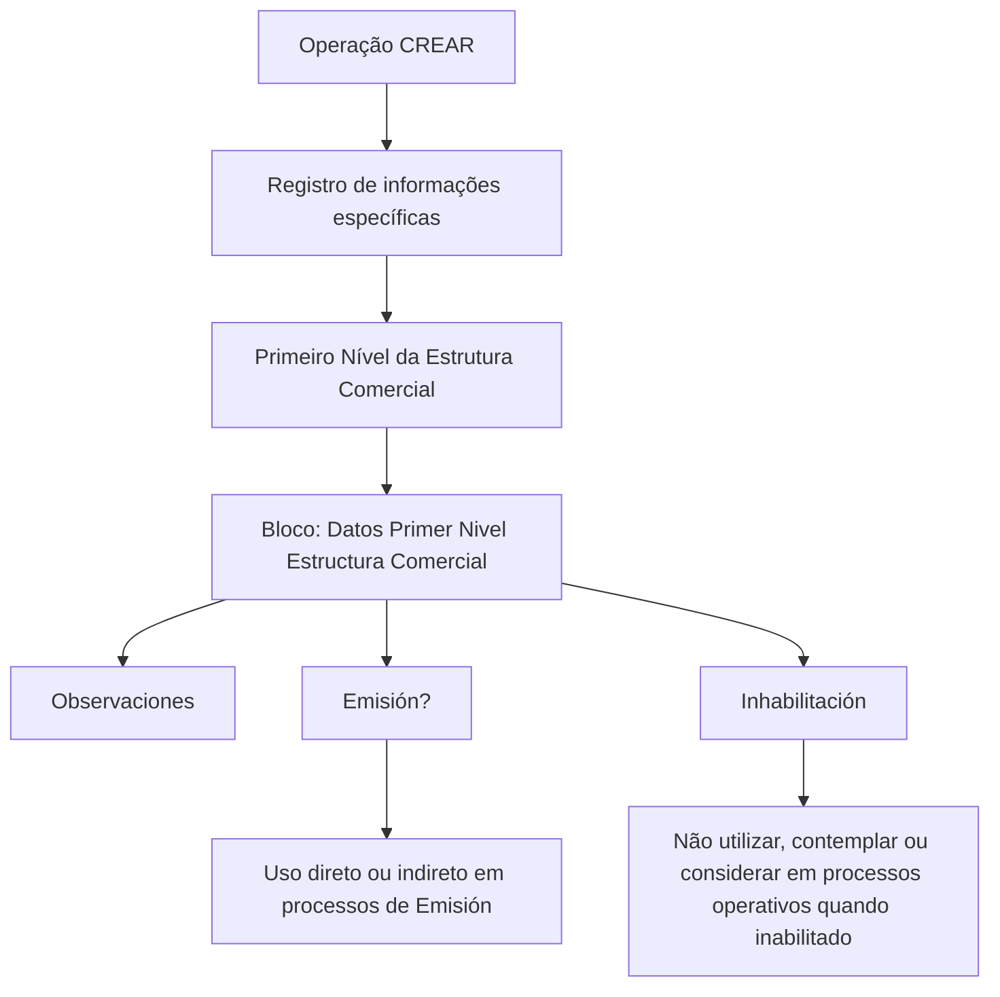

# Criação de Informações Específicas do Primeiro Nível da Estrutura Comercial

## 1. Metadados do Documento
- **Arquivo de Origem:** Não identificado no conteúdo fornecido
- **Tipo de Documento:** Procedimento
- **Domínio / Sistema:** Estrutura Comercial
- **Público-Alvo:** Operação, Negócio e usuários responsáveis pelo cadastro da Estrutura Comercial
- **Data/Versão Identificada:** Não identificada

---

## 2. Resumo Executivo & Contexto de Negócio

O documento descreve a operação **CREAR**, destinada ao registro, no sistema, de informações específicas dos **Primeiros Níveis da Estrutura Comercial** configurados na Companhia. O texto cita **Pessoas Jurídicas** como exemplo de entidade que pode compor esses primeiros níveis.

A operação estabelece uma sequência de captura de informações no bloco denominado **Datos Primer Nivel Estructura Comercial**. A orientação de preenchimento apresentada determina que os campos devem ser considerados da esquerda para a direita e de cima para baixo.

Os campos identificados no conteúdo são **Observaciones**, **Emisión?** e **Inhabilitación**. Esses campos registram observações sobre a criação, definem se o código do primeiro nível pode ser usado em processos de emissão e determinam se o primeiro nível está inabilitado para processos operacionais da entidade.

O documento não apresenta detalhes sobre autenticação, tecnologias utilizadas, contratos de integração, métodos HTTP, persistência de dados, validações de obrigatoriedade ou comportamento de salvamento da operação **CREAR**.

---

## 3. Arquitetura, Componentes & Tecnologias Envolvidas

O conteúdo fornecido menciona os seguintes elementos:

| Componente / Elemento | Papel identificado no documento |
| :--- | :--- |
| Sistema | Ambiente no qual são registradas as informações dos Primeiros Níveis da Estrutura Comercial. |
| Estrutura Comercial | Estrutura configurada na Companhia que possui Primeiros Níveis. |
| Primeiro Nível da Estrutura Comercial | Nível cadastrado pela operação **CREAR**; Pessoas Jurídicas são citadas como exemplo. |
| Bloco “Datos Primer Nivel Estructura Comercial” | Bloco de informações que contém os campos da sequência de captura. |
| Processos de Emisión | Processos nos quais o código do primeiro nível pode ser empregado direta ou indiretamente. |
| Processos operativos de la entidad | Processos nos quais um primeiro nível inabilitado não deve ser empregado, contemplado ou considerado. |
| Home Solutions APIs Documentation Zeus | Texto presente no material bruto; a função, tecnologia ou relação com a operação não é detalhada. |



**Nota de Análise:** O documento não detalha arquitetura de software, integrações, microsserviços, banco de dados, tecnologias, ambientes ou interfaces técnicas.

---

## 4. Regras de Negócio, Especificações Funcionais & Processos

### Operação habilitada

A ação habilitada no material é:

- **CREAR:** operação que permite registrar no sistema determinadas informações dos Primeiros Níveis da Estrutura Comercial configurados na Companhia.

### Escopo do cadastro

- O cadastro refere-se a informações específicas dos **Primeiros Níveis da Estrutura Comercial**.
- O documento apresenta **Pessoas Jurídicas** como exemplo de elementos configurados nesses primeiros níveis.
- Não há detalhamento sobre todos os tipos de entidades permitidas além do exemplo de Pessoas Jurídicas.

### Sequência de captura

O documento determina que os campos do bloco **Datos Primer Nivel Estructura Comercial** marcam a sequência de captura:

1. Considerar os campos da esquerda para a direita.
2. Considerar os campos de cima para baixo.
3. Preencher os campos apresentados no bloco de informações.

### Regra do campo “Observaciones”

- O campo **Observaciones** permite inserir texto explicativo ou observações relacionadas ao fato de criar o nível da estrutura.
- O documento não especifica tamanho máximo, formato, obrigatoriedade ou regras de validação para o texto.

### Regra do campo “Emisión?”

- O campo **Emisión?** determina o comportamento do sistema quanto ao uso do código do primeiro nível da Estrutura Comercial.
- Quando aplicável conforme a configuração desse campo, o código do primeiro nível pode ser empregado, de forma direta ou indireta, nos processos de **Emisión**.
- O documento não informa valores possíveis, valor padrão ou condições adicionais para habilitar esse uso.

### Regra do campo “Inhabilitación”

- O campo **Inhabilitación** informa ao sistema que o primeiro nível da Estrutura Comercial está inabilitado no sistema.
- Quando o primeiro nível estiver inabilitado, ele não deve:
  - ser empregado;
  - ser contemplado;
  - ser considerado;
  nos processos operativos da entidade.
- O documento não esclarece se a inabilitação é reversível, se exige justificativa ou se bloqueia alterações cadastrais.

---

## 5. Tabelas de Parâmetros, Ambientes e Estruturas de Dados

| Item / Parâmetro | Descrição / Função | Tipo / Valores / Formato | Ambiente / Observações |
| :--- | :--- | :--- | :--- |
| CREAR | Operação habilitada para registrar informações específicas do Primeiro Nível da Estrutura Comercial. | Ação / operação | O conteúdo não detalha comandos, tela, API ou mecanismo de execução. |
| Primeiro Nível da Estrutura Comercial | Nível da estrutura configurada na Companhia que recebe o cadastro. | Entidade de negócio | Pessoas Jurídicas são citadas como exemplo. |
| Datos Primer Nivel Estructura Comercial | Bloco de informações que organiza a sequência de captura dos campos. | Bloco de informação | Os campos devem ser considerados da esquerda para a direita e de cima para baixo. |
| Observaciones | Permite registrar texto explicativo ou observações sobre a criação do nível. | Texto | Não há formato, limite de caracteres ou obrigatoriedade especificados. |
| Emisión? | Define se o código do primeiro nível pode ser empregado direta ou indiretamente em processos de Emisión. | Campo de configuração; valores não especificados | O comportamento exato dos valores não é detalhado. |
| Inhabilitación | Indica que o primeiro nível está inabilitado no sistema. | Campo de configuração; valores não especificados | Um primeiro nível inabilitado não deve ser empregado, contemplado ou considerado nos processos operativos da entidade. |
| Home Solutions APIs Documentation Zeus | Texto exibido no material bruto. | Não especificado | Não há relação funcional ou técnica explicitada com a operação CREAR. |

---

## 6. Bateria de Perguntas & Respostas para RAG (FAQ Sintético)

### P1: Qual é o objetivo da operação CREAR no contexto da Estrutura Comercial?
**R:** A operação **CREAR** permite registrar no sistema determinadas informações específicas dos Primeiros Níveis da Estrutura Comercial configurados na Companhia. O documento cita Pessoas Jurídicas como exemplo de elementos que podem estar configurados nesses primeiros níveis.

### P2: Qual entidade de negócio é cadastrada pela operação CREAR?
**R:** A operação **CREAR** está relacionada ao cadastro de informações dos **Primeiros Níveis da Estrutura Comercial**. O texto não limita o cadastro exclusivamente a um tipo de entidade, mas cita Pessoas Jurídicas como exemplo.

### P3: Qual é a ordem de preenchimento dos campos em “Datos Primer Nivel Estructura Comercial”?
**R:** Os campos do bloco **Datos Primer Nivel Estructura Comercial** devem ser considerados da esquerda para a direita e de cima para baixo, pois essa organização marca a sequência de captura das informações.

### P4: Para que serve o campo Observaciones?
**R:** O campo **Observaciones** permite inserir um texto explicativo ou observações relacionadas ao fato de criar o nível da Estrutura Comercial.

### P5: O que o campo Emisión? controla?
**R:** O campo **Emisión?** determina o comportamento do sistema permitindo que o código do primeiro nível da Estrutura Comercial possa ser utilizado, direta ou indiretamente, nos processos de Emisión.

### P6: O documento informa quais valores podem ser usados no campo Emisión??
**R:** Não. O documento descreve a finalidade do campo **Emisión?**, mas não especifica os valores disponíveis, o valor padrão ou as regras de configuração associadas a cada valor.

### P7: O que ocorre quando um Primeiro Nível da Estrutura Comercial está inabilitado?
**R:** Quando o campo **Inhabilitación** indica que o primeiro nível está inabilitado no sistema, esse primeiro nível não deve ser empregado, contemplado ou considerado nos processos operativos da entidade.

### P8: A inabilitação impede o uso do primeiro nível em quais processos?
**R:** A inabilitação impede que o primeiro nível da Estrutura Comercial seja empregado, contemplado ou considerado nos processos operativos da entidade. O documento não detalha quais processos operativos específicos são afetados.

### P9: O documento apresenta APIs, métodos HTTP ou contratos JSON para a operação CREAR?
**R:** Não. Embora o conteúdo bruto apresente o texto “Home Solutions APIs Documentation Zeus”, o documento não descreve APIs, métodos HTTP, contratos JSON, endpoints, autenticação ou integrações técnicas para a operação **CREAR**.

### P10: O documento especifica campos obrigatórios ou validações de formato?
**R:** Não. O conteúdo identifica os campos **Observaciones**, **Emisión?** e **Inhabilitación**, porém não informa obrigatoriedade, formato, tamanho máximo, valores permitidos ou mensagens de validação.

---

## 7. Glossário de Termos, Siglas & Conceitos-Chave

- **CREAR:** Ação habilitada para registrar no sistema informações específicas dos Primeiros Níveis da Estrutura Comercial.
- **Emisión:** Processos nos quais o código do primeiro nível da Estrutura Comercial pode ser utilizado direta ou indiretamente, conforme o campo **Emisión?**.
- **Estructura Comercial / Estrutura Comercial:** Estrutura configurada na Companhia, composta por níveis; o documento trata especificamente dos Primeiros Níveis.
- **Inhabilitación:** Indicação de que um primeiro nível da Estrutura Comercial está inabilitado no sistema.
- **Observaciones:** Campo destinado à inclusão de texto explicativo ou observações sobre a criação do nível.
- **Personas Jurídicas / Pessoas Jurídicas:** Exemplo citado de entidade configurada nos Primeiros Níveis da Estrutura Comercial.
- **Primer Nivel / Primeiro Nível:** Nível da Estrutura Comercial cujas informações são registradas pela operação **CREAR**.

---

## 8. Notas Críticas, Riscos & Limitações

- O documento não identifica arquivo de origem, autoria, data, versão ou sistema específico.
- O material não descreve tecnologia, arquitetura técnica, integrações, APIs, banco de dados, segurança, perfis de acesso ou ambientes.
- O texto menciona **Home Solutions APIs Documentation Zeus**, mas não explica sua relação com a operação ou com a Estrutura Comercial.
- Não há definição dos valores aceitos pelos campos **Emisión?** e **Inhabilitación**.
- Não são especificadas regras de obrigatoriedade, persistência, confirmação de cadastro, mensagens de erro, auditoria ou reversão de inabilitação.
- O documento não detalha os processos de **Emisión** nem os processos operativos da entidade impactados pelas configurações.

---

## 9. Conteúdo Bruto Estruturado (Referência Fiel)

```text
--- [PÁGINA 1 DE 2] ---

CREAR Información específica del Primer Nivel
de la Estructura Comercial
Objetivo
Esta operación permite registrar en el sistema cierta información de los Primeros Niveles de la
Estructura Comercial (como Personas Jurídicas) configurados en la Compañía.
Acciones habilitadas
 CREAR ( )
Datos Primer Nivel Estructura Comercial
De Izquierda a Derecha y de Arriba hacia Abajo, los siguientes campos marcan la secuencia de
captura en este Bloque de Información.
Observaciones ( )
Este campo permite ingresar un texto aclaratorio u observaciones al hecho de crear el nivel de la
estructura.
 /
 CF
Home Solutions APIs Documentation Zeus
EN


--- [PÁGINA 2 DE 2] ---

Emisión? ( )
Este campo determina el comportamiento del sistema permitiendo que el código del primer nivel de la
estructura comercial se pueda emplear, directa o indirectamente, en los procesos de Emisión.
Inhabilitación ( )
Este campo le indica al sistema que el primer nivel de la estructura comercial está inhabilitado en el
Sistema por lo cual, de estarlo, no debería ser empleado, contemplado o considerado en los
procesos operativos de la entidad.
```
