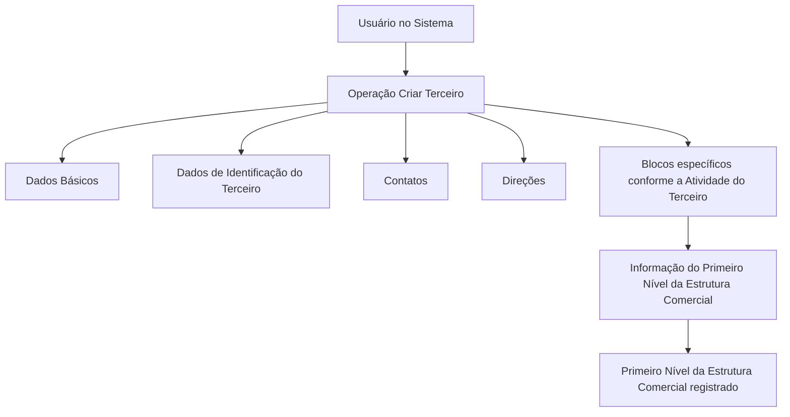

# Operação Criar — Primeiro Nível da Estrutura Comercial no Sistema

## 1. Metadados do Documento
- **Arquivo de Origem:** Não identificado no conteúdo fornecido
- **Tipo de Documento:** Procedimento
- **Domínio / Sistema:** Estrutura Comercial / Dados de Terceiros
- **Público-Alvo:** Usuários do Sistema responsáveis pelo cadastro da Estrutura Comercial
- **Data/Versão Identificada:** Não identificada

---

## 2. Resumo Executivo & Contexto de Negócio

O documento descreve a operação **Criar**, destinada ao registro, no Sistema, das informações dos **Primeiros Níveis da Estrutura Comercial** configurados na Companhia. Esses primeiros níveis são exemplificados como **Pessoas Jurídicas**.

A operação depende da habilitação do **Novo Modelo de Dados de Terceiros** para uso pela Companhia. O documento estabelece como premissa que os Primeiros Níveis da Estrutura Comercial da Entidade Asseguradora serão sempre cadastrados como Pessoas Jurídicas.

O registro utiliza blocos de informação compartilhados da operação **Criar Terceiro**, incluindo Dados Básicos, Dados de Identificação do Terceiro, Contatos e Direções. Também existe um bloco específico denominado **Informação do Primeiro Nível da Estrutura Comercial**, aplicável conforme a atividade do Terceiro.

A obrigatoriedade, habilitação e comportamento dos campos podem variar conforme o código de atividade do Terceiro e conforme personalizações implementadas. O documento também informa que a ordem de captura dos dados nos diferentes blocos pode variar conforme o critério seguido pelo Usuário no Sistema.

---

## 3. Arquitetura, Componentes & Tecnologias Envolvidas

O conteúdo não descreve uma arquitetura técnica de infraestrutura, microsserviços, APIs, bancos de dados, URLs de ambientes ou tecnologias de implementação. O fluxo identificado é funcional e envolve o Sistema, a operação Criar Terceiro, blocos de informação compartilhados e informações específicas relacionadas à atividade do Terceiro.



| Componente / Conceito | Função identificada | Detalhamento disponível |
| :--- | :--- | :--- |
| Sistema | Realiza o registro das informações dos Primeiros Níveis da Estrutura Comercial. | O nome do Sistema não é informado. |
| Operação Criar | Permite registrar informações dos Primeiros Níveis da Estrutura Comercial. | A operação aparece associada ao processo Criar Terceiro. |
| Criar Terceiro | Agrupa blocos de informação compartilhados para criação do Terceiro. | Métodos, telas, contratos e validações detalhadas não são informados. |
| Novo Modelo de Dados de Terceiros | Premissa para utilização da operação pela Companhia. | Estrutura técnica e regras internas não são detalhadas. |
| Informação do Primeiro Nível da Estrutura Comercial | Bloco específico relacionado à atividade do Terceiro. | Campos do bloco não são detalhados. |

> *Nota de Análise: o documento menciona “APIs”, “Documentação” e “Zeus” apenas na extração visual de navegação, sem explicar relações funcionais ou técnicas com a operação Criar. Portanto, não há base documental para caracterizá-los como componentes da solução.*

---

## 4. Regras de Negócio, Especificações Funcionais & Processos

### 4.1 Objetivo da operação

A operação **Criar** permite registrar no Sistema as informações dos Primeiros Níveis da Estrutura Comercial configurados na Companhia. O documento apresenta Pessoas Jurídicas como exemplo desses níveis.

### 4.2 Premissas

1. O **Novo Modelo de Dados de Terceiros** deve estar habilitado para ser utilizado pela Companhia.
2. Os Primeiros Níveis da Estrutura Comercial da Entidade Asseguradora devem ser criados sempre como **Pessoas Jurídicas**.
3. A obrigatoriedade e/ou habilitação de campos no registro dos dados pode variar conforme o código de atividade do Terceiro.
4. Personalizações implementadas podem afetar o comportamento da aplicação quanto à obrigatoriedade no registro dos Dados do Terceiro.
5. A ordem de captura dos dados em diferentes blocos de informação pode variar conforme o critério adotado pelo Usuário no Sistema.

### 4.3 Processo funcional identificado

1. O Usuário inicia a operação **Criar Terceiro**.
2. O Usuário registra os blocos de informação compartilhados:
   - Dados Básicos;
   - Dados de Identificação do Terceiro;
   - Contatos;
   - Direções.
3. O Usuário registra os blocos de informação específicos de acordo com a Atividade do Terceiro.
4. Entre as informações específicas, o processo inclui a **Informação do Primeiro Nível da Estrutura Comercial**.
5. A exigência ou disponibilidade dos campos depende do código de atividade do Terceiro e pode ser alterada por personalizações da aplicação.
6. A sequência de preenchimento dos blocos pode variar de acordo com o critério do Usuário.

### 4.4 Restrições e ausência de detalhamento

- O documento não apresenta a lista de campos de Dados Básicos, Identificação, Contatos, Direções ou Informação do Primeiro Nível da Estrutura Comercial.
- O documento não apresenta códigos de atividade específicos nem o mapeamento entre cada código e os campos obrigatórios/habilitados.
- O documento não detalha regras de validação, mensagens de erro, permissões, estados do cadastro, persistência ou aprovação.
- O documento não informa métodos HTTP, contratos JSON, endpoints ou integrações técnicas.

---

## 5. Tabelas de Parâmetros, Ambientes e Estruturas de Dados

| Item / Parâmetro | Descrição / Função | Tipo / Valores / Formato | Ambiente / Observações |
| :--- | :--- | :--- | :--- |
| Operação Criar | Registra no Sistema informações dos Primeiros Níveis da Estrutura Comercial. | Operação funcional | Associada ao processo Criar Terceiro. |
| Primeiro Nível da Estrutura Comercial | Nível da estrutura comercial configurada na Companhia. | Deve ser criado como Pessoa Jurídica. | Aplicável à Entidade Asseguradora. |
| Novo Modelo de Dados de Terceiros | Modelo de dados que deve estar habilitado para uso pela Companhia. | Premissa de utilização | O documento não detalha configuração, versão ou estrutura. |
| Código de atividade do Terceiro | Critério que pode influenciar a obrigatoriedade e/ou habilitação de campos. | Código não especificado | Não há relação de códigos ou regras por código. |
| Personalizações implementadas | Implementações que podem afetar o comportamento da aplicação. | Não especificado | Podem alterar a obrigatoriedade do registro dos Dados do Terceiro. |
| Dados Básicos | Bloco de informação compartilhado no processo Criar Terceiro. | Estrutura não detalhada | Campos não informados. |
| Dados de Identificação do Terceiro | Bloco de informação compartilhado no processo Criar Terceiro. | Estrutura não detalhada | Campos não informados. |
| Contatos | Bloco de informação compartilhado no processo Criar Terceiro. | Estrutura não detalhada | Campos não informados. |
| Direções | Bloco de informação compartilhado no processo Criar Terceiro. | Estrutura não detalhada | O documento utiliza o termo “Direcciones”. |
| Informação do Primeiro Nível da Estrutura Comercial | Bloco específico relacionado à atividade do Terceiro. | Estrutura não detalhada | Inserido como informação específica no fluxo. |
| Ordem de captura dos dados | Sequência de preenchimento dos blocos de informação. | Variável | Pode variar conforme o critério seguido pelo Usuário no Sistema. |

---

## 6. Bateria de Perguntas & Respostas para RAG (FAQ Sintético)

### P1: Qual é o objetivo da operação Criar no contexto da Estrutura Comercial?
**R:** A operação Criar permite registrar no Sistema as informações dos Primeiros Níveis da Estrutura Comercial configurados na Companhia. O documento exemplifica esses primeiros níveis como Pessoas Jurídicas.

### P2: Qual é a premissa relacionada ao modelo de dados para utilizar a operação?
**R:** O Novo Modelo de Dados de Terceiros deve estar habilitado para ser utilizado pela Companhia. O documento não informa como essa habilitação é realizada nem quais configurações técnicas são necessárias.

### P3: Como os Primeiros Níveis da Estrutura Comercial da Entidade Asseguradora devem ser cadastrados?
**R:** Os Primeiros Níveis da Estrutura Comercial da Entidade Asseguradora devem ser sempre criados como Pessoas Jurídicas.

### P4: Quais blocos de informação compartilhados fazem parte do processo Criar Terceiro?
**R:** O processo Criar Terceiro inclui os blocos compartilhados Dados Básicos, Dados de Identificação do Terceiro, Contatos e Direções. O documento não detalha os campos contidos em cada bloco.

### P5: Existe um bloco específico para registrar informações do Primeiro Nível da Estrutura Comercial?
**R:** Sim. O documento identifica o bloco “Informação do Primeiro Nível da Estrutura Comercial” como uma informação específica, aplicável de acordo com a Atividade do Terceiro.

### P6: O código de atividade do Terceiro influencia o cadastro?
**R:** Sim. A obrigatoriedade e/ou a habilitação dos campos no registro dos dados dos blocos ou estruturas de informação compartilhadas pode variar de acordo com o código de atividade do Terceiro.

### P7: Personalizações podem alterar a obrigatoriedade dos campos?
**R:** Sim. O documento informa que personalizações implementadas podem afetar o comportamento da aplicação em relação à obrigatoriedade do registro dos Dados do Terceiro.

### P8: Os blocos de informação precisam ser preenchidos em uma ordem fixa?
**R:** Não necessariamente. O documento afirma que a ordem de captura dos dados nos diferentes blocos de informação pode variar conforme o critério seguido pelo Usuário no Sistema.

### P9: O documento informa quais campos são obrigatórios para cada código de atividade?
**R:** Não. O documento informa apenas que a obrigatoriedade e a habilitação podem variar conforme o código de atividade do Terceiro, sem listar códigos, campos ou matrizes de obrigatoriedade.

### P10: O documento descreve APIs, endpoints ou contratos de integração para a operação Criar?
**R:** Não. Apesar de a extração visual apresentar referências a “APIs”, “Documentação” e “Zeus”, o conteúdo não detalha endpoints, métodos HTTP, contratos JSON, autenticação ou integrações relacionadas à operação Criar.

---

## 7. Glossário de Termos, Siglas & Conceitos-Chave

- **Atividade do Terceiro:** Critério associado ao Terceiro que pode determinar a obrigatoriedade e/ou habilitação de campos nos blocos de informação.
- **Blocos de Informação Compartilhados:** Estruturas de informação utilizadas na operação Criar Terceiro, incluindo Dados Básicos, Dados de Identificação do Terceiro, Contatos e Direções.
- **Companhia:** Organização na qual a Estrutura Comercial está configurada e que utiliza o Novo Modelo de Dados de Terceiros.
- **Criar Terceiro:** Processo que reúne blocos de informação compartilhados para criação do Terceiro.
- **Dados do Terceiro:** Informações registradas para o Terceiro nos blocos ou estruturas de informação.
- **Entidade Asseguradora:** Entidade para a qual os Primeiros Níveis da Estrutura Comercial devem ser criados como Pessoas Jurídicas.
- **Estrutura Comercial:** Estrutura configurada na Companhia, composta por níveis comerciais, incluindo Primeiros Níveis.
- **Novo Modelo de Dados de Terceiros:** Modelo de dados que deve estar habilitado para uso pela Companhia.
- **Pessoa Jurídica:** Tipo de entidade exigido para a criação dos Primeiros Níveis da Estrutura Comercial da Entidade Asseguradora.
- **Primeiro Nível da Estrutura Comercial:** Nível da Estrutura Comercial cuja informação é registrada pela operação Criar.
- **Terceiro:** Entidade cujos dados são criados e registrados por meio do processo Criar Terceiro.

---

## 8. Notas Críticas, Riscos & Limitações

- O documento não identifica o nome do Sistema, a versão, a data, o autor ou o arquivo de origem.
- A operação depende de o Novo Modelo de Dados de Terceiros estar habilitado para a Companhia, mas o procedimento de habilitação não é apresentado.
- A obrigatoriedade e habilitação dos campos podem variar por código de atividade do Terceiro, porém o documento não fornece os códigos, os campos envolvidos nem uma matriz de regras.
- Personalizações podem modificar o comportamento da aplicação relativo à obrigatoriedade de Dados do Terceiro. Isso implica que o comportamento pode diferir entre implantações, mas o documento não relaciona as personalizações existentes.
- Não há detalhamento de campos, regras de validação, mensagens de erro, permissões, integrações, APIs, URLs, ambientes, logs ou mecanismos de auditoria.
- A ordem de captura de dados pode variar conforme o critério do Usuário, sem que o documento estabeleça uma sequência obrigatória de preenchimento.

---

## 9. Conteúdo Bruto Estruturado (Referência Fiel)

```text
--- [PÁGINA 1 DE 2] ---

OPERACIÓN CREAR Primer Nivel de la
Estructura Comercial
¿En que consiste?
Esta operación permite registrar en el Sistema la Información de los Primeros Niveles de la
Estructura Comercial (como Personas Jurídicas) configurados en la Compañía.
Premisas
El Nuevo Modelo de Datos de Terceros está habilitado para ser utilizado por la Compañía
Los Primeros Niveles de la Estructura Comercial de la Entidad Aseguradora siempre se crearán
como Personas Jurídicas.
La obligatoriedad y/o la habilitación de los campos en el registro de los datos de cada uno de
los bloques o estructuras de información compartidas puede variar de acuerdo con el código de
actividad del Tercero:
Las personalizaciones que se hubieran podido implementar a su vez pueden afectar el
comportamiento de la aplicación en relación con la obligatoriedad en el registro de los Datos del
Tercero.
Ejemplo:
 / 
 RS
Inicio Soluciones APIs Documentación Zeus
ES


--- [PÁGINA 2 DE 2] ---

Por último, el orden de captura de los datos en los distintos bloques de Información puede
variar de acuerdo con el criterio seguido por el Usuario en el Sistema.
Proceso
CREAR
TERCERO
Crear Información
del Primer Nivel de la Estructura Comercial
Bloques de Información Compartidos (CREAR TERCERO)
 Datos Básicos ( )
 Datos Identificación del Tercero ( )
 Contactos ( )
 Direcciones ( )
Bloques de Información Específicos de acuerdo con la
Actividad del Tercero.
 Información del Primer Nivel la Estructura Comercial ( )
```
