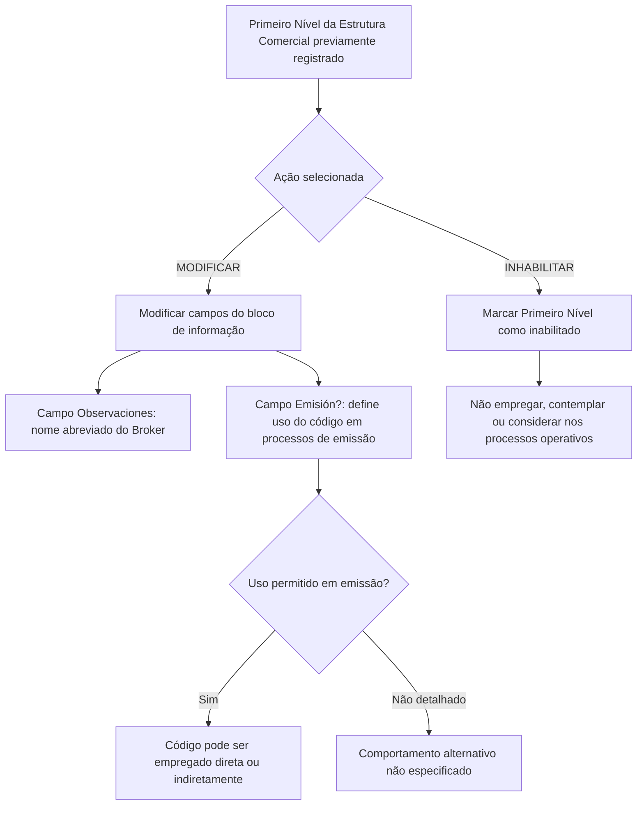

# Modificação e Inabilitação do Primeiro Nível da Estrutura Comercial

## 1. Metadados do Documento
- **Arquivo de Origem:** Não identificado
- **Tipo de Documento:** Manual Operacional
- **Domínio / Sistema:** Estrutura Comercial / processos operativos da entidade
- **Público-Alvo:** Operação, Negócio e Administradores de Estrutura Comercial
- **Data/Versão Identificada:** Não identificada

---

## 2. Resumo Executivo & Contexto de Negócio

O documento descreve uma operação destinada a modificar informações previamente registradas no Primeiro Nível da Estrutura Comercial de uma companhia. A operação também permite inabilitar esse nível estrutural.

As ações explicitamente disponíveis são **MODIFICAR** e **INHABILITAR**. A modificação segue uma sequência de preenchimento apresentada da esquerda para a direita e de cima para baixo no bloco de informações do Primeiro Nível da Estrutura Comercial.

O campo **Observaciones** contém o nome abreviado do Broker, previamente capturado em um bloco de informação não detalhado no trecho fornecido. O campo **Emisión?** controla se o código do Primeiro Nível da Estrutura Comercial pode ser utilizado direta ou indiretamente em processos de emissão.

A inabilitação informa ao sistema que o Primeiro Nível da Estrutura Comercial não deve ser empregado, contemplado ou considerado nos processos operativos da entidade. O documento não detalha telas, persistência de dados, permissões, validações técnicas, contratos de integração ou efeitos de reversão da inabilitação.

---

## 3. Arquitetura, Componentes & Tecnologias Envolvidas

O conteúdo fornecido não descreve arquitetura de software, tecnologias, microsserviços, bancos de dados, integrações, URLs, ambientes ou mecanismos de autenticação. Os componentes funcionais identificados são:

| Componente / Conceito | Descrição sustentada pelo documento |
| :--- | :--- |
| Sistema | Sistema que controla o uso do código do Primeiro Nível da Estrutura Comercial em processos de emissão e operativos. |
| Primeiro Nível da Estrutura Comercial | Nível estrutural previamente registrado cuja informação pode ser modificada ou inabilitada. |
| Broker | Entidade cujo nome abreviado é armazenado no campo `Observaciones`. |
| Processos de Emissão | Processos nos quais o código do Primeiro Nível pode ser empregado direta ou indiretamente quando permitido. |
| Processos Operativos da Entidade | Processos nos quais um Primeiro Nível inabilitado não deve ser empregado, contemplado ou considerado. |



> **Nota de Análise:** O diagrama representa apenas relações funcionais explicitamente descritas. O documento não detalha componentes técnicos, interfaces, armazenamento ou integrações.

---

## 4. Regras de Negócio, Especificações Funcionais & Processos

### 4.1 Objetivo da operação

A operação permite modificar as informações que o Primeiro Nível da Estrutura Comercial da companhia já possuía registradas. A mesma operação permite inabilitar o Primeiro Nível da Estrutura Comercial.

### 4.2 Ações disponíveis

- **MODIFICAR:** permite alterar a informação do Primeiro Nível da Estrutura Comercial previamente registrado.
- **INHABILITAR:** permite marcar o Primeiro Nível da Estrutura Comercial como inabilitado no sistema.

### 4.3 Sequência de modificação

O documento estabelece que os campos do bloco de informação devem ser percorridos na sequência:

1. Da esquerda para a direita.
2. De cima para baixo.

O trecho fornecido não apresenta a lista completa dos campos, os critérios de obrigatoriedade, valores válidos ou mensagens de erro.

### 4.4 Campo `Observaciones`

O campo `Observaciones` contém o nome abreviado do Broker. Esse nome abreviado deve ter sido capturado previamente em um bloco de informação mencionado pelo documento.

> **Nota de Análise:** O trecho não identifica o nome do bloco de informação anterior, o formato do nome abreviado, o tamanho do campo ou regras de validação.

### 4.5 Campo `Emisión?`

O campo `Emisión?` determina o comportamento do sistema quanto ao emprego do código do Primeiro Nível da Estrutura Comercial em processos de emissão.

- Quando o comportamento permitir o uso, o código pode ser empregado **direta ou indiretamente** nos processos de emissão.
- O documento não especifica valores possíveis para o campo, como `Sim/Não`, nem detalha o comportamento quando o emprego não é permitido.

### 4.6 Inabilitação

A inabilitação sinaliza ao sistema que o Primeiro Nível da Estrutura Comercial está inabilitado. Quando inabilitado:

- Não deve ser empregado nos processos operativos da entidade.
- Não deve ser contemplado nos processos operativos da entidade.
- Não deve ser considerado nos processos operativos da entidade.

> **Nota de Análise:** O documento não informa se a inabilitação bloqueia registros já existentes, se pode ser revertida, quais processos específicos são impactados ou se existe validação de dependências antes da inabilitação.

---

## 5. Tabelas de Parâmetros, Ambientes e Estruturas de Dados

| Item / Parâmetro | Descrição / Função | Tipo / Valores / Formato | Ambiente / Observações |
| :--- | :--- | :--- | :--- |
| Ação `MODIFICAR` | Modifica informações previamente registradas do Primeiro Nível da Estrutura Comercial. | Ação operacional. | Não são detalhados critérios de alteração ou confirmação. |
| Ação `INHABILITAR` | Inabilita o Primeiro Nível da Estrutura Comercial no sistema. | Ação operacional. | O nível inabilitado não deve ser empregado, contemplado ou considerado operacionalmente. |
| Primeiro Nível da Estrutura Comercial | Nível da estrutura comercial da companhia sujeito à modificação ou inabilitação. | Entidade funcional. | Deve estar previamente registrado. |
| `Observaciones` | Armazena o nome abreviado do Broker. | Campo; formato não especificado. | O nome abreviado foi capturado previamente em outro bloco de informação. |
| `Emisión?` | Determina se o código do Primeiro Nível pode ser usado em processos de emissão. | Campo; valores não especificados. | O uso pode ocorrer de forma direta ou indireta. |
| Código do Primeiro Nível | Código associado ao Primeiro Nível da Estrutura Comercial. | Código; formato não especificado. | Pode ser utilizado em processos de emissão conforme o comportamento definido por `Emisión?`. |
| Inabilitação | Estado que informa ao sistema que o Primeiro Nível está inabilitado. | Estado funcional; valores não especificados. | Impede que o nível seja empregado, contemplado ou considerado em processos operativos. |
| Processos de Emissão | Processos que podem utilizar o código do Primeiro Nível. | Processo de negócio. | Uso direto ou indireto condicionado ao campo `Emisión?`. |
| Processos Operativos da Entidade | Processos nos quais níveis inabilitados não devem ser considerados. | Processo de negócio. | O documento não lista quais processos pertencem a esse conjunto. |

---

## 6. Bateria de Perguntas & Respostas para RAG (FAQ Sintético)

### P1: Qual é o objetivo da operação de modificação do Primeiro Nível da Estrutura Comercial?
**R:** A operação permite modificar a informação previamente registrada para o Primeiro Nível da Estrutura Comercial de uma companhia. A operação também permite inabilitar esse Primeiro Nível no sistema.

### P2: Quais ações podem ser realizadas na operação descrita?
**R:** O documento identifica duas ações possíveis: `MODIFICAR` e `INHABILITAR`. `MODIFICAR` altera informações previamente registradas, enquanto `INHABILITAR` informa ao sistema que o Primeiro Nível da Estrutura Comercial está inabilitado.

### P3: Em qual ordem os campos devem ser modificados no bloco de informação?
**R:** Os campos devem seguir a sequência da esquerda para a direita e de cima para baixo. O documento não apresenta todos os campos existentes nem suas regras de obrigatoriedade.

### P4: O que deve ser informado no campo Observaciones?
**R:** O campo `Observaciones` contém o nome abreviado do Broker. O documento informa que esse nome abreviado já deve ter sido capturado em um bloco de informação anterior, não detalhado no trecho disponibilizado.

### P5: Qual é a função do campo Emisión??
**R:** O campo `Emisión?` determina o comportamento do sistema quanto à possibilidade de utilizar o código do Primeiro Nível da Estrutura Comercial nos processos de emissão. Quando permitido, o código pode ser empregado direta ou indiretamente nesses processos.

### P6: Um código de Primeiro Nível pode ser usado indiretamente em processos de emissão?
**R:** Sim. O documento afirma que o campo `Emisión?` pode permitir que o código do Primeiro Nível da Estrutura Comercial seja empregado direta ou indiretamente nos processos de emissão.

### P7: O que acontece quando o Primeiro Nível da Estrutura Comercial é inabilitado?
**R:** Quando o Primeiro Nível está inabilitado, o sistema deve tratá-lo como não utilizável nos processos operativos da entidade. O nível não deve ser empregado, contemplado ou considerado nesses processos.

### P8: O documento define quais valores podem ser usados no campo Emisión??
**R:** Não. O documento descreve somente a finalidade do campo `Emisión?`, mas não especifica valores permitidos, formato, obrigatoriedade ou o comportamento exato quando o uso em emissão não é permitido.

### P9: O documento detalha como reabilitar um Primeiro Nível inabilitado?
**R:** Não. O conteúdo fornecido descreve a ação de inabilitação, mas não apresenta procedimento, ação específica ou regra para reabilitação.

### P10: Quais processos operativos são afetados pela inabilitação?
**R:** O documento estabelece genericamente que o Primeiro Nível inabilitado não deve ser empregado, contemplado ou considerado nos processos operativos da entidade. Os processos operativos específicos não são identificados.

---

## 7. Glossário de Termos, Siglas & Conceitos-Chave

- **Broker:** entidade cujo nome abreviado é armazenado no campo `Observaciones`.
- **Emisión:** processo de emissão no qual o código do Primeiro Nível da Estrutura Comercial pode ser utilizado direta ou indiretamente, conforme o comportamento definido pelo campo `Emisión?`.
- **Estrutura Comercial:** estrutura organizacional ou funcional que possui um Primeiro Nível passível de modificação e inabilitação.
- **Inabilitação:** estado que informa ao sistema que o Primeiro Nível da Estrutura Comercial não deve ser empregado, contemplado ou considerado nos processos operativos da entidade.
- **Primeiro Nível da Estrutura Comercial:** nível da estrutura comercial da companhia que é previamente registrado e pode ser modificado ou inabilitado.
- **Processos Operativos:** processos da entidade nos quais um Primeiro Nível inabilitado não deve ser usado ou considerado.

---

## 8. Notas Críticas, Riscos & Limitações

- O arquivo de origem, a data, a versão e o sistema proprietário não foram identificados no conteúdo fornecido.
- O documento não apresenta valores válidos, obrigatoriedade, formato ou validações para os campos `Observaciones` e `Emisión?`.
- O conteúdo não especifica quais processos de emissão e quais processos operativos são afetados.
- Não há detalhamento sobre perfis de acesso, autorização para modificar ou inabilitar, trilha de auditoria, persistência, integração ou tratamento de erros.
- Não há procedimento documentado para reabilitar um Primeiro Nível da Estrutura Comercial.
- As referências textuais `CF`, `Home Solutions APIs Documentation Zeus` e `EN` aparecem no material bruto, mas não possuem contexto funcional suficiente para definição segura.

---

## 9. Conteúdo Bruto Estruturado (Referência Fiel)

```text
--- [PÁGINA 1 DE 2] ---

MODIFICAR Información específica del Primer
Nivel de la Estructura Comercial
Objetivo
Esta Operación permite Modificar la información que tuviera el Primer Nivel de la Estructura
Comercial de la compañía registrada previamente además de poder Inhabilitarlo.
Posibles Acciones
 MODIFICAR ( )
 INHABILITAR ( )
Datos Primer Nivel Estructura Comercial
De Izquierda a Derecha y de Arriba hacia Abajo, los siguientes campos marcan la secuencia de
Modificación en este Bloque de Información.
Observaciones ( )
Este campo contiene el nombre abreviado del Broker, que se habrá capturado en el Bloque de
Información
 / 
 CF
Home Solutions APIs Documentation Zeus
EN


--- [PÁGINA 2 DE 2] ---

Emisión? ( )
Este campo determina el comportamiento del Sistema permitiendo que el código del primer nivel de
la estructura comercial se pueda emplear, directa o indirectamente, en los procesos de Emisión.
Inhabilitación ( )
Este campo le indica al Sistema que el Primer Nivel de la Estructura Comercial está inhabilitado en el
Sistema por lo cual, de estarlo, no debería ser empleado, contemplado o considerado en los
procesos operativos de la entidad.
```
