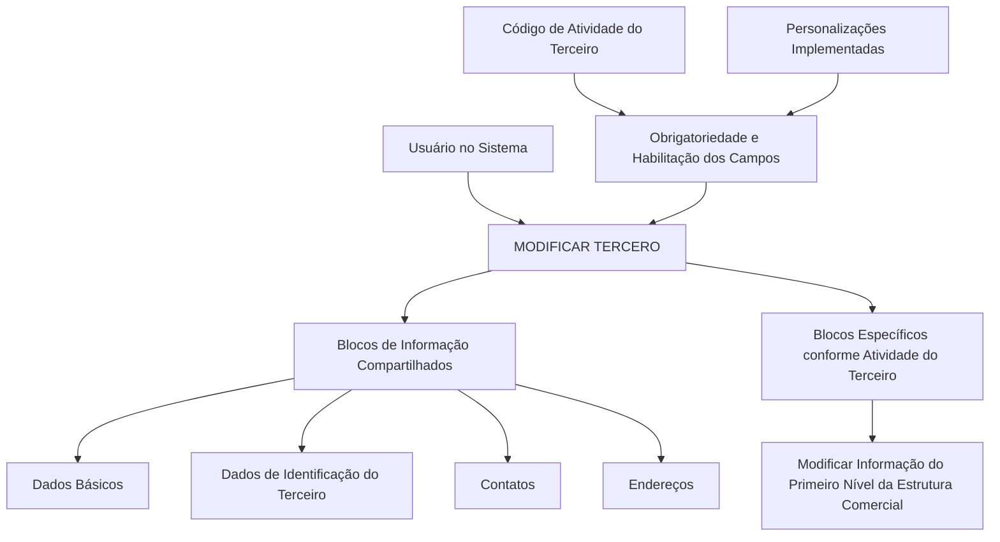
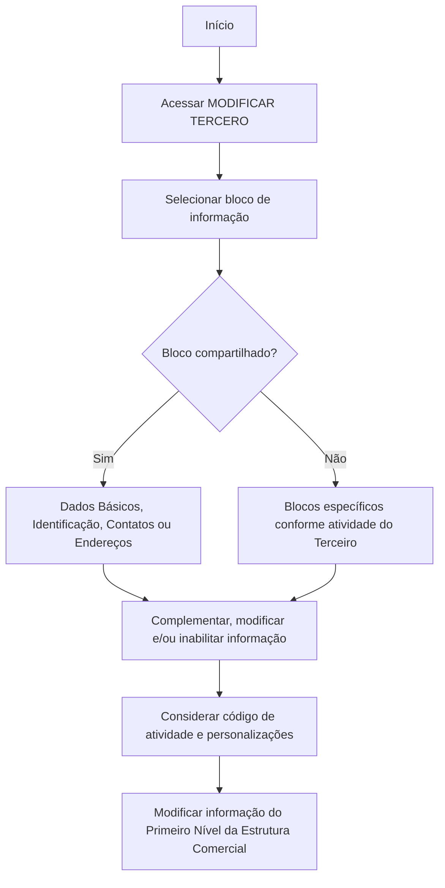

# Operação MODIFICAR TERCEIRO — Modificação do Primeiro Nível da Estrutura Comercial

## 1. Metadados do Documento
- **Arquivo de Origem:** Não identificado
- **Tipo de Documento:** Procedimento
- **Domínio / Sistema:** MODIFICAR TERCERO / Estrutura Comercial
- **Público-Alvo:** Usuários do sistema e operação
- **Data/Versão Identificada:** Não identificada

---

## 2. Resumo Executivo & Contexto de Negócio

O documento descreve a operação de complementar, modificar e/ou inabilitar informações do Primeiro Nível da Estrutura Comercial. A alteração pode ocorrer em qualquer estrutura de dados que contenha e agrupe essas informações.

A operação está inserida na funcionalidade **MODIFICAR TERCERO**, que organiza os dados em blocos de informação compartilhados e em blocos específicos conforme a atividade do Terceiro. Os blocos compartilhados apresentados incluem Dados Básicos, Dados de Identificação do Terceiro, Contatos e Endereços.

A obrigatoriedade e a habilitação dos campos não são uniformes: elas podem variar conforme o código de atividade do Terceiro. Personalizações implementadas no sistema também podem modificar o comportamento relacionado à obrigatoriedade de preenchimento dos Dados do Terceiro.

O documento também informa que a ordem de captura dos dados nos blocos de informação pode variar segundo o critério utilizado pelo usuário no sistema. Não são detalhados contratos de integração, métodos HTTP, regras de persistência, validações de campo específicas ou fluxos de aprovação.

---

## 3. Arquitetura, Componentes & Tecnologias Envolvidas

Os componentes funcionais explicitamente citados são:

| Componente | Papel identificado |
| :--- | :--- |
| MODIFICAR TERCERO | Funcionalidade que concentra blocos de informação do Terceiro. |
| Primeiro Nível da Estrutura Comercial | Informação que pode ser complementada, modificada ou inabilitada. |
| Dados Básicos | Bloco de informação compartilhado. |
| Dados de Identificação do Terceiro | Bloco de informação compartilhado. |
| Contatos | Bloco de informação compartilhado. |
| Endereços | Bloco de informação compartilhado. |
| Blocos específicos por atividade do Terceiro | Estruturas de informação condicionadas à atividade do Terceiro. |
| Código de atividade do Terceiro | Critério que pode alterar obrigatoriedade e habilitação de campos. |
| Personalizações | Implementações que podem afetar a obrigatoriedade de registro dos Dados do Terceiro. |



> **Nota de Análise:** o documento não identifica tecnologias, banco de dados, interfaces, APIs, URLs, ambientes, servidores, contratos de dados ou mecanismos de integração.

---

## 4. Regras de Negócio, Especificações Funcionais & Processos

### Escopo da operação

A operação consiste em executar uma ou mais das seguintes ações sobre informações do Primeiro Nível da Estrutura Comercial:

1. Complementar informações.
2. Modificar informações.
3. Inabilitar informações.

As ações podem ser realizadas em qualquer estrutura de dados que contenha e agrupe as informações do Primeiro Nível da Estrutura Comercial.

### Premissas para preenchimento e edição

1. A obrigatoriedade dos campos pode variar conforme o código de atividade do Terceiro.
2. A habilitação dos campos pode variar conforme o código de atividade do Terceiro.
3. Personalizações implementadas podem afetar o comportamento da aplicação relativo à obrigatoriedade de preenchimento dos Dados do Terceiro.
4. A ordem de captura de dados nos blocos de informação pode variar de acordo com o critério do usuário no sistema.
5. O documento relaciona a modificação do Primeiro Nível da Estrutura Comercial à funcionalidade **MODIFICAR TERCERO**.
6. O documento apresenta blocos compartilhados e blocos específicos conforme a atividade do Terceiro, mas não especifica os campos internos, critérios de validação ou resultados esperados para cada ação de complementar, modificar ou inabilitar.

### Fluxo funcional identificado



> **Nota de Análise:** o documento não detalha as etapas de confirmação, gravação, aprovação, rejeição, auditoria ou tratamento de erro após a modificação.

---

## 5. Tabelas de Parâmetros, Ambientes e Estruturas de Dados

| Item / Parâmetro | Descrição / Função | Tipo / Valores / Formato | Ambiente / Observações |
| :--- | :--- | :--- | :--- |
| Primeiro Nível da Estrutura Comercial | Informação-alvo da operação descrita. | Complementar, modificar e/ou inabilitar. | Pode existir em qualquer estrutura de dados que a contenha e agrupe. |
| Código de atividade do Terceiro | Critério que influencia campos do registro de dados. | Código de atividade; formato não informado. | Pode alterar obrigatoriedade e habilitação dos campos. |
| Personalizações implementadas | Implementações que podem afetar o comportamento da aplicação. | Não informado. | Podem afetar a obrigatoriedade de registro dos Dados do Terceiro. |
| Dados Básicos | Bloco de informação compartilhado em MODIFICAR TERCERO. | Campos não detalhados. | Associado à modificação de Terceiro. |
| Dados de Identificação do Terceiro | Bloco de informação compartilhado em MODIFICAR TERCERO. | Campos não detalhados. | Associado à modificação de Terceiro. |
| Contatos | Bloco de informação compartilhado em MODIFICAR TERCERO. | Campos não detalhados. | Associado à modificação de Terceiro. |
| Endereços | Bloco de informação compartilhado em MODIFICAR TERCERO. | Campos não detalhados. | Associado à modificação de Terceiro. |
| Blocos específicos conforme atividade do Terceiro | Estruturas de informação dependentes da atividade do Terceiro. | Não informado. | O documento não detalha os blocos ou campos específicos. |
| Ordem de captura de dados | Sequência usada pelo usuário para registrar dados em diferentes blocos. | Variável. | Pode variar segundo o critério do usuário no sistema. |

---

## 6. Bateria de Perguntas & Respostas para RAG (FAQ Sintético)

### P1: Em que consiste a operação de modificar o Primeiro Nível da Estrutura Comercial?
**R:** A operação consiste em complementar, modificar e/ou inabilitar as informações do Primeiro Nível da Estrutura Comercial em qualquer estrutura de dados que contenha e agrupe essas informações.

### P2: Qual funcionalidade concentra os blocos de informação mencionados no procedimento?
**R:** O procedimento apresenta os blocos de informação no contexto da funcionalidade **MODIFICAR TERCERO**.

### P3: Quais blocos de informação compartilhados são citados em MODIFICAR TERCERO?
**R:** Os blocos compartilhados citados são Dados Básicos, Dados de Identificação do Terceiro, Contatos e Endereços.

### P4: O código de atividade do Terceiro influencia o preenchimento de campos?
**R:** Sim. A obrigatoriedade e/ou a habilitação dos campos no registro de dados de cada bloco ou estrutura de informação compartilhada podem variar conforme o código de atividade do Terceiro.

### P5: As personalizações do sistema podem alterar o comportamento dos campos?
**R:** Sim. Personalizações implementadas podem afetar o comportamento da aplicação em relação à obrigatoriedade do registro dos Dados do Terceiro.

### P6: Existe uma ordem obrigatória para capturar os dados nos blocos de informação?
**R:** Não. O documento informa que a ordem de captura dos dados nos diferentes blocos pode variar de acordo com o critério seguido pelo usuário no sistema.

### P7: O documento descreve os campos internos de Dados Básicos, Contatos ou Endereços?
**R:** Não. O documento apenas lista Dados Básicos, Dados de Identificação do Terceiro, Contatos e Endereços como blocos de informação compartilhados; os campos internos não são detalhados.

### P8: O procedimento informa como inabilitar uma informação da Estrutura Comercial?
**R:** O procedimento declara que a operação pode inabilitar informações do Primeiro Nível da Estrutura Comercial, mas não apresenta passos específicos, validações ou critérios para executar a inabilitação.

### P9: Há informações sobre APIs, URLs, ambientes ou servidores?
**R:** Não. O conteúdo fornecido não especifica APIs, métodos HTTP, URLs, ambientes, servidores, portas, tecnologias ou contratos de integração.

### P10: Os blocos específicos são iguais para todos os Terceiros?
**R:** Não é possível afirmar que sejam iguais. O documento indica que existem blocos de informação específicos de acordo com a atividade do Terceiro, mas não detalha quais são esses blocos.

---

## 7. Glossário de Termos, Siglas & Conceitos-Chave

- **MODIFICAR TERCERO:** Funcionalidade citada como contexto para os blocos de informação compartilhados e específicos relacionados ao Terceiro.
- **Terceiro:** Entidade cujos dados são registrados e modificados na funcionalidade apresentada. O documento não fornece definição adicional.
- **Primeiro Nível da Estrutura Comercial:** Informação comercial que pode ser complementada, modificada ou inabilitada.
- **Blocos de Informação Compartilhados:** Blocos apresentados como Dados Básicos, Dados de Identificação do Terceiro, Contatos e Endereços.
- **Blocos de Informação Específicos:** Blocos dependentes da atividade do Terceiro.
- **Código de atividade do Terceiro:** Critério que pode alterar a obrigatoriedade e a habilitação de campos.
- **Personalizações:** Implementações que podem afetar o comportamento da aplicação relativo à obrigatoriedade dos Dados do Terceiro.

---

## 8. Notas Críticas, Riscos & Limitações

- O documento não identifica o arquivo de origem, versão, data, sistema proprietário ou ambiente de execução.
- O documento não especifica campos, formatos, valores permitidos, regras de validação ou mensagens de erro.
- A obrigatoriedade e a habilitação de campos dependem do código de atividade do Terceiro, o que pode introduzir comportamentos distintos por contexto de uso.
- Personalizações podem alterar a obrigatoriedade de preenchimento, criando dependência de configurações não descritas no documento.
- A ordem de captura de dados pode variar segundo o critério do usuário, sem um fluxo obrigatório explicitamente definido.
- Não há detalhamento de persistência, aprovação, auditoria, segurança, permissões, integração ou rastreabilidade das alterações.
- Não há detalhamento adicional dos blocos específicos conforme a atividade do Terceiro.

---

## 9. Conteúdo Bruto Estruturado (Referência Fiel)

```text
--- [PÁGINA 1 DE 2] ---

OPERACIÓN MODIFICAR Primer Nivel de la
Estructura Comercial
¿En que consiste?
Esta operación consiste en Complementar, Modificar y/o Inhabilitar la información del Primer
Nivel de la Estructura Comercial en cualquiera de las estructuras de datos que la contienen y
agrupan.
Premisas
La obligatoriedad y/o la habilitación de los campos en el registro de los datos de cada uno de
los bloques o estructuras de información compartidas puede variar de acuerdo con el código de
actividad del Tercero:
Las personalizaciones que se hubieran podido implementar a su vez pueden afectar el
comportamiento de la aplicación en relación con la obligatoriedad en el registro de los Datos del
Tercero.
Por último, el orden de captura de los datos en los distintos bloques de Información puede
variar de acuerdo con el criterio seguido por el Usuario en el Sistema.
Proceso
Ejemplo:
 / 
 RS
Inicio Soluciones APIs Documentación Zeus
ES


--- [PÁGINA 2 DE 2] ---

MODIFICAR
TERCERO
Modificar Información
del Primer Nivel Estructura Comercial
Bloques de Información Compartidos (MODIFICAR TERCERO)
 Datos Básicos ( )
 Datos Identificación Tercero ( )
 Contactos (   )
 Direcciones (   )
Bloques de Información Específicos de acuerdo con la
Actividad del Tercero.
 Modificar Información del Primer Nivel de la Estructura Comercial(  )
```
