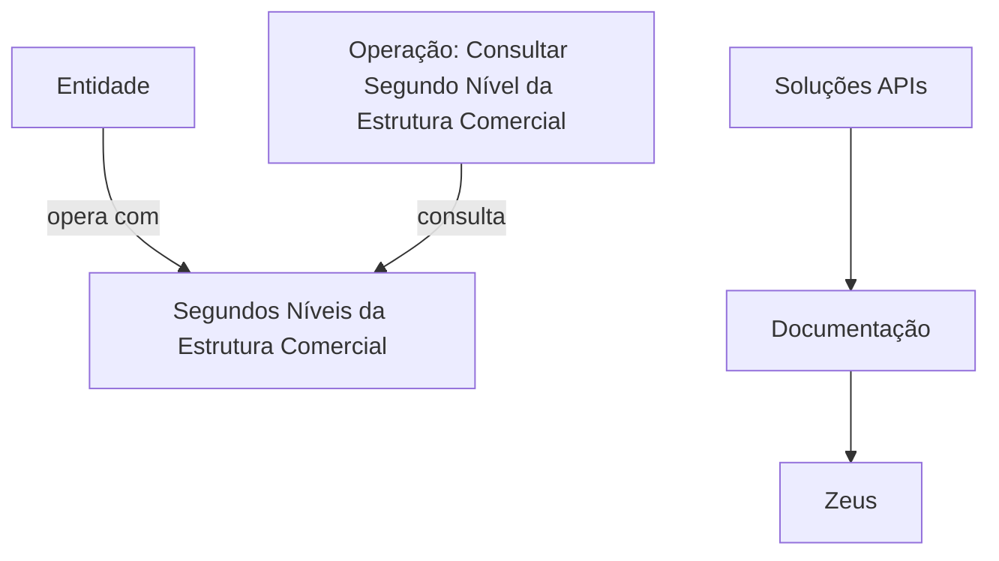

# Operação Consultar Segundo Nível da Estrutura Comercial

## 1. Metadados do Documento
- **Arquivo de Origem:** Não identificado
- **Tipo de Documento:** Não identificado; conteúdo aparenta ser uma página de documentação de API
- **Domínio / Sistema:** Estrutura Comercial / Soluções APIs / Zeus
- **Público-Alvo:** Desenvolvedores, Arquitetos, Operação
- **Data/Versão Identificada:** Não identificada

---

## 2. Resumo Executivo & Contexto de Negócio

O conteúdo descreve a operação **“Consultar Segundo Nivel de la Estructura Comercial”**. O propósito declarado é consultar os segundos níveis da Estrutura Comercial com os quais uma Entidade opera.

A fonte menciona o contexto de **Soluções APIs**, **Documentação** e **Zeus**, porém não especifica a arquitetura da solução, contratos de integração, métodos HTTP, formatos de mensagem ou mecanismos de autenticação.

O texto também apresenta referências de navegação ou identificação, incluindo `RS`, `ES` e `Inicio`. Não há explicação semântica para essas referências no conteúdo fornecido.

> **Nota de Análise:** O documento não detalha quais dados compõem um “segundo nível”, como uma Entidade é identificada, nem quais filtros ou critérios determinam a consulta.

---

## 3. Arquitetura, Componentes & Tecnologias Envolvidas

Os elementos explicitamente citados são:

| Componente / Termo | Papel identificado no conteúdo |
| :--- | :--- |
| Operação Consultar Segundo Nível da Estrutura Comercial | Operação destinada à consulta de segundos níveis da Estrutura Comercial associados à Entidade |
| Estrutura Comercial | Domínio consultado pela operação |
| Entidade | Organização ou objeto que opera com os segundos níveis consultados |
| Soluções APIs | Contexto de navegação ou catálogo indicado no conteúdo |
| Documentação | Contexto de navegação indicado no conteúdo |
| Zeus | Sistema, área ou referência citada sem detalhamento técnico |
| RS | Referência citada sem definição |
| ES | Referência citada sem definição |
| Inicio | Referência de navegação citada no conteúdo |



> **Nota de Análise:** O diagrama representa exclusivamente a relação semântica indicada pelo texto. O documento não apresenta componentes técnicos, endpoints, protocolos, bancos de dados, filas, serviços ou fluxos de integração.

---

## 4. Regras de Negócio, Especificações Funcionais & Processos

1. Existe uma operação denominada **“Consultar Segundo Nivel de la Estructura Comercial”**.
2. A finalidade declarada da operação é realizar a consulta dos **Segundos Níveis da Estrutura Comercial**.
3. A consulta está associada aos Segundos Níveis da Estrutura Comercial **com os quais a Entidade opera**.
4. O conteúdo não define:
   - o identificador da Entidade;
   - os critérios de busca;
   - os campos retornados;
   - as regras de autorização;
   - os métodos HTTP;
   - os contratos JSON, XML ou outro formato;
   - o tratamento de erros;
   - o comportamento para ausência de resultados;
   - os limites de paginação, ordenação ou filtragem.

> **Nota de Análise:** Não há detalhamento adicional de fluxo funcional além da finalidade de consulta apresentada.

---

## 5. Tabelas de Parâmetros, Ambientes e Estruturas de Dados

| Item / Parâmetro | Descrição / Função | Tipo / Valores / Formato | Ambiente / Observações |
| :--- | :--- | :--- | :--- |
| Operação | Consultar Segundo Nível da Estrutura Comercial | Nome da operação | Não são informados endpoint, método ou contrato |
| Objeto consultado | Segundos Níveis da Estrutura Comercial | Não especificado | Associados à Entidade que opera com esses níveis |
| Entidade | Referência à organização ou objeto relacionado à operação | Não especificado | Critérios de identificação não detalhados |
| Soluções APIs | Referência contextual de navegação | Texto | Sem detalhamento adicional |
| Documentação | Referência contextual de navegação | Texto | Sem detalhamento adicional |
| Zeus | Sistema, área ou referência citada | Texto | Sem definição funcional ou técnica |
| RS | Referência citada | Texto | Significado não identificado |
| ES | Referência citada | Texto | Significado não identificado |
| Inicio | Referência de navegação | Texto | Sem detalhamento adicional |

---

## 6. Bateria de Perguntas & Respostas para RAG (FAQ Sintético)

### P1: Qual é o objetivo da operação “Consultar Segundo Nivel de la Estructura Comercial”?
**R:** A operação tem como objetivo consultar os Segundos Níveis da Estrutura Comercial com os quais a Entidade opera.

### P2: O que a operação consulta?
**R:** A operação consulta os Segundos Níveis da Estrutura Comercial relacionados à operação da Entidade.

### P3: O documento informa quais campos são retornados pela consulta?
**R:** Não. O conteúdo não descreve campos de resposta, estrutura de dados, atributos dos segundos níveis ou formato do retorno.

### P4: Qual método HTTP deve ser utilizado para consultar a Estrutura Comercial?
**R:** O método HTTP não é informado no conteúdo fornecido.

### P5: Qual é o endpoint da operação de consulta do Segundo Nível da Estrutura Comercial?
**R:** O documento não informa URL, rota, endpoint ou ambiente de execução da operação.

### P6: Como a Entidade é identificada na consulta?
**R:** O conteúdo menciona a Entidade como participante da operação, mas não informa identificadores, parâmetros de entrada ou critérios de seleção.

### P7: O que significa Zeus neste documento?
**R:** Zeus é citado no conteúdo, mas não recebe definição funcional, técnica ou arquitetural adicional.

### P8: O documento descreve autenticação ou autorização para acessar a operação?
**R:** Não. Não há informações sobre autenticação, autorização, credenciais, perfis de acesso ou mecanismos de segurança.

### P9: Existem regras para tratar uma Entidade sem Segundos Níveis da Estrutura Comercial?
**R:** Não. O documento não descreve comportamento para consultas sem resultados, exceções ou mensagens de erro.

### P10: O conteúdo apresenta detalhes de integração entre Soluções APIs e Zeus?
**R:** Não. Soluções APIs, Documentação e Zeus são mencionados, mas não há fluxo técnico, contrato de integração ou dependência explicitamente descrita.

---

## 7. Glossário de Termos, Siglas & Conceitos-Chave

- **Estrutura Comercial:** Estrutura de domínio mencionada como objeto da consulta.
- **Segundo Nível da Estrutura Comercial:** Nível da Estrutura Comercial que a operação consulta para identificar aqueles com os quais a Entidade opera.
- **Entidade:** Referência ao elemento que opera com os Segundos Níveis da Estrutura Comercial; sem definição adicional.
- **Soluções APIs:** Referência contextual de navegação ou catálogo de APIs.
- **Zeus:** Termo citado sem definição no conteúdo fornecido.
- **RS:** Sigla ou referência citada sem significado identificado.
- **ES:** Sigla ou referência citada sem significado identificado.

---

## 8. Notas Críticas, Riscos & Limitações

- O conteúdo é extremamente resumido e não contém especificação técnica suficiente para implementar ou operar a consulta.
- Não foram identificados endpoint, método HTTP, parâmetros de entrada, estrutura de resposta, códigos de erro ou requisitos de autenticação.
- Não há versão, data, autor, proprietário funcional ou ambiente identificado.
- Os termos `RS`, `ES` e `Zeus` não são definidos pela fonte.
- Qualquer definição adicional sobre contratos, tecnologias, ambientes, regras de elegibilidade ou comportamento operacional exigiria uma fonte complementar.

---

## 9. Conteúdo Bruto Estruturado (Referência Fiel)

```text
--- [PÁGINA 1 DE 1] ---

OPERACIÓN CONSULTAR Segundo Nivel de la
Estructura Comercial
Consulta de los Segundos Niveles de la Estructura Comercial con las que opera la Entidad.
 / 
 RS
Inicio Soluciones APIs Documentación Zeus
ES
```
