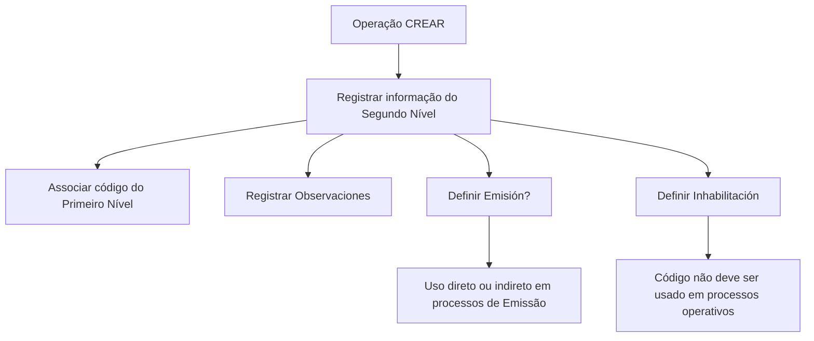

# Registro de Informação do Segundo Nível da Estrutura Comercial

## 1. Metadados do Documento
- **Arquivo de Origem:** Não identificado
- **Tipo de Documento:** Manual Operacional
- **Domínio / Sistema:** Estrutura Comercial — Segundo Nível
- **Público-Alvo:** Operação, Negócio e usuários responsáveis pela manutenção da estrutura comercial
- **Data/Versão Identificada:** Não identificada

---

## 2. Resumo Executivo & Contexto de Negócio

O documento descreve a operação **CREAR**, destinada ao registro de informações específicas dos **Segundos Níveis da Estrutura Comercial** configurados na Companhia. O exemplo citado para esse nível estrutural é o de Pessoas Jurídicas.

A operação relaciona cada chave de Segundo Nível a um código de Primeiro Nível da Estrutura Comercial. Essa dependência estabelece a hierarquia comercial que deve orientar o cadastro da informação.

O documento também apresenta campos para inclusão de observações, modulação do uso do código em processos de Emissão e inabilitação operacional. A inabilitação determina que o código não deve ser empregado, contemplado ou considerado nos processos operativos da entidade.

Não há detalhamento sobre interface, persistência de dados, métodos HTTP, contratos JSON, regras de autenticação, permissões, URLs, ambientes ou integrações técnicas.

---

## 3. Arquitetura, Componentes & Tecnologias Envolvidas

Os componentes e conceitos explicitamente citados são:

| Componente / Conceito | Papel identificado |
| :--- | :--- |
| Sistema | Registra as informações dos Segundos Níveis da Estrutura Comercial. |
| Companhia | Contexto organizacional em que a Estrutura Comercial é configurada. |
| Estrutura Comercial | Estrutura hierárquica que contém Primeiro Nível e Segundo Nível. |
| Primeiro Nível | Nível superior cujo código é associado à chave do Segundo Nível. |
| Segundo Nível | Entidade estrutural cadastrada pela operação CREAR. |
| Pessoas Jurídicas | Exemplo apresentado de Segundo Nível da Estrutura Comercial. |
| Processos de Emissão | Processos nos quais o código do Segundo Nível pode ser empregado direta ou indiretamente, conforme o campo Emisión?. |
| Processos operativos da entidade | Processos que não devem utilizar códigos marcados como inabilitados. |



> **Nota de Análise:** O documento não descreve tecnologias, microsserviços, bancos de dados, APIs, protocolos, ambientes ou mecanismos de integração.

---

## 4. Regras de Negócio, Especificações Funcionais & Processos

1. A operação apresentada é denominada **CREAR**.
2. A operação CREAR permite registrar no sistema informações dos Segundos Níveis da Estrutura Comercial configurados na Companhia.
3. Pessoas Jurídicas são citadas como exemplo de Segundo Nível da Estrutura Comercial.
4. O campo **Primer Nivel** deve conter o código do Primeiro Nível da Estrutura Comercial do qual depende a chave do Segundo Nível.
5. O campo **Observaciones** permite inserir texto esclarecedor ou observações relacionadas ao ato de criar o nível da Estrutura Comercial.
6. O campo **Emisión?** modula o comportamento do sistema para permitir que o código do Segundo Nível seja utilizado direta ou indiretamente em processos de Emissão.
7. O campo **Inhabilitación** informa ao sistema que o Segundo Nível da Estrutura Comercial está inabilitado.
8. Quando um Segundo Nível estiver inabilitado, seu código não deve ser empregado, contemplado ou considerado nos processos operativos da entidade.
9. O documento informa que os campos são apresentados em sequência de captura da esquerda para a direita e de cima para baixo.
10. O documento não detalha valores permitidos, obrigatoriedade, formato, validações de consistência, mensagens de erro ou comportamento de persistência dos campos.

---

## 5. Tabelas de Parâmetros, Ambientes e Estruturas de Dados

| Item / Parâmetro | Descrição / Função | Tipo / Valores / Formato | Ambiente / Observações |
| :--- | :--- | :--- | :--- |
| Ação habilitada | Executar o registro de informação do Segundo Nível da Estrutura Comercial. | `CREAR` | Única ação explicitamente apresentada. |
| Primer Nivel | Contém o código do Primeiro Nível da Estrutura Comercial do qual depende a chave do Segundo Nível. | Código; formato não detalhado | Campo apresentado no bloco “Datos Segundo Nivel Estructura Comercial”. |
| Observaciones | Permite inserir texto esclarecedor ou observações sobre a criação do nível. | Texto; formato e limite não detalhados | Relacionado ao fato de criar o nível da Estrutura Comercial. |
| Emisión? | Modula o comportamento do sistema quanto ao uso do código do Segundo Nível em processos de Emissão. | Valor não detalhado | O uso pode ser direto ou indireto. |
| Inhabilitación | Indica que o Segundo Nível está inabilitado no sistema. | Valor não detalhado | Quando inabilitado, o código não deve participar dos processos operativos. |
| Segundo Nível da Estrutura Comercial | Nível estrutural cuja informação é registrada pela operação CREAR. | Entidade de negócio; estrutura não detalhada | Pessoas Jurídicas são apresentadas como exemplo. |

---

## 6. Bateria de Perguntas & Respostas para RAG (FAQ Sintético)

### P1: Qual é o objetivo da operação CREAR na Estrutura Comercial?
**R:** A operação CREAR permite registrar no sistema informações específicas dos Segundos Níveis da Estrutura Comercial configurados na Companhia.

### P2: Qual entidade é apresentada como exemplo de Segundo Nível da Estrutura Comercial?
**R:** O documento apresenta Pessoas Jurídicas como exemplo de Segundo Nível da Estrutura Comercial.

### P3: Qual informação deve ser preenchida no campo Primer Nivel?
**R:** O campo Primer Nivel deve conter o código do Primeiro Nível da Estrutura Comercial do qual depende a chave do Segundo Nível.

### P4: Para que serve o campo Observaciones no cadastro do Segundo Nível?
**R:** O campo Observaciones permite inserir um texto esclarecedor ou observações relacionadas ao ato de criar o nível da Estrutura Comercial.

### P5: Qual é o efeito do campo Emisión? sobre o código do Segundo Nível?
**R:** O campo Emisión? modula o comportamento do sistema, permitindo que o código do Segundo Nível da Estrutura Comercial seja utilizado direta ou indiretamente nos processos de Emissão.

### P6: O que acontece quando o campo Inhabilitación indica que o Segundo Nível está inabilitado?
**R:** Quando o Segundo Nível está inabilitado, o sistema deve tratar seu código como não utilizável: o código não deve ser empregado, contemplado nem considerado nos processos operativos da entidade.

### P7: O documento define os valores possíveis para Emisión? e Inhabilitación?
**R:** Não. O documento explica a finalidade funcional dos campos Emisión? e Inhabilitación, mas não define seus valores permitidos, tipo de dado, formato ou regras de obrigatoriedade.

### P8: O documento descreve APIs, métodos HTTP ou contratos JSON para a operação CREAR?
**R:** Não. O documento descreve a finalidade operacional da ação CREAR e os campos do Segundo Nível da Estrutura Comercial, mas não detalha APIs, métodos HTTP, contratos JSON, URLs ou integrações.

### P9: Como o documento orienta a sequência de captura dos campos?
**R:** O documento informa que os campos devem ser considerados da esquerda para a direita e de cima para baixo como sequência de captura no bloco de informação.

### P10: Um código de Segundo Nível inabilitado pode ser usado em processos de Emissão?
**R:** O documento afirma que um código inabilitado não deve ser empregado, contemplado ou considerado nos processos operativos da entidade. Não há detalhamento adicional que relacione explicitamente a inabilitação ao comportamento específico dos processos de Emissão.

---

## 7. Glossário de Termos, Siglas & Conceitos-Chave

- **CREAR:** Ação habilitada para registrar informações dos Segundos Níveis da Estrutura Comercial.
- **Estrutura Comercial:** Estrutura configurada na Companhia, composta por níveis, incluindo Primeiro Nível e Segundo Nível.
- **Primer Nivel / Primeiro Nível:** Nível da Estrutura Comercial cujo código estabelece a dependência da chave do Segundo Nível.
- **Segundo Nível:** Nível da Estrutura Comercial cujas informações são registradas pela operação CREAR.
- **Observaciones / Observações:** Campo destinado ao registro de texto esclarecedor ou observações sobre a criação do nível.
- **Emisión / Emissão:** Processos nos quais o código do Segundo Nível pode ser usado direta ou indiretamente, segundo a modulação do campo Emisión?.
- **Inhabilitación / Inabilitação:** Indicação de que o Segundo Nível está inabilitado no sistema e não deve ser usado nos processos operativos.
- **Pessoas Jurídicas:** Exemplo de Segundo Nível da Estrutura Comercial citado no documento.

---

## 8. Notas Críticas, Riscos & Limitações

- O arquivo de origem, data, versão e autoria não foram identificados no conteúdo fornecido.
- O documento não define os tipos de dados, formatos, valores permitidos ou obrigatoriedade dos campos.
- O documento não detalha a chave do Segundo Nível, apesar de informar que ela depende do código do Primeiro Nível.
- Não há descrição de controles de acesso, matrizes de permissão, trilha de auditoria ou responsáveis pela execução da operação CREAR.
- Não há detalhamento sobre APIs, métodos HTTP, contratos JSON, banco de dados, logs, URLs, ambientes ou integrações.
- Não foram apresentados critérios para reabilitar um Segundo Nível inabilitado.
- **Nota de Análise:** O documento descreve o campo Emisión?, mas não detalha quais processos de Emissão existem nem como a modulação é tecnicamente aplicada.

---

## 9. Conteúdo Bruto Estruturado (Referência Fiel)

```text
--- [PÁGINA 1 DE 2] ---

CREAR Información específica del Segundo
Nivel de la Estructura Comercial
Objetivo
Esta operación permite registrar en el sistema la información de los Segundos Niveles de la
Estructura Comercial (como Personas Jurídicas) configurados en la Compañía.
Acciones habilitadas
 CREAR ( )
Datos Segundo Nivel Estructura Comercial
De Izquierda a Derecha y de Arriba hacia Abajo, los siguientes campos marcan la secuencia de
captura en este Bloque de Información.
Primer Nivel (  )
Este dato va a contener el código del primer nivel de la estructura comercial del que depende la
clave del segundo nivel.
 / 
 CF
Home Solutions APIs Documentation Zeus
EN


--- [PÁGINA 2 DE 2] ---

Observaciones ( )
Este campo permite ingresar un texto aclaratorio u observaciones al hecho de crear el nivel de la
estructura comercial.
Emisión? ( )
Este campo modula el comportamiento del sistema permitiendo que el código del segundo nivel de la
estructura comercial se pueda emplear, directa o indirectamente, en los procesos de Emisión.
Inhabilitación ( )
Este campo le indica al sistema que el segundo nivel de la estructura comercial está inhabilitado en
el sistema por lo cual, de estarlo, no debería ser empleado, contemplado o considerado en los
procesos operativos de la entidad.
```
