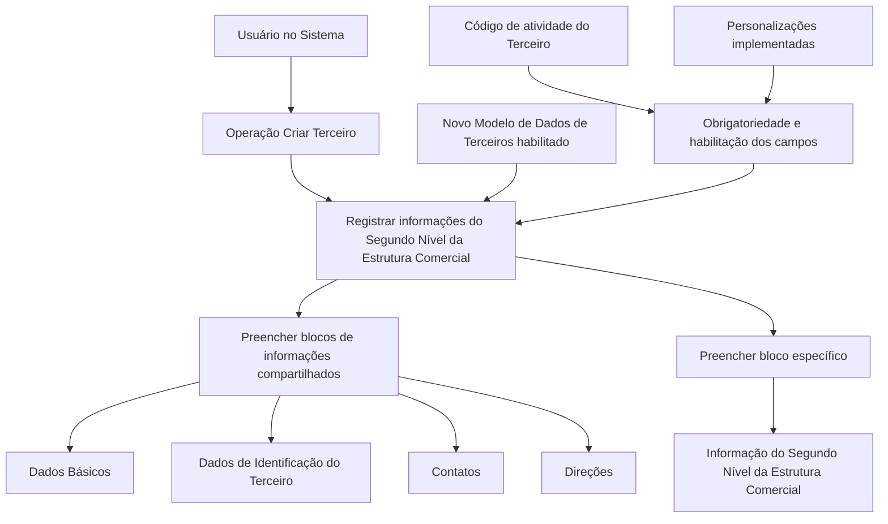

# Operação Criar Segundo Nível da Estrutura Comercial

## 1. Metadados do Documento
- **Arquivo de Origem:** Não informado
- **Tipo de Documento:** Procedimento
- **Domínio / Sistema:** Estrutura Comercial / Modelo de Dados de Terceiros
- **Público-Alvo:** Usuários de negócio e operadores do sistema
- **Data/Versão Identificada:** Não identificada

---

## 2. Resumo Executivo & Contexto de Negócio

O documento descreve a operação **Criar Segundo Nível da Estrutura Comercial**, destinada ao registro, no sistema, das informações referentes aos segundos níveis da estrutura comercial configurada na companhia. O documento cita como exemplo que esses níveis podem corresponder a Pessoas Jurídicas.

A operação depende de uma premissa funcional: o **Novo Modelo de Dados de Terceiros** deve estar habilitado para uso pela companhia. Sem essa habilitação, o documento não apresenta o comportamento ou procedimento alternativo para o registro do segundo nível da estrutura comercial.

Segundo as regras apresentadas, os segundos níveis da estrutura comercial de uma entidade seguradora devem ser sempre criados como **Pessoas Jurídicas**. O cadastro utiliza blocos de informações compartilhados da operação **Criar Terceiro** e blocos específicos definidos conforme a atividade do terceiro.

A obrigatoriedade e a habilitação dos campos variam de acordo com o código de atividade do terceiro. Além disso, personalizações implementadas na aplicação podem alterar o comportamento relacionado à obrigatoriedade de preenchimento dos dados do terceiro. O documento também informa que a ordem de captura das informações pode variar conforme o critério adotado pelo usuário no sistema.

---

## 3. Arquitetura, Componentes & Tecnologias Envolvidas

O conteúdo não descreve arquitetura técnica, integrações, APIs, bancos de dados, URLs operacionais, tecnologias, métodos HTTP ou contratos de dados. Os únicos elementos funcionais explicitamente citados são:

- **Sistema:** ambiente no qual são registrados os dados dos segundos níveis da estrutura comercial.
- **Operação Criar Terceiro:** operação que fornece os blocos de informações compartilhados.
- **Novo Modelo de Dados de Terceiros:** pré-requisito para a utilização da operação.
- **Estrutura Comercial:** estrutura organizacional cujo segundo nível é registrado.
- **Entidade Seguradora / Companhia:** contexto organizacional no qual os segundos níveis são criados como Pessoas Jurídicas.
- **Código de atividade do Terceiro:** critério que influencia habilitação e obrigatoriedade de campos.
- **Personalizações da aplicação:** possíveis implementações que podem afetar regras de obrigatoriedade.



> **Nota de Análise:** O documento lista elementos de navegação como “Inicio”, “Soluciones”, “APIs”, “Documentación”, “Zeus” e “ES”, mas não fornece explicações funcionais ou técnicas que permitam classificá-los como componentes arquiteturais, sistemas integrados ou ambientes.

---

## 4. Regras de Negócio, Especificações Funcionais & Processos

### 4.1 Objetivo da operação

A operação permite registrar no sistema as informações dos segundos níveis da estrutura comercial configurados na companhia.

### 4.2 Natureza do segundo nível da estrutura comercial

Os segundos níveis da estrutura comercial de uma entidade seguradora devem ser criados sempre como **Pessoas Jurídicas**.

### 4.3 Premissa de habilitação

O Novo Modelo de Dados de Terceiros deve estar habilitado para que a companhia possa utilizar a operação descrita.

### 4.4 Variação de campos conforme atividade

A obrigatoriedade e/ou habilitação dos campos usados no registro dos dados de cada bloco ou estrutura de informações compartilhadas pode variar conforme o código de atividade do terceiro.

O documento não identifica:

- Quais códigos de atividade existem.
- Quais campos são obrigatórios para cada código.
- Quais campos são habilitados ou desabilitados em cada cenário.
- Quais validações o sistema aplica ao salvar o cadastro.

### 4.5 Impacto de personalizações

Personalizações implementadas na aplicação podem afetar o comportamento da aplicação em relação à obrigatoriedade do registro dos dados do terceiro.

> **Nota de Análise:** O documento não especifica quais personalizações podem existir, quem as administra, quais blocos ou campos são afetados, nem como identificar uma personalização ativa.

### 4.6 Ordem de captura das informações

A ordem de captura dos dados nos diferentes blocos de informação pode variar conforme o critério seguido pelo usuário no sistema.

O documento não estabelece uma sequência obrigatória de preenchimento entre os blocos compartilhados e o bloco específico do segundo nível da estrutura comercial.

### 4.7 Fluxo funcional identificado

1. Confirmar que o Novo Modelo de Dados de Terceiros está habilitado para a companhia.
2. Iniciar a operação **Criar Terceiro**.
3. Registrar a informação do segundo nível da estrutura comercial.
4. Criar o segundo nível como Pessoa Jurídica.
5. Preencher os blocos de informações compartilhadas aplicáveis.
6. Preencher os blocos de informações específicos conforme a atividade do terceiro.
7. Registrar a informação específica do segundo nível da estrutura comercial.
8. Considerar que obrigatoriedade e habilitação de campos podem variar conforme o código de atividade e as personalizações existentes.
9. Utilizar a ordem de captura de dados adotada pelo usuário no sistema.

---

## 5. Tabelas de Parâmetros, Ambientes e Estruturas de Dados

| Item / Parâmetro | Descrição / Função | Tipo / Valores / Formato | Ambiente / Observações |
| :--- | :--- | :--- | :--- |
| Operação | Criar Segundo Nível da Estrutura Comercial | Operação funcional de cadastro | Executada no sistema citado pelo documento |
| Operação base | Criar Terceiro | Operação que disponibiliza blocos de informações compartilhadas | Utilizada para registrar o segundo nível |
| Objeto cadastrado | Segundo Nível da Estrutura Comercial | Elemento da estrutura comercial configurada na companhia | Pode corresponder a uma Pessoa Jurídica |
| Tipo obrigatório do segundo nível | Pessoa Jurídica | Regra de negócio | Os segundos níveis de entidade seguradora sempre são criados como Pessoas Jurídicas |
| Pré-requisito | Novo Modelo de Dados de Terceiros | Habilitação funcional | Deve estar habilitado para utilização pela companhia |
| Critério de variação de campos | Código de atividade do Terceiro | Código não detalhado no documento | Afeta obrigatoriedade e/ou habilitação de campos |
| Fator adicional de variação | Personalizações implementadas | Configurações ou implementações não detalhadas | Podem afetar a obrigatoriedade dos dados do terceiro |
| Ordem de captura | Critério do usuário no sistema | Sequência variável | O documento não define ordem obrigatória |
| Bloco compartilhado | Dados Básicos | Bloco de informações compartilhadas | Associado à operação Criar Terceiro |
| Bloco compartilhado | Dados de Identificação do Terceiro | Bloco de informações compartilhadas | Associado à operação Criar Terceiro |
| Bloco compartilhado | Contatos | Bloco de informações compartilhadas | Associado à operação Criar Terceiro |
| Bloco compartilhado | Direções | Bloco de informações compartilhadas | Associado à operação Criar Terceiro |
| Bloco específico | Informação do Segundo Nível da Estrutura Comercial | Bloco específico conforme a atividade do terceiro | Necessário para registrar a informação do segundo nível |
| Elementos de interface mencionados | Inicio, Soluciones, APIs, Documentación, Zeus, ES | Rótulos textuais de navegação | Sem detalhamento funcional adicional |

---

## 6. Bateria de Perguntas & Respostas para RAG (FAQ Sintético)

### P1: Qual é o objetivo da operação Criar Segundo Nível da Estrutura Comercial?
**R:** A operação permite registrar no sistema as informações dos segundos níveis da estrutura comercial configurados na companhia. O documento indica que esses segundos níveis podem ser tratados como Pessoas Jurídicas.

### P2: Qual pré-requisito é necessário para utilizar a operação de criação do segundo nível da estrutura comercial?
**R:** O Novo Modelo de Dados de Terceiros deve estar habilitado para ser utilizado pela companhia. O documento não descreve o procedimento de habilitação desse modelo.

### P3: Como devem ser criados os segundos níveis da estrutura comercial de uma entidade seguradora?
**R:** Os segundos níveis da estrutura comercial da entidade seguradora devem sempre ser criados como Pessoas Jurídicas.

### P4: Quais blocos de informação compartilhada fazem parte da operação Criar Terceiro?
**R:** Os blocos de informação compartilhada citados são: Dados Básicos, Dados de Identificação do Terceiro, Contatos e Direções.

### P5: Existe um bloco específico para registrar o segundo nível da estrutura comercial?
**R:** Sim. O documento cita o bloco “Informação do Segundo Nível da Estrutura Comercial” como bloco de informação específico, aplicável de acordo com a atividade do terceiro.

### P6: O código de atividade do terceiro influencia o cadastro?
**R:** Sim. A obrigatoriedade e/ou habilitação dos campos no registro dos dados de cada bloco ou estrutura de informação compartilhada pode variar conforme o código de atividade do terceiro.

### P7: O documento informa quais campos são obrigatórios para cada código de atividade?
**R:** Não. O documento informa apenas que obrigatoriedade e habilitação podem variar conforme o código de atividade do terceiro, sem apresentar a matriz de códigos, campos, validações ou regras de preenchimento.

### P8: Personalizações da aplicação podem alterar o comportamento do cadastro?
**R:** Sim. Personalizações que tenham sido implementadas podem afetar o comportamento da aplicação em relação à obrigatoriedade no registro dos dados do terceiro.

### P9: Existe uma ordem obrigatória para preencher os blocos de informações?
**R:** Não há uma ordem obrigatória definida no documento. A ordem de captura dos dados nos diferentes blocos de informação pode variar de acordo com o critério seguido pelo usuário no sistema.

### P10: O documento descreve APIs, métodos HTTP ou contratos JSON para a operação?
**R:** Não. Embora o texto contenha a palavra “APIs” em um trecho de navegação, não há detalhamento de endpoints, métodos HTTP, parâmetros, payloads, respostas ou contratos JSON.

### P11: Quais tecnologias e ambientes são usados pela operação?
**R:** O documento não informa tecnologias, servidores, URLs de ambiente, portas, banco de dados, ferramentas de implantação ou mecanismos de autenticação.

### P12: O que deve ser registrado para criar a informação do segundo nível da estrutura comercial?
**R:** Devem ser considerados os blocos compartilhados da operação Criar Terceiro — Dados Básicos, Dados de Identificação do Terceiro, Contatos e Direções — além do bloco específico “Informação do Segundo Nível da Estrutura Comercial”, respeitando a atividade do terceiro, a habilitação de campos e as regras de obrigatoriedade aplicáveis.

---

## 7. Glossário de Termos, Siglas & Conceitos-Chave

- **Criar Terceiro:** Operação citada como origem dos blocos de informações compartilhadas utilizados no cadastro.
- **Dados Básicos:** Bloco de informação compartilhada citado no processo de criação.
- **Dados de Identificação do Terceiro:** Bloco de informação compartilhada para identificação do terceiro.
- **Direções:** Bloco de informação compartilhada citado no documento.
- **Entidade Seguradora:** Entidade cujo segundo nível da estrutura comercial deve ser criado como Pessoa Jurídica.
- **Estrutura Comercial:** Estrutura configurada na companhia que possui segundos níveis cadastráveis.
- **Informação do Segundo Nível da Estrutura Comercial:** Bloco de informação específico citado para registrar o segundo nível.
- **Novo Modelo de Dados de Terceiros:** Modelo que deve estar habilitado para utilização pela companhia.
- **Pessoa Jurídica:** Tipo obrigatório de criação para os segundos níveis da estrutura comercial da entidade seguradora.
- **Segundo Nível da Estrutura Comercial:** Objeto funcional cujo registro é o objetivo da operação.
- **Terceiro:** Entidade cujos dados são registrados por meio dos blocos de informação compartilhados e específicos.

---

## 8. Notas Críticas, Riscos & Limitações

- O documento não identifica o nome do sistema, sua versão, ambiente, URL, autenticação ou perfis necessários para executar a operação.
- Não há detalhamento da estrutura de dados, campos, tipos, tamanhos, valores permitidos ou mensagens de validação.
- Não é fornecida uma matriz que associe códigos de atividade do terceiro aos respectivos campos obrigatórios ou habilitados.
- As personalizações podem alterar regras de obrigatoriedade, mas o documento não informa como identificá-las, configurá-las ou auditá-las.
- A ordem de preenchimento dos blocos é variável conforme o critério do usuário, sem critérios operacionais adicionais.
- Não são descritos fluxos de aprovação, salvamento, alteração, exclusão, consulta, tratamento de erros ou confirmação de cadastro.
- Não há informações sobre APIs, integrações, logs, monitoramento, segurança, permissões ou rastreabilidade.
- **Nota de Análise:** O documento possui conteúdo predominantemente resumido e funcional. Não há detalhamento adicional que permita inferir contratos técnicos ou regras não explicitamente apresentadas.

---

## 9. Conteúdo Bruto Estruturado (Referência Fiel)

```text
--- [PÁGINA 1 DE 2] ---

OPERACIÓN CREAR Segundo Nivel de la
Estructura Comercial
¿En que consiste?
Esta operación permite registrar en el Sistema la Información de los Segundos Niveles de la
Estructura Comercial (como Personas Jurídicas) configurados en la Compañía.
Premisas
El Nuevo Modelo de Datos de Terceros está habilitado para ser utilizado por la Compañía
Los Segundos Niveles de la Estructura Comercial de la Entidad Aseguradora siempre se crearán
como Personas Jurídicas.
La obligatoriedad y/o la habilitación de los campos en el registro de los datos de cada uno de
los bloques o estructuras de información compartidas puede variar de acuerdo con el código de
actividad del Tercero:
Las personalizaciones que se hubieran podido implementar a su vez pueden afectar el
comportamiento de la aplicación en relación con la obligatoriedad en el registro de los Datos del
Tercero.
Ejemplo:
 / 
 RS
Inicio Soluciones APIs Documentación Zeus
ES


--- [PÁGINA 2 DE 2] ---

Por último, el orden de captura de los datos en los distintos bloques de Información puede
variar de acuerdo con el criterio seguido por el Usuario en el Sistema.
Proceso
CREAR
TERCERO
Crear Información
del Segundo Nivel de la Estructura Comercial
Bloques de Información Compartidos (CREAR TERCERO)
 Datos Básicos ( )
 Datos Identificación del Tercero ( )
 Contactos ( )
 Direcciones ( )
Bloques de Información Específicos de acuerdo con la
Actividad del Tercero.
 Información del Segundo Nivel la Estructura Comercial ( )
```
