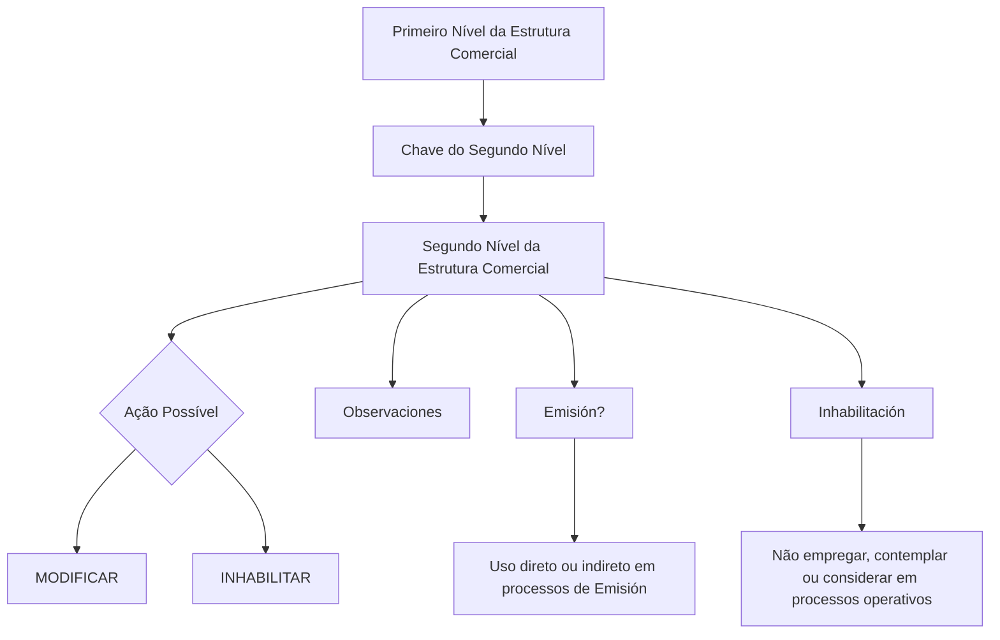

# Modificação e Inabilitação do Segundo Nível da Estrutura Comercial

## 1. Metadados do Documento
- **Arquivo de Origem:** Não identificado
- **Tipo de Documento:** Procedimento
- **Domínio / Sistema:** Estrutura Comercial da companhia
- **Público-Alvo:** Operação, Negócio
- **Data/Versão Identificada:** Não identificada

---

## 2. Resumo Executivo & Contexto de Negócio

O documento descreve uma operação para modificar informações previamente registradas no segundo nível da estrutura comercial de uma companhia. A operação também permite inabilitar esse segundo nível, impedindo sua utilização nos processos operacionais da entidade.

As ações possíveis explicitamente apresentadas são **MODIFICAR** e **INHABILITAR**. O procedimento organiza os campos do bloco “Datos Segundo Nivel Estructura Comercial” segundo uma sequência de preenchimento: da esquerda para a direita e de cima para baixo.

O segundo nível da estrutura comercial depende de um código de primeiro nível. Além disso, podem ser registrados textos de observação e configurado se o código do segundo nível poderá ser utilizado, direta ou indiretamente, em processos de emissão.

A inabilitação possui impacto operacional: quando o segundo nível estiver marcado como inabilitado, ele não deve ser empregado, contemplado ou considerado nos processos operativos da entidade.

---

## 3. Arquitetura, Componentes & Tecnologias Envolvidas

O conteúdo apresenta a estrutura comercial em dois níveis e os campos funcionais associados à alteração do segundo nível:

- **Primeiro Nível:** contém o código do primeiro nível da estrutura comercial do qual dependerá a chave do segundo nível.
- **Segundo Nível da Estrutura Comercial:** registro que pode ser modificado ou inabilitado.
- **Observaciones:** campo para texto esclarecedor ou observações relacionadas à criação do nível.
- **Emisión?:** configuração que regula o uso do código do segundo nível, direta ou indiretamente, nos processos de emissão.
- **Inhabilitación:** configuração que informa ao sistema que o segundo nível está inabilitado e, portanto, não deve participar dos processos operacionais.



**Nota de Análise:** o documento não detalha telas, URLs, métodos HTTP, contratos JSON, persistência de dados, perfis de acesso, validações obrigatórias ou integrações técnicas.

---

## 4. Regras de Negócio, Especificações Funcionais & Processos

1. A operação permite modificar a informação previamente registrada para o segundo nível da estrutura comercial da companhia.
2. A operação permite inabilitar o segundo nível da estrutura comercial.
3. As ações possíveis declaradas são:
   - **MODIFICAR**
   - **INHABILITAR**
4. Os campos do bloco de informações do segundo nível devem ser considerados na sequência indicada no documento:
   - da esquerda para a direita;
   - de cima para baixo.
5. O campo **Primer Nivel** deve conter o código do primeiro nível da estrutura comercial do qual dependerá a chave do segundo nível.
6. O campo **Observaciones** permite informar um texto aclaratório ou observações relacionadas ao fato de criar o nível da estrutura comercial.
7. O campo **Emisión?** regula o comportamento do sistema para permitir que o código do segundo nível seja utilizado, direta ou indiretamente, nos processos de emissão.
8. O campo **Inhabilitación** informa ao sistema que o segundo nível da estrutura comercial está inabilitado.
9. Quando o segundo nível estiver inabilitado, ele não deve ser:
   - empregado;
   - contemplado;
   - considerado;
   nos processos operativos da entidade.

---

## 5. Tabelas de Parâmetros, Ambientes e Estruturas de Dados

| Item / Parâmetro | Descrição / Função | Tipo / Valores / Formato | Ambiente / Observações |
| :--- | :--- | :--- | :--- |
| Operação | Permite modificar informações registradas no segundo nível da estrutura comercial e também inabilitá-lo. | Ações: `MODIFICAR`, `INHABILITAR` | Companhia / entidade |
| Primer Nivel | Contém o código do primeiro nível da estrutura comercial do qual dependerá a chave do segundo nível. | Código; formato não detalhado | Campo do bloco “Datos Segundo Nivel Estructura Comercial” |
| Segundo Nível da Estrutura Comercial | Nível da estrutura comercial sujeito à modificação ou inabilitação. | Não detalhado | Depende do código do primeiro nível |
| Observaciones | Permite inserir texto aclaratório ou observações sobre a criação do nível da estrutura comercial. | Texto | Não há limite, formato ou obrigatoriedade informados |
| Emisión? | Modula o comportamento do sistema quanto ao uso do código do segundo nível nos processos de emissão. | Campo de controle; valores não detalhados | Pode permitir uso direto ou indireto |
| Inhabilitación | Indica que o segundo nível está inabilitado no sistema. | Campo de controle; valores não detalhados | Um nível inabilitado não deve participar de processos operativos |
| Sequência de campos | Define a ordem de leitura ou modificação dos campos do bloco de informações. | Da esquerda para a direita e de cima para baixo | Aplicável ao bloco “Datos Segundo Nivel Estructura Comercial” |

---

## 6. Bateria de Perguntas & Respostas para RAG (FAQ Sintético)

### P1: Qual é o objetivo da operação de segundo nível da estrutura comercial?
**R:** A operação permite modificar informações que já tenham sido registradas para o segundo nível da estrutura comercial da companhia. A mesma operação também permite inabilitar esse segundo nível.

### P2: Quais ações podem ser executadas na operação descrita?
**R:** O documento apresenta duas ações possíveis: `MODIFICAR` e `INHABILITAR`.

### P3: Qual é a sequência indicada para os campos do bloco de informações do segundo nível?
**R:** Os campos devem ser considerados da esquerda para a direita e de cima para baixo, conforme a sequência de modificação descrita para o bloco “Datos Segundo Nivel Estructura Comercial”.

### P4: O que deve ser informado no campo Primer Nivel?
**R:** O campo `Primer Nivel` deve conter o código do primeiro nível da estrutura comercial do qual dependerá a chave do segundo nível.

### P5: Para que serve o campo Observaciones?
**R:** O campo `Observaciones` permite inserir um texto aclaratório ou observações relacionadas ao fato de criar o nível da estrutura comercial.

### P6: Qual é a finalidade do campo Emisión??
**R:** O campo `Emisión?` modula o comportamento do sistema para permitir que o código do segundo nível da estrutura comercial possa ser empregado, direta ou indiretamente, nos processos de emissão.

### P7: O que acontece quando o segundo nível está inabilitado?
**R:** Quando o campo `Inhabilitación` indica que o segundo nível está inabilitado, esse nível não deve ser empregado, contemplado ou considerado nos processos operativos da entidade.

### P8: A inabilitação remove o segundo nível do documento ou apenas restringe seu uso?
**R:** O documento informa que a inabilitação sinaliza ao sistema que o segundo nível está inabilitado e que ele não deve ser utilizado nos processos operativos. O documento não descreve remoção física, exclusão lógica ou retenção do registro.

### P9: O documento especifica quais processos de emissão utilizam o segundo nível?
**R:** Não. O documento apenas informa que o código do segundo nível pode ser empregado, direta ou indiretamente, nos processos de emissão quando controlado pelo campo `Emisión?`; processos específicos não são detalhados.

### P10: O documento define o formato dos códigos da estrutura comercial?
**R:** Não. O documento menciona que `Primer Nivel` contém um código e que o segundo nível possui uma chave dependente desse primeiro nível, mas não define tamanho, máscara, domínio de valores ou regras de validação.

---

## 7. Glossário de Termos, Siglas & Conceitos-Chave

- **Estrutura Comercial:** estrutura composta por níveis comerciais; o documento trata especificamente do primeiro e do segundo nível.
- **Primer Nivel:** primeiro nível da estrutura comercial; seu código determina a dependência da chave do segundo nível.
- **Segundo Nivel:** segundo nível da estrutura comercial sujeito a modificação ou inabilitação.
- **Emisión:** processos de emissão nos quais o código do segundo nível pode ser usado direta ou indiretamente.
- **Inhabilitación:** condição que informa que o segundo nível está inabilitado no sistema e não deve ser usado em processos operativos.
- **Observaciones:** campo destinado a texto aclaratório ou observações.

---

## 8. Notas Críticas, Riscos & Limitações

- O documento não identifica arquivo de origem, data, versão, autor ou responsável pelo processo.
- O documento não detalha os valores aceitos pelos campos `Emisión?` e `Inhabilitación`.
- Não há especificação de obrigatoriedade, validação, formato ou tamanho para o código do primeiro nível, chave do segundo nível ou campo de observações.
- Não são descritos os efeitos técnicos da ação `MODIFICAR`, como persistência, trilha de auditoria, mensagens de sucesso ou tratamento de erros.
- Não são descritos mecanismos de reversão da inabilitação, exclusão de registros ou aprovação por perfis de acesso.
- Não há detalhamento dos processos de emissão ou processos operativos impactados.
- **Nota de Análise:** o conteúdo apresentado é funcional e resumido; não há detalhamento adicional sobre interfaces, APIs, bancos de dados, tecnologias ou ambientes.

---

## 9. Conteúdo Bruto Estruturado (Referência Fiel)

```text
--- [PÁGINA 1 DE 2] ---

MODIFICAR Información específica del
Segundo Nivel de la Estructura Comercial
Objetivo
Esta Operación permite Modificar la información que tuviera el segundo nivel de la estructura
comercial de la compañía registrada previamente además de poder Inhabilitarlo.
Posibles Acciones
 MODIFICAR ( )
 INHABILITAR ( )
Datos Segundo Nivel Estructura Comercial
De Izquierda a Derecha y de Arriba hacia Abajo, los siguientes campos marcan la secuencia de
modificación en este Bloque de Información.
Primer Nivel (  )
Este dato va a contener el código del primer nivel de la estructura comercial del que dependerá la
clave del segundo nivel.
 / 
 CF
Home Solutions APIs Documentation Zeus
EN


--- [PÁGINA 2 DE 2] ---

Observaciones ( )
Este campo permite ingresar un texto aclaratorio u observaciones al hecho de crear el nivel de la
estructura comercial.
Emisión? ( )
Este campo modula el comportamiento del sistema permitiendo que el código del segundo nivel de la
estructura comercial se pueda emplear, directa o indirectamente, en los procesos de Emisión.
Inhabilitación ( )
Este campo le indica al sistema que el segundo nivel de la estructura comercial está inhabilitado en
el sistema por lo cual, de estarlo, no debería ser empleado, contemplado o considerado en los
procesos operativos de la entidad.
```
