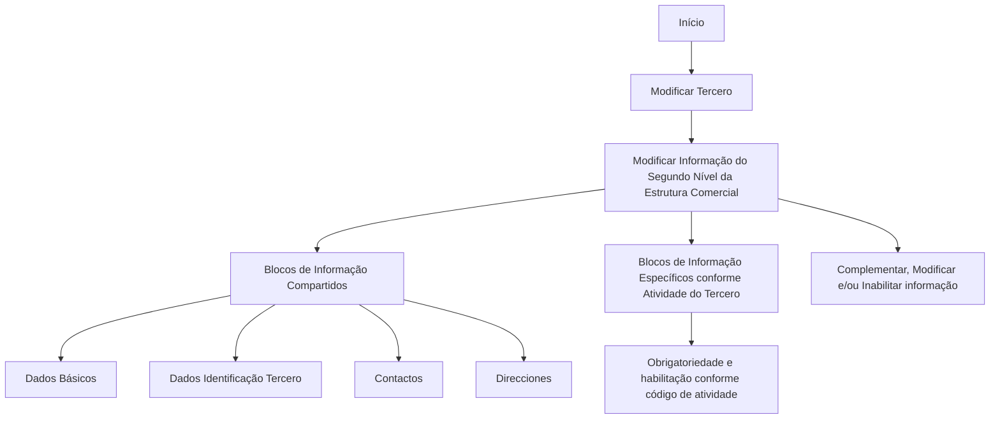

# Operação Modificar Segundo Nível da Estrutura Comercial

## 1. Metadados do Documento
- **Arquivo de Origem:** Não identificado
- **Tipo de Documento:** Manual Operacional
- **Domínio / Sistema:** Estrutura Comercial / Modificar Terceiro; navegação exibida no ambiente Zeus
- **Público-Alvo:** Usuários do Sistema
- **Data/Versão Identificada:** Não identificada

---

## 2. Resumo Executivo & Contexto de Negócio

O documento descreve a operação **Modificar Segundo Nível da Estrutura Comercial**. A operação permite complementar, modificar e/ou inabilitar informações do segundo nível da Estrutura Comercial nas estruturas de dados que contêm e agrupam essas informações.

A modificação é realizada no contexto da funcionalidade **Modificar Tercero**, que organiza informações em blocos compartilhados e blocos específicos conforme a atividade do Tercero. O documento cita os blocos compartilhados Dados Básicos, Dados Identificação Tercero, Contactos e Direcciones.

A obrigatoriedade e a habilitação dos campos variam de acordo com o código de atividade do Tercero. Personalizações implementadas também podem alterar o comportamento da aplicação quanto à obrigatoriedade de registro dos Dados do Tercero.

O documento estabelece que a ordem de captura das informações nos diferentes blocos pode variar conforme o critério adotado pelo Usuário no Sistema. Não há detalhamento de campos, valores permitidos, validações específicas ou contratos de integração.

---

## 3. Arquitetura, Componentes & Tecnologias Envolvidas

Os elementos explicitamente citados são:

- Operação **Modificar Segundo Nível da Estrutura Comercial**.
- Funcionalidade **Modificar Tercero**.
- Estruturas de dados que contêm e agrupam dados do Segundo Nível da Estrutura Comercial.
- Blocos de Informação Compartidos.
- Blocos de Informação Específicos conforme a Atividade do Tercero.
- Navegação apresentada: `Inicio > Soluciones > APIs > Documentación > Zeus`.
- Elemento textual `RS`, sem explicação adicional.



> **Nota de Análise:** O documento não especifica tecnologias de implementação, serviços, APIs, métodos HTTP, contratos JSON, bancos de dados, URLs operacionais ou ambientes técnicos.

---

## 4. Regras de Negócio, Especificações Funcionais & Processos

1. A operação permite **complementar**, **modificar** e/ou **inabilitar** a informação do Segundo Nível da Estrutura Comercial.
2. A informação pode estar presente em qualquer uma das estruturas de dados que a contenham e agrupem.
3. A obrigatoriedade dos campos registrados nos blocos ou estruturas de informação compartilhados pode variar conforme o **código de atividade do Tercero**.
4. A habilitação dos campos registrados nos blocos ou estruturas de informação compartilhados pode variar conforme o **código de atividade do Tercero**.
5. Personalizações previamente implementadas podem afetar o comportamento da aplicação em relação à obrigatoriedade de registro dos Dados do Tercero.
6. A ordem de captura dos dados nos distintos blocos de informação pode variar conforme o critério seguido pelo Usuário no Sistema.
7. Os blocos de informação compartilhados apresentados são:
   - Dados Básicos.
   - Dados Identificação Tercero.
   - Contactos.
   - Direcciones.
8. Existem blocos de informação específicos de acordo com a Atividade do Tercero.
9. O documento não detalha quais campos compõem o Segundo Nível da Estrutura Comercial, quais atividades existem, nem quais personalizações podem ser aplicadas.

---

## 5. Tabelas de Parâmetros, Ambientes e Estruturas de Dados

| Item / Parâmetro | Descrição / Função | Tipo / Valores / Formato | Ambiente / Observações |
| :--- | :--- | :--- | :--- |
| Operação Modificar Segundo Nível da Estrutura Comercial | Complementa, modifica e/ou inabilita informações do Segundo Nível da Estrutura Comercial. | Operação funcional. | Executada no contexto de Modificar Tercero. |
| Segundo Nível da Estrutura Comercial | Informação alvo da operação descrita. | Não detalhado. | Presente em estruturas de dados que a contêm e agrupam. |
| Código de atividade do Tercero | Critério que pode alterar obrigatoriedade e habilitação de campos. | Código; valores não informados. | Aplicável aos blocos ou estruturas de informação compartilhados. |
| Personalizações implementadas | Podem afetar o comportamento da aplicação quanto à obrigatoriedade de Dados do Tercero. | Não detalhado. | Não há relação de personalizações ou regras específicas. |
| Ordem de captura | Ordem em que dados são capturados nos blocos de informação. | Variável. | Pode variar conforme o critério do Usuário no Sistema. |
| Dados Básicos | Bloco de Informação Compartido. | Campos não detalhados. | Associado a Modificar Tercero. |
| Dados Identificação Tercero | Bloco de Informação Compartido. | Campos não detalhados. | Associado a Modificar Tercero. |
| Contactos | Bloco de Informação Compartido. | Campos não detalhados. | Associado a Modificar Tercero. |
| Direcciones | Bloco de Informação Compartido. | Campos não detalhados. | Associado a Modificar Tercero. |
| Blocos de Informação Específicos | Blocos determinados de acordo com a Atividade do Tercero. | Não detalhado. | O documento não lista os blocos ou atividades correspondentes. |
| Zeus | Elemento presente na trilha de navegação exibida. | Não detalhado. | `Inicio > Soluciones > APIs > Documentación > Zeus`. |
| RS | Sigla ou elemento textual exibido no documento. | Não identificado. | Não há definição no conteúdo fornecido. |

---

## 6. Bateria de Perguntas & Respostas para RAG (FAQ Sintético)

### P1: Em que consiste a operação Modificar Segundo Nível da Estrutura Comercial?
**R:** A operação consiste em complementar, modificar e/ou inabilitar a informação do Segundo Nível da Estrutura Comercial em qualquer estrutura de dados que contenha e agrupe essa informação.

### P2: Quais ações podem ser realizadas sobre as informações do Segundo Nível da Estrutura Comercial?
**R:** O documento informa três ações possíveis: complementar a informação, modificar a informação e/ou inabilitar a informação do Segundo Nível da Estrutura Comercial.

### P3: Onde a modificação da Estrutura Comercial é realizada?
**R:** A modificação é apresentada no contexto da funcionalidade **Modificar Tercero**, especificamente como “Modificar Información del Segundo Nivel Estructura Comercial”.

### P4: A obrigatoriedade dos campos é sempre a mesma para todos os Terceiros?
**R:** Não. A obrigatoriedade dos campos no registro dos dados dos blocos ou estruturas de informação compartilhados pode variar de acordo com o código de atividade do Tercero.

### P5: O código de atividade do Tercero influencia a habilitação dos campos?
**R:** Sim. O documento estabelece que a habilitação dos campos nos blocos ou estruturas de informação compartilhados pode variar conforme o código de atividade do Tercero.

### P6: Personalizações podem alterar o comportamento da aplicação?
**R:** Sim. Personalizações que tenham sido implementadas podem afetar o comportamento da aplicação em relação à obrigatoriedade no registro dos Dados do Tercero.

### P7: A ordem de preenchimento dos blocos de informação é fixa?
**R:** Não. A ordem de captura dos dados nos diferentes blocos de informação pode variar conforme o critério adotado pelo Usuário no Sistema.

### P8: Quais blocos de informação compartilhados são mencionados?
**R:** O documento menciona os blocos Dados Básicos, Dados Identificação Tercero, Contactos e Direcciones como Blocos de Informação Compartidos no contexto de Modificar Tercero.

### P9: Existem blocos de informação específicos para o Tercero?
**R:** Sim. O documento indica a existência de Blocos de Informação Específicos de acordo com a Atividade do Tercero, mas não apresenta quais são esses blocos nem quais atividades os determinam.

### P10: O documento detalha os campos disponíveis para modificação?
**R:** Não. O documento cita blocos de informação e regras gerais de obrigatoriedade, habilitação e ordem de captura, porém não detalha campos, formatos, valores aceitos ou validações específicas.

---

## 7. Glossário de Termos, Siglas & Conceitos-Chave

- **Estrutura Comercial:** Estrutura cujo Segundo Nível pode ser complementado, modificado e/ou inabilitado.
- **Segundo Nível da Estrutura Comercial:** Informação-alvo da operação descrita no documento.
- **Tercero:** Entidade referenciada pela funcionalidade Modificar Tercero; o documento não fornece definição adicional.
- **Modificar Tercero:** Contexto funcional que contém blocos compartilhados e blocos específicos relacionados ao Tercero.
- **Blocos de Informação Compartidos:** Blocos de dados compartilhados citados como Dados Básicos, Dados Identificação Tercero, Contactos e Direcciones.
- **Blocos de Informação Específicos:** Blocos associados à Atividade do Tercero, sem detalhamento adicional.
- **Código de atividade do Tercero:** Critério que pode determinar obrigatoriedade e habilitação de campos.
- **Datos Básicos:** Bloco de Informação Compartido citado no documento.
- **Datos Identificación Tercero:** Bloco de Informação Compartido citado no documento.
- **Contactos:** Bloco de Informação Compartido citado no documento.
- **Direcciones:** Bloco de Informação Compartido citado no documento.
- **Zeus:** Elemento presente na navegação exibida; sem definição funcional no conteúdo fornecido.
- **RS:** Sigla ou elemento textual não definido no conteúdo fornecido.

---

## 8. Notas Críticas, Riscos & Limitações

- O documento não identifica o arquivo de origem, data, versão, autor ou proprietário funcional.
- Não há especificação dos campos que compõem o Segundo Nível da Estrutura Comercial.
- Não são apresentados valores de código de atividade do Tercero nem a matriz que relaciona atividades, obrigatoriedade e habilitação de campos.
- O documento reconhece que personalizações podem afetar o comportamento da aplicação, mas não relaciona essas personalizações ou seus impactos específicos.
- Não há detalhamento dos blocos específicos associados às atividades do Tercero.
- Não são descritos métodos de integração, endpoints, contratos de API, tecnologias, URLs técnicas, logs, ambientes ou mecanismos de tratamento de erro.
- **Nota de Análise:** O conteúdo disponibilizado apresenta regras operacionais gerais, mas não fornece detalhamento suficiente para executar validações técnicas ou implementar integrações relacionadas à operação.

---

## 9. Conteúdo Bruto Estruturado (Referência Fiel)

```text
--- [PÁGINA 1 DE 2] ---

OPERACIÓN MODIFICAR Segundo Nivel de la
Estructura Comercial
¿En que consiste?
Esta operación consiste en Complementar, Modificar y/o Inhabilitar la información del Segundo
Nivel de la Estructura Comercial en cualquiera de las estructuras de datos que la contienen y
agrupan.
Premisas
La obligatoriedad y/o la habilitación de los campos en el registro de los datos de cada uno de
los bloques o estructuras de información compartidas puede variar de acuerdo con el código de
actividad del Tercero:
Las personalizaciones que se hubieran podido implementar a su vez pueden afectar el
comportamiento de la aplicación en relación con la obligatoriedad en el registro de los Datos del
Tercero.
Por último, el orden de captura de los datos en los distintos bloques de Información puede
variar de acuerdo con el criterio seguido por el Usuario en el Sistema.
Proceso
Ejemplo:
 / 
 RS
Inicio Soluciones APIs Documentación Zeus
ES


--- [PÁGINA 2 DE 2] ---

MODIFICAR
TERCERO
Modificar Información
del Segundo Nivel Estructura Comercial
Bloques de Información Compartidos (MODIFICAR TERCERO)
 Datos Básicos ( )
 Datos Identificación Tercero ( )
 Contactos (   )
 Direcciones (   )
Bloques de Información Específicos de acuerdo con la
Actividad del Tercero.
 Modificar Información del Segundo Nivel de la Estructura Comercial (
)
```
