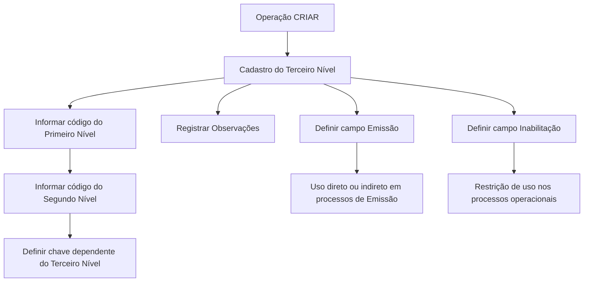

# Cadastro de Informações do Terceiro Nível da Estrutura Comercial

## 1. Metadados do Documento
- **Arquivo de Origem:** `Não identificado no conteúdo fornecido`
- **Tipo de Documento:** Manual Operacional
- **Domínio / Sistema:** Estrutura Comercial — cadastro de Terceiros Níveis
- **Público-Alvo:** Operação, Negócio e usuários responsáveis pela configuração da Estrutura Comercial
- **Data/Versão Identificada:** Não identificada

---

## 2. Resumo Executivo & Contexto de Negócio

O documento descreve a operação de criação de informações específicas do Terceiro Nível da Estrutura Comercial em um sistema corporativo. O objetivo declarado é registrar no sistema os Terceiros Níveis configurados pela companhia, incluindo exemplos associados a Pessoas Jurídicas.

A operação habilitada é exclusivamente **CRIAR**. O processo de cadastramento depende da seleção ou informação dos códigos de Primeiro Nível e Segundo Nível da Estrutura Comercial, estabelecendo uma dependência hierárquica para a chave do Terceiro Nível.

O cadastro também permite registrar observações explicativas sobre a criação do nível, controlar se o Terceiro Nível pode ser utilizado direta ou indiretamente em processos de Emissão e determinar se o Terceiro Nível está inabilitado para uso operacional.

O material não detalha interfaces, métodos HTTP, contratos JSON, persistência de dados, validações obrigatórias, permissões de acesso nem o comportamento técnico da ação **CRIAR** após a submissão do cadastro.

---

## 3. Arquitetura, Componentes & Tecnologias Envolvidas

Os componentes e conceitos identificados no conteúdo são:

| Componente / Conceito | Papel identificado no documento |
| :--- | :--- |
| Sistema | Registra as informações dos Terceiros Níveis da Estrutura Comercial. |
| Estrutura Comercial | Estrutura hierárquica composta, no contexto apresentado, por Primeiro Nível, Segundo Nível e Terceiro Nível. |
| Primeiro Nível | Nível cujo código determina a dependência da chave do Terceiro Nível. |
| Segundo Nível | Nível dependente do Primeiro Nível; seu código também determina a dependência da chave do Terceiro Nível. |
| Terceiro Nível | Entidade cadastrada no processo; pode representar, como exemplo, Pessoas Jurídicas. |
| Processos de Emissão | Processos nos quais o código do Terceiro Nível pode ser empregado direta ou indiretamente quando o campo Emissão estiver habilitado. |
| Processos operacionais da entidade | Processos que não devem empregar, contemplar ou considerar o Terceiro Nível quando este estiver inabilitado. |



> **Nota de Análise:** O documento não apresenta tecnologias, microsserviços, URLs, ambientes, servidores, bancos de dados, métodos HTTP ou integrações externas.

---

## 4. Regras de Negócio, Especificações Funcionais & Processos

1. A operação permite registrar no sistema informações dos Terceiros Níveis da Estrutura Comercial configurados na companhia.
2. O documento apresenta Pessoas Jurídicas como exemplo de entidades que podem corresponder a Terceiros Níveis da Estrutura Comercial.
3. A única ação explicitamente habilitada no conteúdo é **CRIAR**.
4. O código do **Primeiro Nível** deve corresponder ao Primeiro Nível da Estrutura Comercial do qual dependerá a chave do Terceiro Nível.
5. O código do **Segundo Nível** deve corresponder ao Segundo Nível da Estrutura Comercial.
6. O Segundo Nível possui dependência em relação à chave do Primeiro Nível.
7. A chave do Terceiro Nível depende da combinação hierárquica relacionada ao Primeiro Nível e ao Segundo Nível.
8. O campo **Observações** permite inserir texto esclarecedor ou observações relativas ao ato de criar o nível da Estrutura Comercial.
9. O campo **Emissão?** modula o comportamento do sistema para permitir que o código do Terceiro Nível seja utilizado direta ou indiretamente em processos de Emissão.
10. O campo **Inabilitação** indica ao sistema que o Terceiro Nível está inabilitado.
11. Quando um Terceiro Nível estiver inabilitado, ele não deve ser empregado, contemplado ou considerado nos processos operacionais da entidade.

### Fluxo operacional identificado

1. Iniciar a ação **CRIAR**.
2. Informar o código do Primeiro Nível da Estrutura Comercial.
3. Informar o código do Segundo Nível associado ao Primeiro Nível.
4. Registrar, quando aplicável, observações sobre a criação do Terceiro Nível.
5. Definir o comportamento de uso do Terceiro Nível em processos de Emissão por meio do campo **Emissão?**.
6. Definir se o Terceiro Nível estará inabilitado por meio do campo **Inabilitação**.
7. Registrar as informações do Terceiro Nível no sistema.

> **Nota de Análise:** O conteúdo não especifica quais campos são obrigatórios, formatos aceitos, valores possíveis para os campos de controle, mensagens de erro, regras de unicidade ou etapas de aprovação.

---

## 5. Tabelas de Parâmetros, Ambientes e Estruturas de Dados

| Item / Parâmetro | Descrição / Função | Tipo / Valores / Formato | Ambiente / Observações |
| :--- | :--- | :--- | :--- |
| Ação habilitada | Permite registrar informações do Terceiro Nível da Estrutura Comercial. | `CRIAR` | Nenhuma outra ação é apresentada. |
| Primeiro Nível | Contém o código do Primeiro Nível da Estrutura Comercial do qual dependerá a chave do Terceiro Nível. | Código; formato não especificado | Componente hierárquico anterior ao Segundo Nível e Terceiro Nível. |
| Segundo Nível | Contém o código do Segundo Nível da Estrutura Comercial do qual dependerá a chave do Terceiro Nível. | Código; formato não especificado | O Segundo Nível é dependente, por sua vez, da chave do Primeiro Nível. |
| Terceiro Nível | Nível da Estrutura Comercial cujas informações são registradas. | Não especificado | O documento cita Pessoas Jurídicas como exemplo. |
| Observações | Permite inserir texto esclarecedor ou observações sobre a criação do nível. | Texto; formato e limite não especificados | Relacionado ao ato de criar o nível da Estrutura Comercial. |
| Emissão? | Modula o comportamento do sistema para permitir o uso do código do Terceiro Nível em processos de Emissão. | Valor ou formato não especificado | O uso pode ser direto ou indireto. |
| Inabilitação | Indica que o Terceiro Nível está inabilitado no sistema. | Valor ou formato não especificado | Um Terceiro Nível inabilitado não deve ser usado, contemplado ou considerado nos processos operacionais. |
| Processos de Emissão | Processos que podem utilizar o código do Terceiro Nível. | Não especificado | Dependem do comportamento definido pelo campo Emissão?. |
| Processos operacionais da entidade | Processos nos quais um Terceiro Nível inabilitado não deve ser utilizado. | Não especificado | Aplicável quando o campo Inabilitação indicar inabilitação. |

---

## 6. Bateria de Perguntas & Respostas para RAG (FAQ Sintético)

### P1: Qual é o objetivo da operação de criação do Terceiro Nível da Estrutura Comercial?
**R:** A operação tem como objetivo registrar no sistema as informações dos Terceiros Níveis da Estrutura Comercial configurados pela companhia. O documento cita Pessoas Jurídicas como exemplo de entidades que podem ser tratadas como Terceiros Níveis.

### P2: Qual ação está habilitada no documento para a manutenção do Terceiro Nível?
**R:** A única ação explicitamente habilitada é **CRIAR**. O conteúdo fornecido não menciona ações de alteração, consulta, exclusão ou reativação.

### P3: Para que serve o campo Primeiro Nível?
**R:** O campo Primeiro Nível contém o código do Primeiro Nível da Estrutura Comercial do qual dependerá a chave do Terceiro Nível.

### P4: Qual é a relação entre Segundo Nível, Primeiro Nível e Terceiro Nível?
**R:** O Segundo Nível contém o código do Segundo Nível da Estrutura Comercial e depende, por sua vez, da chave do Primeiro Nível. A chave do Terceiro Nível depende dessa estrutura hierárquica formada pelo Primeiro Nível e pelo Segundo Nível.

### P5: O que pode ser informado no campo Observações?
**R:** O campo Observações permite inserir um texto esclarecedor ou observações relacionadas ao fato de criar o nível da Estrutura Comercial.

### P6: Qual é a finalidade do campo Emissão?
**R:** O campo Emissão modula o comportamento do sistema para permitir que o código do Terceiro Nível da Estrutura Comercial possa ser utilizado direta ou indiretamente nos processos de Emissão.

### P7: O que acontece quando um Terceiro Nível está inabilitado?
**R:** Quando o campo Inabilitação indica que o Terceiro Nível está inabilitado, esse Terceiro Nível não deve ser empregado, contemplado ou considerado nos processos operacionais da entidade.

### P8: O documento informa os valores aceitos para os campos Emissão e Inabilitação?
**R:** Não. O documento descreve a finalidade funcional dos campos Emissão e Inabilitação, mas não especifica valores permitidos, formato, obrigatoriedade ou comportamento de interface.

### P9: O documento detalha como o registro é enviado ou persistido no sistema?
**R:** Não. O conteúdo não informa métodos HTTP, contratos JSON, banco de dados, rotas, tecnologias, integrações ou procedimentos técnicos de persistência.

### P10: O Terceiro Nível pode ser usado em processos de Emissão mesmo estando inabilitado?
**R:** O documento informa separadamente que o campo Emissão permite o uso do código do Terceiro Nível em processos de Emissão e que a Inabilitação impede o uso, a consideração ou a contemplação do Terceiro Nível nos processos operacionais da entidade. O conteúdo não esclarece explicitamente a precedência entre esses dois campos.

---

## 7. Glossário de Termos, Siglas & Conceitos-Chave

- **Estrutura Comercial:** Estrutura hierárquica da companhia composta, no conteúdo apresentado, por Primeiro Nível, Segundo Nível e Terceiro Nível.
- **Primeiro Nível:** Nível da Estrutura Comercial cujo código influencia a dependência da chave do Terceiro Nível.
- **Segundo Nível:** Nível da Estrutura Comercial dependente do Primeiro Nível e relacionado à definição da chave do Terceiro Nível.
- **Terceiro Nível:** Nível cadastrado na operação; o documento cita Pessoas Jurídicas como exemplo.
- **Emissão:** Processos nos quais o código do Terceiro Nível pode ser utilizado direta ou indiretamente quando permitido pelo campo correspondente.
- **Inabilitação:** Condição que informa ao sistema que o Terceiro Nível não deve ser empregado, contemplado ou considerado nos processos operacionais.
- **Pessoas Jurídicas:** Exemplo citado pelo documento para os Terceiros Níveis da Estrutura Comercial.

---

## 8. Notas Críticas, Riscos & Limitações

- O documento não identifica o nome do sistema, versão, data, autor, ambiente ou organização responsável.
- Não há detalhamento de campos obrigatórios, formatos, tamanhos, domínios de valores ou regras de validação.
- Não são descritos perfis de acesso, permissões, trilha de auditoria ou segregação de funções para a ação **CRIAR**.
- O conteúdo não estabelece como conflitos entre **Emissão** e **Inabilitação** devem ser resolvidos.
- Não há especificação de erros, mensagens ao usuário, critérios de sucesso, retorno da operação ou processamento assíncrono.
- Não são apresentados contratos de integração, APIs, URLs, métodos HTTP, tecnologias, logs ou monitoramento.
- A referência textual a “Home Solutions APIs Documentation Zeus” aparece no conteúdo bruto, mas não possui explicação adicional que permita classificá-la como sistema, produto, ambiente ou tecnologia.

---

## 9. Conteúdo Bruto Estruturado (Referência Fiel)

```text
--- [PÁGINA 1 DE 2] ---

CREAR Información específica del Tercer Nivel
de la Estructura Comercial
Objetivo
Esta operación permite registrar en el Sistema la Información de los Terceros Niveles de la
Estructura Comercial (como Personas Jurídicas) configurados en la Compañía.
Acciones habilitadas
 CREAR ( )
Datos Tercer Nivel Estructura Comercial
De Izquierda a Derecha y de Arriba hacia Abajo, los siguientes campos marcan la secuencia de
captura en este Bloque de Información.
Primer Nivel (  )
Este dato va a contener el código del primer nivel de la estructura comercial del que dependerá la
clave del tercer nivel.
 / 
 CF
Home Solutions APIs Documentation Zeus
EN


--- [PÁGINA 2 DE 2] ---

Segundo Nivel (  )
Este dato va a contener el código del segundo nivel de la estructura comercial (dependiente a su
vez a la clave del primer nivel) del que dependerá la clave del tercer nivel.
Observaciones ( )
Este campo permite ingresar un texto aclaratorio u observaciones al hecho de crear el nivel de la
estructura comercial.
Emisión? ( )
Este campo modula el comportamiento del sistema permitiendo que el código del tercer nivel de la
estructura comercial se pueda emplear, directa o indirectamente, en los procesos de Emisión.
Inhabilitación ( )
Este campo le indica al sistema que el tercer nivel de la estructura comercial está inhabilitado en el
sistema por lo cual, de estarlo, no debería ser empleado, contemplado o considerado en los procesos
operativos de la entidad.
```
