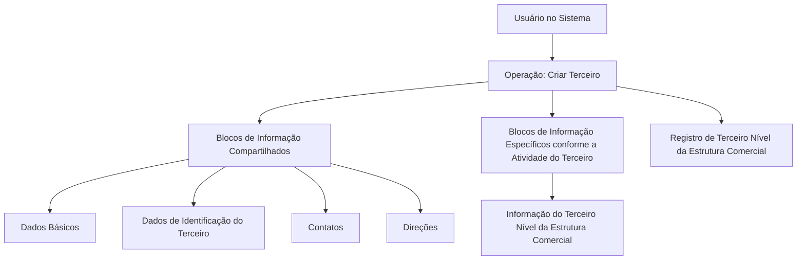

# Operação Criar Terceiro Nível da Estrutura Comercial

## 1. Metadados do Documento
- **Arquivo de Origem:** `Não identificado no conteúdo fornecido`
- **Tipo de Documento:** `Procedimento`
- **Domínio / Sistema:** `Sistema — Estrutura Comercial / Dados de Terceiros`
- **Público-Alvo:** `Usuários do Sistema`
- **Data/Versão Identificada:** `Não identificada`

---

## 2. Resumo Executivo & Contexto de Negócio

O documento descreve a operação **“Crear Tercer Nivel de la Estructura Comercial”**, destinada ao registro, no Sistema, das informações relativas aos terceiros níveis da Estrutura Comercial configurados pela Companhia. O documento exemplifica esses terceiros níveis como **Pessoas Jurídicas**.

A operação pressupõe que o **Novo Modelo de Dados de Terceiros** esteja habilitado para utilização pela Companhia. O texto estabelece como premissa que os terceiros níveis da Estrutura Comercial da entidade seguradora devem ser sempre criados como Pessoas Jurídicas.

O processo de criação utiliza blocos compartilhados de informação, incluindo Dados Básicos, Dados de Identificação do Terceiro, Contatos e Direções. Além desses blocos, a operação requer informações específicas associadas à atividade do terceiro, em particular informações do terceiro nível da Estrutura Comercial.

A obrigatoriedade ou habilitação dos campos pode variar conforme o código de atividade do terceiro. Personalizações implementadas pela Companhia também podem alterar o comportamento da aplicação quanto à obrigatoriedade de registro dos Dados do Terceiro. O documento também informa que a ordem de preenchimento dos blocos de informação pode variar conforme o critério adotado pelo usuário no Sistema.

---

## 3. Arquitetura, Componentes & Tecnologias Envolvidas

O conteúdo fornecido não apresenta uma arquitetura técnica de infraestrutura, integrações, APIs, bancos de dados, ambientes, protocolos ou tecnologias. A estrutura funcional identificada é composta pelo Sistema, pela operação de criação de terceiro e pelos blocos de informação utilizados no registro.



> **Nota de Análise:** O documento não detalha métodos HTTP, contratos JSON, URLs de serviços, tecnologias de implementação, persistência de dados ou integrações externas.

---

## 4. Regras de Negócio, Especificações Funcionais & Processos

### Objetivo da operação
A operação permite registrar no Sistema as informações dos terceiros níveis da Estrutura Comercial configurados na Companhia.

### Premissas
1. O Novo Modelo de Dados de Terceiros deve estar habilitado para uso pela Companhia.
2. Os terceiros níveis da Estrutura Comercial da entidade seguradora devem ser sempre criados como Pessoas Jurídicas.
3. A obrigatoriedade e/ou habilitação dos campos de registro pode variar conforme o código de atividade do terceiro.
4. Personalizações implementadas podem afetar o comportamento da aplicação em relação à obrigatoriedade de registro dos Dados do Terceiro.
5. A ordem de captura dos dados nos diferentes blocos de informação pode variar segundo o critério seguido pelo usuário no Sistema.

### Processo funcional identificado
1. O usuário inicia a operação **Criar Terceiro**.
2. O usuário registra os dados nos blocos de informação compartilhados.
3. O usuário registra os dados específicos conforme a atividade do terceiro.
4. O usuário registra as informações do terceiro nível da Estrutura Comercial.
5. O Sistema registra as informações do terceiro nível da Estrutura Comercial.

### Blocos de informação compartilhados
- Dados Básicos.
- Dados de Identificação do Terceiro.
- Contatos.
- Direções.

### Blocos de informação específicos
- Informações específicas de acordo com a atividade do terceiro.
- Informação do Terceiro Nível da Estrutura Comercial.

---

## 5. Tabelas de Parâmetros, Ambientes e Estruturas de Dados

| Item / Parâmetro | Descrição / Função | Tipo / Valores / Formato | Ambiente / Observações |
| :--- | :--- | :--- | :--- |
| Operação | Criar Terceiro | Operação no Sistema | Utilizada para registrar terceiros níveis da Estrutura Comercial |
| Terceiro nível | Terceiro nível da Estrutura Comercial configurada na Companhia | Pessoa Jurídica | Deve sempre ser criado como Pessoa Jurídica |
| Novo Modelo de Dados de Terceiros | Modelo de dados requerido para a operação | Premissa de habilitação | Deve estar habilitado para uso pela Companhia |
| Código de atividade do terceiro | Critério que influencia campos de registro | Código de atividade | Pode alterar obrigatoriedade e/ou habilitação de campos |
| Personalizações | Implementações específicas realizadas | Não detalhado | Podem afetar a obrigatoriedade do registro dos Dados do Terceiro |
| Dados Básicos | Bloco de informação compartilhado | Não detalhado | Parte do processo Criar Terceiro |
| Dados de Identificação do Terceiro | Bloco de informação compartilhado | Não detalhado | Parte do processo Criar Terceiro |
| Contatos | Bloco de informação compartilhado | Não detalhado | Parte do processo Criar Terceiro |
| Direções | Bloco de informação compartilhado | Não detalhado | Parte do processo Criar Terceiro |
| Informações específicas por atividade | Bloco de informação específico | Conforme atividade do terceiro | O documento não detalha os campos |
| Informação do Terceiro Nível da Estrutura Comercial | Informação específica do processo | Não detalhado | Necessária para o registro do terceiro nível |

---

## 6. Bateria de Perguntas & Respostas para RAG (FAQ Sintético)

### P1: Qual é o objetivo da operação “Criar Terceiro Nível da Estrutura Comercial”?
**R:** A operação permite registrar no Sistema as informações dos terceiros níveis da Estrutura Comercial configurados pela Companhia.

### P2: Que tipo de terceiro deve ser criado para o terceiro nível da Estrutura Comercial?
**R:** Os terceiros níveis da Estrutura Comercial da entidade seguradora devem sempre ser criados como Pessoas Jurídicas.

### P3: Qual é a premissa relacionada ao modelo de dados de terceiros?
**R:** O Novo Modelo de Dados de Terceiros deve estar habilitado para ser utilizado pela Companhia antes da execução da operação.

### P4: Quais blocos de informação compartilhados são utilizados na operação Criar Terceiro?
**R:** Os blocos compartilhados identificados são Dados Básicos, Dados de Identificação do Terceiro, Contatos e Direções.

### P5: A obrigatoriedade dos campos é fixa para todos os terceiros?
**R:** Não. A obrigatoriedade e/ou a habilitação dos campos pode variar de acordo com o código de atividade do terceiro.

### P6: As personalizações da Companhia podem afetar o registro de dados?
**R:** Sim. As personalizações implementadas podem afetar o comportamento da aplicação em relação à obrigatoriedade no registro dos Dados do Terceiro.

### P7: Existe uma ordem obrigatória para preencher os blocos de informação?
**R:** O documento informa que a ordem de captura dos dados nos diferentes blocos de informação pode variar conforme o critério seguido pelo usuário no Sistema.

### P8: Quais informações específicas devem ser registradas além dos blocos compartilhados?
**R:** Devem ser registradas informações específicas de acordo com a atividade do terceiro, incluindo a Informação do Terceiro Nível da Estrutura Comercial.

### P9: O documento detalha os campos internos de Dados Básicos, Contatos ou Direções?
**R:** Não. O documento apenas lista Dados Básicos, Dados de Identificação do Terceiro, Contatos e Direções como blocos de informação compartilhados, sem detalhar seus campos internos.

### P10: O documento define APIs, métodos HTTP ou contratos de integração para a operação?
**R:** Não. O conteúdo fornecido não especifica APIs, métodos HTTP, contratos JSON, URLs, tecnologias ou integrações externas.

---

## 7. Glossário de Termos, Siglas & Conceitos-Chave

- **Companhia:** Organização na qual a Estrutura Comercial e o Novo Modelo de Dados de Terceiros estão configurados.
- **Dados do Terceiro:** Dados registrados para o terceiro no Sistema.
- **Entidade Seguradora:** Entidade para a qual os terceiros níveis da Estrutura Comercial são criados como Pessoas Jurídicas.
- **Estrutura Comercial:** Estrutura configurada na Companhia que possui terceiros níveis.
- **Novo Modelo de Dados de Terceiros:** Modelo de dados que deve estar habilitado para utilização pela Companhia.
- **Pessoa Jurídica:** Tipo obrigatório para criação dos terceiros níveis da Estrutura Comercial.
- **Terceiro Nível:** Nível da Estrutura Comercial cujas informações são registradas pela operação descrita.

---

## 8. Notas Críticas, Riscos & Limitações

- O documento não identifica o nome do Sistema.
- O documento não apresenta data, versão, autor ou responsável.
- Os campos internos dos blocos Dados Básicos, Dados de Identificação do Terceiro, Contatos e Direções não são especificados.
- Os códigos de atividade do terceiro e suas regras de obrigatoriedade ou habilitação não são detalhados.
- As personalizações capazes de alterar o comportamento da aplicação não são identificadas.
- O documento não detalha validações, mensagens de erro, perfis de acesso, persistência de dados, APIs, integrações, ambientes ou URLs.
- A sequência de preenchimento dos blocos não é determinística, pois pode variar segundo o critério do usuário no Sistema.

---

## 9. Conteúdo Bruto Estruturado (Referência Fiel)

```text
--- [PÁGINA 1 DE 2] ---

OPERACIÓN CREAR Tercer Nivel de la
Estructura Comercial
¿En que consiste?
Esta operación permite registrar en el Sistema la Información de los Terceros Niveles de la
Estructura Comercial (como Personas Jurídicas) configurados en la Compañía.
Premisas
El Nuevo Modelo de Datos de Terceros está habilitado para ser utilizado por la Compañía
Los Terceros Niveles de la Estructura Comercial de la Entidad Aseguradora siempre se crearán
como Personas Jurídicas.
La obligatoriedad y/o la habilitación de los campos en el registro de los datos de cada uno de
los bloques o estructuras de información compartidas puede variar de acuerdo con el código de
actividad del Tercero:
Las personalizaciones que se hubieran podido implementar a su vez pueden afectar el
comportamiento de la aplicación en relación con la obligatoriedad en el registro de los Datos del
Tercero.
Ejemplo:
 /
 RS
Inicio Soluciones APIs Documentación Zeus
ES


--- [PÁGINA 2 DE 2] ---

Por último, el orden de captura de los datos en los distintos bloques de Información puede
variar de acuerdo con el criterio seguido por el Usuario en el Sistema.
Proceso
CREAR
TERCERO
Crear Información
del Tercer Nivel de la Estructura Comercial
Bloques de Información Compartidos (CREAR TERCERO)
 Datos Básicos ( )
 Datos Identificación del Tercero ( )
 Contactos ( )
 Direcciones ( )
Bloques de Información Específicos de acuerdo con la
Actividad del Tercero.
 Información del Tercer Nivel la Estructura Comercial ( )
```
