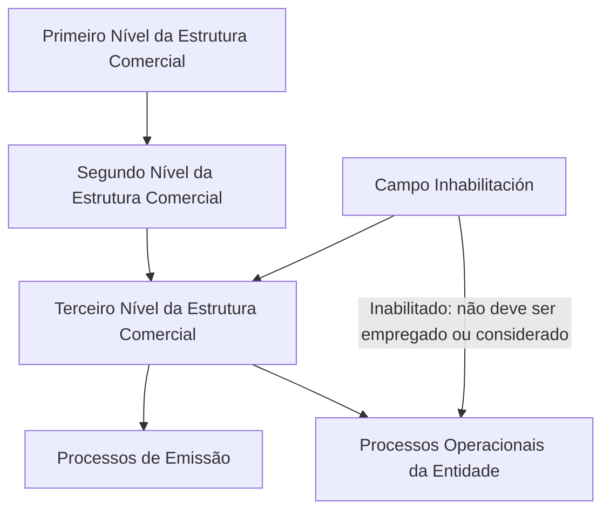

# Modificação e Inabilitação do Terceiro Nível da Estrutura Comercial

## 1. Metadados do Documento
- **Arquivo de Origem:** Não identificado
- **Tipo de Documento:** Procedimento
- **Domínio / Sistema:** Estrutura Comercial
- **Público-Alvo:** Operação, Negócio
- **Data/Versão Identificada:** Não identificada

---

## 2. Resumo Executivo & Contexto de Negócio

O conteúdo descreve uma operação para modificar informações previamente registradas no Terceiro Nível da Estrutura Comercial de uma companhia. A mesma operação também permite inabilitar esse nível da estrutura comercial.

A operação apresenta duas ações possíveis: **MODIFICAR** e **INHABILITAR**. A modificação envolve campos que estabelecem a dependência hierárquica do Terceiro Nível em relação ao Primeiro e ao Segundo Nível da Estrutura Comercial.

O campo **Emisión?** controla se o código do Terceiro Nível pode ser utilizado, direta ou indiretamente, em processos de emissão. O campo **Inhabilitación** indica ao sistema que o Terceiro Nível está inabilitado e, quando marcado, não deve ser empregado, considerado ou contemplado nos processos operacionais da entidade.

> **Nota de Análise:** O conteúdo não detalha a interface, os métodos de persistência, as validações técnicas, os perfis autorizados nem os efeitos de uma inabilitação sobre registros já existentes.

---

## 3. Arquitetura, Componentes & Tecnologias Envolvidas

Os componentes funcionais explicitamente identificados são:

- Operação de manutenção do Terceiro Nível da Estrutura Comercial.
- Primeiro Nível da Estrutura Comercial.
- Segundo Nível da Estrutura Comercial.
- Terceiro Nível da Estrutura Comercial.
- Processos de Emissão.
- Processos operacionais da entidade.



> **Nota de Análise:** O documento não informa tecnologias, microsserviços, bancos de dados, URLs, ambientes, APIs ou contratos de integração.

---

## 4. Regras de Negócio, Especificações Funcionais & Processos

1. A operação permite modificar informações já registradas para o Terceiro Nível da Estrutura Comercial da companhia.
2. A operação permite inabilitar o Terceiro Nível da Estrutura Comercial.
3. As ações possíveis são:
   - **MODIFICAR**
   - **INHABILITAR**
4. O campo **Primer Nivel** deve conter o código do Primeiro Nível da Estrutura Comercial do qual depende a chave do Terceiro Nível.
5. O campo **Segundo Nivel** deve conter o código do Segundo Nível da Estrutura Comercial, que depende, por sua vez, da chave do Primeiro Nível; a chave do Terceiro Nível depende desse Segundo Nível.
6. O campo **Observaciones** permite informar texto esclarecedor ou observações relacionadas à criação do nível da Estrutura Comercial.
7. O campo **Emisión?** modula o comportamento do sistema para permitir que o código do Terceiro Nível seja empregado direta ou indiretamente em processos de emissão.
8. O campo **Inhabilitación** informa ao sistema que o Terceiro Nível da Estrutura Comercial está inabilitado.
9. Quando o Terceiro Nível estiver inabilitado, ele não deve ser empregado, contemplado ou considerado nos processos operacionais da entidade.

---

## 5. Tabelas de Parâmetros, Ambientes e Estruturas de Dados

| Item / Parâmetro | Descrição / Função | Tipo / Valores / Formato | Ambiente / Observações |
| :--- | :--- | :--- | :--- |
| Ação da operação | Define a ação realizada sobre o Terceiro Nível da Estrutura Comercial. | MODIFICAR ou INHABILITAR | Não detalhado |
| Primer Nivel | Contém o código do Primeiro Nível da Estrutura Comercial do qual depende a chave do Terceiro Nível. | Código | Não detalhado |
| Segundo Nivel | Contém o código do Segundo Nível da Estrutura Comercial, dependente do Primeiro Nível, do qual depende a chave do Terceiro Nível. | Código | Não detalhado |
| Observaciones | Permite registrar texto esclarecedor ou observações sobre a criação do nível da Estrutura Comercial. | Texto | Não detalhado |
| Emisión? | Modula a possibilidade de utilização direta ou indireta do código do Terceiro Nível em processos de emissão. | Campo de controle; valores não detalhados | Relacionado aos processos de Emissão |
| Inhabilitación | Indica que o Terceiro Nível está inabilitado no sistema. | Campo de controle; valores não detalhados | Quando inabilitado, não deve ser usado em processos operacionais |

---

## 6. Bateria de Perguntas & Respostas para RAG (FAQ Sintético)

### P1: Qual é o objetivo da operação sobre o Terceiro Nível da Estrutura Comercial?
**R:** A operação permite modificar informações previamente registradas para o Terceiro Nível da Estrutura Comercial de uma companhia e também permite inabilitar esse Terceiro Nível.

### P2: Quais ações estão disponíveis na operação do Terceiro Nível?
**R:** As ações possíveis apresentadas são **MODIFICAR** e **INHABILITAR**.

### P3: Qual informação deve ser informada no campo Primer Nivel?
**R:** O campo **Primer Nivel** deve conter o código do Primeiro Nível da Estrutura Comercial do qual depende a chave do Terceiro Nível.

### P4: Como o Segundo Nível se relaciona com o Terceiro Nível da Estrutura Comercial?
**R:** O campo **Segundo Nivel** contém o código do Segundo Nível da Estrutura Comercial. Esse Segundo Nível depende da chave do Primeiro Nível, e a chave do Terceiro Nível depende do Segundo Nível.

### P5: Para que serve o campo Observaciones?
**R:** O campo **Observaciones** permite incluir texto esclarecedor ou observações relacionadas ao fato de criar o nível da Estrutura Comercial.

### P6: Qual é a finalidade do campo Emisión??
**R:** O campo **Emisión?** modula o comportamento do sistema, permitindo que o código do Terceiro Nível da Estrutura Comercial seja empregado direta ou indiretamente nos processos de Emissão.

### P7: O que significa marcar o campo Inhabilitación?
**R:** Marcar o campo **Inhabilitación** informa ao sistema que o Terceiro Nível da Estrutura Comercial está inabilitado.

### P8: Um Terceiro Nível inabilitado pode ser utilizado em processos operacionais?
**R:** Não. Quando o Terceiro Nível está inabilitado, ele não deve ser empregado, contemplado ou considerado nos processos operacionais da entidade.

### P9: O documento define quais valores podem ser usados nos campos Emisión? e Inhabilitación?
**R:** Não. O conteúdo explica a função dos campos **Emisión?** e **Inhabilitación**, mas não especifica valores permitidos, formatos, comportamento padrão ou regras de preenchimento.

---

## 7. Glossário de Termos, Siglas & Conceitos-Chave

- **Estrutura Comercial:** Estrutura hierárquica composta, no conteúdo analisado, por Primeiro, Segundo e Terceiro Nível.
- **Primeiro Nível:** Nível da Estrutura Comercial cujo código estabelece uma dependência para a chave do Terceiro Nível.
- **Segundo Nível:** Nível da Estrutura Comercial dependente do Primeiro Nível e do qual depende a chave do Terceiro Nível.
- **Terceiro Nível:** Nível da Estrutura Comercial sujeito à modificação ou inabilitação pela operação descrita.
- **Emisión:** Processos de emissão nos quais o código do Terceiro Nível pode ser empregado direta ou indiretamente.
- **Inhabilitación:** Indicação de que o Terceiro Nível está inabilitado no sistema.

---

## 8. Notas Críticas, Riscos & Limitações

- O documento não detalha validações obrigatórias, formatos dos códigos ou mensagens de erro.
- O documento não especifica se a inabilitação é reversível.
- O documento não informa impactos da inabilitação em processos de emissão, apenas em processos operacionais.
- O documento não identifica sistemas, APIs, tecnologias, ambientes ou responsáveis pela operação.
- O texto menciona “Home Solutions APIs Documentation Zeus”, mas não estabelece relação técnica ou funcional com a operação descrita.

---

## 9. Conteúdo Bruto Estruturado (Referência Fiel)

```text
--- [PÁGINA 1 DE 2] ---

MODIFICAR Información específica del Tercer
Nivel de la Estructura Comercial
Objetivo
Esta Operación permite Modificar la información que tuviera el Tercer Nivel de la Estructura
Comercial de la compañía registrada previamente además de poder Inhabilitarlo.
Posibles Acciones
 MODIFICAR ( )
 INHABILITAR ( )
Datos Tercer Nivel Estructura Comercial
De Izquierda a Derecha y de Arriba hacia Abajo, los siguientes campos marcan la secuencia de
Modificación en este Bloque de Información.
Primer Nivel (  )
Este dato va a contener el código del primer nivel de la estructura comercial del que dependerá la
clave del tercer nivel.
 / 
 CF
Home Solutions APIs Documentation Zeus
EN


--- [PÁGINA 2 DE 2] ---

Segundo Nivel (  )
Este dato va a contener el código del segundo nivel de la estructura comercial (dependiente a su
vez a la clave del primer nivel) del que dependerá la clave del tercer nivel.
Observaciones ( )
Este campo permite ingresar un texto aclaratorio u observaciones al hecho de crear el nivel de la
estructura comercial.
Emisión? ( )
Este campo modula el comportamiento del sistema permitiendo que el código del tercer nivel de la
estructura comercial se pueda emplear, directa o indirectamente, en los procesos de Emisión.
Inhabilitación ( )
Este campo le indica al sistema que el tercer nivel de la estructura comercial está inhabilitado en el
sistema por lo cual, de estarlo, no debería ser empleado, contemplado o considerado en los procesos
operativos de la entidad.
```
