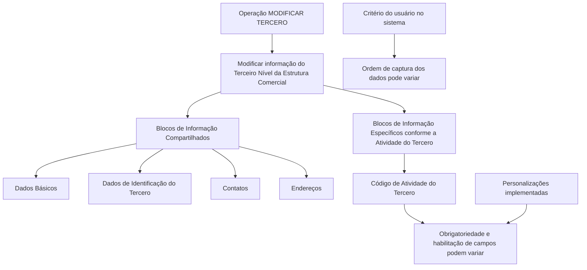

# Operação MODIFICAR TERCEIRO — Terceiro Nível da Estrutura Comercial

## 1. Metadados do Documento
- **Arquivo de Origem:** Não identificado no conteúdo fornecido
- **Tipo de Documento:** Procedimento
- **Domínio / Sistema:** Estrutura Comercial — operação MODIFICAR TERCERO
- **Público-Alvo:** Usuários do Sistema
- **Data/Versão Identificada:** Não identificada

---

## 2. Resumo Executivo & Contexto de Negócio

O documento descreve a operação **MODIFICAR TERCERO**, destinada a complementar, modificar e/ou inabilitar informações do **Terceiro Nível da Estrutura Comercial**. A alteração pode ocorrer em qualquer estrutura de dados que contenha e agrupe as informações desse terceiro nível.

A obrigatoriedade e a habilitação dos campos não são estáticas: podem variar conforme o **código de atividade do Tercero**. Portanto, o preenchimento e a disponibilidade de campos dependem do contexto de atividade associado ao registro que está sendo modificado.

O documento também registra que personalizações implementadas no sistema podem afetar o comportamento da aplicação quanto à obrigatoriedade do registro dos dados do Tercero. Essa condição representa uma dependência funcional relevante para usuários que executam a operação.

A captura ou modificação de dados pode ocorrer em diferentes blocos de informação compartilhados e em blocos específicos definidos pela atividade do Tercero. A ordem de captura dos dados pode variar conforme o critério adotado pelo usuário no sistema.

---

## 3. Arquitetura, Componentes & Tecnologias Envolvidas

O conteúdo não apresenta uma arquitetura técnica de software, integrações, APIs, microsserviços, ambientes ou tecnologias implementacionais. O documento apresenta uma estrutura funcional de manutenção de informações do Tercero por meio de blocos de informação.

Os componentes funcionais explicitamente citados são:

- Operação **MODIFICAR TERCERO**.
- **Modificar Información del Tercer Nivel Estructura Comercial**.
- Blocos de informação compartilhados:
  - Datos Básicos.
  - Datos Identificación Tercero.
  - Contactos.
  - Direcciones.
- Blocos de informação específicos de acordo com a atividade do Tercero.
- Código de atividade do Tercero.
- Personalizações da aplicação.



> **Nota de Análise:** O documento não detalha métodos HTTP, contratos JSON, banco de dados, autenticação, URLs de serviço ou relações técnicas entre sistemas.

---

## 4. Regras de Negócio, Especificações Funcionais & Processos

### Objetivo da operação

A operação **MODIFICAR TERCERO** permite executar uma ou mais das seguintes ações sobre as informações do Terceiro Nível da Estrutura Comercial:

1. Complementar informações.
2. Modificar informações.
3. Inabilitar informações.

As alterações podem ser realizadas em qualquer uma das estruturas de dados que contém e agrupa as informações do Terceiro Nível da Estrutura Comercial.

### Premissas funcionais

1. A obrigatoriedade dos campos pode variar conforme o código de atividade do Tercero.
2. A habilitação dos campos pode variar conforme o código de atividade do Tercero.
3. Personalizações previamente implementadas podem afetar o comportamento da aplicação quanto à obrigatoriedade no registro dos Dados do Tercero.
4. A ordem de captura dos dados nos diferentes blocos de informação pode variar segundo o critério seguido pelo usuário no sistema.
5. A manutenção das informações pode envolver blocos compartilhados e blocos específicos conforme a atividade do Tercero.

### Fluxo funcional identificado

1. O usuário acessa a operação **MODIFICAR TERCERO**.
2. O usuário seleciona a funcionalidade de modificar informações do Terceiro Nível da Estrutura Comercial.
3. O usuário atua nos blocos de informação compartilhados aplicáveis:
   - Dados Básicos.
   - Dados de Identificação do Tercero.
   - Contatos.
   - Endereços.
4. O usuário atua, quando aplicável, nos blocos específicos definidos pela atividade do Tercero.
5. A aplicação pode exigir ou habilitar campos de forma diferente conforme o código de atividade do Tercero e as personalizações existentes.
6. A sequência de preenchimento ou alteração pode variar segundo o critério do usuário.

> **Nota de Análise:** O documento não especifica critérios de validação por campo, mensagens de erro, regras de persistência, permissões de acesso, eventos de auditoria ou condições de sucesso da operação.

---

## 5. Tabelas de Parâmetros, Ambientes e Estruturas de Dados

| Item / Parâmetro | Descrição / Função | Tipo / Valores / Formato | Ambiente / Observações |
| :--- | :--- | :--- | :--- |
| MODIFICAR TERCERO | Operação para complementar, modificar e/ou inabilitar informações do Terceiro Nível da Estrutura Comercial. | Operação funcional. | Não há ambiente identificado. |
| Terceiro Nível da Estrutura Comercial | Nível de informação comercial cuja manutenção é tratada pela operação descrita. | Estrutura de informação. | Pode estar presente em diferentes estruturas de dados. |
| Código de atividade do Tercero | Critério que pode alterar a obrigatoriedade e/ou habilitação de campos. | Código de atividade; valores não detalhados. | Regras específicas não detalhadas. |
| Dados Básicos | Bloco de informação compartilhado na operação MODIFICAR TERCERO. | Bloco de informação. | Campos não detalhados. |
| Dados de Identificação do Tercero | Bloco de informação compartilhado para identificação do Tercero. | Bloco de informação. | Campos não detalhados. |
| Contatos | Bloco de informação compartilhado relacionado a contatos. | Bloco de informação. | Campos não detalhados. |
| Direções / Endereços | Bloco de informação compartilhado relacionado a endereços. | Bloco de informação. | Campos não detalhados. |
| Blocos específicos conforme atividade | Estruturas de informação aplicáveis de acordo com a atividade do Tercero. | Blocos específicos. | Conteúdo não detalhado. |
| Personalizações implementadas | Implementações que podem alterar o comportamento da aplicação quanto à obrigatoriedade do registro dos Dados do Tercero. | Configuração ou personalização; detalhes não informados. | Deve ser considerada na operação. |
| Ordem de captura | Sequência em que o usuário registra ou altera dados nos blocos de informação. | Ordem definida pelo critério do usuário. | Pode variar. |

---

## 6. Bateria de Perguntas & Respostas para RAG (FAQ Sintético)

### P1: Qual é a finalidade da operação MODIFICAR TERCERO?
**R:** A operação MODIFICAR TERCERO permite complementar, modificar e/ou inabilitar informações do Terceiro Nível da Estrutura Comercial em qualquer estrutura de dados que contenha e agrupe essas informações.

### P2: Quais ações podem ser executadas sobre as informações do Terceiro Nível da Estrutura Comercial?
**R:** O documento informa três ações possíveis: complementar informações, modificar informações e inabilitar informações.

### P3: A obrigatoriedade dos campos é sempre a mesma na operação MODIFICAR TERCERO?
**R:** Não. A obrigatoriedade dos campos no registro dos dados pode variar conforme o código de atividade do Tercero. O documento também informa que personalizações implementadas podem afetar esse comportamento.

### P4: O que pode influenciar a habilitação dos campos do Tercero?
**R:** A habilitação dos campos pode variar de acordo com o código de atividade do Tercero. O conteúdo não fornece os códigos de atividade nem o mapeamento entre códigos e campos habilitados.

### P5: Quais blocos de informação compartilhados são citados no documento?
**R:** Os blocos de informação compartilhados citados são Dados Básicos, Dados de Identificação do Tercero, Contatos e Direções/Endereços.

### P6: Existem blocos de informação além dos blocos compartilhados?
**R:** Sim. O documento menciona blocos de informação específicos de acordo com a atividade do Tercero, mas não detalha quais blocos são aplicáveis a cada atividade.

### P7: As personalizações do sistema podem alterar o comportamento da operação?
**R:** Sim. Personalizações que tenham sido implementadas podem afetar o comportamento da aplicação em relação à obrigatoriedade do registro dos Dados do Tercero.

### P8: A ordem de preenchimento dos blocos de informação é fixa?
**R:** Não. O documento informa que a ordem de captura dos dados nos distintos blocos de informação pode variar conforme o critério seguido pelo usuário no sistema.

### P9: O documento informa quais campos existem em Dados Básicos, Contatos ou Endereços?
**R:** Não. O documento apenas nomeia os blocos de informação compartilhados; não apresenta os campos, formatos, obrigatoriedades individuais ou validações de cada bloco.

### P10: O documento descreve APIs, serviços técnicos ou contratos de integração para MODIFICAR TERCERO?
**R:** Não. Embora o texto extraído contenha referências de navegação como “Soluciones”, “APIs”, “Documentación” e “Zeus”, não há detalhamento técnico de APIs, métodos HTTP, endpoints, payloads ou contratos de integração.

---

## 7. Glossário de Termos, Siglas & Conceitos-Chave

- **MODIFICAR TERCERO:** Operação destinada a complementar, modificar e/ou inabilitar informações do Terceiro Nível da Estrutura Comercial.
- **Tercero:** Termo utilizado pelo documento para identificar a entidade cujos dados são mantidos na operação. O significado corporativo específico não é detalhado.
- **Terceiro Nível da Estrutura Comercial:** Nível de informação comercial tratado pela operação MODIFICAR TERCERO.
- **Código de atividade do Tercero:** Código que pode determinar variações na obrigatoriedade e na habilitação dos campos.
- **Blocos de Informação Compartilhados:** Conjunto de blocos citados como Dados Básicos, Dados de Identificação do Tercero, Contatos e Direções/Endereços.
- **Blocos de Informação Específicos:** Blocos aplicáveis conforme a atividade do Tercero; o documento não descreve sua composição.
- **APIs:** Termo exibido no conteúdo de navegação extraído; o documento não apresenta definição ou detalhes técnicos associados.
- **Zeus:** Termo exibido no conteúdo de navegação extraído; o documento não apresenta definição funcional ou técnica.

---

## 8. Notas Críticas, Riscos & Limitações

- O documento não identifica o arquivo de origem, versão, data, autor ou sistema corporativo proprietário.
- Não há detalhamento de campos, tipos de dados, formatos, valores permitidos ou regras de validação por bloco de informação.
- Não há matriz que relacione códigos de atividade do Tercero aos campos obrigatórios ou habilitados.
- Personalizações implementadas podem alterar a obrigatoriedade de registro dos Dados do Tercero, mas o documento não informa como identificar, consultar ou administrar essas personalizações.
- A ordem de captura pode variar conforme o usuário, o que pode dificultar a padronização operacional sem procedimento complementar.
- Não há informações sobre permissões, perfis de acesso, trilha de auditoria, persistência, tratamento de falhas ou confirmação de atualização.
- Não há especificações de APIs, integrações, URLs, ambientes ou contratos técnicos.
- Os textos “Inicio”, “Soluciones”, “APIs”, “Documentación”, “Zeus”, “ES” e “RS” aparecem na extração, mas não possuem explicação contextual suficiente para classificá-los como componentes funcionais ou técnicos.

---

## 9. Conteúdo Bruto Estruturado (Referência Fiel)

```text
--- [PÁGINA 1 DE 2] ---

OPERACIÓN MODIFICAR Tercer Nivel de la
Estructura Comercial
¿En que consiste?
Esta operación consiste en Complementar, Modificar y/o Inhabilitar la información del Tercer Nivel
de la Estructura Comercial en cualquiera de las estructuras de datos que la contienen y agrupan.
Premisas
La obligatoriedad y/o la habilitación de los campos en el registro de los datos de cada uno de
los bloques o estructuras de información compartidas puede variar de acuerdo con el código de
actividad del Tercero:
Las personalizaciones que se hubieran podido implementar a su vez pueden afectar el
comportamiento de la aplicación en relación con la obligatoriedad en el registro de los Datos del
Tercero.
Por último, el orden de captura de los datos en los distintos bloques de Información puede
variar de acuerdo con el criterio seguido por el Usuario en el Sistema.
Proceso
Ejemplo:
 / 
 RS
Inicio Soluciones APIs Documentación Zeus
ES


--- [PÁGINA 2 DE 2] ---

MODIFICAR
TERCERO
Modificar Información
del Tercer Nivel Estructura Comercial
Bloques de Información Compartidos (MODIFICAR TERCERO)
 Datos Básicos ( )
 Datos Identificación Tercero ( )
 Contactos (   )
 Direcciones (   )
Bloques de Información Específicos de acuerdo con la
Actividad del Tercero.
 Modificar Información del Tercer Nivel de la Estructura Comercial (  )
```
