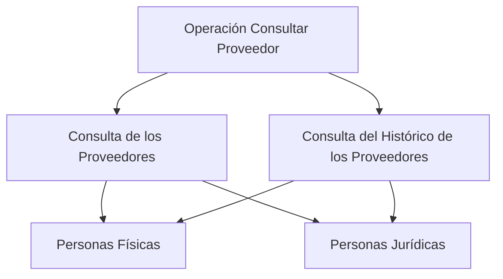

# Consulta de Proveedores e Histórico de Proveedores

## 1. Metadados do Documento
- **Arquivo de Origem:** Não identificado
- **Tipo de Documento:** Não identificado; conteúdo aparenta ser uma página/tela de documentação
- **Domínio / Sistema:** Consulta de proveedores; referências textuais a Home Solutions, APIs Documentation e Zeus
- **Público-Alvo:** Não identificado
- **Data/Versão Identificada:** Não identificada

---

## 2. Resumo Executivo & Contexto de Negócio

O conteúdo descreve a funcionalidade **“OPERACIÓN CONSULTAR Proveedor”**, destinada à consulta de fornecedores e à consulta do histórico desses fornecedores.

A abrangência declarada inclui fornecedores classificados como **Personas Físicas** e **Personas Jurídicas**. O trecho não apresenta critérios de busca, campos retornados, permissões, estados de fornecedor ou regras para acesso ao histórico.

Também são exibidas as expressões **Home**, **Solutions**, **APIs Documentation**, **Zeus**, **EN** e **CF**. O conteúdo disponível não esclarece se essas expressões representam navegação, produto, módulo, idioma, ambiente ou identificação funcional.

> **Nota de Análise:** O conteúdo não detalha endpoints, métodos HTTP, contratos JSON, tecnologias, URLs, autenticação, logs ou integrações técnicas.

---

## 3. Arquitetura, Componentes & Tecnologias Envolvidas

Os componentes explicitamente citados são:

- **Operación Consultar Proveedor:** operação de consulta de fornecedores.
- **Consulta de los Proveedores:** consulta de fornecedores.
- **Consulta del Histórico de los Proveedores:** consulta do histórico dos fornecedores.
- **Personas Físicas:** categoria de fornecedor pessoa física.
- **Personas Jurídicas:** categoria de fornecedor pessoa jurídica.
- **Home Solutions APIs Documentation Zeus:** termos exibidos sem relação técnica explicada.
- **EN:** termo exibido sem detalhamento.
- **CF:** termo exibido sem detalhamento.



> **Nota de Análise:** O diagrama representa somente as relações funcionais explicitamente sustentadas pelo texto. Não há informação suficiente para representar arquitetura de sistemas, APIs, bancos de dados ou integrações.

---

## 4. Regras de Negócio, Especificações Funcionais & Processos

1. A operação apresentada é denominada **“OPERACIÓN CONSULTAR Proveedor”**.
2. A operação contempla a **consulta de fornecedores**.
3. A operação contempla a **consulta do histórico de fornecedores**.
4. A consulta e o histórico abrangem fornecedores que sejam **Personas Físicas**.
5. A consulta e o histórico abrangem fornecedores que sejam **Personas Jurídicas**.
6. O documento não informa:
   - filtros ou parâmetros de pesquisa;
   - campos de identificação de fornecedores;
   - conteúdo ou período coberto pelo histórico;
   - critérios de ordenação, paginação ou retorno;
   - validações;
   - regras de autorização;
   - regras de inclusão, alteração ou exclusão;
   - contratos de API ou formatos de resposta.

---

## 5. Tabelas de Parâmetros, Ambientes e Estruturas de Dados

| Item / Parâmetro | Descrição / Função | Tipo / Valores / Formato | Ambiente / Observações |
| :--- | :--- | :--- | :--- |
| OPERACIÓN CONSULTAR Proveedor | Nome da operação apresentada | Texto | Não há detalhamento adicional |
| Consulta de los Proveedores | Consulta de fornecedores | Funcionalidade | Não informa filtros, retorno ou interface |
| Consulta del Histórico de los Proveedores | Consulta do histórico de fornecedores | Funcionalidade | Não informa eventos, período ou estrutura do histórico |
| Personas Físicas | Categoria de fornecedor abrangida | Classificação | Sem definição adicional |
| Personas Jurídicas | Categoria de fornecedor abrangida | Classificação | Sem definição adicional |
| Home | Termo exibido no conteúdo | Não identificado | Pode representar elemento de navegação; não confirmado |
| Solutions | Termo exibido no conteúdo | Não identificado | Sem detalhamento |
| APIs Documentation | Termo exibido no conteúdo | Não identificado | O texto não apresenta documentação de API |
| Zeus | Termo exibido no conteúdo | Não identificado | Sem detalhamento |
| EN | Termo exibido no conteúdo | Não identificado | Pode indicar idioma; não confirmado |
| CF | Termo exibido no conteúdo | Não identificado | Sem detalhamento |

---

## 6. Bateria de Perguntas & Respostas para RAG (FAQ Sintético)

### P1: Qual é a operação principal descrita no documento?
**R:** A operação principal é **“OPERACIÓN CONSULTAR Proveedor”**, relacionada à consulta de fornecedores.

### P2: A operação permite consultar o histórico de fornecedores?
**R:** Sim. O conteúdo declara a **“Consulta del Histórico de los Proveedores”**, ou seja, a consulta do histórico dos fornecedores.

### P3: Quais tipos de fornecedores são abrangidos pela consulta?
**R:** A consulta abrange fornecedores classificados como **Personas Físicas** e **Personas Jurídicas**.

### P4: O documento descreve como filtrar fornecedores na consulta?
**R:** Não. O conteúdo não informa filtros, parâmetros de pesquisa, campos de entrada ou critérios de seleção.

### P5: Quais informações são retornadas pela consulta de fornecedores?
**R:** O documento não especifica os dados retornados pela consulta de fornecedores.

### P6: Quais eventos compõem o histórico de fornecedores?
**R:** O documento menciona a consulta do histórico, mas não descreve quais eventos, alterações ou períodos são registrados.

### P7: O documento fornece endpoints ou métodos HTTP para a operação?
**R:** Não. Apesar de conter o termo “APIs Documentation”, o conteúdo não apresenta URLs, endpoints, métodos HTTP ou contratos de API.

### P8: A funcionalidade diferencia pessoa física de pessoa jurídica?
**R:** Sim. O texto declara que a consulta e a consulta do histórico abrangem fornecedores que sejam **Personas Físicas** ou **Personas Jurídicas**.

### P9: O termo Zeus identifica um sistema ou ambiente?
**R:** Não é possível concluir. “Zeus” aparece no conteúdo, mas não recebe definição nem contexto técnico adicional.

### P10: Existem regras de permissão para consultar fornecedores ou seus históricos?
**R:** Não. O documento não informa perfis, matrizes de acesso, autenticação ou regras de autorização.

---

## 7. Glossário de Termos, Siglas & Conceitos-Chave

- **Proveedor:** Fornecedor.
- **Consulta de los Proveedores:** Consulta de fornecedores.
- **Consulta del Histórico de los Proveedores:** Consulta do histórico dos fornecedores.
- **Personas Físicas:** Fornecedores classificados como pessoas físicas.
- **Personas Jurídicas:** Fornecedores classificados como pessoas jurídicas.
- **APIs Documentation:** Termo exibido no conteúdo; não há documentação de APIs no trecho disponível.
- **Zeus:** Termo exibido sem definição no documento.
- **EN:** Termo exibido sem definição no documento.
- **CF:** Termo exibido sem definição no documento.

---

## 8. Notas Críticas, Riscos & Limitações

- O conteúdo é extremamente resumido e não permite inferir arquitetura, integrações, APIs, estruturas de dados ou ambientes.
- Não há identificação de arquivo, autor, versão, data, sistema proprietário ou público-alvo.
- Não são descritos filtros, parâmetros, campos de retorno, contratos, validações ou regras de segurança.
- Os termos **Home**, **Solutions**, **APIs Documentation**, **Zeus**, **EN** e **CF** não possuem definição contextual suficiente.
- Qualquer detalhamento adicional sobre tecnologia, endpoints, autenticação, banco de dados ou fluxo operacional configuraria informação não sustentada pelo texto original.

---

## 9. Conteúdo Bruto Estruturado (Referência Fiel)

```text
--- [PÁGINA 1 DE 1] ---

OPERACIÓN CONSULTAR Proveedor
Consulta de los Proveedores y Consulta del Histórico de los Proveedores sean estos Personas
Físicas o Personas Jurídicas.
 /
 CF
Home Solutions APIs Documentation Zeus
EN
```
