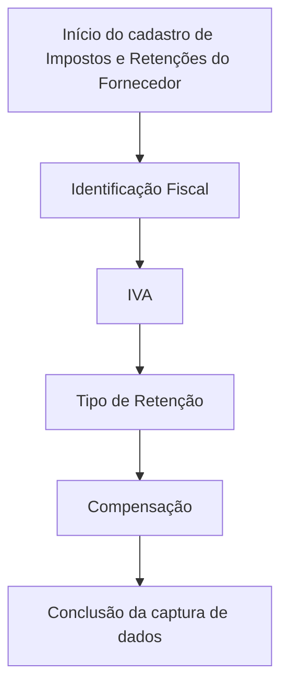

# Cadastro de Impostos e Retenções do Fornecedor

## 1. Metadados do Documento
- **Arquivo de Origem:** Não identificado no conteúdo fornecido
- **Tipo de Documento:** Manual Operacional / Especificação Funcional
- **Domínio / Sistema:** Soluções APIs / Zeus — cadastro fiscal de fornecedores
- **Público-Alvo:** Analistas funcionais, equipes de cadastro, operação e desenvolvedores
- **Data/Versão Identificada:** Não identificada

---

## 2. Resumo Executivo & Contexto de Negócio

O documento descreve a funcionalidade **“Crear Impuestos y Retenciones del Proveedor”**, destinada ao cadastro de informações tributárias e de retenções aplicáveis a um fornecedor. O objetivo declarado é identificar informações impositivas do fornecedor por meio de uma estrutura de dados.

A estrutura apresentada contém campos para identificação fiscal, IVA, tipo de retenção e compensação. A sequência de preenchimento deve seguir a orientação visual de **esquerda para direita** e de **cima para baixo**.

A identificação fiscal é vinculada à legislação do país onde está localizada a entidade seguradora. O campo de IVA registra o tipo de Imposto sobre Valor Agregado aplicável aos serviços prestados pelo fornecedor à entidade seguradora.

O documento também indica que o tipo de retenção é selecionado entre códigos configurados localmente pela entidade seguradora. A compensação registra o código da forma de cobrança/pagamento do segurado, conforme opções existentes no catálogo mestre de compensações.

---

## 3. Arquitetura, Componentes & Tecnologias Envolvidas

O conteúdo fornecido não descreve arquitetura de software, integrações, APIs, contratos HTTP, bancos de dados, tecnologias ou ambientes técnicos. São citados os termos **“Soluciones APIs”**, **“Documentación”** e **“Zeus”**, mas o material não explica suas responsabilidades nem relacionamentos técnicos.



**Nota de Análise:** O fluxo representa somente a sequência de captura indicada pelo documento, da esquerda para a direita e de cima para baixo. O documento não detalha validações de persistência, integrações, endpoints, métodos HTTP ou contratos JSON.

---

## 4. Regras de Negócio, Especificações Funcionais & Processos

1. A funcionalidade disponibiliza a ação **CRIAR** para o cadastro de impostos e retenções do fornecedor.
2. A estrutura de dados existe para identificar a informação tributária do fornecedor.
3. A captura dos campos deve obedecer à sequência visual:
   - da esquerda para a direita;
   - de cima para baixo.
4. O campo **Identificação Fiscal** deve conter a chave do identificador fiscal do fornecedor.
5. A identificação fiscal deve estar de acordo com a legislação do país onde se localiza a entidade seguradora.
6. O campo **IVA** deve conter o tipo de Imposto sobre Valor Agregado que identifica a tributação fiscal do fornecedor pelos serviços prestados à entidade seguradora.
7. O campo **Tipo de Retenção** deve conter o código de um dos tipos de retenção configurados localmente pela entidade seguradora.
8. O campo **Compensação** deve indicar o código da forma de cobrança/pagamento do segurado.
9. A forma de compensação deve corresponder a uma das formas definidas no catálogo mestre de compensações.

---

## 5. Tabelas de Parâmetros, Ambientes e Estruturas de Dados

| Item / Parâmetro | Descrição / Função | Tipo / Valores / Formato | Ambiente / Observações |
| :--- | :--- | :--- | :--- |
| Ação habilitada | Cria o registro de impostos e retenções do fornecedor. | `CRIAR` | O documento não descreve permissões, perfis ou pré-requisitos. |
| Identificação Fiscal | Chave do identificador fiscal do fornecedor. | Não especificado | Deve seguir a legislação do país em que está localizada a entidade seguradora. |
| IVA | Tipo de Imposto sobre Valor Agregado aplicável ao fornecedor. | Não especificado | Identifica o gravame fiscal pelos serviços prestados à entidade seguradora. |
| Tipo de Retenção | Código de um tipo de retenção. | Código configurado localmente | O valor deve pertencer aos tipos de retenção configurados pela entidade seguradora. |
| Compensação | Código da forma de cobrança/pagamento do segurado. | Código de compensação | Deve corresponder às formas disponíveis no catálogo mestre de compensações. |
| Soluciones APIs | Termo exibido na navegação do conteúdo. | Não especificado | Não há detalhamento técnico no material fornecido. |
| Zeus | Termo exibido na navegação do conteúdo. | Não especificado | Não há descrição funcional ou arquitetural associada. |

---

## 6. Bateria de Perguntas & Respostas para RAG (FAQ Sintético)

### P1: Qual é o objetivo da funcionalidade “Crear Impuestos y Retenciones del Proveedor”?
**R:** O objetivo é capturar, em uma estrutura de dados, as informações tributárias necessárias para identificar a situação impositiva de um fornecedor.

### P2: Qual ação está habilitada para Impostos e Retenções do Fornecedor?
**R:** A ação habilitada apresentada no documento é **CRIAR**.

### P3: Em qual ordem os campos de Impostos e Retenções do Fornecedor devem ser preenchidos?
**R:** Os atributos devem ser preenchidos seguindo a sequência visual da esquerda para a direita e de cima para baixo.

### P4: O que deve ser informado no campo Identificação Fiscal?
**R:** O campo Identificação Fiscal deve conter a chave do identificador fiscal do fornecedor, de acordo com a legislação do país onde está localizada a entidade seguradora.

### P5: Qual é a finalidade do campo IVA no cadastro do fornecedor?
**R:** O campo IVA contém o tipo de Imposto sobre Valor Agregado que identifica a tributação fiscal do fornecedor pelos serviços prestados à entidade seguradora.

### P6: De onde vem o valor informado no campo Tipo de Retenção?
**R:** O valor deve ser o código de um dos tipos de retenção configurados localmente pela entidade seguradora.

### P7: O que representa o campo Compensação?
**R:** O campo Compensação indica o código da forma de cobrança ou pagamento do segurado, conforme as possíveis formas de compensação definidas no catálogo mestre de compensações.

### P8: O documento define o formato técnico dos campos fiscais?
**R:** Não. O documento descreve a finalidade funcional de Identificação Fiscal, IVA, Tipo de Retenção e Compensação, mas não especifica tipos de dados, tamanhos, máscaras, obrigatoriedade ou regras de validação técnica.

### P9: O documento detalha APIs, métodos HTTP ou contratos JSON para criar impostos e retenções?
**R:** Não. Apesar de o conteúdo mencionar “Soluciones APIs”, ele não descreve endpoints, métodos HTTP, payloads, respostas, autenticação ou contratos de integração.

### P10: O documento informa quais formas de compensação podem ser utilizadas?
**R:** Não apresenta uma lista de formas de compensação. Apenas determina que a compensação deve corresponder a uma forma definida no catálogo mestre de compensações.

---

## 7. Glossário de Termos, Siglas & Conceitos-Chave

- **Fornecedor / Proveedor:** Entidade cujas informações tributárias, retenções e compensação são cadastradas.
- **Identificação Fiscal / Identificación Fiscal:** Chave do identificador fiscal do fornecedor, alinhada à legislação aplicável.
- **IVA:** Imposto sobre Valor Agregado, usado para identificar a tributação fiscal do fornecedor pelos serviços prestados.
- **Tipo de Retenção / Tipo de Retención:** Código de uma retenção configurada localmente pela entidade seguradora.
- **Compensação / Compensación:** Código da forma de cobrança ou pagamento do segurado, selecionado conforme o catálogo mestre de compensações.
- **Entidade Seguradora / Entidad Aseguradora:** Organização cuja localização determina a legislação aplicável à identificação fiscal e que configura localmente os tipos de retenção.
- **Catálogo Mestre de Compensações:** Catálogo que define as possíveis formas de compensação.
- **Zeus:** Termo citado na navegação do documento, sem definição adicional.

---

## 8. Notas Críticas, Riscos & Limitações

- O conteúdo não informa nome do arquivo de origem, data, versão, autor ou responsável pelo documento.
- O documento não especifica obrigatoriedade dos campos, formatos, domínios de valores, tamanho máximo ou mensagens de erro.
- Não há descrição de regras de validação para Identificação Fiscal, IVA, Tipo de Retenção ou Compensação.
- Não são apresentados exemplos preenchidos; há referências a “Ejemplo”, mas nenhum conteúdo de exemplo foi fornecido.
- Não há detalhes sobre APIs, integrações, persistência de dados, permissões, auditoria ou tratamento de falhas.
- **Nota de Análise:** O documento cita “Soluciones APIs” e “Zeus”, mas não detalha a relação desses termos com a operação de cadastro fiscal.

---

## 9. Conteúdo Bruto Estruturado (Referência Fiel)

```text
--- [PÁGINA 1 DE 2] ---

CREAR Impuestos y Retenciones del
Proveedor

Objetivo

La captura de la información en esta Estructura de datos obedece a la necesidad de identificar la
información impositiva del Proveedor.

Acciones habilitadas

 CREAR ( )

Impuestos y Retenciones del Proveedor

De Izquierda a Derecha y de Arriba hacia Abajo, los siguientes atributos marcan la secuencia de
captura de los Campos en este Bloque de Información.

Identificación Fiscal ( )

Es la clave del Identificador fiscal del Proveedor de acuerdo con la Legislación del País en el que se
ubica la Entidad Aseguradora.

/ 
RS
Inicio Soluciones APIs Documentación Zeus
ES


--- [PÁGINA 2 DE 2] ---

IVA (  )

Este campo contiene el Tipo del Impuesto de Valor Añadido (IVA) que identificará el gravamen fiscal
del Proveedor por los servicios prestados a la Entidad Aseguradora.

Tipo de Retención (  )

Este Dato contiene el código de uno de los Tipos de Retención configurados localmente por la
Entidad Aseguradora.

Compensación (  )

Este Dato indicará el Código de la Forma de Cobro/Pago del Asegurado de acuerdo con las posibles
Formas de Compensación definidas en el catálogo maestro de Compensaciones

Ejemplo:

Ejemplo:
```
