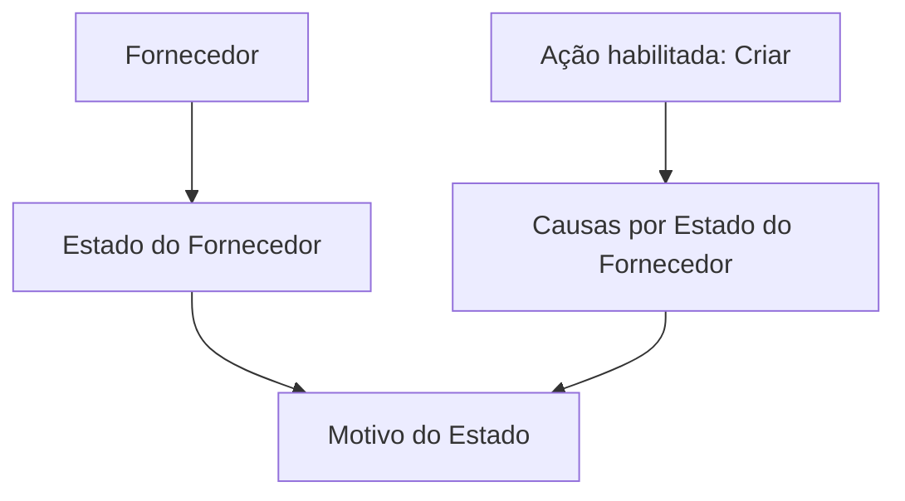

# Criação de Causas por Estado do Fornecedor

## 1. Metadados do Documento
- **Arquivo de Origem:** Não identificado
- **Tipo de Documento:** Especificação Funcional
- **Domínio / Sistema:** Gestão de fornecedores; interface Zeus
- **Público-Alvo:** Negócio, analistas funcionais e operadores
- **Data/Versão Identificada:** Não identificada

---

## 2. Resumo Executivo & Contexto de Negócio

O documento descreve a estrutura de dados **“Causas por Estado do Fornecedor”**, destinada a registrar o motivo ou os motivos pelos quais um fornecedor se encontra em determinado estado.

O objetivo informado é permitir a captura de informação necessária para identificar a causa associada ao estado de um fornecedor. A associação é feita por meio do atributo **“Motivo do Estado”**.

A ação explicitamente habilitada na estrutura é **CRIAR**. O conteúdo não descreve outras operações, tais como consulta, alteração, exclusão, aprovação ou integração.

A interface contém referências de navegação a **Início**, **Soluções**, **APIs**, **Documentação** e **Zeus**, mas o documento não detalha o papel técnico dessas opções, contratos de API, persistência de dados ou regras de validação.

---

## 3. Arquitetura, Componentes & Tecnologias Envolvidas

| Componente / Termo | Descrição baseada no documento |
| :--- | :--- |
| Causas por Estado do Fornecedor | Estrutura de dados usada para capturar motivos relacionados ao estado de um fornecedor. |
| Fornecedor | Entidade cujo estado possui um ou mais motivos associados. |
| Estado do Fornecedor | Valor de estado ao qual um motivo é associado. |
| Motivo do Estado | Atributo que determina o motivo conforme o valor do estado do fornecedor associado. |
| Criar | Ação habilitada para a estrutura de dados. |
| Zeus | Nome exibido na navegação/interface. O documento não especifica sua função. |
| APIs | Opção exibida na navegação. O documento não apresenta APIs, métodos ou contratos. |
| Documentação | Opção exibida na navegação. O documento não descreve documentos adicionais. |



**Nota de Análise:** O documento não apresenta arquitetura de software, tecnologias de implementação, integrações, microsserviços, endpoints, bancos de dados ou ambientes.

---

## 4. Regras de Negócio, Especificações Funcionais & Processos

1. A estrutura de dados denominada **“Causas por Estado do Fornecedor”** existe para capturar informações relacionadas aos motivos pelos quais um fornecedor se encontra em determinado estado.
2. A identificação do motivo ou dos motivos deve estar associada ao estado do fornecedor.
3. O atributo **“Motivo do Estado”** determina o motivo de acordo com o valor do estado do fornecedor ao qual o atributo está sendo associado.
4. A ação habilitada explicitamente no documento é **CRIAR**.
5. O documento não informa:
   - quais valores de estado de fornecedor são permitidos;
   - quais motivos podem ser cadastrados;
   - se mais de um motivo pode ser associado simultaneamente ao mesmo estado;
   - obrigatoriedade do atributo “Motivo do Estado”;
   - validações de formato, unicidade ou consistência;
   - regras para alteração, exclusão ou consulta;
   - responsáveis pela execução da ação de criação.

### Fluxo funcional extraído

1. O usuário acessa a estrutura **Causas por Estado do Fornecedor**.
2. A ação **CRIAR** está habilitada.
3. O usuário associa um valor de **Motivo do Estado** a um estado de fornecedor.
4. A finalidade da captura é identificar o motivo ou os motivos relacionados ao estado do fornecedor.

---

## 5. Tabelas de Parâmetros, Ambientes e Estruturas de Dados

| Item / Parâmetro | Descrição / Função | Tipo / Valores / Formato | Ambiente / Observações |
| :--- | :--- | :--- | :--- |
| Causas por Estado do Fornecedor | Estrutura de dados para capturar causas vinculadas ao estado de um fornecedor. | Estrutura de dados | Não são especificados campos adicionais. |
| Motivo do Estado | Determina o motivo conforme o valor do estado do fornecedor associado. | Atributo; formato não informado | Não é informada obrigatoriedade ou lista de valores. |
| Estado do Fornecedor | Estado cujo motivo está sendo associado. | Valor de estado; domínio não informado | Não há catálogo de estados no documento. |
| Criar | Ação habilitada para a estrutura. | Ação funcional | Nenhuma outra ação é explicitamente habilitada. |
| Zeus | Item de navegação exibido na interface. | Não informado | Não há descrição técnica ou funcional adicional. |
| APIs | Item de navegação exibido na interface. | Não informado | Não são apresentados endpoints ou contratos. |
| Documentação | Item de navegação exibido na interface. | Não informado | Não são referenciados documentos específicos. |

---

## 6. Bateria de Perguntas & Respostas para RAG (FAQ Sintético)

### P1: Qual é o objetivo da estrutura “Causas por Estado do Fornecedor”?
**R:** O objetivo é capturar informações que permitam identificar o motivo ou os motivos pelos quais um fornecedor se encontra em determinado estado.

### P2: Qual atributo determina o motivo associado ao estado de um fornecedor?
**R:** O atributo **“Motivo do Estado”** determina o motivo conforme o valor do estado do fornecedor ao qual está associado.

### P3: Qual ação está habilitada para “Causas por Estado do Fornecedor”?
**R:** A única ação explicitamente habilitada no documento é **CRIAR**.

### P4: O documento informa como consultar, editar ou excluir causas por estado do fornecedor?
**R:** Não. O documento somente indica a ação **CRIAR** e não descreve operações de consulta, alteração ou exclusão.

### P5: O documento apresenta os valores permitidos para o estado do fornecedor?
**R:** Não. O conteúdo menciona o estado do fornecedor, mas não fornece uma lista, catálogo ou definição dos valores de estado permitidos.

### P6: O documento informa os motivos de estado que podem ser cadastrados?
**R:** Não. O documento define a finalidade do atributo “Motivo do Estado”, mas não apresenta valores, códigos ou catálogo de motivos.

### P7: É possível associar mais de um motivo ao mesmo estado de fornecedor?
**R:** O objetivo menciona identificar “o motivo ou motivos” relacionados a um estado de fornecedor. Entretanto, o documento não detalha a regra operacional, cardinalidade ou forma de associação de múltiplos motivos.

### P8: Quais sistemas ou opções de navegação são citados?
**R:** A interface exibe referências a **Início**, **Soluções**, **APIs**, **Documentação** e **Zeus**. O documento não explica a função técnica dessas opções.

### P9: Existem APIs ou contratos JSON documentados para a estrutura de causas por estado?
**R:** Não. Apesar de “APIs” aparecer na navegação da interface, o documento não apresenta endpoints, métodos HTTP, contratos JSON ou mecanismos de integração.

### P10: O documento especifica validações para o atributo “Motivo do Estado”?
**R:** Não. Não são descritas regras de obrigatoriedade, formato, tamanho, unicidade ou validação entre o motivo e o estado do fornecedor.

---

## 7. Glossário de Termos, Siglas & Conceitos-Chave

- **Causas por Estado do Fornecedor:** Estrutura de dados para registrar motivos relacionados ao estado de um fornecedor.
- **Fornecedor:** Entidade cujo estado pode possuir um motivo ou motivos associados.
- **Estado do Fornecedor:** Valor de estado relacionado ao fornecedor e usado na associação com um motivo.
- **Motivo do Estado:** Atributo que determina o motivo de acordo com o valor do estado do fornecedor associado.
- **Zeus:** Termo exibido na navegação da interface; sem definição adicional no documento.
- **API:** Sigla exibida na navegação como “APIs”; o documento não detalha interfaces de programação.

---

## 8. Notas Críticas, Riscos & Limitações

- O documento não identifica o arquivo de origem, versão, data, autor ou sistema proprietário da estrutura.
- Não há detalhamento de modelo de dados, campos obrigatórios, tipos de dados, identificadores ou persistência.
- Não são descritos os estados de fornecedor nem o catálogo de motivos de estado.
- Não há especificação de permissões, perfis de acesso, auditoria ou responsabilidades operacionais.
- Não são documentadas integrações, APIs, contratos, mensagens, URLs, ambientes ou rotas de log.
- **Nota de Análise:** O documento lista a estrutura **“Causas por Estado do Fornecedor”** e o atributo **“Motivo do Estado”**, porém não detalha métodos HTTP, contratos JSON, validações ou comportamento de persistência.

---

## 9. Conteúdo Bruto Estruturado (Referência Fiel)

```text
--- [PÁGINA 1 DE 2] ---

CREAR Causa/s por Estado del Proveedor
Objetivo
La captura de la información en esta Estructura de datos obedece a la necesidad de identificar el
motivo o motivos por los que un proveedor se encuentra en un estado determinado.
Acciones habilitadas
 CREAR ( )
Causas por Estado del Proveedor
Motivo del Estado (  )
Este Atributo determina el motivo, de acuerdo con el valor en el estado del Proveedor, que se está
asociando a este.
 /
 RS
Inicio Soluciones APIs Documentación Zeus
ES


--- [PÁGINA 2 DE 2] ---

[Página em branco ou apenas elementos visuais/imagem]
```
