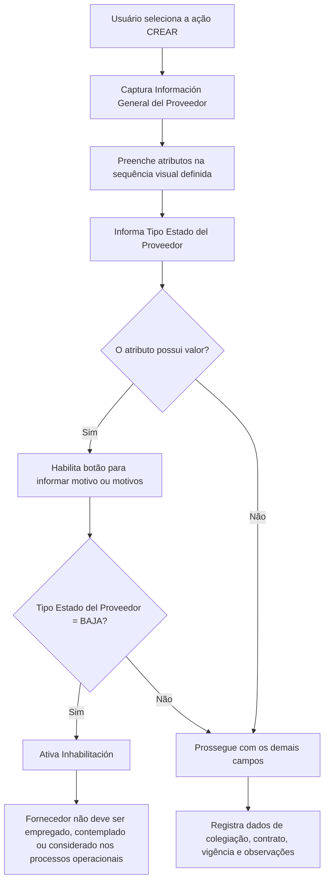

# Gestão de Informações Gerais do Fornecedor — Estrutura de Dados, Validade e Contrato

## 1. Metadados do Documento
- **Arquivo de Origem:** Não identificado; conteúdo bruto fornecido na solicitação.
- **Tipo de Documento:** Especificação Técnica / Manual Funcional.
- **Domínio / Sistema:** Cadastro de fornecedor/provedor em entidade seguradora.
- **Público-Alvo:** Desenvolvedores, analistas funcionais, operação e áreas de negócio da entidade seguradora.
- **Data/Versão Identificada:** Não identificada.

---

## 2. Resumo Executivo & Contexto de Negócio

O documento descreve a estrutura de dados denominada **Información General del Proveedor**, destinada ao cadastro e à manutenção das informações gerais, contratuais e de estado de um fornecedor/provedor em uma entidade seguradora.

O objetivo declarado é identificar o estado do fornecedor e as suas informações contratuais. A correta captura da **Fecha de Validez** permite manter um histórico das mudanças realizadas na configuração do terceiro dentro da entidade seguradora.

A estrutura disponibiliza a ação **CREAR**, indicando que o processo documentado está relacionado à criação das informações gerais do fornecedor. Os atributos devem ser preenchidos seguindo uma sequência de captura definida visualmente: da esquerda para a direita e de cima para baixo.

O documento também estabelece controles funcionais para o estado do fornecedor. Quando o atributo **Tipo Estado del Proveedor** possuir valor, é habilitado um botão para registrar o motivo ou os motivos daquela situação. Especificamente, quando o estado for **BAJA**, o campo **Inhabilitación** é ativado, indicando que o fornecedor está inabilitado e não deve ser utilizado, considerado ou contemplado nos processos operacionais da entidade.

---

## 3. Arquitetura, Componentes & Tecnologias Envolvidas

O conteúdo não descreve arquitetura de software, microsserviços, tecnologias, protocolos, APIs, bancos de dados ou ambientes técnicos. O documento apresenta uma estrutura funcional de captura de dados para fornecedor/provedor, relacionada a uma entidade seguradora, a um catálogo corporativo e a usuários responsáveis pelo preenchimento das informações.

Componentes e entidades identificados:

| Componente / Entidade | Papel identificado no documento |
| :--- | :--- |
| **Información General del Proveedor** | Estrutura de dados para registrar informações gerais, de estado e contratuais do fornecedor. |
| **Ação CREAR** | Ação habilitada para criação das informações na estrutura. |
| **Fornecedor / Proveedor** | Terceiro cujos dados, estado, habilitação profissional e contrato são registrados. |
| **Entidad Aseguradora** | Organização que celebra contratos com o fornecedor e utiliza as informações nos processos operacionais. |
| **Catálogo Corporativo** | Fonte configurada dos valores possíveis para o tipo de estado do fornecedor. |
| **Usuário** | Responsável por capturar informações adicionais no campo de observações. |
| **Botão de motivos** | Controle habilitado quando o tipo de estado do fornecedor possui valor, permitindo registrar motivos da situação. |



> **Nota de Análise:** O documento apresenta elementos de navegação como “Inicio Soluciones APIs Documentación Zeus” e “RS”, mas não detalha seus significados, funcionalidades, tecnologias ou relações com a estrutura de dados do fornecedor.

---

## 4. Regras de Negócio, Especificações Funcionais & Processos

### 4.1 Objetivo da estrutura de dados

A captura das informações na estrutura **Información General del Proveedor** é necessária para identificar:

- O estado do fornecedor/provedor.
- As informações contratuais do fornecedor/provedor.

### 4.2 Ação habilitada

A ação habilitada pelo documento é:

- **CREAR**

O documento não detalha ações de edição, consulta, exclusão, aprovação, submissão ou cancelamento.

### 4.3 Sequência de captura dos campos

Os atributos da estrutura devem seguir uma sequência de preenchimento definida da seguinte forma:

1. Da esquerda para a direita.
2. De cima para baixo.

O documento não apresenta obrigatoriedade, tamanho, máscara, tipo de dado técnico, valor padrão ou regras de validação de formato para os campos identificados.

### 4.4 Regras de validade do fornecedor

A **Fecha de Validez** informa a data a partir da qual o fornecedor está plenamente operacional no sistema.

A utilização correta da **Fecha de Validez** permite que a entidade seguradora possua um histórico das mudanças efetuadas na configuração do terceiro.

### 4.5 Regras de estado do fornecedor

O campo **Tipo Estado del Proveedor** determina e especifica o tipo de estado em que o fornecedor se encontra, de acordo com os valores configurados no **catálogo corporativo**.

Quando o atributo **Tipo Estado del Proveedor** possuir valor:

- Um botão é habilitado.
- O botão permite informar o motivo ou os motivos pelos quais o fornecedor é considerado naquela situação.

O documento não lista os valores disponíveis no catálogo corporativo, exceto o valor **BAJA**.

### 4.6 Regra de inabilitação

O campo **Inhabilitación** possui uma regra condicional explícita:

- O campo é ativado **somente** quando o valor de **Tipo Estado del Proveedor** for **BAJA**.
- Quando ativado, o campo indica que o fornecedor está inabilitado no sistema.
- Um fornecedor inabilitado não deve ser empregado, contemplado ou considerado nos processos operacionais da entidade seguradora.

### 4.7 Regras de habilitação profissional

O campo **Número de Colegiación** deve conter a chave ou código da cédula profissional do terceiro.

A cédula profissional está associada à habilitação do terceiro para exercer a sua profissão quando o terceiro pertence a um colégio profissional ou associação oficial semelhante.

### 4.8 Regras contratuais

O campo **Contrato** armazena o código ou a chave do contrato privado celebrado entre a entidade seguradora e o fornecedor.

A **Fecha de Efecto del Contrato** determina a data de efeito do contrato que habilita o fornecedor a exercer como tal.

A **Fecha de Vencimiento del Contrato** representa a data em que o contrato anteriormente celebrado entre a entidade seguradora e o fornecedor é encerrado.

### 4.9 Regras de observações

O campo **Observaciones** permite que o usuário registre informações adicionais sobre o fornecedor.

As informações adicionais devem seguir os direcionamentos ou as diretrizes que possam ser definidos pelas Direções de Negócio da entidade seguradora.

> **Nota de Análise:** O documento não detalha quais diretrizes de negócio devem ser aplicadas ao campo **Observaciones**, nem informa limites de tamanho, formato, obrigatoriedade ou mecanismos de aprovação dessas informações.

---

## 5. Tabelas de Parâmetros, Ambientes e Estruturas de Dados

| Item / Parâmetro | Descrição / Função | Tipo / Valores / Formato | Ambiente / Observações |
| :--- | :--- | :--- | :--- |
| **CREAR** | Ação habilitada para criar informações gerais do fornecedor. | Ação. | O documento não descreve outras ações. |
| **Información General del Proveedor** | Estrutura de dados para identificar o estado e as informações contratuais do fornecedor. | Estrutura de informações. | Associada ao fornecedor/provedor em uma entidade seguradora. |
| **Fecha de Validez** | Indica a data a partir da qual o fornecedor está plenamente operativo no sistema. Permite manter histórico das mudanças na configuração do terceiro. | Data; formato não especificado. | Deve ser utilizada corretamente para preservar o histórico da entidade seguradora. |
| **Tipo Estado del Proveedor** | Determina e especifica o tipo de estado do fornecedor. | Valores configurados no catálogo corporativo; inclui **BAJA**. | Quando possui valor, habilita o botão para informar motivo ou motivos. |
| **Botão de motivos** | Permite registrar o motivo ou os motivos pelos quais o fornecedor está em determinada situação. | Controle de interface; formato dos motivos não especificado. | Habilitado quando **Tipo Estado del Proveedor** possui valor. |
| **Inhabilitación** | Indica que o fornecedor está inabilitado no sistema. | Campo condicional; ativado para **BAJA**. | Fornecedor inabilitado não deve ser empregado, contemplado ou considerado nos processos operacionais. |
| **Número de Colegiación** | Contém a chave ou código da cédula profissional do terceiro. | Chave ou código; formato não especificado. | Relacionado à habilitação profissional por colégio profissional ou associação oficial semelhante. |
| **Contrato** | Código ou chave do contrato privado celebrado entre a entidade seguradora e o fornecedor. | Código ou chave; formato não especificado. | Contrato entre entidade seguradora e fornecedor. |
| **Fecha de Efecto del Contrato** | Determina a data de efeito do contrato que habilita o fornecedor a exercer como tal. | Data; formato não especificado. | Relacionada à habilitação contratual do fornecedor. |
| **Fecha de Vencimiento del Contrato** | Data em que causa baixa o contrato celebrado previamente entre entidade seguradora e fornecedor. | Data; formato não especificado. | Marca o encerramento do contrato. |
| **Observaciones** | Permite ao usuário registrar informações adicionais do fornecedor. | Texto; formato e limite não especificados. | Deve observar os direcionamentos ou diretrizes das Direções de Negócio. |
| **Catálogo Corporativo** | Fonte dos valores configurados para o tipo de estado do fornecedor. | Catálogo de valores; conteúdo não listado. | O documento não fornece a relação completa de estados disponíveis. |
| **Entidad Aseguradora** | Entidade que mantém o histórico do terceiro, celebra contrato e executa processos operacionais. | Organização de negócio. | Não identificada por nome. |
| **Fornecedor / Proveedor / Tercero** | Parte cadastrada, sujeita a estado, habilitação profissional e vínculo contratual. | Entidade de cadastro. | Os termos são utilizados no documento para o objeto cadastrado. |

---

## 6. Bateria de Perguntas & Respostas para RAG (FAQ Sintético)

### P1: Qual é o objetivo da estrutura “Información General del Proveedor”?
**R:** A estrutura “Información General del Proveedor” existe para capturar dados que permitam identificar o estado do fornecedor/provedor e as suas informações contratuais dentro da entidade seguradora.

### P2: Qual ação está habilitada no processo documentado?
**R:** A única ação explicitamente habilitada no documento é **CREAR**, destinada à criação das informações gerais do fornecedor. O conteúdo não descreve ações de edição, consulta ou exclusão.

### P3: Como deve ser seguida a ordem de preenchimento dos campos do fornecedor?
**R:** Os atributos devem ser capturados da esquerda para a direita e de cima para baixo, conforme a sequência visual definida no bloco de informações.

### P4: O que representa a “Fecha de Validez” do fornecedor?
**R:** A “Fecha de Validez” indica a data a partir da qual o fornecedor está plenamente operativo no sistema. Seu uso correto permite à entidade seguradora manter um histórico das mudanças efetuadas na configuração do terceiro.

### P5: De onde vêm os valores para “Tipo Estado del Proveedor”?
**R:** Os valores de “Tipo Estado del Proveedor” são aqueles configurados no catálogo corporativo. O documento cita explicitamente apenas o valor **BAJA**, sem apresentar os demais valores do catálogo.

### P6: Quando o botão para informar os motivos do estado do fornecedor é habilitado?
**R:** O botão é habilitado quando o atributo “Tipo Estado del Proveedor” possui valor. O botão permite registrar o motivo ou os motivos pelos quais o fornecedor é considerado naquela situação.

### P7: Em qual condição o campo “Inhabilitación” é ativado?
**R:** O campo “Inhabilitación” é ativado exclusivamente quando o valor de “Tipo Estado del Proveedor” é **BAJA**.

### P8: Qual é o impacto operacional de um fornecedor com “Inhabilitación” ativada?
**R:** Quando “Inhabilitación” está ativado, o fornecedor está inabilitado no sistema e não deve ser empregado, contemplado ou considerado nos processos operacionais da entidade seguradora.

### P9: O que deve ser registrado em “Número de Colegiación”?
**R:** O campo “Número de Colegiación” deve conter a chave ou o código da cédula profissional do terceiro. Essa cédula está relacionada à habilitação para o exercício profissional quando o terceiro pertence a um colégio profissional ou associação oficial semelhante.

### P10: O que é armazenado no campo “Contrato”?
**R:** O campo “Contrato” armazena o código ou a chave do contrato privado celebrado entre a entidade seguradora e o fornecedor.

### P11: Qual é a diferença entre “Fecha de Efecto del Contrato” e “Fecha de Vencimiento del Contrato”?
**R:** A “Fecha de Efecto del Contrato” determina a data a partir da qual o contrato habilita o fornecedor a exercer como tal. A “Fecha de Vencimiento del Contrato” é a data em que causa baixa o contrato previamente celebrado entre a entidade seguradora e o fornecedor.

### P12: Para que serve o campo “Observaciones”?
**R:** O campo “Observaciones” permite que o usuário registre informações adicionais sobre o fornecedor, conforme os direcionamentos ou diretrizes que possam ser definidos pelas Direções de Negócio da entidade seguradora.

---

## 7. Glossário de Termos, Siglas & Conceitos-Chave

- **BAJA:** Valor citado para o atributo **Tipo Estado del Proveedor**. Quando selecionado, ativa o campo **Inhabilitación**.
- **Catálogo Corporativo:** Fonte configurada dos valores utilizados para determinar o tipo de estado do fornecedor.
- **Cédula Profesional:** Chave ou código profissional associado à habilitação do terceiro para exercer a sua profissão.
- **Entidad Aseguradora:** Entidade seguradora que mantém as informações do fornecedor, celebra o contrato e conduz processos operacionais.
- **Fecha de Efecto del Contrato:** Data de efeito do contrato que habilita o fornecedor a exercer como tal.
- **Fecha de Validez:** Data a partir da qual o fornecedor está plenamente operativo no sistema.
- **Fecha de Vencimiento del Contrato:** Data em que o contrato anteriormente celebrado entre a entidade seguradora e o fornecedor causa baixa.
- **Información General del Proveedor:** Estrutura de dados destinada ao cadastro das informações gerais, de estado e contratuais do fornecedor.
- **Inhabilitación:** Condição que indica que o fornecedor está inabilitado no sistema quando o tipo de estado é **BAJA**.
- **Número de Colegiación:** Chave ou código da cédula profissional do terceiro.
- **Proveedor / Fornecedor:** Terceiro cadastrado cuja situação, habilitação profissional e contrato são administrados pela estrutura documentada.
- **Tercero:** Termo utilizado para o fornecedor/provedor na configuração mantida pela entidade seguradora.

---

## 8. Notas Críticas, Riscos & Limitações

- O documento não identifica o arquivo de origem, a versão, a data, a entidade seguradora específica ou o sistema responsável pela estrutura de dados.
- O documento não informa tipos técnicos, formatos, máscaras, tamanhos máximos, obrigatoriedade ou validações de entrada para os campos.
- O catálogo corporativo é mencionado como origem dos estados do fornecedor, mas a lista integral de valores permitidos não é fornecida.
- Apenas o estado **BAJA** possui comportamento operacional detalhado.
- O documento não especifica quais motivos podem ser registrados para os estados do fornecedor, nem o formato de armazenamento desses motivos.
- Não há detalhes sobre persistência de dados, integrações, APIs, microsserviços, autenticação, autorização, auditoria técnica ou tratamento de erros.
- Não há regra explícita para impedir tecnicamente a utilização de um fornecedor inabilitado; o documento estabelece que um fornecedor com **Inhabilitación** ativa não deveria ser utilizado nos processos operacionais.
- Não são detalhadas as diretrizes das Direções de Negócio aplicáveis ao campo **Observaciones**.
- Os elementos “Inicio Soluciones APIs Documentación Zeus”, “RS” e “ES” aparecem no conteúdo bruto, porém não recebem explicação funcional ou técnica.

---

## 9. Conteúdo Bruto Estruturado (Referência Fiel)

```text
--- [PÁGINA 1 DE 2] ---

CREAR Información General del Proveedor
Objetivo
La captura de la información en esta Estructura de datos obedece a la necesidad de identificar el
estado y la información contractual del Proveedor.
Acciones habilitadas
 CREAR ( )
Información General del Proveedor
De Izquierda a Derecha y de Arriba hacia Abajo, los siguientes atributos marcan la secuencia de
captura de los Campos en este Bloque de Información.
Fecha de Validez ( )
Esta propiedad indica la fecha a partir de la cual el Proveedor está plenamente operativo en el
sistema por lo que su empleo y correcta utilización permite tener en la entidad Aseguradora un
histórico de los cambios efectuados en la configuración del Tercero.
 /
 RS
Inicio Soluciones APIs Documentación Zeus
ES


--- [PÁGINA 2 DE 2] ---

Tipo Estado del Proveedor (  )
Este campo determina y especifica el Tipo de Estado en el que se encuentra el proveedor de acuerdo
con los valores que estén configurados en el catálogo Corporativo.
En el supuesto que este atributo tenga valor se habilitará el botón que permitirá ingresar el motivo
o motivos por los que se considera que el Proveedor está en dicha situación.
Inhabilitación
Únicamente en el supuesto que el valor del atributo que indica el tipo de estado del proveedor sea
BAJA este campo estará activado indicando que el Proveedor está inhabilitado en el sistema y
por tanto no debería ser empleado, contemplado o considerado en los procesos operativos de la
entidad.
Número de Colegiación ( )
Este Campo va a contener la clave ó código de la Cédula Profesional por la que el Tercero, por
pertenecer a un colegio profesional o asociación semejante de carácter oficial, está habilitado para
ejercer en el desempeño de su profesión.
Contrato ( )
Código o Clave del Contrato Privado celebrado entre la Entidad Aseguradora y el Proveedor.
Fecha de Efecto del Contrato ( )
Este dato determina la fecha de efecto del Contrato que habilita al Proveedor para poder ejercer
como tal.
Fecha de Vencimiento del Contrato ( )
Fecha en la que causa baja el contrato celebrado previamente entre la entidad Aseguradora y el
Proveedor.
Observaciones ( )
El propósito de este campo permite al Usuario capturar información adicional del Proveedor de
acuerdo con los Planteamientos o directrices que pudieran efectuar las Direcciones de Negocio de la
entidad aseguradora.
```
