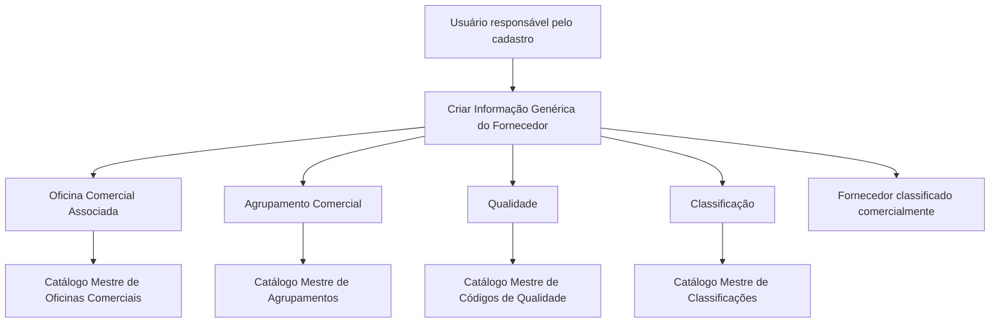

# Cadastro de Informação Genérica do Fornecedor — Classificação Comercial

## 1. Metadados do Documento
- **Arquivo de Origem:** `Não identificado`
- **Tipo de Documento:** Procedimento
- **Domínio / Sistema:** Cadastro de fornecedor e catálogos mestres do Sistema
- **Público-Alvo:** Negócio, Operação e usuários responsáveis pelo cadastro de fornecedores
- **Data/Versão Identificada:** Não identificada

---

## 2. Resumo Executivo & Contexto de Negócio

O documento descreve o bloco de **Informação Genérica do Fornecedor**, cuja finalidade é classificar comercialmente o fornecedor por meio do preenchimento de atributos associados a catálogos mestres existentes no Sistema.

A única ação explicitamente habilitada para o bloco de informação é **CRIAR**. A captura deve obedecer a uma sequência de preenchimento definida: leitura da esquerda para a direita e de cima para baixo.

Os atributos documentados associam o fornecedor à estrutura comercial, ao agrupamento comercial, à condição de qualidade e à classificação de terceiro genérico. Para cada atributo, os valores devem ser selecionados conforme os respectivos catálogos mestres do Sistema.

O conteúdo não detalha métodos HTTP, contratos de integração, persistência de dados, regras de obrigatoriedade, mensagens de erro, perfis de acesso ou comportamento posterior à criação do registro.

---

## 3. Arquitetura, Componentes & Tecnologias Envolvidas

Os componentes e conceitos identificados são:

- **Informação Genérica do Fornecedor:** bloco de dados destinado à classificação comercial do fornecedor.
- **Ação CRIAR:** ação habilitada no bloco documentado.
- **Sistema:** repositório dos catálogos mestres usados como fonte de valores para os campos.
- **Catálogo Mestre de Escritórios Comerciais:** fonte do código de terceiro nível da estrutura comercial.
- **Catálogo Mestre de Agrupamentos:** fonte da agrupação comercial.
- **Catálogo Mestre de Códigos de Qualidade:** fonte da condição de qualidade.
- **Catálogo Mestre de Classificações:** fonte da classificação do terceiro genérico.



> **Nota de Análise:** O documento descreve referências a catálogos mestres, mas não apresenta a tecnologia, a base de dados, os identificadores técnicos, as interfaces ou os mecanismos de integração usados pelo Sistema.

---

## 4. Regras de Negócio, Especificações Funcionais & Processos

1. O bloco de **Informação Genérica do Fornecedor** existe para atender à necessidade de classificar comercialmente o fornecedor.
2. A ação habilitada explicitamente no conteúdo é **CRIAR**.
3. Os campos devem ser capturados na ordem visual indicada pelo documento: **da esquerda para a direita e de cima para baixo**.
4. O campo **Oficina Comercial Associada** deve conter o código do terceiro nível da Estrutura Comercial atribuída ao fornecedor.
5. O valor de **Oficina Comercial Associada** deve respeitar a relação de valores disponível no catálogo mestre de Oficinas Comerciais do Sistema.
6. O campo **Agrupamento Comercial** deve conter a agrupação comercial associada ao fornecedor.
7. O valor de **Agrupamento Comercial** deve respeitar a relação de valores definida no catálogo mestre de Agrupamentos do Sistema.
8. O campo **Qualidade** deve conter a condição de qualidade vinculada ao fornecedor.
9. O valor de **Qualidade** deve ser escolhido entre os valores existentes no catálogo mestre de Códigos de Qualidade do Sistema.
10. O campo **Classificação** deve conter a classificação do terceiro genérico.
11. O valor de **Classificação** deve respeitar a relação de valores existente no catálogo mestre de Classificações do Sistema.

> **Nota de Análise:** O documento não especifica se os quatro atributos são obrigatórios, se admitem múltiplos valores, se possuem dependências entre si ou quais validações devem ocorrer quando um valor não estiver presente no catálogo mestre correspondente.

---

## 5. Tabelas de Parâmetros, Ambientes e Estruturas de Dados

| Item / Parâmetro | Descrição / Função | Tipo / Valores / Formato | Ambiente / Observações |
| :--- | :--- | :--- | :--- |
| Ação habilitada | Permite criar a Informação Genérica do Fornecedor. | `CRIAR` | Nenhuma outra ação é detalhada. |
| Ordem de captura | Define a sequência de preenchimento dos campos do bloco. | Da esquerda para a direita e de cima para baixo | Aplicável aos atributos documentados. |
| Oficina Comercial Associada | Armazena o código do terceiro nível da Estrutura Comercial atribuída ao fornecedor. | Valores provenientes do catálogo mestre de Oficinas Comerciais | O formato do código não é informado. |
| Agrupamento Comercial | Armazena a agrupação comercial associada ao fornecedor. | Valores provenientes do catálogo mestre de Agrupamentos | O documento não informa os valores disponíveis. |
| Qualidade | Armazena a condição de qualidade vinculada ao fornecedor. | Valores provenientes do catálogo mestre de Códigos de Qualidade | O documento não define códigos nem critérios de qualidade. |
| Classificação | Armazena a classificação do terceiro genérico. | Valores provenientes do catálogo mestre de Classificações | O documento não detalha categorias de classificação. |
| Sistema | Mantém os catálogos mestres referenciados pelos campos. | Não informado | Nome técnico do Sistema não identificado. |

---

## 6. Bateria de Perguntas & Respostas para RAG (FAQ Sintético)

### P1: Qual é o objetivo da Informação Genérica do Fornecedor?
**R:** A Informação Genérica do Fornecedor tem como objetivo classificar comercialmente o fornecedor por meio da captura de atributos relacionados à estrutura comercial, agrupamento comercial, qualidade e classificação.

### P2: Qual ação está habilitada para a Informação Genérica do Fornecedor?
**R:** A única ação explicitamente habilitada no documento é **CRIAR**.

### P3: Qual é a ordem de preenchimento dos campos da Informação Genérica do Fornecedor?
**R:** Os campos devem ser preenchidos da esquerda para a direita e de cima para baixo, conforme a sequência indicada no bloco de informação.

### P4: O que deve ser informado no campo Oficina Comercial Associada?
**R:** O campo Oficina Comercial Associada deve conter o código do terceiro nível da Estrutura Comercial atribuída ao fornecedor, utilizando a relação de valores disponível no catálogo mestre de Oficinas Comerciais do Sistema.

### P5: Qual catálogo mestre deve ser consultado para preencher Agrupamento Comercial?
**R:** O campo Agrupamento Comercial deve ser preenchido de acordo com os valores definidos no catálogo mestre de Agrupamentos existente no Sistema.

### P6: Qual é a finalidade do campo Qualidade no cadastro do fornecedor?
**R:** O campo Qualidade registra a condição de qualidade vinculada ao fornecedor. O valor deve corresponder a um dos valores existentes no catálogo mestre de Códigos de Qualidade do Sistema.

### P7: O que representa o campo Classificação?
**R:** O campo Classificação representa a classificação do terceiro genérico. O valor deve ser escolhido conforme a relação de valores presente no catálogo mestre de Classificações do Sistema.

### P8: O documento informa quais valores podem ser usados nos campos comerciais?
**R:** Não. O documento determina que os valores devem ser obtidos nos respectivos catálogos mestres do Sistema, mas não apresenta as listas de códigos, descrições ou valores permitidos.

### P9: O documento define APIs, contratos JSON ou métodos HTTP para o cadastro de fornecedor?
**R:** Não. O conteúdo descreve apenas a finalidade do bloco, a ação CRIAR, a sequência de captura e os campos associados a catálogos mestres.

### P10: O documento especifica se os campos de Informação Genérica do Fornecedor são obrigatórios?
**R:** Não. Não há definição explícita de obrigatoriedade, validações de preenchimento, mensagens de erro ou regras para ausência de valores nos catálogos mestres.

---

## 7. Glossário de Termos, Siglas & Conceitos-Chave

- **Fornecedor / Proveedor:** entidade cuja informação é cadastrada e classificada comercialmente.
- **Informação Genérica do Fornecedor:** estrutura de dados usada para classificar comercialmente o fornecedor.
- **Oficina Comercial Associada:** atributo que contém o código do terceiro nível da Estrutura Comercial atribuído ao fornecedor.
- **Estrutura Comercial:** estrutura da qual o documento referencia especificamente o terceiro nível para a Oficina Comercial Associada.
- **Agrupamento Comercial:** agrupação comercial associada ao fornecedor.
- **Qualidade:** condição de qualidade vinculada ao fornecedor.
- **Terceiro Genérico:** entidade cuja classificação é registrada no campo Classificação.
- **Catálogo Mestre:** fonte de valores existentes ou definidos no Sistema para preenchimento dos atributos.

---

## 8. Notas Críticas, Riscos & Limitações

- O arquivo de origem, a versão e a data do documento não foram identificados no conteúdo fornecido.
- O nome técnico do Sistema não é informado; o texto apenas menciona “Sistema”.
- O documento não apresenta valores concretos dos catálogos mestres.
- Não há detalhamento de obrigatoriedade, tipos de dados, tamanho de campos, formatos, valores padrão ou regras de dependência entre atributos.
- Não há informações sobre autenticação, autorização, matriz de permissões, auditoria ou responsáveis pela manutenção dos catálogos mestres.
- Não são documentadas mensagens de erro, comportamento de validação ou tratamento para valores ausentes ou inválidos.
- Os elementos “Inicio Soluciones APIs Documentación Zeus ES” aparecem no texto bruto, mas não possuem explicação funcional suficiente para serem tratados como componentes confirmados da solução.

---

## 9. Conteúdo Bruto Estruturado (Referência Fiel)

```text
--- [PÁGINA 1 DE 2] ---

CREAR Información Genérica del Proveedor
Objetivo
La captura de la información en esta Estructura de datos obedece a la necesidad de clasificar
comercialmente al Proveedor.
Acciones habilitadas
 CREAR ( )
Información Genérica del Proveedor
De Izquierda a Derecha y de Arriba hacia Abajo, los siguientes atributos marcan la secuencia de
captura de los Campos en este Bloque de Información.
Oficina Comercial Asociada (  )
Este atributo contiene el código del Tercer Nivel de la Estructura Comercial asignado al Proveedor, de
acuerdo con la relación de valores existentes en el catálogo maestro de Oficinas Comerciales
existente en el Sistema.
Agrupamiento Comercial (  )
 / 
 RS
Inicio Soluciones APIs Documentación Zeus
ES


--- [PÁGINA 2 DE 2] ---

Este Campo contendrá la Agrupación Comercial que se asocia al Proveedor de acuerdo con la
relación de valores definidos en el catálogo maestro de Agrupaciones existente en el Sistema.
Calidad (  )
Este Campo contendrá la condición de calidad vinculada al Proveedor de acuerdo con uno de valores
existentes en el catálogo maestro de Códigos de Calidad existente en el Sistema.
Clasificación (  )
Este Campo contendrá la Clasificación del Tercero Genérico de acuerdo con la relación de valores
existentes en el catálogo maestro de Clasificaciones existente en el Sistema.
```
