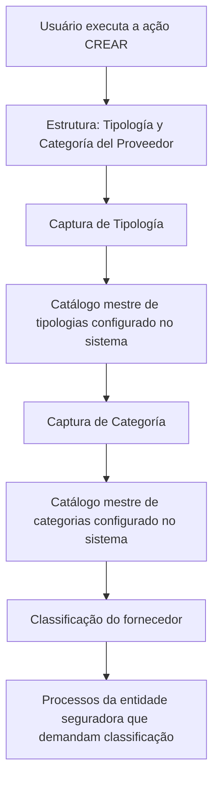

# Criação de Tipologia e Categoria do Fornecedor

## 1. Metadados do Documento
- **Arquivo de Origem:** Não identificado
- **Tipo de Documento:** Procedimento
- **Domínio / Sistema:** Cadastro e classificação de fornecedores em entidade seguradora
- **Público-Alvo:** Operação, Negócio e usuários responsáveis pelo cadastro de fornecedores
- **Data/Versão Identificada:** Não identificada

---

## 2. Resumo Executivo & Contexto de Negócio

O documento descreve a criação da estrutura de dados **“Tipología y Categoría del Proveedor”**. O objetivo declarado é capturar informações necessárias para classificar um fornecedor de modo adequado nos processos da entidade seguradora que demandem essa classificação.

A estrutura apresentada contém dois atributos de captura sequencial: **Tipologia** e **Categoria**. Ambos os atributos são determinados por códigos ou chaves previamente existentes em catálogos mestres configurados no sistema.

A classificação não é descrita como entrada livre. A Tipologia deve corresponder à relação de valores existente no catálogo mestre de tipologias, enquanto a Categoria deve corresponder à relação de valores disponível no catálogo mestre de categorias.

O documento habilita a ação **CREAR**, mas não apresenta detalhes sobre permissões, validações adicionais, persistência dos dados, métodos HTTP, contratos de API, telas, mensagens de erro ou integração com outros componentes.

---

## 3. Arquitetura, Componentes & Tecnologias Envolvidas

Os componentes e elementos explicitamente citados são:

- Estrutura de dados **Tipología y Categoría del Proveedor**.
- Atributo **Tipología**.
- Atributo **Categoría**.
- Catálogo mestre de tipologias configurado no sistema.
- Catálogo mestre de categorias configurado no sistema.
- Processos da entidade seguradora que exigem classificação de fornecedores.
- Ação habilitada: **CREAR**.
- Elementos de navegação mencionados no conteúdo bruto: **Inicio**, **Soluciones**, **APIs**, **Documentación**, **Zeus**, **ES**.



**Nota de Análise:** O documento não detalha a tecnologia da aplicação, a persistência dos dados, os serviços responsáveis pelos catálogos, nem os contratos de integração ou APIs associados à criação da classificação.

---

## 4. Regras de Negócio, Especificações Funcionais & Processos

1. A estrutura de dados **Tipología y Categoría del Proveedor** existe para registrar informações de classificação do fornecedor.
2. A finalidade da classificação é permitir que o fornecedor seja considerado adequadamente em processos da entidade seguradora que a demandem.
3. A ação habilitada no documento é **CREAR**.
4. Os atributos devem ser capturados da esquerda para a direita, obedecendo à sequência apresentada:
   1. **Tipología**
   2. **Categoría**
5. O atributo **Tipología** determina o código ou a chave do tipo de fornecedor.
6. O valor de **Tipología** deve estar de acordo com a relação de valores existente no catálogo mestre de tipologias configurado no sistema.
7. O atributo **Categoría** determina o código ou a chave da categoria do fornecedor.
8. O valor de **Categoría** deve estar de acordo com a relação de valores existente no catálogo mestre de categorias configurado no sistema.
9. O documento não informa se Tipologia e Categoria são obrigatórias, opcionais, mutuamente dependentes ou validadas entre si.
10. O documento não define critérios para criação de novos valores nos catálogos mestres de tipologias ou categorias.

---

## 5. Tabelas de Parâmetros, Ambientes e Estruturas de Dados

| Item / Parâmetro | Descrição / Função | Tipo / Valores / Formato | Ambiente / Observações |
| :--- | :--- | :--- | :--- |
| Tipología y Categoría del Proveedor | Estrutura de dados usada para classificar o fornecedor. | Estrutura de informação. | Destinada a processos de uma entidade seguradora. |
| CREAR | Ação habilitada para a estrutura descrita. | Ação. | O documento não detalha fluxo de aprovação, permissões ou resultado da criação. |
| Tipología | Determina o código ou a chave do tipo de fornecedor. | Código ou chave proveniente do catálogo mestre de tipologias. | Primeiro atributo na sequência de captura. |
| Categoría | Determina o código ou a chave da categoria do fornecedor. | Código ou chave proveniente do catálogo mestre de categorias. | Segundo atributo na sequência de captura. |
| Catálogo mestre de tipologias | Relação de valores válida para o atributo Tipología. | Catálogo configurado no sistema. | Não são informados valores, responsáveis ou manutenção do catálogo. |
| Catálogo mestre de categorias | Relação de valores válida para o atributo Categoría. | Catálogo configurado no sistema. | Não são informados valores, responsáveis ou manutenção do catálogo. |
| Entidade seguradora | Organização cujos processos podem demandar a classificação do fornecedor. | Contexto organizacional. | Nome da entidade não identificado. |
| Inicio / Soluciones / APIs / Documentación / Zeus / ES | Elementos textuais de navegação presentes na extração. | Navegação ou interface, sem detalhamento funcional. | O documento não explica sua função no processo de classificação. |

---

## 6. Bateria de Perguntas & Respostas para RAG (FAQ Sintético)

### P1: Qual é o objetivo da estrutura “Tipología y Categoría del Proveedor”?
**R:** A estrutura “Tipología y Categoría del Proveedor” tem como objetivo capturar informações para classificar o fornecedor adequadamente nos processos da entidade seguradora que demandem essa classificação.

### P2: Qual ação está habilitada para a estrutura de Tipologia e Categoria do Fornecedor?
**R:** O documento indica que a ação habilitada é **CREAR**. Não são fornecidos detalhes adicionais sobre permissões, etapas de aprovação ou comportamento após a criação.

### P3: Em qual ordem os campos da estrutura devem ser capturados?
**R:** A captura deve seguir a ordem da esquerda para a direita apresentada no documento: primeiro o atributo **Tipología** e depois o atributo **Categoría**.

### P4: O que o atributo Tipología representa no cadastro do fornecedor?
**R:** O atributo **Tipología** determina o código ou a chave do tipo de fornecedor, conforme a relação de valores existente no catálogo mestre de tipologias configurado no sistema.

### P5: De onde deve vir o valor atribuído ao campo Tipología?
**R:** O valor de **Tipología** deve vir da relação de valores existente no catálogo mestre de tipologias configurado no sistema.

### P6: O que o atributo Categoría representa no cadastro do fornecedor?
**R:** O atributo **Categoría** determina o código ou a chave da categoria do fornecedor, conforme a relação de valores existente no catálogo mestre de categorias configurado no sistema.

### P7: De onde deve vir o valor atribuído ao campo Categoría?
**R:** O valor de **Categoría** deve corresponder a um valor da relação existente no catálogo mestre de categorias configurado no sistema.

### P8: O documento informa quais são as tipologias de fornecedor disponíveis?
**R:** Não. O documento informa apenas que existe um catálogo mestre de tipologias configurado no sistema, mas não lista os valores desse catálogo.

### P9: O documento informa quais são as categorias de fornecedor disponíveis?
**R:** Não. O documento informa somente que existe um catálogo mestre de categorias configurado no sistema, sem apresentar seus códigos, chaves ou descrições.

### P10: Existem regras de dependência entre Tipología e Categoría?
**R:** O documento não descreve qualquer dependência, compatibilidade ou regra de validação cruzada entre **Tipología** e **Categoría**.

### P11: O documento define APIs ou contratos JSON para criar a classificação do fornecedor?
**R:** Não. Embora a extração contenha o termo “APIs” como elemento de navegação, não há métodos HTTP, endpoints, contratos JSON ou detalhes de integração descritos.

### P12: Para quais processos a classificação do fornecedor é utilizada?
**R:** A classificação é utilizada nos processos da entidade seguradora que demandem a adequada classificação do fornecedor. O documento não identifica nominalmente esses processos.

---

## 7. Glossário de Termos, Siglas & Conceitos-Chave

- **CREAR:** Ação habilitada para criar a estrutura de Tipologia e Categoria do Fornecedor.
- **Categoría:** Atributo que determina o código ou a chave da categoria do fornecedor conforme o catálogo mestre de categorias.
- **Catálogo mestre:** Relação de valores configurada no sistema e utilizada como referência para selecionar códigos ou chaves válidos.
- **Fornecedor / Proveedor:** Entidade que deve ser classificada para atendimento aos processos da entidade seguradora.
- **Tipología:** Atributo que determina o código ou a chave do tipo de fornecedor conforme o catálogo mestre de tipologias.
- **Zeus:** Termo presente nos elementos de navegação do conteúdo bruto; o documento não define seu significado ou função.
- **ES:** Termo presente nos elementos de navegação do conteúdo bruto; o documento não define seu significado ou função.

---

## 8. Notas Críticas, Riscos & Limitações

- O nome do arquivo, a data, a versão e a autoria do documento não foram identificados.
- O documento não apresenta a lista de valores dos catálogos mestres de tipologias e categorias.
- O documento não informa se os campos Tipología e Categoría são obrigatórios.
- O documento não descreve validações, mensagens de erro, regras de consistência ou tratamento de valores inválidos.
- O documento não detalha permissões ou perfis autorizados a executar a ação **CREAR**.
- O documento não define integrações, APIs, endpoints, contratos de dados ou serviços relacionados.
- O documento não especifica se a Categoria depende da Tipologia selecionada.
- O documento não identifica os processos específicos da entidade seguradora que consomem essa classificação.
- **Nota de Análise:** O conteúdo disponível é resumido e não contém detalhamento adicional sobre implementação, arquitetura técnica ou operação do processo.

---

## 9. Conteúdo Bruto Estruturado (Referência Fiel)

```text
--- [PÁGINA 1 DE 2] ---

CREAR Tipología y Categoría del Proveedor
Objetivo
La captura de la información en esta Estructura de datos obedece a la necesidad de clasificar al
Proveedor para poder contemplarlo adecuadamente en los procesos de la entidad Aseguradora que
así lo demanden.
Acciones habilitadas
 CREAR ( )
Tipología y Categoría del Proveedor
De Izquierda a Derecha los siguientes atributos marcan la secuencia de captura de los Campos en
este Bloque de Información.
Tipología (  )
Este Atributo determina el código o clave del Tipo de Proveedor de acuerdo con la relación de valores
existentes en el catálogo maestro de tipologías configurado en el Sistema.
Categoría (  )
 / 
 RS
Inicio Soluciones APIs Documentación Zeus
ES


--- [PÁGINA 2 DE 2] ---

Este campo determina el código o clave de la Categoría del Proveedor de acuerdo con la relación de
valores existentes en el catálogo maestro de Categorías configurado en el Sistema.
```
