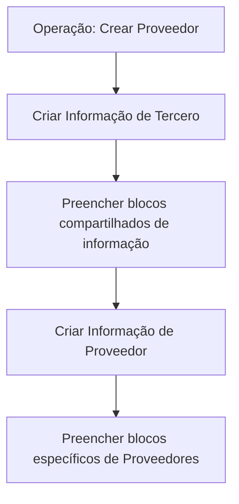

# Operação Criar Provedor — Registro de Informações de Terceiros e Fornecedores

## 1. Metadados do Documento
- **Arquivo de Origem:** `Não identificado`
- **Tipo de Documento:** `Procedimento`
- **Domínio / Sistema:** `Cadastro de Terceiros e Provedores`
- **Público-Alvo:** `Usuários do sistema, analistas funcionais e operação`
- **Data/Versão Identificada:** `Não identificada`

---

## 2. Resumo Executivo & Contexto de Negócio

O documento descreve a operação **“Crear Proveedor”**, destinada ao registro das informações de provedores. O processo inclui o cadastramento inicial do provedor como um **Tercero** e o preenchimento posterior de blocos específicos de informações de provedores.

A obrigatoriedade e a habilitação dos campos de cadastro podem variar conforme o código de atividade do Tercero. O documento também estabelece que essas condições podem mudar segundo o tipo de Tercero, distinguindo **Persona Física** e **Persona Jurídica**.

Personalizações implementadas no sistema podem afetar o comportamento da aplicação, especialmente em relação à obrigatoriedade do registro dos dados do Tercero. Portanto, as regras apresentadas não garantem uniformidade absoluta entre todas as configurações do ambiente.

A ordem de captura dos dados nos diferentes blocos de informação não é fixa. O documento informa que o usuário pode definir essa ordem segundo seu critério pessoal no sistema.

---

## 3. Arquitetura, Componentes & Tecnologias Envolvidas

O conteúdo não detalha arquitetura de software, microsserviços, tecnologias, integrações, contratos HTTP, bancos de dados, URLs de ambiente ou mecanismos de autenticação.

O documento apresenta um fluxo funcional de cadastro composto por duas etapas principais: criação das informações do Tercero e criação das informações específicas do provedor.



### Componentes funcionais identificados

| Componente / Etapa | Descrição |
| :--- | :--- |
| Operação “Crear Proveedor” | Operação que permite registrar informações de provedores. |
| Criar Informação Tercero | Etapa de cadastro do provedor como Tercero. |
| Criar Informação Proveedor | Etapa de cadastro dos blocos específicos de provedores. |
| Blocos compartilhados | Estruturas de informação utilizadas para dar alta ao provedor como Tercero. |
| Blocos específicos de provedores | Estruturas exclusivas do cadastro de provedores. |

> **Nota de Análise:** O texto apresenta referências de navegação, incluindo “Home Solutions APIs Documentation Zeus”, mas não fornece detalhamento suficiente para classificá-las como sistemas, componentes técnicos ou integrações.

---

## 4. Regras de Negócio, Especificações Funcionais & Processos

### Objetivo da operação

A operação **“Crear Proveedor”** permite registrar a informação dos provedores.

### Premissas de preenchimento

1. A obrigatoriedade e/ou habilitação dos campos no registro dos dados de cada bloco ou estrutura de informação compartilhada pode variar conforme o **código de atividade do Tercero**.
2. A obrigatoriedade e/ou habilitação dos campos no registro dos dados de cada bloco ou estrutura de informação pode variar quando o tipo de Tercero for:
   - Persona Física;
   - Persona Jurídica.
3. Personalizações implementadas podem afetar o comportamento da aplicação em relação à obrigatoriedade do registro dos dados do Tercero.
4. A ordem de captura dos dados nos diferentes blocos de informação pode variar de acordo com o critério pessoal seguido pelo usuário no sistema.

### Processo funcional

1. Criar a informação de **Tercero**.
2. Preencher os blocos de informação necessários para registrar o provedor como Tercero.
3. Criar a informação de **Proveedor**.
4. Preencher os blocos específicos de provedores.
5. Considerar as regras de obrigatoriedade e habilitação aplicáveis ao código de atividade, tipo de Tercero e personalizações existentes.

### Blocos de informação para dar alta ao Proveedor como Tercero

- Datos Básicos
- Tipología y Categoría
- Información General
- Datos Identificación del Tercero
- Persona Políticamente Expuesta
- Contactos
- Direcciones
- Impuestos y Retenciones
- Información Genérica
- Documentos Alternativos
- Representantes Legales
- Accionistas
- Medios de Cobro y Pago

### Blocos de informação específicos de Proveedores

- Datos Básicos
- Servicios y Marcas
- Servicios de Valor Agregado
- Zonas de Asignación
- Tarifas
- I.Q.R.F.
- Datos de Atención
- Datos de Evaluación
- Fraudes

> **Nota de Análise:** O documento não detalha os campos, validações, valores permitidos ou regras específicas de cada bloco de informação.

---

## 5. Tabelas de Parâmetros, Ambientes e Estruturas de Dados

| Item / Parâmetro | Descrição / Função | Tipo / Valores / Formato | Ambiente / Observações |
| :--- | :--- | :--- | :--- |
| Código de atividade do Tercero | Pode influenciar a obrigatoriedade e a habilitação de campos nos blocos ou estruturas de informação compartilhadas. | Não detalhado. | Aplicável ao cadastro de dados do Tercero. |
| Tipo de Tercero | Pode influenciar a obrigatoriedade e a habilitação de campos. | Persona Física ou Persona Jurídica. | Aplicável aos blocos ou estruturas de informação. |
| Personalizações implementadas | Podem alterar o comportamento da aplicação quanto à obrigatoriedade do registro dos dados do Tercero. | Não detalhado. | Dependente das personalizações existentes. |
| Ordem de captura dos dados | Ordem de preenchimento dos blocos de informação. | Definida conforme critério pessoal do usuário. | Não é apresentada uma sequência obrigatória fixa. |
| Datos Básicos | Bloco compartilhado para dar alta ao Proveedor como Tercero; também listado como bloco específico de Proveedores. | Estrutura de informação; campos não detalhados. | Presente nas duas categorias de blocos. |
| Tipología y Categoría | Bloco de informação para dar alta ao Proveedor como Tercero. | Estrutura de informação; campos não detalhados. | Bloco compartilhado. |
| Información General | Bloco de informação para dar alta ao Proveedor como Tercero. | Estrutura de informação; campos não detalhados. | Bloco compartilhado. |
| Datos Identificación del Tercero | Bloco de informação para identificação do Tercero. | Estrutura de informação; campos não detalhados. | Bloco compartilhado. |
| Persona Políticamente Expuesta | Bloco de informação para dar alta ao Proveedor como Tercero. | Estrutura de informação; campos não detalhados. | Bloco compartilhado. |
| Contactos | Bloco de informação para dar alta ao Proveedor como Tercero. | Estrutura de informação; campos não detalhados. | Bloco compartilhado. |
| Direcciones | Bloco de informação para dar alta ao Proveedor como Tercero. | Estrutura de informação; campos não detalhados. | Bloco compartilhado. |
| Impuestos y Retenciones | Bloco de informação para dar alta ao Proveedor como Tercero. | Estrutura de informação; campos não detalhados. | Bloco compartilhado. |
| Información Genérica | Bloco de informação para dar alta ao Proveedor como Tercero. | Estrutura de informação; campos não detalhados. | Bloco compartilhado. |
| Documentos Alternativos | Bloco de informação para dar alta ao Proveedor como Tercero. | Estrutura de informação; campos não detalhados. | Bloco compartilhado. |
| Representantes Legales | Bloco de informação para dar alta ao Proveedor como Tercero. | Estrutura de informação; campos não detalhados. | Bloco compartilhado. |
| Accionistas | Bloco de informação para dar alta ao Proveedor como Tercero. | Estrutura de informação; campos não detalhados. | Bloco compartilhado. |
| Medios de Cobro y Pago | Bloco de informação para dar alta ao Proveedor como Tercero. | Estrutura de informação; campos não detalhados. | Bloco compartilhado. |
| Servicios y Marcas | Bloco específico de Proveedores. | Estrutura de informação; campos não detalhados. | Cadastro específico do provedor. |
| Servicios de Valor Agregado | Bloco específico de Proveedores. | Estrutura de informação; campos não detalhados. | Cadastro específico do provedor. |
| Zonas de Asignación | Bloco específico de Proveedores. | Estrutura de informação; campos não detalhados. | Cadastro específico do provedor. |
| Tarifas | Bloco específico de Proveedores. | Estrutura de informação; campos não detalhados. | Cadastro específico do provedor. |
| I.Q.R.F. | Bloco específico de Proveedores. | Sigla não expandida no documento. | Cadastro específico do provedor. |
| Datos de Atención | Bloco específico de Proveedores. | Estrutura de informação; campos não detalhados. | Cadastro específico do provedor. |
| Datos de Evaluación | Bloco específico de Proveedores. | Estrutura de informação; campos não detalhados. | Cadastro específico do provedor. |
| Fraudes | Bloco específico de Proveedores. | Estrutura de informação; campos não detalhados. | Cadastro específico do provedor. |

---

## 6. Bateria de Perguntas & Respostas para RAG (FAQ Sintético)

### P1: Qual é o objetivo da operação “Crear Proveedor”?
**R:** A operação “Crear Proveedor” permite registrar as informações dos provedores.

### P2: O cadastro de um provedor inclui o registro como Tercero?
**R:** Sim. O processo apresentado inclui a criação da informação de Tercero e, em seguida, a criação da informação específica de Proveedor.

### P3: Quais fatores podem alterar a obrigatoriedade dos campos no cadastro do Tercero?
**R:** A obrigatoriedade e/ou habilitação dos campos pode variar conforme o código de atividade do Tercero, o tipo de Tercero — Persona Física ou Persona Jurídica — e as personalizações implementadas na aplicação.

### P4: A ordem de preenchimento dos blocos de informação é obrigatória?
**R:** Não. O documento informa que a ordem de captura dos dados nos diferentes blocos de informação pode variar de acordo com o critério pessoal do usuário no sistema.

### P5: Quais blocos são utilizados para dar alta ao Proveedor como Tercero?
**R:** Os blocos são: Datos Básicos, Tipología y Categoría, Información General, Datos Identificación del Tercero, Persona Políticamente Expuesta, Contactos, Direcciones, Impuestos y Retenciones, Información Genérica, Documentos Alternativos, Representantes Legales, Accionistas e Medios de Cobro y Pago.

### P6: Quais são os blocos específicos do cadastro de Proveedores?
**R:** Os blocos específicos são: Datos Básicos, Servicios y Marcas, Servicios de Valor Agregado, Zonas de Asignación, Tarifas, I.Q.R.F., Datos de Atención, Datos de Evaluación e Fraudes.

### P7: O bloco “Datos Básicos” aparece em mais de uma etapa do cadastro?
**R:** Sim. “Datos Básicos” é listado tanto entre os blocos de informação para dar alta ao Proveedor como Tercero quanto entre os blocos específicos de Proveedores.

### P8: O documento define quais campos compõem o bloco “Tarifas”?
**R:** Não. O documento apenas lista “Tarifas” como bloco específico de Proveedores, sem detalhar campos, formatos, regras de cálculo ou validações.

### P9: O que significa a sigla I.Q.R.F.?
**R:** O documento lista “I.Q.R.F.” como um bloco específico de Proveedores, mas não apresenta a expansão ou definição da sigla.

### P10: As personalizações podem modificar o comportamento do cadastro?
**R:** Sim. O documento declara que personalizações implementadas podem afetar o comportamento da aplicação quanto à obrigatoriedade do registro dos dados do Tercero.

---

## 7. Glossário de Termos, Siglas & Conceitos-Chave

- **Proveedor:** Entidade cujo registro de informações é realizado pela operação “Crear Proveedor”.
- **Tercero:** Entidade para a qual são criadas informações antes do registro das informações específicas de Proveedor.
- **Persona Física:** Tipo de Tercero citado como fator que pode alterar a obrigatoriedade e/ou habilitação de campos.
- **Persona Jurídica:** Tipo de Tercero citado como fator que pode alterar a obrigatoriedade e/ou habilitação de campos.
- **I.Q.R.F.:** Bloco específico de Proveedores; significado não definido no documento.
- **Blocos de Informação:** Estruturas de informação usadas no processo de cadastro do Tercero e do Proveedor.

---

## 8. Notas Críticas, Riscos & Limitações

- O documento não apresenta os campos internos, formatos, tipos de dados ou validações de cada bloco de informação.
- O documento não detalha arquitetura de software, integrações, APIs, endpoints, métodos HTTP, contratos JSON, servidores ou ambientes.
- A obrigatoriedade e habilitação de campos não são estáticas: podem variar por código de atividade, tipo de Tercero e personalizações implementadas.
- A ordem de preenchimento dos blocos é variável segundo o critério do usuário, não havendo uma sequência operacional obrigatória documentada.
- A sigla **I.Q.R.F.** é citada, mas não é definida.
- O texto não especifica quais personalizações podem existir nem como elas alteram o comportamento da aplicação.

---

## 9. Conteúdo Bruto Estruturado (Referência Fiel)

```text
--- [PÁGINA 1 DE 2] ---

OPERACIÓN CREAR Proveedor
¿En que consiste?
Esta operación permite registrar la Información de los Proveedores.
Premisas
La obligatoriedad y/o la habilitación de los campos en el registro de los datos de cada uno de
los bloques o estructuras de información compartidas puede variar de acuerdo con el código de
actividad del Tercero:
La obligatoriedad y/o la habilitación de los campos en el registro de los datos de cada uno de
los bloques o estructuras de información pueden variar si el tipo de Tercero es una Persona
Física o una Persona Jurídica:
Las personalizaciones que se hubieran podido implementar a su vez pueden afectar el
comportamiento de la aplicación en relación con la obligatoriedad en el registro de los Datos del
Tercero.
Por último, el orden en la captura de los datos en los distintos bloques de Información puede
variar de acuerdo con el criterio personal seguido por el Usuario en el Sistema.
Ejemplo:
Ejemplo:
 /
CF
Home Solutions APIs Documentation Zeus
EN


--- [PÁGINA 2 DE 2] ---

Proceso
Crear Información
Tercero
Crear Información
Proveedor
Bloques de Información para dar de alta al Proveedor como
Tercero.
 Datos Básicos ( )
 Tipología y Categoría ( )
 Información General ( )
 Datos Identificación del Tercero ( )
 Persona Políticamente Expuesta ( )
 Contactos ( )
 Direcciones ( )
 Impuestos y Retenciones ( )
 Información Genérica ( )
 Documentos Alternativos ( )
 Representantes Legales ( )
 Accionistas ( )
 Medios de Cobro y Pago ( )
Bloques de Información específicos de Proveedores.
 Datos Básicos
 Servicios y Marcas
 Servicios de Valor Agregado
 Zonas de Asignación
 Tarifas
 I.Q.R.F.
 Datos de Atención
 Datos de Evaluación
 Fraudes
```
