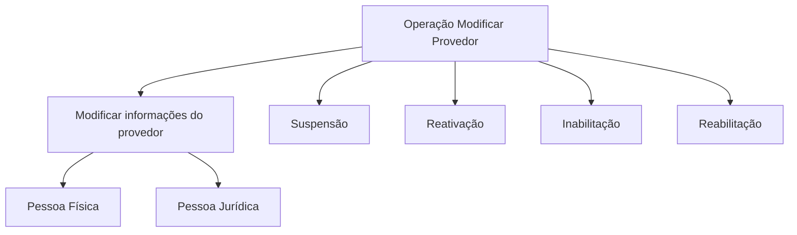

# Operação Modificar Provedor: Gestão de Informação e Estados do Provedor

## 1. Metadados do Documento
- **Arquivo de Origem:** `Não identificado`
- **Tipo de Documento:** `Procedimento`
- **Domínio / Sistema:** `Gestão de Provedores`
- **Público-Alvo:** `Não identificado`
- **Data/Versão Identificada:** `Não identificada`

---

## 2. Resumo Executivo & Contexto de Negócio

O documento descreve a operação **Modificar Provedor**, destinada à alteração de informações de provedores, abrangendo tanto **Pessoas Físicas** quanto **Pessoas Jurídicas**.

Além da modificação cadastral, a operação deve contemplar quatro transições ou condições relacionadas ao estado do provedor: **Suspensão**, **Reativação**, **Inabilitação** e **Reabilitação**.

O trecho fornecido não especifica sistemas executores, APIs, métodos HTTP, contratos de dados, critérios de autorização, campos modificáveis, regras de validação ou fluxos de aprovação.

> **Nota de Análise:** O documento define o escopo funcional da operação de modificação de provedores, mas não detalha o comportamento técnico ou operacional necessário para executar cada alteração ou transição de estado.

---

## 3. Arquitetura, Componentes & Tecnologias Envolvidas

Os únicos elementos textuais identificados são a operação **Modificar Provedor** e referências de navegação ou interface: **Inicio**, **Soluciones**, **APIs**, **Documentación**, **Zeus**, **RS** e **ES**.

O texto não estabelece relações técnicas verificáveis entre esses elementos, nem identifica tecnologias, integrações, bancos de dados, microsserviços, ambientes ou contratos de API.



> **Nota de Análise:** O diagrama representa exclusivamente os elementos e estados explicitamente citados no documento. O documento não define a sequência, as pré-condições ou os efeitos das transições de Suspensão, Reativação, Inabilitação e Reabilitação.

---

## 4. Regras de Negócio, Especificações Funcionais & Processos

1. A operação é denominada **Modificar Provedor**.
2. A operação trata da modificação das informações de provedores.
3. O escopo de provedores inclui:
   - Pessoas Físicas.
   - Pessoas Jurídicas.
4. A operação deve contemplar:
   - Suspensão do provedor.
   - Reativação do provedor.
   - Inabilitação do provedor.
   - Reabilitação do provedor.
5. O documento não informa:
   - Quais informações de provedor podem ser modificadas.
   - Quais campos são obrigatórios.
   - Quais validações devem ser aplicadas.
   - Quem pode executar a operação.
   - Quais condições permitem Suspensão, Reativação, Inabilitação ou Reabilitação.
   - Se os quatro estados são mutuamente exclusivos.
   - Se existe trilha de auditoria, aprovação ou notificação.

---

## 5. Tabelas de Parâmetros, Ambientes e Estruturas de Dados

| Item / Parâmetro | Descrição / Função | Tipo / Valores / Formato | Ambiente / Observações |
| :--- | :--- | :--- | :--- |
| Operação | Modificar Provedor | Operação funcional | Alteração de informações de provedores |
| Provedor | Entidade cuja informação pode ser modificada | Pessoa Física ou Pessoa Jurídica | Não há campos cadastrais especificados |
| Suspensão | Condição que deve ser contemplada pela operação | Estado ou ação mencionada | Sem critérios ou fluxo detalhados |
| Reativação | Condição que deve ser contemplada pela operação | Estado ou ação mencionada | Sem critérios ou fluxo detalhados |
| Inabilitação | Condição que deve ser contemplada pela operação | Estado ou ação mencionada | Sem critérios ou fluxo detalhados |
| Reabilitação | Condição que deve ser contemplada pela operação | Estado ou ação mencionada | Sem critérios ou fluxo detalhados |
| Inicio | Elemento textual presente no conteúdo | Referência de navegação ou interface | Função não detalhada |
| Soluciones | Elemento textual presente no conteúdo | Referência de navegação ou interface | Função não detalhada |
| APIs | Elemento textual presente no conteúdo | Referência de navegação ou interface | Não há especificação de APIs |
| Documentación | Elemento textual presente no conteúdo | Referência de navegação ou interface | Função não detalhada |
| Zeus | Elemento textual presente no conteúdo | Termo ou sistema citado | Não definido no trecho |
| RS | Sigla ou marcador citado | Não identificado | Sem definição no trecho |
| ES | Sigla ou marcador citado | Não identificado | Sem definição no trecho |

---

## 6. Bateria de Perguntas & Respostas para RAG (FAQ Sintético)

### P1: Qual é o objetivo da operação Modificar Provedor?
**R:** A operação Modificar Provedor tem como objetivo modificar informações de provedores. O documento informa que o escopo inclui provedores classificados como Pessoas Físicas e Pessoas Jurídicas.

### P2: A operação Modificar Provedor aplica-se a Pessoas Físicas?
**R:** Sim. O documento declara que a modificação de informações de provedores deve contemplar provedores que sejam Pessoas Físicas.

### P3: A operação Modificar Provedor aplica-se a Pessoas Jurídicas?
**R:** Sim. O documento declara que a modificação de informações de provedores deve contemplar provedores que sejam Pessoas Jurídicas.

### P4: Quais situações relacionadas ao estado do provedor devem ser contempladas?
**R:** A operação deve contemplar Suspensão, Reativação, Inabilitação e Reabilitação do provedor.

### P5: O documento especifica quais dados cadastrais do provedor podem ser alterados?
**R:** Não. O documento menciona a modificação da informação dos provedores, mas não lista campos cadastrais, estruturas de dados ou atributos que possam ser modificados.

### P6: Quais são os critérios para suspender um provedor?
**R:** O documento informa que a Suspensão deve ser contemplada pela operação, mas não descreve critérios, responsáveis, validações, pré-condições ou consequências da Suspensão.

### P7: O documento define como reativar um provedor suspenso?
**R:** Não. O texto cita a Reativação como uma condição que deve ser contemplada, mas não define o fluxo, as regras de elegibilidade ou os dados necessários para realizar a Reativação.

### P8: Qual é a diferença entre Inabilitação e Reabilitação no documento?
**R:** O documento cita Inabilitação e Reabilitação como condições que devem ser contempladas na operação Modificar Provedor. Entretanto, o texto não define seus significados, suas diferenças funcionais ou suas regras de transição.

### P9: Existem APIs ou contratos técnicos documentados para a operação Modificar Provedor?
**R:** Não. Embora o conteúdo inclua o termo “APIs”, não há métodos HTTP, endpoints, parâmetros de entrada, respostas, contratos JSON, mecanismos de autenticação ou códigos de erro documentados.

### P10: O que significa Zeus no contexto da operação Modificar Provedor?
**R:** O termo “Zeus” aparece no conteúdo fornecido, mas o documento não apresenta definição, papel arquitetural, integração ou relação explícita entre Zeus e a operação Modificar Provedor.

---

## 7. Glossário de Termos, Siglas & Conceitos-Chave

- **Modificar Provedor:** Operação destinada à modificação da informação de provedores.
- **Provedor:** Entidade cuja informação pode ser modificada; pode ser Pessoa Física ou Pessoa Jurídica.
- **Pessoa Física:** Categoria de provedor explicitamente incluída no escopo da operação.
- **Pessoa Jurídica:** Categoria de provedor explicitamente incluída no escopo da operação.
- **Suspensão:** Condição ou ação relativa ao provedor que deve ser contemplada pela operação.
- **Reativação:** Condição ou ação relativa ao provedor que deve ser contemplada pela operação.
- **Inabilitação:** Condição ou ação relativa ao provedor que deve ser contemplada pela operação.
- **Reabilitação:** Condição ou ação relativa ao provedor que deve ser contemplada pela operação.
- **APIs:** Termo presente no conteúdo; não há APIs descritas.
- **Zeus:** Termo presente no conteúdo; não definido no trecho.
- **RS:** Sigla ou marcador presente no conteúdo; não definido no trecho.
- **ES:** Sigla ou marcador presente no conteúdo; não definido no trecho.

---

## 8. Notas Críticas, Riscos & Limitações

- O documento não identifica o arquivo de origem, data, versão, autor ou público-alvo.
- Não há detalhamento dos dados cadastrais modificáveis para Pessoas Físicas e Pessoas Jurídicas.
- Não há definição funcional ou operacional para Suspensão, Reativação, Inabilitação e Reabilitação.
- Não há critérios de validação, regras de autorização, perfis de acesso ou responsáveis pela operação.
- Não há detalhes de integrações, APIs, endpoints, contratos de dados ou tecnologias envolvidas.
- Não há definição verificável para os termos **Zeus**, **RS** e **ES**.
- Não há fluxo sequencial explícito; o diagrama apresentado organiza os elementos citados sem inferir transições de estado.

---

## 9. Conteúdo Bruto Estruturado (Referência Fiel)

```text
--- [PÁGINA 1 DE 1] ---

OPERACIÓN MODIFICAR Proveedor
Elementos que intervienen o pueden intervenir en la Modificación de la información de los
Proveedores, sean estos Personas Físicas o Personas Jurídicas.
Debe contemplar tanto la Suspensión como la Reactivación, Inhabilitación y Rehabilitación del
Proveedor.
 / 
 RS
Inicio Soluciones APIs Documentación Zeus
ES
```
