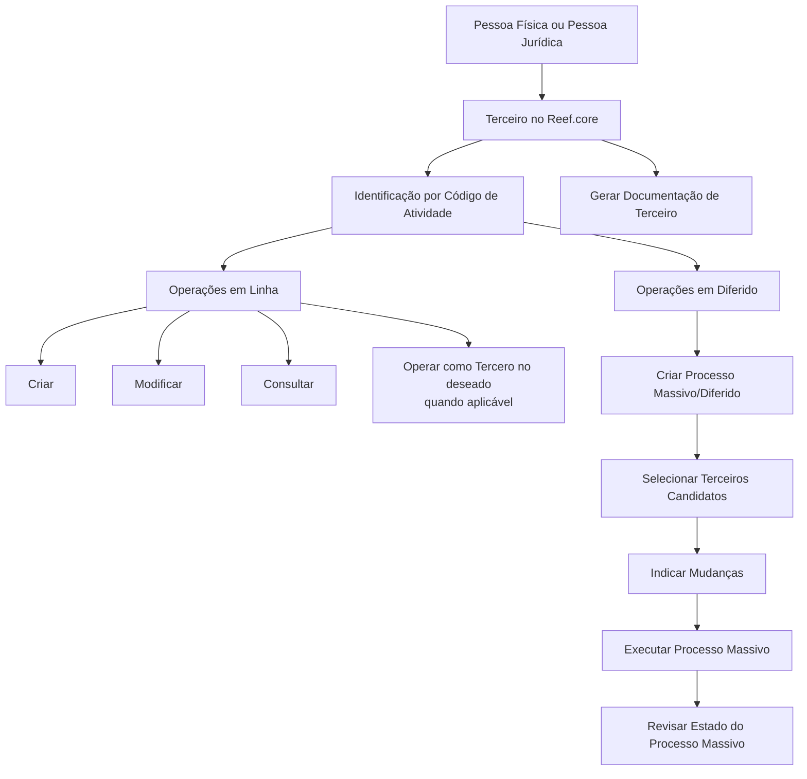

# Operações com Terceiros por Código de Atividade no Reef.core

## 1. Metadados do Documento
- **Arquivo de Origem:** Não identificado no conteúdo extraído
- **Tipo de Documento:** Manual Operacional
- **Domínio / Sistema:** Reef.core — gestão de Terceiros e operações por Código de Atividade
- **Público-Alvo:** Operação, analistas funcionais, desenvolvedores e equipes de negócio
- **Data/Versão Identificada:** Não identificada

---

## 2. Resumo Executivo & Contexto de Negócio

O documento descreve as operações disponíveis no sistema **Reef.core** para administrar entidades denominadas **Terceiros**. No contexto do Reef.core, o termo Terceiros abrange tanto pessoas físicas quanto pessoas jurídicas.

A categorização de cada Terceiro ocorre por meio de uma **Clave/Código de Atividade**, que determina o tipo de entidade administrada, como Asegurados/Clientes, Agentes, Supervisores de Sinistros, Tramitadores, seguradoras, bancos, oficinas bancárias e níveis da estrutura comercial.

Para os grupos detalhados, o documento relaciona operações em linha de criação, alteração e consulta. Alguns tipos também permitem tratamento como **“Tercero no deseado”**, especificamente Agentes e Terceiros Genéricos. O documento não detalha o significado funcional, critérios, efeitos ou regras de aprovação associados ao status “Tercero no deseado”.

Além das operações online, o conteúdo apresenta um processo em diferido ou massivo: criação do processo, seleção de candidatos, indicação de mudanças, execução e revisão do estado. Há também uma operação para geração de documentação de Terceiro, sem detalhamento de formatos, requisitos, destino ou conteúdo documental.

---

## 3. Arquitetura, Componentes & Tecnologias Envolvidas

O componente principal explicitamente identificado é o **Reef.core**, responsável por classificar e operar Terceiros por Código de Atividade. O texto também contém a sequência “CF / Home Solutions APIs Documentation Zeus / EN”, mas não apresenta contexto suficiente para estabelecer uma integração, tecnologia, ambiente, contrato de API ou relação arquitetural com Reef.core.

### Componentes e capacidades identificados

| Componente / Conceito | Papel sustentado pelo documento | Observações |
| :--- | :--- | :--- |
| Reef.core | Sistema que denomina pessoas físicas e jurídicas como Terceiros e permite operações conforme o Código de Atividade. | Não há detalhes de arquitetura interna, APIs, bancos de dados ou interfaces. |
| Terceiro | Pessoa física ou jurídica tratada pelo Reef.core. | Pode representar múltiplas categorias de atividade. |
| Código de Atividade | Chave usada pelo sistema para identificar determinados tipos de Terceiros. | Há códigos explícitos para diversas categorias. |
| Operações em linha | Operações individuais de criação, modificação e consulta. | Disponíveis conforme a categoria de Terceiro. |
| Operações em diferido | Processo massivo aplicado a Terceiros candidatos. | O documento enumera as etapas, mas não define critérios de seleção ou execução. |
| Geração de documentação de Terceiro | Capacidade de gerar documentação associada a um Terceiro. | Formato e conteúdo não detalhados. |



> **Nota de Análise:** O documento não detalha camadas de aplicação, protocolos, endpoints, métodos HTTP, contratos JSON, mecanismos de autenticação, persistência de dados, URLs ou ambientes técnicos.

---

## 4. Regras de Negócio, Especificações Funcionais & Processos

### 4.1 Regra de classificação de Terceiros

1. O Reef.core utiliza o termo **Terceiros** para pessoas físicas e pessoas jurídicas.
2. A identificação de determinadas categorias de Terceiros ocorre por uma **Clave de Atividade**.
3. As operações disponíveis variam de acordo com a categoria e, quando indicada, com a Clave de Atividade correspondente.
4. O documento menciona parâmetros específicos de instalação para Terceiros, mas não apresenta nomes, valores, tipos, regras ou efeitos desses parâmetros.

### 4.2 Operações online por categoria

#### Asegurados/Clientes — Clave de Atividade 1
- Criar Asegurado.
- Criar Asegurado a partir da informação de outro Terceiro.
- Modificar Asegurado.
- Consultar Asegurado.

#### Agentes — Clave de Atividade 2
- Criar Agente.
- Criar Agente como Tercero no deseado.
- Modificar Agente.
- Modificar Agente como Tercero no deseado.
- Consultar Agente.

#### Terceiros Genéricos — Claves de Atividade listadas
- Criar Tercero Genérico.
- Criar Tercero Genérico como Tercero no deseado.
- Modificar Tercero Genérico.
- Modificar Tercero Genérico como Tercero no deseado.
- Consultar Tercero Genérico.

O documento define como Terceiros Genéricos pessoas físicas ou jurídicas cujas atividades laborais correspondam às profissões listadas nas tabelas de códigos de atividade.

#### Supervisores — Clave de Atividade 8
- Criar Supervisor.
- Modificar Supervisor.
- Consultar Supervisor.

#### Tramitadores — Clave de Atividade 9
- Criar Tramitador.
- Modificar Tramitador.
- Consultar Tramitador.

#### Companhias Aseguradoras — Clave de Atividade 13
- Criar Compañía Aseguradora.
- Modificar Compañía Aseguradora.
- Consultar Compañía Aseguradora.

#### Companhias Reaseguradoras — Clave de Atividade 14
- Criar Compañía Reaseguradora.
- Modificar Compañía Reaseguradora.
- Consultar Compañía Reaseguradora.

#### Brokers de Seguros — Clave de Atividade 16
- Criar Broker de Seguros.
- Modificar Broker de Seguros.
- Consultar Broker de Seguros.

#### Empregados de Agências/Agentes — Clave de Atividade 37
- Criar Empleado de Agente.
- Modificar Empleado de Agente.
- Consultar Empleado de Agente.

#### Companhias do Grupo MAPFRE Local — Clave de Atividade 39
- Criar Compañía.
- Modificar Compañía.
- Consultar Compañía.

#### Entidades Bancárias — Clave de Atividade 40
- Criar Entidad Bancaria.
- Modificar Entidad Bancaria.
- Consultar Entidad Bancaria.

#### Oficinas/Sucursais Bancárias — Clave de Atividade 41
- Criar Oficina Bancaria.
- Modificar Oficina Bancaria.
- Consultar Oficina Bancaria.

#### Primeiro Nível da Estrutura Comercial — Clave de Atividade 42
- Criar Primer Nivel Estructura Comercial.
- Modificar Primer Nivel Estructura Comercial.
- Consultar Primer Nivel Estructura Comercial.

#### Segundo Nível da Estrutura Comercial — Clave de Atividade 43
- Criar Segundo Nivel Estructura Comercial.
- Modificar Segundo Nivel Estructura Comercial.
- Consultar Segundo Nivel Estructura Comercial.

#### Terceiro Nível da Estrutura Comercial — Clave de Atividade 44
- Criar Tercer Nivel Estructura Comercial.
- Modificar Tercer Nivel Estructura Comercial.
- Consultar Tercer Nivel Estructura Comercial.

#### Proveedores
- Criar Proveedor.
- Modificar Proveedor.
- Consultar Proveedor.

**Restrição explicitamente registrada:** um Terceiro somente pode ser usado ou empregado como Proveedor quando o respectivo Código de Atividade permitir esse uso ou emprego. O documento não informa quais códigos permitem essa condição.

### 4.3 Processo em diferido ou massivo

| Ordem | Etapa | Descrição sustentada |
| :--- | :--- | :--- |
| 1 | Criar Processo Massivo/Diferido | Início de um processo destinado a operações em diferido. |
| 2 | Selecionar Terceiros Candidatos | Seleção dos Terceiros que participarão do processo. |
| 3 | Indicar Mudanças nos Terceiros Candidatos | Registro das alterações a aplicar aos candidatos selecionados. |
| 4 | Executar Processo Massivo | Execução do processo massivo configurado. |
| 5 | Revisar Estado do Processo Massivo | Consulta ou revisão do estado do processo após a execução. |

### 4.4 Geração de documentação

- Gerar Documentação de Terceiro.

> **Nota de Análise:** O documento não especifica os pré-requisitos, o conteúdo, os templates, o formato de saída, o armazenamento ou o canal de entrega da documentação gerada.

---

## 5. Tabelas de Parâmetros, Ambientes e Estruturas de Dados

### 5.1 Códigos de Atividade explicitamente identificados

| Item / Parâmetro | Descrição / Função | Tipo / Valores / Formato | Ambiente / Observações |
| :--- | :--- | :--- | :--- |
| Clave de Atividade 1 | Identifica Asegurados/Clientes. | Código numérico: `1` | Reef.core |
| Clave de Atividade 2 | Identifica Agentes. | Código numérico: `2` | Reef.core |
| Clave de Atividade 3 | Peritos. | Código numérico: `3` | Terceiro Genérico |
| Clave de Atividade 4 | Inspectores. | Código numérico: `4` | Terceiro Genérico |
| Clave de Atividade 5 | Médicos. | Código numérico: `5` | Terceiro Genérico |
| Clave de Atividade 6 | Abogados. | Código numérico: `6` | Terceiro Genérico |
| Clave de Atividade 7 | Procuradores. | Código numérico: `7` | Terceiro Genérico |
| Clave de Atividade 8 | Supervisores de Sinistros. | Código numérico: `8` | Reef.core |
| Clave de Atividade 9 | Tramitadores de Sinistros. | Código numérico: `9` | Reef.core |
| Clave de Atividade 10 | Proveedores. | Código numérico: `10` | Terceiro Genérico |
| Clave de Atividade 11 | Ejecutivos de Cta. | Código numérico: `11` | Terceiro Genérico |
| Clave de Atividade 12 | Cobradores. | Código numérico: `12` | Terceiro Genérico |
| Clave de Atividade 13 | Compañías Aseguradoras. | Código numérico: `13` | Reef.core |
| Clave de Atividade 14 | Compañías Reaseguradoras. | Código numérico: `14` | Reef.core |
| Clave de Atividade 15 | Empleados. | Código numérico: `15` | Terceiro Genérico |
| Clave de Atividade 16 | Brokers de Seguros. | Código numérico: `16` | Reef.core |
| Clave de Atividade 17 | Talleres. | Código numérico: `17` | Terceiro Genérico |
| Clave de Atividade 18 | Clínicas. | Código numérico: `18` | Terceiro Genérico |
| Clave de Atividade 19 | Juzgados. | Código numérico: `19` | Terceiro Genérico |
| Clave de Atividade 20 | Cristaleros. | Código numérico: `20` | Terceiro Genérico |
| Clave de Atividade 21 | Cerrajeros. | Código numérico: `21` | Terceiro Genérico |
| Clave de Atividade 22 | Plomeros. | Código numérico: `22` | Terceiro Genérico |
| Clave de Atividade 23 | Electricistas. | Código numérico: `23` | Terceiro Genérico |
| Clave de Atividade 24 | Grúas. | Código numérico: `24` | Terceiro Genérico |
| Clave de Atividade 25 | Investigadores. | Código numérico: `25` | Terceiro Genérico |
| Clave de Atividade 26 | Recuperadores. | Código numérico: `26` | Terceiro Genérico |
| Clave de Atividade 27 | Ajustadores. | Código numérico: `27` | Terceiro Genérico |
| Clave de Atividade 28 | Herreros. | Código numérico: `28` | Terceiro Genérico |
| Clave de Atividade 29 | Tribunales. | Código numérico: `29` | Terceiro Genérico |
| Clave de Atividade 30 | Terceros Seg. MOTOR. | Código numérico: `30` | Terceiro Genérico |
| Clave de Atividade 31 | Terceros Seg. SALUD. | Código numérico: `31` | Terceiro Genérico |
| Clave de Atividade 32 | Terceros Seg. PATRIMONIALES. | Código numérico: `32` | Terceiro Genérico |
| Clave de Atividade 33 | Depósitos. | Código numérico: `33` | Terceiro Genérico |
| Clave de Atividade 34 | Notarías. | Código numérico: `34` | Terceiro Genérico |
| Clave de Atividade 35 | Centros de Peritación. | Código numérico: `35` | Terceiro Genérico |
| Clave de Atividade 36 | Comisarías. | Código numérico: `36` | Terceiro Genérico |
| Clave de Atividade 37 | Empleados de Agencias/Agentes. | Código numérico: `37` | Reef.core |
| Clave de Atividade 38 | Filial. | Código numérico: `38` | Terceiro Genérico |
| Clave de Atividade 39 | Compañías del Grupo MAPFRE Local. | Código numérico: `39` | Reef.core |
| Clave de Atividade 40 | Entidades Bancarias. | Código numérico: `40` | Reef.core |
| Clave de Atividade 41 | Oficinas/Sucursales Bancarias. | Código numérico: `41` | Reef.core |
| Clave de Atividade 42 | Primer Nivel de la Estructura Comercial (Estructural). | Código numérico: `42` | Reef.core |
| Clave de Atividade 43 | Segundo Nivel de la Estructura Comercial (Sub Central). | Código numérico: `43` | Reef.core |
| Clave de Atividade 44 | Tercer Nivel de la Estructura Comercial (Oficinas). | Código numérico: `44` | Reef.core |
| Clave de Atividade 45 | Representantes Legales. | Código numérico: `45` | Terceiro Genérico |

### 5.2 Parâmetros e informações ausentes

| Item / Parâmetro | Descrição / Função | Tipo / Valores / Formato | Ambiente / Observações |
| :--- | :--- | :--- | :--- |
| Parâmetros específicos de instalação para Terceiros | O documento informa sua existência. | Não detalhado. | Não detalhado. |
| Ambientes técnicos | URLs, servidores, portas, credenciais e variáveis de ambiente. | Não informado. | Não informado. |
| Logs e monitoramento | Rotas, arquivos, níveis e políticas de retenção de log. | Não informado. | Não informado. |
| Contratos de integração | Métodos HTTP, endpoints, payloads e autenticação. | Não informado. | Não informado. |

---

## 6. Bateria de Perguntas & Respostas para RAG (FAQ Sintético)

### P1: O que o Reef.core considera como Terceiro?
**R:** No Reef.core, o termo Terceiros é usado para abranger tanto pessoas físicas quanto pessoas jurídicas. Esses Terceiros são administrados conforme a sua Clave ou Código de Atividade.

### P2: Qual Código de Atividade identifica Asegurados e Clientes no Reef.core?
**R:** Asegurados e Clientes são identificados pela Clave de Atividade `1`. Para essa categoria, o documento lista as operações de criar Asegurado, criar Asegurado a partir das informações de outro Terceiro, modificar Asegurado e consultar Asegurado.

### P3: Quais operações estão disponíveis para Agentes?
**R:** Os Agentes, identificados pela Clave de Atividade `2`, podem ser criados, modificados e consultados. O documento também prevê criar Agente como “Tercero no deseado” e modificar Agente como “Tercero no deseado”, sem explicar as regras ou os efeitos dessa classificação.

### P4: O que são Terceiros Genéricos no Reef.core?
**R:** Terceiros Genéricos são pessoas físicas ou jurídicas cujas atividades laborais correspondem às profissões e categorias de atividade listadas no documento, como Peritos, Médicos, Abogados, Proveedores, Talleres, Clínicas, Grúas, Notarías e Representantes Legales. Para essa categoria, existem operações de criação, alteração e consulta, incluindo criação e modificação como “Tercero no deseado”.

### P5: Quais Códigos de Atividade estão associados a Supervisores e Tramitadores de Sinistros?
**R:** Supervisores de Sinistros são identificados pela Clave de Atividade `8`, enquanto Tramitadores de Sinistros são identificados pela Clave de Atividade `9`. Para ambas as categorias, o documento relaciona criar, modificar e consultar.

### P6: Quais são as etapas do processo massivo ou em diferido para Terceiros?
**R:** O processo em diferido contém cinco etapas: criar o processo massivo/diferido, selecionar Terceiros candidatos, indicar mudanças nos Terceiros candidatos, executar o processo massivo e revisar o estado do processo massivo.

### P7: Um Terceiro pode sempre ser usado como Proveedor?
**R:** Não. O documento estabelece que um Terceiro pode ser usado ou empregado como Proveedor somente quando o respectivo Código de Atividade permitir esse uso. O conteúdo não identifica quais Códigos de Atividade satisfazem essa condição.

### P8: Qual Código de Atividade representa uma Companhia Aseguradora?
**R:** As Compañías Aseguradoras são identificadas pela Clave de Atividade `13`. As operações listadas são criar Compañía Aseguradora, modificar Compañía Aseguradora e consultar Compañía Aseguradora.

### P9: Como são identificadas as Entidades Bancárias e as Oficinas Bancárias?
**R:** Entidades Bancárias são identificadas pela Clave de Atividade `40`, e Oficinas/Sucursales Bancarias são identificadas pela Clave de Atividade `41`. Para ambas as categorias, o documento apresenta as operações de criação, modificação e consulta.

### P10: Quais Códigos representam os níveis da Estrutura Comercial?
**R:** O Primeiro Nível da Estrutura Comercial, denominado Estructural, corresponde ao código `42`; o Segundo Nível, denominado Sub Central, corresponde ao código `43`; e o Terceiro Nível, denominado Oficinas, corresponde ao código `44`. Cada nível possui operações de criação, modificação e consulta.

### P11: O documento especifica APIs, URLs ou contratos de integração do Reef.core?
**R:** Não. Embora o texto extraído contenha a expressão “Home Solutions APIs Documentation Zeus”, não há contexto suficiente para afirmar que ela representa uma API, integração, URL, ambiente ou contrato relacionado ao Reef.core. Não são fornecidos endpoints, métodos HTTP, payloads, portas ou mecanismos de autenticação.

### P12: Que tipo de documentação pode ser gerada para um Terceiro?
**R:** O documento registra a operação “GENERAR DOCUMENTACIÓN Tercero”. Entretanto, não especifica quais documentos são gerados, quais dados são utilizados, os formatos de arquivo, os critérios de elegibilidade, o armazenamento ou o destino da documentação.

---

## 7. Glossário de Termos, Siglas & Conceitos-Chave

- **Reef.core:** Sistema citado no documento para gerenciamento de Terceiros por Código de Atividade.
- **Terceiro / Tercero:** Termo utilizado pelo Reef.core para se referir tanto a pessoas físicas quanto a pessoas jurídicas.
- **Clave de Atividade / Código de Atividade:** Código numérico que identifica uma categoria ou atividade de Terceiro no Reef.core.
- **Asegurado:** Categoria de Terceiro associada a Asegurados/Clientes, identificada pelo código `1`.
- **Agente:** Categoria de Terceiro identificada pelo código `2`.
- **Tercero Genérico:** Pessoa física ou jurídica cuja atividade laboral corresponde às categorias profissionais listadas no documento.
- **Tercero no deseado:** Estado ou classificação aplicável a Agentes e Terceiros Genéricos. O documento não fornece definição ou regras funcionais adicionais.
- **Supervisor de Siniestros:** Categoria de Terceiro identificada pelo código `8`.
- **Tramitador de Siniestros:** Categoria de Terceiro identificada pelo código `9`.
- **Compañía Aseguradora:** Companhia seguradora identificada pelo código `13`.
- **Compañía Reaseguradora:** Companhia resseguradora identificada pelo código `14`.
- **Broker de Seguros:** Broker de seguros identificado pelo código `16`.
- **Proveedor:** Fornecedor; o uso do Terceiro como Proveedor depende de autorização pelo Código de Atividade.
- **Proceso Masivo/Diferido:** Processo operacional com seleção de candidatos, indicação de mudanças, execução e revisão de estado.
- **MAPFRE Local:** Referência às Compañías del Grupo MAPFRE Local, identificadas pelo código `39`.
- **Estructura Comercial:** Estrutura comercial com três níveis codificados como `42`, `43` e `44`.

---

## 8. Notas Críticas, Riscos & Limitações

- O documento menciona **parâmetros específicos de instalação para Terceiros**, mas não informa nomes, configurações, valores permitidos ou dependências.
- Não há especificação de APIs, contratos de integração, URLs, ambientes, servidores, credenciais, logs ou procedimentos de monitoramento.
- A expressão **“Tercero no deseado”** aparece em operações de Agentes e Terceiros Genéricos, mas não possui definição funcional, critérios de aplicação, impactos operacionais ou regras de reversão.
- A regra para uso de um Terceiro como **Proveedor** depende do Código de Atividade, mas a matriz que define os códigos autorizados não está presente.
- A relação de Terceiros Genéricos contém uma elipse (`... ...`) após o código `45`, indicando que podem existir atividades não exibidas no conteúdo extraído.
- O processo massivo/diferido não detalha critérios de seleção, validações, tratamento de falhas, possibilidade de reprocessamento, permissões ou transições de estado.
- A funcionalidade de geração de documentação não especifica modelos, formatos, repositórios, assinaturas, destinos ou requisitos de auditoria.

---

## 9. Conteúdo Bruto Estruturado (Referência Fiel)

```text
--- [PÁGINA 1 DE 6] ---

OPERACIONES con TERCEROS Por Código de
Actividad
Relación de Operaciones que se pueden ejecutar en Reef.core con las Personas Físicas y/o
Jurídicas de acuerdo con su Código de Actividad.
En Reef.core se denominan tanto a las personas físicas como a las personas Jurídicas con el
término Terceros
CONSIDERACIONES PREVIAS para Todas Las Actividades de
Terceros.
 Parámetros de la Instalación Específicos para los Terceros
OPERACIONES EN LÍNEA.
Asegurados/Clientes
El Sistema identifica a los Asegurados/Clientes con la Clave de Actividad... 1.
 CREAR Asegurado
 CREAR Asegurado partiendo de la información de otro Tercero
 MODIFICAR Asegurado
 CONSULTAR Asegurado
 / 
 CF
Home Solutions APIs Documentation Zeus
EN


--- [PÁGINA 2 DE 6] ---

Agentes
El Sistema identifica a los Agentes con la Clave de Actividad... 2.
 CREAR Agente
 CREAR Agente como Tercero no deseado
 MODIFICAR Agente
 MODIFICAR Agente como Tercero no deseado
 CONSULTAR Agente
Terceros Genéricos
En Reef.core se consideran "Terceros Genéricos" todas aquellas personas físicas o jurídicas cuyas
actividades laborales se corresponden con las siguientes profesiones...
Clave Actividad Descripción
3 Peritos
4 Inspectores
5 Médicos
6 Abogados
7 Procuradores
10 Proveedores
11 Ejecutivos de Cta.
12 Cobradores
15 Empleados
17 Talleres
18 Clínicas
19 Juzgados


--- [PÁGINA 3 DE 6] ---

Clave Actividad Descripción
20 Cristaleros
21 Cerrajeros
22 Plomeros
23 Electricistas
24 Grúas
25 Investigadores
26 Recuperadores
27 Ajustadores
28 Herreros
29 Tribunales
30 Terceros Seg. MOTOR
31 Terceros Seg. SALUD
32 Terceros Seg. PATRIMONIALES
33 Depósitos
34 Notarías
35 Centros de Peritación
36 Comisarías
38 Filial


--- [PÁGINA 4 DE 6] ---

Clave Actividad Descripción
45 Representantes Legales
... ...
 CREAR Tercero Genérico
 CREAR Tercero Genérico como Tercero no deseado
 MODIFICAR Tercero Genérico
 MODIFICAR Tercero Genérico como Tercero no deseado
 CONSULTAR Tercero Genérico
Supervisores
El Sistema identifica a los Supervisores de Siniestros con la Clave de Actividad... 8.
 CREAR Supervisor
 MODIFICAR Supervisor
 CONSULTAR Supervisor
Tramitadores
El Sistema identifica a los Tramitadores de Siniestros con la Clave de Actividad... 9.
 CREAR Tramitador
 MODIFICAR Tramitador
 CONSULTAR Tramitador
Aseguradoras
El Sistema identifica a las Compañías Aseguradoras con la Clave de Actividad... 13.
 CREAR Compañía Aseguradora
 MODIFICAR Compañía Aseguradora
 CONSULTAR Compañía Aseguradora
Reaseguradoras
El Sistema identifica a las Compañías Reaseguradoras con la Clave de Actividad... 14.
 CREAR Compañía Reaseguradora
 MODIFICAR Compañía Reaseguradora
 CONSULTAR Compañía Reaseguradora


--- [PÁGINA 5 DE 6] ---

Brokers de Seguros
El Sistema identifica a los Brokers de Seguros con la Clave de Actividad... 16.
 CREAR Broker de Seguros
 MODIFICAR Broker de Seguros
 CONSULTAR Broker de Seguros
Empleados de Agencias/Agentes
El Sistema identifica a los Empleados de las Agencias o de los Agentes con los que opera la
Compañía, con la Clave de Actividad... 37.
 CREAR Empleado de Agente
 MODIFICAR Empleado de Agente
 CONSULTAR Empleado de Agente
Compañías
El Sistema identifica a las Compañías del Grupo MAPFRE Local, con la Clave de Actividad... 39.
 CREAR Compañía
 MODIFICAR Compañía
 CONSULTAR Compañía
Entidades Bancarias
El Sistema identifica a las Entidades Bancarias con la Clave de Actividad... 40.
 CREAR Entidad Bancaria
 MODIFICAR Entidad Bancaria
 CONSULTAR Entidad Bancaria
Oficinas Bancarias
El Sistema identifica a las Oficinas/Sucursales Bancarias de las Entidades Bancarias con la Clave de
Actividad... 41.
 CREAR Oficina Bancaria
 MODIFICAR Oficina Bancaria
 CONSULTAR Oficina Bancaria
Primer Nivel de la Estructura Comercial
El Sistema identifica a los Primeros Niveles de la Estructura Comercial (Estructural) con la Clave de
Actividad... 42.


--- [PÁGINA 6 DE 6] ---

CREAR Primer Nivel Estructura Comercial
 MODIFICAR Primer Nivel Estructura Comercial
 CONSULTAR Primer Nivel Estructura Comercial
Segundo Nivel de la Estructura Comercial
El Sistema identifica a los Segundos Niveles de la Estructura Comercial (Sub Central) con la Clave
de Actividad... 43.
 CREAR Segundo Nivel de la Estructura Comercial
 MODIFICAR Segundo Nivel de la Estructura Comercial
 CONSULTAR Segundo Nivel de la Estructura Comercial
Tercer Nivel de la Estructura Comercial
El Sistema identifica a los Terceros Niveles de la Estructura Comercial (Oficinas) con la Clave de
Actividad... 44.
 CREAR Tercer Nivel de la Estructura Comercial
 MODIFICAR Tercer Nivel de la Estructura Comercial
 CONSULTAR Tercer Nivel de la Estructura Comercial
Proveedores
Siempre y cuando el Código de Actividad del Tercero permita su uso o empleo como Proveedor...
 CREAR Proveedor
 MODIFICAR Proveedor
 CONSULTAR Proveedor
OPERACIONES EN DIFERIDO.
 CREAR Proceso Masivo/Diferido
 SELECCIONAR Terceros Candidatos
 INDICAR CAMBIOS en Terceros Candidatos
 EJECUTAR Proceso Masivo
 REVISAR Estado Proceso Masivo
GENERAR DOCUMENTACIÓN TERCERO.
 GENERAR DOCUMENTACIÓN Tercero
```
