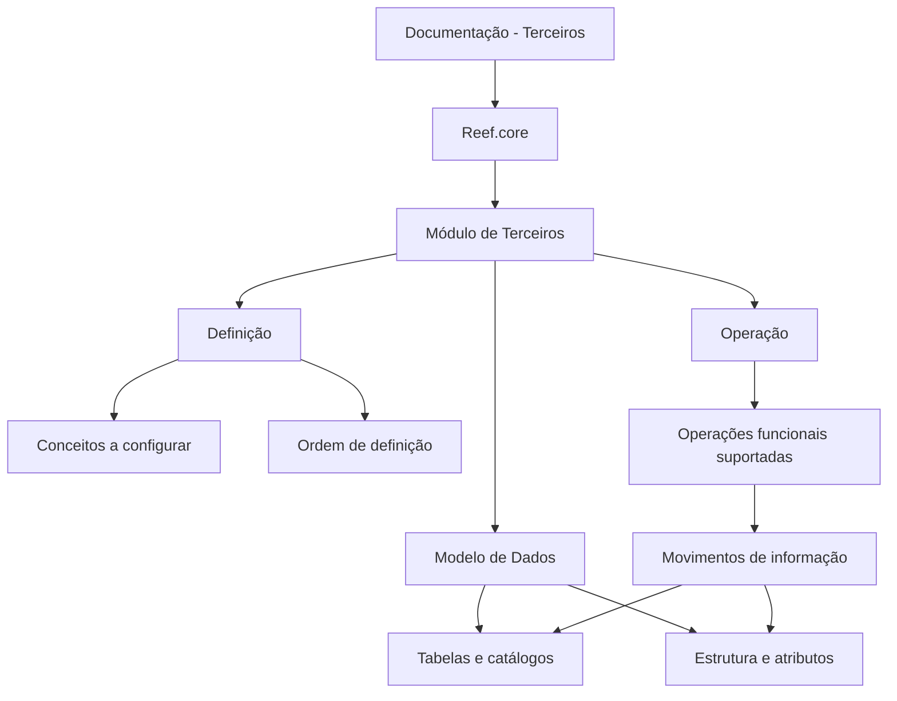
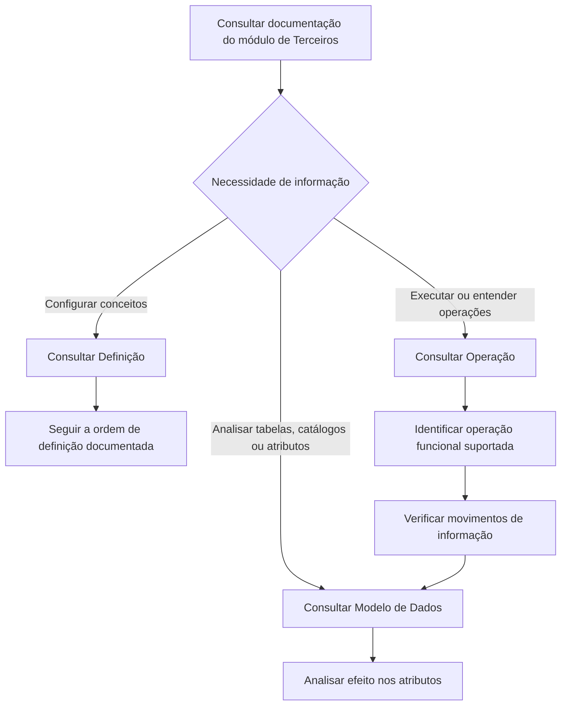

# Documentação do Módulo de Terceiros no Reef.core

## 1. Metadados do Documento
- **Arquivo de Origem:** Não identificado; conteúdo bruto fornecido em duas páginas.
- **Tipo de Documento:** Manual Operacional / Documentação Funcional.
- **Domínio / Sistema:** Módulo de Terceiros do Reef.core.
- **Público-Alvo:** Desenvolvedores, analistas funcionais, operação e equipes que configuram ou consultam o módulo.
- **Data/Versão Identificada:** Não identificada.

---

## 2. Resumo Executivo & Contexto de Negócio

O documento apresenta a organização da documentação referente à funcionalidade do módulo de **Terceiros** no sistema **Reef.core**. A finalidade principal é direcionar o usuário para os conjuntos documentais necessários ao entendimento, configuração, operação e análise estrutural do módulo.

A documentação é dividida em três áreas: **Definição**, **Operação** e **Modelo de Dados**. A seção Definição concentra os conceitos que precisam ser configurados e a ordem necessária para que o módulo de Terceiros possa ser utilizado de forma funcional e completa.

A seção Operação agrupa documentos sobre as operações funcionais suportadas pelo módulo de Terceiros. O texto não enumera essas operações, nem detalha seus fluxos, regras, métodos de execução ou pré-requisitos específicos.

A seção Modelo de Dados é voltada ao conhecimento da estrutura e dos atributos das tabelas ou catálogos do Reef.core relacionados ao módulo de Terceiros. Adicionalmente, a documentação descreve os movimentos de informação nas tabelas e os efeitos sobre seus atributos durante a execução das operações funcionais suportadas.

---

## 3. Arquitetura, Componentes & Tecnologias Envolvidas

O conteúdo fornecido cita os seguintes elementos:

| Componente / Elemento | Papel identificado no documento |
| :--- | :--- |
| **Reef.core** | Sistema no qual está localizado o módulo de Terceiros. |
| **Módulo de Terceiros** | Módulo funcional cuja documentação está organizada por definição, operação e modelo de dados. |
| **Definição** | Área documental para conceitos configuráveis e ordem de definição necessária à operação completa do módulo. |
| **Operação** | Área documental referente às operações funcionais suportadas pelo módulo de Terceiros. |
| **Modelo de Dados** | Área documental sobre estrutura, atributos, tabelas ou catálogos relacionados ao módulo de Terceiros. |
| **Tabelas / Catálogos de Reef.core** | Estruturas relacionadas ao módulo; recebem movimentos de informação decorrentes da execução de operações funcionais. |
| **Home Solutions APIs Documentation Zeus** | Texto presente na extração bruta, sem explicação de função, integração ou relação técnica com o módulo de Terceiros. |



> **Nota de Análise:** O documento não especifica arquitetura de software, microsserviços, APIs, protocolos, bancos de dados, tecnologias de persistência, endpoints, métodos HTTP ou contratos de integração.

---

## 4. Regras de Negócio, Especificações Funcionais & Processos

### Organização documental do módulo de Terceiros

1. A documentação da funcionalidade do módulo de Terceiros no Reef.core está dividida em:
   - Definição;
   - Operação;
   - Modelo de Dados.

2. A área de **Definição** deve documentar:
   - Os conceitos que precisam ser configurados;
   - A ordem que deve ser seguida na definição desses conceitos;
   - As condições documentais necessárias para operar o módulo de Terceiros de forma funcional e completa.

3. A área de **Operação** deve reunir documentos relacionados às operações funcionais suportadas pelo módulo de Terceiros.

4. A área de **Modelo de Dados** deve documentar:
   - A estrutura das tabelas ou catálogos do Reef.core relacionados ao módulo de Terceiros;
   - Os atributos dessas tabelas ou catálogos;
   - Os movimentos de informação nas tabelas;
   - O efeito da execução de cada operação funcional suportada sobre os atributos das tabelas.

### Processo documental inferido diretamente da estrutura apresentada



> **Nota de Análise:** O texto não informa quais conceitos devem ser configurados, qual é a ordem concreta de configuração, quais operações funcionais são suportadas ou quais tabelas, catálogos e atributos são afetados.

---

## 5. Tabelas de Parâmetros, Ambientes e Estruturas de Dados

| Item / Parâmetro | Descrição / Função | Tipo / Valores / Formato | Ambiente / Observações |
| :--- | :--- | :--- | :--- |
| Sistema | Sistema que contém o módulo documentado. | Reef.core | O documento não fornece versão ou ambiente. |
| Módulo | Funcionalidade coberta pela documentação. | Terceiros | Não há detalhamento funcional adicional. |
| Área documental | Documenta conceitos configuráveis e sua ordem de definição. | Definição | Necessária para operar o módulo funcional e completamente. |
| Área documental | Documenta operações funcionais suportadas. | Operação | Operações não são listadas. |
| Área documental | Documenta estrutura, atributos, tabelas e catálogos relacionados. | Modelo de Dados | Inclui movimentos de informação e efeitos nos atributos. |
| Estrutura de dados | Estruturas do Reef.core relacionadas ao módulo. | Tabelas ou catálogos | Nomes, chaves e campos não identificados. |
| Atributos | Elementos das tabelas ou catálogos que podem ser afetados por operações funcionais. | Não especificado | O documento não apresenta atributos concretos ou regras de atualização. |
| Movimentos de informação | Alterações ou trânsito de informações nas tabelas conforme operações funcionais. | Não especificado | Sem detalhamento de eventos, origens, destinos ou valores. |
| Home Solutions APIs Documentation Zeus | Texto de navegação ou referência presente na extração. | Não especificado | Sem relação técnica explicada no conteúdo. |

---

## 6. Bateria de Perguntas & Respostas para RAG (FAQ Sintético)

### P1: Qual é o sistema e o módulo abordados pela documentação?
**R:** A documentação aborda a funcionalidade do módulo de **Terceiros** no sistema **Reef.core**.

### P2: Como está organizada a documentação do módulo de Terceiros?
**R:** A documentação do módulo de Terceiros está dividida em três apartados: **Definição**, **Operação** e **Modelo de Dados**.

### P3: O que deve ser consultado para configurar o módulo de Terceiros?
**R:** Deve ser consultada a seção de **Definição**, pois ela trata dos conceitos que precisam ser configurados e da ordem que deve ser seguida para permitir a operação funcional e completa do módulo de Terceiros.

### P4: O documento informa a ordem concreta de configuração dos conceitos do módulo?
**R:** Não. O texto informa que existe uma ordem a ser seguida na definição dos conceitos, mas não apresenta quais são os conceitos nem a sequência concreta de configuração.

### P5: Onde estão documentadas as operações funcionais do módulo de Terceiros?
**R:** As operações funcionais suportadas pelo módulo de Terceiros são tratadas na seção documental denominada **Operação**.

### P6: Quais operações funcionais do módulo de Terceiros são detalhadas no conteúdo fornecido?
**R:** Nenhuma operação funcional específica é detalhada no conteúdo fornecido. O documento apenas afirma que existem documentos relacionados às operações funcionais suportadas pelo módulo.

### P7: Qual seção deve ser usada para conhecer tabelas, catálogos e atributos relacionados ao módulo de Terceiros?
**R:** A seção de **Modelo de Dados** deve ser usada para conhecer a estrutura e os atributos das tabelas ou catálogos do Reef.core relacionados ao módulo de Terceiros.

### P8: O que a documentação descreve sobre os movimentos de informação nas tabelas?
**R:** A documentação descreve detalhadamente os movimentos de informação nas tabelas e o efeito desses movimentos sobre os atributos, de acordo com a execução de cada operação funcional suportada.

### P9: O documento identifica os nomes das tabelas ou catálogos do Reef.core envolvidos?
**R:** Não. O documento menciona tabelas ou catálogos do Reef.core relacionados ao módulo de Terceiros, mas não identifica seus nomes, campos, chaves ou relacionamentos.

### P10: O documento apresenta APIs, URLs, métodos HTTP ou contratos JSON do módulo de Terceiros?
**R:** Não. Embora a extração contenha o texto “Home Solutions APIs Documentation Zeus”, não há detalhamento de APIs, URLs, endpoints, métodos HTTP, contratos JSON ou integrações técnicas.

### P11: Como as operações funcionais se relacionam com o modelo de dados?
**R:** Segundo o documento, a execução de cada operação funcional suportada produz movimentos de informação nas tabelas e afeta os atributos dessas estruturas relacionadas ao módulo de Terceiros.

### P12: A documentação permite identificar os ambientes de execução do módulo?
**R:** Não. O conteúdo não fornece informações sobre ambientes, servidores, URLs, credenciais, versões, portas ou configurações de infraestrutura.

---

## 7. Glossário de Termos, Siglas & Conceitos-Chave

- **Reef.core:** Sistema citado como base do módulo de Terceiros e de suas tabelas ou catálogos relacionados.
- **Módulo de Terceiros:** Funcionalidade do Reef.core cuja documentação é organizada nas áreas de Definição, Operação e Modelo de Dados.
- **Definição:** Área documental que trata dos conceitos configuráveis e da ordem necessária para defini-los.
- **Operação:** Área documental relacionada às operações funcionais suportadas pelo módulo de Terceiros.
- **Modelo de Dados:** Área documental dedicada à estrutura, aos atributos, às tabelas e aos catálogos relacionados ao módulo de Terceiros.
- **Tabela:** Estrutura de dados do Reef.core mencionada como receptora de movimentos de informação decorrentes das operações funcionais.
- **Catálogo:** Estrutura de dados do Reef.core citada em conjunto com tabelas; o documento não define sua diferença em relação a uma tabela.
- **Atributo:** Elemento de uma tabela ou catálogo cujo estado ou valor pode ser afetado pela execução de operações funcionais.
- **Movimento de informação:** Alteração ou fluxo de informação nas tabelas associado à execução de operações funcionais suportadas.
- **Home Solutions APIs Documentation Zeus:** Texto presente no conteúdo bruto; o documento não define seu significado, papel ou vínculo técnico com o Reef.core.

---

## 8. Notas Críticas, Riscos & Limitações

- O conteúdo é predominantemente uma apresentação da estrutura documental, não uma especificação funcional ou técnica completa do módulo de Terceiros.
- Não foram identificados nomes de conceitos configuráveis, ordem efetiva de configuração, operações funcionais concretas, tabelas, catálogos, atributos ou regras de atualização.
- Não há informações sobre integrações, APIs, URLs, ambientes, servidores, tecnologia, persistência, autenticação, autorização ou monitoramento.
- O texto afirma que a documentação detalha movimentos de informação e efeitos nos atributos, mas esses detalhes não estão presentes na extração fornecida.
- A referência “Home Solutions APIs Documentation Zeus” aparece no texto bruto sem contexto suficiente para estabelecer significado ou relacionamento com o módulo de Terceiros.

---

## 9. Conteúdo Bruto Estruturado (Referência Fiel)

```text
--- [PÁGINA 1 DE 2] ---

DOCUMENTACIÓN - TERCEROS
La información relacionada con la funcionalidad del módulo de Terceros en Reef.core se encuentra
dividida en los siguientes apartados:
Definición
Operación
Modelo de datos
DEFINICIÓN
Documentos que detallan aquellos Conceptos que se han de configurar y el Orden que se ha de
seguir en su definición para poder operar funcional y completamente el Módulo de Terceros.
OPERACIÓN
Documentos relacionados con las Operaciones Funcionales soportadas en el Módulo de Terceros.
MODELO DE DATOS
Documentación orientada al conocimiento de la Estructura y Atributos de las Tablas o Catálogos de
Reef.core relacionadas con el Módulo de Terceros.
 / 
 CF
Home Solutions APIs Documentation Zeus
EN


--- [PÁGINA 2 DE 2] ---

Adicionalmente, se describen con detalle los movimientos de la información en las Tablas y el
efecto en sus Atributos, de acuerdo con la Ejecución de cada una de las Operaciones Funcionales
soportadas.
```
