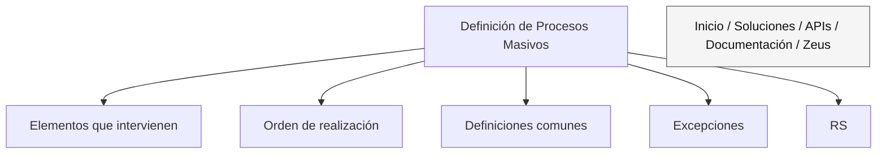

# Definição de Processos Massivos: Elementos, Ordem e Exceções

## 1. Metadados do Documento
- **Arquivo de Origem:** `Não identificado`
- **Tipo de Documento:** `Procedimento`
- **Domínio / Sistema:** `Processos massivos; Zeus`
- **Público-Alvo:** `Não identificado`
- **Data/Versão Identificada:** `Não identificada`

---

## 2. Resumo Executivo & Contexto de Negócio

O conteúdo descreve a **definição de processos massivos**, com foco nos elementos que participam da definição e na ordem em que esses elementos devem ser realizados.

O material menciona **definições comuns**, **exceções** e o termo **RS** como tópicos associados ao contexto de processos massivos. Entretanto, o texto extraído não fornece definições funcionais, critérios de execução, responsáveis, entradas, saídas ou regras detalhadas para esses itens.

Também são citados os termos ou opções de navegação **Inicio**, **Soluciones**, **APIs**, **Documentación** e **Zeus**. O texto não esclarece se esses elementos representam módulos de um sistema, páginas de um portal, sistemas integrados ou referências documentais.

> **Nota de Análise:** O conteúdo disponível é resumido e não detalha o fluxo operacional, a arquitetura tecnológica, contratos de APIs, regras específicas para exceções ou o significado de `RS`.

---

## 3. Arquitetura, Componentes & Tecnologias Envolvidas

Os seguintes elementos são explicitamente citados:

| Componente / Termo | Contexto identificado |
| :--- | :--- |
| Processos massivos | Tema principal do documento. |
| Definiciones comunes | Seção ou conceito associado à definição de processos massivos. |
| Excepciones | Tópico citado sem detalhamento de tratamento, condições ou impactos. |
| RS | Sigla ou termo citado sem expansão ou explicação. |
| Inicio | Item citado no trecho de navegação. |
| Soluciones | Item citado no trecho de navegação. |
| APIs | Item citado no trecho de navegação. |
| Documentación | Item citado no trecho de navegação. |
| Zeus | Nome citado no trecho de navegação. |



> **Nota de Análise:** O diagrama representa apenas a associação textual identificada. O documento não descreve integrações, interfaces, fluxos de dados, tecnologias, métodos HTTP, ambientes ou dependências entre `Zeus`, `APIs`, `Soluciones` e os processos massivos.

---

## 4. Regras de Negócio, Especificações Funcionais & Processos

1. A definição de processos massivos considera os **elementos que intervêm** na definição do processo.
2. A definição de processos massivos considera a **ordem em que as atividades devem ser realizadas**.
3. O documento apresenta **definições comuns** como tópico relacionado aos processos massivos.
4. O documento menciona a existência de **exceções**, mas não especifica:
   - condições que caracterizam uma exceção;
   - responsáveis pelo tratamento;
   - ações de contingência;
   - impacto da exceção na execução do processo massivo;
   - mecanismo de registro ou resolução.
5. O termo **RS** é citado, mas o documento não fornece expansão, finalidade, regra de uso ou relacionamento explícito com exceções ou processos massivos.

> **Nota de Análise:** Não há detalhamento suficiente para derivar uma sequência operacional completa, regras condicionais, validações, parâmetros de negócio ou critérios de sucesso para processos massivos.

---

## 5. Tabelas de Parâmetros, Ambientes e Estruturas de Dados

| Item / Parâmetro | Descrição / Função | Tipo / Valores / Formato | Ambiente / Observações |
| :--- | :--- | :--- | :--- |
| Processos massivos | Tema associado à definição de elementos e à ordem de realização. | Conceito / processo | Não são informados sistemas, ambientes ou responsáveis. |
| Elementos intervenientes | Elementos que participam da definição de processos massivos. | Não detalhado | O documento não lista os elementos. |
| Ordem de realização | Sequência na qual os elementos devem ser realizados. | Não detalhado | A ordem concreta não é fornecida. |
| Definições comuns | Tópico citado no documento. | Não detalhado | Não há conteúdo definicional extraído. |
| Exceções | Tópico citado no documento. | Não detalhado | Não há regras de tratamento descritas. |
| RS | Sigla ou termo citado. | Não identificado | Não há expansão ou descrição. |
| Zeus | Nome citado no trecho de navegação. | Não identificado | Não há indicação de função, URL, ambiente ou integração. |
| APIs | Item citado no trecho de navegação. | Não identificado | Não são descritos endpoints, métodos, autenticação ou contratos. |
| Documentación | Item citado no trecho de navegação. | Não identificado | Não são indicados repositórios, links ou documentos relacionados. |

---

## 6. Bateria de Perguntas & Respostas para RAG (FAQ Sintético)

### P1: Qual é o assunto principal do documento?
**R:** O assunto principal é a definição de processos massivos, incluindo os elementos que intervêm nessa definição e a ordem em que esses elementos devem ser realizados.

### P2: O documento descreve uma sequência detalhada para executar processos massivos?
**R:** Não. O documento afirma que existe uma ordem de realização dos elementos envolvidos, mas não apresenta a sequência concreta de etapas, responsáveis ou critérios de conclusão.

### P3: Quais tópicos são mencionados em conjunto com a definição de processos massivos?
**R:** O texto menciona `Definiciones comunes`, `Excepciones` e `RS` como tópicos relacionados ao contexto de processos massivos.

### P4: Quais são as regras para tratamento de exceções em processos massivos?
**R:** O documento apenas cita `Excepciones`; não apresenta regras de identificação, categorização, tratamento, escalonamento, registro ou resolução de exceções.

### P5: O que significa a sigla RS no documento?
**R:** O significado de `RS` não é informado no conteúdo extraído. Não é possível expandir ou interpretar a sigla com base apenas no texto disponível.

### P6: O documento detalha APIs relacionadas aos processos massivos?
**R:** Não. O termo `APIs` aparece no trecho de navegação, mas não são informados endpoints, métodos HTTP, contratos de dados, autenticação ou integrações.

### P7: Qual é o papel de Zeus no processo descrito?
**R:** O termo `Zeus` é citado junto de `Inicio`, `Soluciones`, `APIs` e `Documentación`, mas o documento não explica sua função, sua relação com os processos massivos ou sua arquitetura.

### P8: Existem ambientes, servidores, URLs ou parâmetros técnicos documentados?
**R:** Não. O conteúdo extraído não apresenta ambientes, servidores, URLs, portas, variáveis de configuração, caminhos de log ou parâmetros técnicos.

### P9: O que são as definições comuns mencionadas no documento?
**R:** `Definiciones comunes` é um tópico explicitamente citado, mas o documento não contém as definições associadas a esse tópico no texto extraído.

### P10: É possível identificar os sistemas integrados no processo massivo?
**R:** Não com segurança. O documento cita `Zeus` e `APIs`, mas não estabelece que sejam sistemas integrados nem descreve qualquer fluxo de integração entre componentes.

---

## 7. Glossário de Termos, Siglas & Conceitos-Chave

- **Processos massivos:** Processos cujo conteúdo descreve a necessidade de definir elementos intervenientes e a ordem de realização.
- **Definiciones comunes:** Tópico citado no documento, sem definições detalhadas no conteúdo extraído.
- **Excepciones:** Tópico relacionado ao documento, sem regras de tratamento fornecidas.
- **RS:** Sigla ou termo não expandido no conteúdo extraído.
- **APIs:** Termo citado no trecho de navegação; não há especificação técnica associada.
- **Zeus:** Nome citado no trecho de navegação; sua função não é detalhada.
- **Inicio:** Termo em espanhol que aparece no trecho de navegação.
- **Soluciones:** Termo em espanhol que aparece no trecho de navegação.
- **Documentación:** Termo em espanhol que aparece no trecho de navegação.

---

## 8. Notas Críticas, Riscos & Limitações

- O conteúdo extraído é insuficiente para especificar um processo massivo executável de ponta a ponta.
- Não há lista dos elementos que participam do processo nem definição da ordem operacional entre eles.
- O termo `RS` não é definido, criando ambiguidade para usuários, operadores e agentes de IA.
- O documento cita exceções, mas não fornece regras de tratamento, responsáveis, níveis de severidade ou impactos operacionais.
- Não existem informações sobre ambientes, integrações, APIs, autenticação, URLs, logs, contratos de dados ou tecnologias.
- A relação entre `Zeus`, `APIs`, `Soluciones`, `Documentación` e processos massivos não é explicitada.

---

## 9. Conteúdo Bruto Estruturado (Referência Fiel)

```text
--- [PÁGINA 1 DE 1] ---

DEFINICIÓN DE PROCESOS MASIVOS
 Elementos que intervienen en la definición y orden en el que se debe realizar.
DEFINICIONES COMUNES
Excepciones
 /
 RS
Inicio Soluciones APIs Documentación Zeus
```
