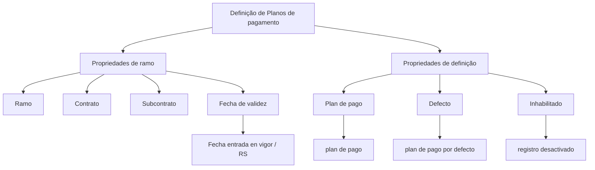

# Definição de Planos de Pagamento — Documento em Construção

## 1. Metadados do Documento
- **Arquivo de Origem:** Não identificado
- **Tipo de Documento:** Não identificado; conteúdo organizado em duas páginas/telas
- **Domínio / Sistema:** Definição de planos de pagamento; referências a Soluciones, APIs, Documentación e Zeus
- **Público-Alvo:** Não identificado
- **Data/Versão Identificada:** Não identificada

---

## 2. Resumo Executivo & Contexto de Negócio

O documento, marcado como **“EN CONSTRUCCIÓN”**, apresenta uma estrutura inicial para a definição de **Planos de pagamento**. O conteúdo indica que a definição está relacionada a propriedades de ramo e propriedades de definição.

A estrutura de propriedades de ramo inclui os elementos **Ramo**, **Contrato**, **Subcontrato** e **Fecha de validez**, associada à expressão **“fecha entrada en vigor / RS”**. O documento não explica o significado de RS nem detalha regras de vigência.

As propriedades de definição incluem **Plan de pago**, **Defecto** e **Inhabilitado**. Os textos associados indicam respectivamente “plan de pago”, “plan de pago por defecto” e “registro desactivado”.

O documento também cita os termos **Inicio**, **Soluciones**, **APIs**, **Documentación** e **Zeus**, porém não descreve integrações, responsabilidades, fluxos operacionais, APIs ou contratos técnicos relacionados a esses termos.

---

## 3. Arquitetura, Componentes & Tecnologias Envolvidas

Os componentes e conceitos identificados são:

- Definição de Planos de pagamento.
- Propriedades de ramo.
- Propriedades de definição.
- Ramo.
- Contrato.
- Subcontrato.
- Fecha de validez.
- RS.
- Plan de pago.
- Defecto.
- Inhabilitado.
- Inicio, Soluciones, APIs, Documentación e Zeus.



> **Nota de Análise:** O conteúdo não apresenta uma arquitetura técnica, tecnologias implementadas, endpoints, protocolos, contratos JSON, ambientes ou relações comprovadas entre Zeus, APIs, Soluciones e Documentación.

---

## 4. Regras de Negócio, Especificações Funcionais & Processos

1. A definição de planos de pagamento possui uma categorização em **propriedades de ramo** e **propriedades de definição**.
2. As propriedades de ramo listadas são:
   - Ramo.
   - Contrato.
   - Subcontrato.
   - Fecha de validez.
3. A propriedade **Fecha de validez** está acompanhada do texto **“fecha entrada en vigor / RS”**.
4. As propriedades de definição listadas são:
   - Plan de pago.
   - Defecto.
   - Inhabilitado.
5. O campo ou conceito **Defecto** é associado a **“plan de pago por defecto”**.
6. O campo ou conceito **Inhabilitado** é associado a **“registro desactivado”**.

> **Nota de Análise:** O documento não detalha critérios de seleção do plano de pagamento padrão, condições para desativação de registros, regras de validação de ramo/contrato/subcontrato, nem comportamento para datas de vigência sobrepostas ou ausentes.

---

## 5. Tabelas de Parâmetros, Ambientes e Estruturas de Dados

| Item / Parâmetro | Descrição / Função | Tipo / Valores / Formato | Ambiente / Observações |
| :--- | :--- | :--- | :--- |
| Plan de pago | Propriedade de definição identificada no documento. | `plan de pago` | Sem detalhamento adicional. |
| Defecto | Propriedade de definição associada ao plano de pagamento padrão. | `plan de pago por defecto` | Não há regra de seleção ou cardinalidade informada. |
| Inhabilitado | Propriedade de definição associada a um registro desativado. | `registro desactivado` | Não há valores permitidos ou processo de desativação informado. |
| Ramo | Propriedade de ramo. | `ramo` | Sem detalhamento adicional. |
| Contrato | Propriedade de ramo. | `contrato` | Sem detalhamento adicional. |
| Subcontrato | Propriedade de ramo. | `subcontrato` | Sem detalhamento adicional. |
| Fecha de validez | Propriedade de ramo vinculada à entrada em vigor. | `fecha entrada en vigor / RS` | O significado de RS não é definido. |
| Inicio | Termo citado no documento. | Não informado | Relação com o plano de pagamento não detalhada. |
| Soluciones | Termo citado no documento. | Não informado | Relação com o plano de pagamento não detalhada. |
| APIs | Termo citado no documento. | Não informado | Não há endpoints, métodos HTTP ou contratos descritos. |
| Documentación | Termo citado no documento. | Não informado | Não há localização ou conteúdo descrito. |
| Zeus | Termo citado no documento. | Não informado | O papel de Zeus não é detalhado. |

---

## 6. Bateria de Perguntas & Respostas para RAG (FAQ Sintético)

### P1: Qual é o objetivo identificado no documento?
**R:** O documento apresenta uma estrutura em construção para a **definição de planos de pagamento**, organizada por propriedades de ramo e propriedades de definição.

### P2: Quais propriedades de ramo são listadas para a definição de planos de pagamento?
**R:** As propriedades de ramo listadas são **Ramo**, **Contrato**, **Subcontrato** e **Fecha de validez**.

### P3: Quais propriedades de definição são apresentadas no documento?
**R:** As propriedades de definição apresentadas são **Plan de pago**, **Defecto** e **Inhabilitado**.

### P4: O que representa a propriedade Defecto?
**R:** A propriedade **Defecto** é associada ao texto **“plan de pago por defecto”**, indicando um plano de pagamento padrão. O documento não especifica como esse plano padrão é escolhido ou aplicado.

### P5: O que significa Inhabilitado no contexto apresentado?
**R:** **Inhabilitado** está associado ao texto **“registro desactivado”**. O documento não descreve os critérios, responsáveis ou efeitos operacionais da desativação.

### P6: Como a vigência é representada na definição?
**R:** A vigência aparece como a propriedade **Fecha de validez**, acompanhada da expressão **“fecha entrada en vigor / RS”**. Não há definição do termo RS nem regras adicionais de vigência.

### P7: O documento define APIs para planos de pagamento?
**R:** Não. O termo **APIs** é citado, mas o documento não fornece métodos HTTP, URLs, operações, parâmetros, contratos de requisição ou contratos de resposta.

### P8: Qual é o papel do sistema Zeus?
**R:** O termo **Zeus** é citado no documento, mas não há descrição de responsabilidades, integrações, arquitetura ou funções do sistema Zeus.

### P9: Existem regras para relacionar ramo, contrato e subcontrato?
**R:** Não. Ramo, Contrato e Subcontrato são listados como propriedades de ramo, mas o documento não descreve regras de relacionamento, validações ou dependências entre esses elementos.

### P10: O documento está completo para implementação técnica?
**R:** Não. O documento está explicitamente marcado como **“EN CONSTRUCCIÓN”** e não detalha modelos de dados, integrações, regras de validação, APIs, ambientes, URLs ou contratos técnicos.

---

## 7. Glossário de Termos, Siglas & Conceitos-Chave

- **APIs:** Termo citado no documento; não há expansão nem especificação técnica adicional.
- **Contrato:** Propriedade de ramo listada na definição de planos de pagamento.
- **Defecto:** Propriedade associada ao plano de pagamento padrão.
- **Documentación:** Termo citado no documento; sem detalhamento adicional.
- **Fecha de validez:** Propriedade de ramo relacionada à data de entrada em vigor.
- **Inhabilitado:** Propriedade associada a registro desativado.
- **Plan de pago:** Propriedade de definição referente ao plano de pagamento.
- **Ramo:** Propriedade de ramo listada no documento.
- **RS:** Sigla citada junto à data de entrada em vigor; significado não informado.
- **Subcontrato:** Propriedade de ramo listada no documento.
- **Zeus:** Termo ou sistema citado; função não detalhada.

---

## 8. Notas Críticas, Riscos & Limitações

- O documento está identificado como **“EN CONSTRUCCIÓN”**, indicando material incompleto.
- Não há nome de arquivo, autoria, data, versão ou público-alvo explicitamente identificados.
- Não há detalhamento de arquitetura, integrações, APIs, contratos de dados, URLs, ambientes, servidores, logs ou tecnologias.
- A sigla **RS** não é definida.
- Não há regras para determinação do plano de pagamento padrão.
- Não há critérios de ativação, desativação ou reativação para registros marcados como **Inhabilitado**.
- Não há regras de consistência ou relacionamento entre Ramo, Contrato e Subcontrato.
- Não há definição para tratamento de datas de vigência, conflitos de vigência ou histórico de planos de pagamento.

---

## 9. Conteúdo Bruto Estruturado (Referência Fiel)

```text
--- [PÁGINA 1 DE 2] ---

EN CONSTRUCCIÓN
DEFINICIÓN de Planes de pago
Objetivo
Propiedades de ramo
Propiedades de definición
Propiedades de ramo
Ramo
ramo
Contrato
contrato
Subcontrato
subcontrato
Fecha de validez
fecha entrada en vigor
 / 
 RS
Inicio Soluciones APIs Documentación Zeus
ES


--- [PÁGINA 2 DE 2] ---

Propiedades de definición
Plan de pago
plan de pago
Defecto
plan de pago por defecto
Inhabilitado
registro desactivado
```
