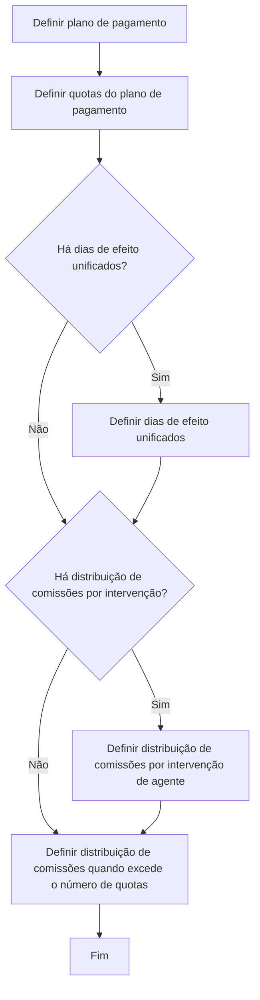
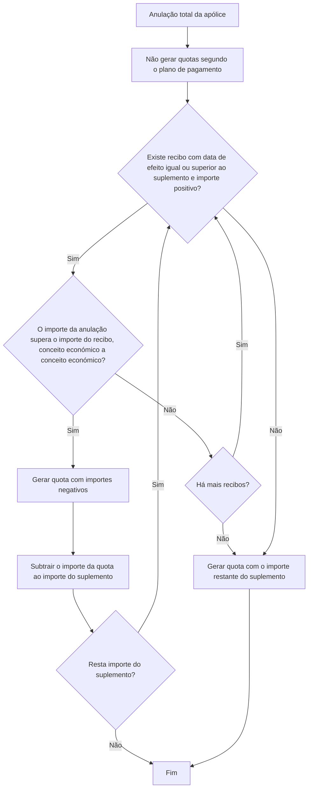

# Definição de Plano de Pagamento para Distribuição de Importes de Apólices

## 1. Metadados do Documento
- **Arquivo de Origem:** Não informado
- **Tipo de Documento:** Especificação Técnica
- **Domínio / Sistema:** Plano de pagamento para apólices/aplicações
- **Público-Alvo:** Desenvolvedores, Arquitetos, Operação e Negócio
- **Data/Versão Identificada:** Não identificada

---

## 2. Resumo Executivo & Contexto de Negócio

O documento define um **plano de pagamento** como o mecanismo que distribui em frações o importe gerado pela criação ou alteração de uma apólice/aplicação. Cada fração gerada pelo plano de pagamento é denominada **quota**.

A quantidade de quotas é livre: um plano de pagamento pode conter de 1 a 99 quotas e não precisa seguir uma periodicidade padronizada, como distribuição mensal, trimestral ou semestral. Os valores das quotas, incluindo prémios, impostos, recargos e comissões, não precisam ser proporcionais às respetivas datas de efeito ou vencimento.

O plano de pagamento pode incluir conceitos económicos próprios, como recargos por fracionamento e os respetivos impostos. A primeira quota é sempre calculada por diferença em relação ao total, assegurando que a soma das quotas distribua corretamente os importes.

Em caso de anulação total da apólice, o documento determina que não sejam geradas quotas segundo o plano de pagamento. O processo usa o importe a devolver para cancelar recibos positivos já gerados, respeitando a comparação de cada conceito económico.

---

## 3. Arquitetura, Componentes & Tecnologias Envolvidas

O documento não identifica tecnologias, servidores, APIs, microsserviços ou ambientes. Os componentes funcionais explicitamente descritos são:

- **Plano de pagamento**
- **Quota**
- **Apólice/aplicação**
- **Suplemento**
- **Recibo**
- **Conceito económico**
- **Intervenções de agente**, incluindo agente principal, organizador ou outra figura
- **Distribuição de comissões**
- **Dias de efeito unificados**

### Fluxo de definição do plano de pagamento



### Fluxo de anulação total da apólice



> **Nota de Análise:** O documento apresenta os fluxos funcionais, mas não detalha contratos de integração, persistência de dados, métodos HTTP, formatos JSON ou tecnologias de implementação.

---

## 4. Regras de Negócio, Especificações Funcionais & Processos

### Definição e finalidade

1. Um plano de pagamento distribui em frações o importe gerado por uma emissão ou suplemento.
2. Cada fração do plano de pagamento é uma quota.
3. O plano de pagamento é utilizado na criação ou modificação de uma apólice/aplicação.

### Regras sobre número de quotas

1. O número de quotas é livre.
2. Um plano de pagamento pode possuir entre **1 e 99 quotas**.
3. Não existe obrigação de utilizar uma distribuição temporal padrão.
4. Um plano de pagamento pode possuir, por exemplo, cinco quotas.

### Regras sobre importes

1. Os importes de prémios, impostos, recargos e outros conceitos não precisam ser proporcionais ao efeito ou vencimento de cada quota.
2. Um plano de pagamento pode calcular importes próprios no momento da distribuição.
3. Os importes próprios podem incluir recargos por fracionamento e, quando necessário, os respetivos impostos.
4. Um plano de pagamento não é apenas a distribuição dos importes previamente calculados na apólice.
5. A primeira quota deve ser sempre calculada por diferença:

\[
quota\_1 := importe\_total - SUMA(quota\_2..quota\_n)
\]

6. O cálculo por diferença assegura a correta distribuição do importe total, mesmo quando exista algum problema na definição das quotas restantes.

### Regras sobre comissões

1. A comissão de uma quota não precisa ser proporcional ao respetivo efeito ou vencimento.
2. Uma quota pode não possuir comissão.
3. As intervenções de agente não precisam utilizar a mesma proporção de distribuição de comissões.
4. O agente principal pode possuir uma distribuição de comissões diferente da distribuição do organizador ou de outra figura interveniente.
5. O processo de definição pode incluir distribuição de comissões por intervenção de agente.
6. O processo de definição inclui distribuição de comissões quando o número de quotas é excedido.

### Regras para anulação total da apólice

1. Em uma anulação total, não são geradas quotas segundo o plano de pagamento.
2. O objetivo é utilizar o importe resultante da anulação total para cancelar recibos já gerados na apólice que tenham importe positivo.
3. A busca considera recibos com data de efeito igual ou superior à do suplemento e importe positivo, começando pelo vencimento.
4. Para cancelar um recibo usando o importe da anulação total, todos os conceitos económicos do recibo candidato devem superar o importe restante da anulação total.
5. Quando a condição de comparação é atendida, é gerada uma quota com importes negativos.
6. O importe da quota gerada é subtraído do importe do suplemento.
7. Se ainda restar importe do suplemento, o processo continua a avaliar recibos.
8. Quando não houver mais recibos aplicáveis, é gerada uma quota com o importe restante do suplemento.

---

## 5. Tabelas de Parâmetros, Ambientes e Estruturas de Dados

| Item / Parâmetro | Descrição / Função | Tipo / Valores / Formato | Ambiente / Observações |
| :--- | :--- | :--- | :--- |
| Plano de pagamento | Distribui em frações o importe gerado por criação ou modificação de apólice/aplicação. | Estrutura funcional | Pode incorporar conceitos económicos próprios. |
| Quota | Fração individual de um plano de pagamento. | De 1 a 99 quotas por plano | A primeira quota é calculada por diferença. |
| `quota_1` | Primeira quota do plano de pagamento. | `importe_total - SUMA(quota_2..quota_n)` | Mecanismo de ajuste para assegurar distribuição correta do importe. |
| Importe total | Valor total a ser distribuído pelas quotas. | Valor económico | Utilizado no cálculo da primeira quota. |
| Prémios | Importe económico que pode compor quotas. | Valor económico | Não precisa ser proporcional ao efeito/vencimento. |
| Impostos | Importe económico que pode compor quotas ou recargos. | Valor económico | Podem ser aplicáveis aos recargos por fracionamento. |
| Recargos por fracionamento | Conceitos próprios que podem ser calculados pelo plano de pagamento. | Valor económico | Podem incluir impostos quando necessário. |
| Comissão | Valor de comissão associado a uma quota ou intervenção. | Valor económico; pode não existir em uma quota | Não precisa ser proporcional ao efeito/vencimento. |
| Agente principal | Figura de agente com distribuição própria de comissões. | Intervenção de agente | Pode diferir da distribuição do organizador. |
| Organizador | Figura interveniente com possível distribuição própria de comissões. | Intervenção de agente | Pode diferir da distribuição do agente principal. |
| Dias de efeito unificados | Configuração opcional no processo de definição. | Condicional: existe/não existe | O documento não detalha regras de cálculo. |
| Suplemento | Elemento usado como referência na anulação total e no importe restante. | Processo de apólice | O documento menciona recibos com efeito igual ou superior ao suplemento. |
| Recibo | Recibo já gerado na apólice que pode ser cancelado durante anulação total. | Documento/registro económico | Deve possuir importe positivo para ser candidato. |
| Conceito económico | Unidade de comparação de importes para cancelamento de recibo. | Valor económico por conceito | A comparação ocorre conceito económico a conceito económico. |

---

## 6. Bateria de Perguntas & Respostas para RAG (FAQ Sintético)

### P1: O que é um plano de pagamento no contexto de uma apólice?
**R:** Um plano de pagamento é a forma de distribuir em frações o importe gerado pela criação ou modificação de uma apólice/aplicação. Cada fração resultante dessa distribuição é denominada quota.

### P2: Quantas quotas um plano de pagamento pode ter?
**R:** Um plano de pagamento pode possuir entre 1 e 99 quotas. O documento afirma que o número de quotas é livre e não precisa corresponder a uma periodicidade padrão, como distribuição semestral ou trimestral.

### P3: Os valores das quotas precisam ser proporcionais às datas de efeito ou vencimento?
**R:** Não. Os importes de prémios, impostos, recargos e comissões de uma quota não precisam ser proporcionais ao efeito ou vencimento dessa quota.

### P4: Como é calculada a primeira quota de um plano de pagamento?
**R:** A primeira quota é sempre calculada por diferença: `quota_1 := importe_total - SUMA(quota_2..quota_n)`. Essa regra garante que a distribuição final das quotas corresponda corretamente ao importe total.

### P5: Um plano de pagamento pode calcular importes além dos já calculados na apólice?
**R:** Sim. O plano de pagamento pode possuir conceitos económicos próprios calculados no momento da distribuição, como recargos por fracionamento e os respetivos impostos quando necessários.

### P6: Uma quota pode não ter comissão?
**R:** Sim. O documento declara expressamente que é possível uma quota não dispor de comissão.

### P7: A distribuição de comissões deve ser igual para todos os agentes?
**R:** Não. O agente principal pode possuir uma distribuição de comissões e o organizador, ou outra figura interveniente, pode ter uma distribuição diferente.

### P8: O que acontece com as quotas quando ocorre uma anulação total da apólice?
**R:** Em caso de anulação total da apólice, não são geradas quotas segundo o plano de pagamento. O importe de devolução é usado para cancelar recibos positivos já gerados na apólice.

### P9: Quais recibos podem ser considerados no processo de anulação total?
**R:** O processo verifica recibos com data de efeito igual ou superior à do suplemento e com importe positivo, começando pelo vencimento.

### P10: Como ocorre o cancelamento de um recibo na anulação total?
**R:** Para um recibo ser cancelado com o importe da anulação total, todos os seus conceitos económicos devem superar o importe restante da anulação total. Quando a condição é satisfeita, é gerada uma quota com importes negativos e o respetivo importe é subtraído do suplemento.

### P11: Quais são as etapas de definição de um plano de pagamento?
**R:** As etapas apresentadas são: definir o plano de pagamento; definir as quotas; definir dias de efeito unificados, se existirem; definir distribuição de comissões por intervenção de agente, se existir; e definir a distribuição de comissões quando excede o número de quotas.

---

## 7. Glossário de Termos, Siglas & Conceitos-Chave

- **Plano de pagamento:** Mecanismo que distribui em quotas o importe gerado por uma emissão ou suplemento.
- **Quota:** Fração de importe pertencente a um plano de pagamento.
- **Apólice/aplicação:** Entidade cuja criação ou modificação gera importe a distribuir.
- **Suplemento:** Elemento de referência no processo de anulação total e no cálculo do importe restante.
- **Recibo:** Registro gerado na apólice que pode ser cancelado no processo de anulação total.
- **Conceito económico:** Componente económico de um recibo, usado na comparação necessária para o cancelamento.
- **Recargo por fracionamento:** Importe próprio que pode ser calculado pelo plano de pagamento durante a distribuição.
- **Agente principal:** Intervenção de agente que pode ter distribuição própria de comissões.
- **Organizador:** Outra figura interveniente que pode ter distribuição de comissões distinta da do agente principal.
- **Dias de efeito unificados:** Etapa opcional de configuração mencionada no fluxo de definição do plano de pagamento.

---

## 8. Notas Críticas, Riscos & Limitações

- O documento não identifica o sistema proprietário, tecnologias, integrações, APIs, ambientes, URLs, servidores ou mecanismos de persistência envolvidos.
- O documento não detalha os critérios de ordenação dos recibos além da indicação de início “pelo vencimento”.
- A regra “todos os conceitos económicos do recibo candidato devem superar o importe restante” é descrita, mas não fornece exemplos numéricos nem explica o comportamento para comparação parcialmente atendida.
- Os dias de efeito unificados são mencionados como etapa opcional, sem definição funcional adicional.
- A distribuição de comissões quando excede o número de quotas é mencionada, mas não possui regra de cálculo detalhada.
- Não são apresentados métodos de validação, códigos de erro, auditoria, autenticação ou regras de reversão operacional.

---

## 9. Conteúdo Bruto Estruturado (Referência Fiel)

```text
--- [PÁGINA 1 DE 3] ---

DEFINICIÓN de plan de pago
Objetivo
Realizar una definición completa de como distribuir el importe generado por una emisión o
suplemento.
¿En que consiste?
Un plan de pago es la forma en la que se distribuye en fracciones el importe generado por la creación
o modificación de una póliza/aplicación. A cada fracción se la denomina cuota.
Características generales
Número de cuotas
Es libre. un plan de pago puede tener 1 o 99 cuotas. Es decir, no tiene porque atender al criterio
de una distribución estándar como puede ser semestral, trimestral, etc. Un plan de pago puede
ser de 5 cuotas
Importes (primas, impuestos, recargos...)
No es obligatorio que el importe y/o comisión de la cuota sea proporcional al efecto/vencimiento.
Ejemplo:
 /
 RS
Inicio Soluciones APIs Documentación Zeus
ES


--- [PÁGINA 2 DE 3] ---

Los planes de pago pueden calcular importes como por ejemplo recargos por fraccionamiento,
junto con sus impuestos si fuera necesario. Es decir, un plan de pago no es la distribución de los
importes calculados en la póliza, un plan de pago puede disponer de conceptos propios hallados
en el momento de la distribución del mismo
Siempre, la primera cuota se halla por diferencia. Esto asegura que el plan de pago distribuya
correctamente los importes en las cuotas si hubiera algún problema en la definición. Es decir:
En caso de anulación total de la póliza, no se generan cuotas según el plan de pago. En este
caso, el objetivo es con el importe a devolver resultante de la anulación total de la póliza, se
toman recibos ya generados en la póliza y que tengan importe positivo para cancelarlos con el
importe de la anulación total. Hay que tener en cuenta que para poder cancelar un recibo con el
importe de la anulación total, todos los conceptos económicos del recibo candidato a cancelar,
deben superar el importe que queda de la anulación total.
Los pasos que se siguen son los siguientes:
SI
NO
SI
NO
SI
NO
SI
NO
¿EXISTE un recibo
con fecha de
efecto igual
o superior
al suplemento
con importe
positivo
comenzando por
el vencimiento?
¿El importe de
la anulación
supera al
importe del
recibo
(concepto económico
a concepto económico)?
GENERAR cuota
con los
importes en
negativo
RESTAR el
importe de
la cuota
al importe
del suplemento
¿Queda importe
del suplemento?
¿Hay más
recibos?
GENERAR cuota
con el
importe que
resta del
suplemento
FIN
Comisiones
No es obligatorio que sea proporcional al efecto/vencimiento de la cuota. Incluso es posible que
una cuota no disponga de comisión
No todas las intervenciones de agente están obligadas a disponer de la misma proporción. Es
decir, el agente principal puede disponer de una distribución de sus comisiones y el organizador
(u otra figura), puede disponer de otra distribución distinta
Proceso a seguir
La definición de un plan de pago se realiza completando los pasos mostrados a continuación aunque
todos no son obligatorios.
1 cuota_1 := importe_total - SUMA(cuota_2..cuota_n)
Ejemplo:


--- [PÁGINA 3 DE 3] ---

SI
NO
SI
NO
DEFINIR
plan pago
(1)
DEFINIR
cuotas del
plan pago
(2)
¿Hay días
de efecto
unificados? DEFINIR
días de efecto
unificados
(3)
¿Hay distribución
de comisiones
por intervención? DEFINIR
distribución de
comisiones por
intervención de
agente
(4)
DEFINIR
distribución de
comisiones cuando
excede el número
de cuotas
(5)
FIN
1. DEFINIR plan pago
2. DEFINIR cuotas del plan de pago
3. DEFINIR días de efecto unificados
4. DEFINIR distribución de comisiones por intervención de agente
5. DEFINIR distribución de comisiones cuando excede el número de cuotas
```
